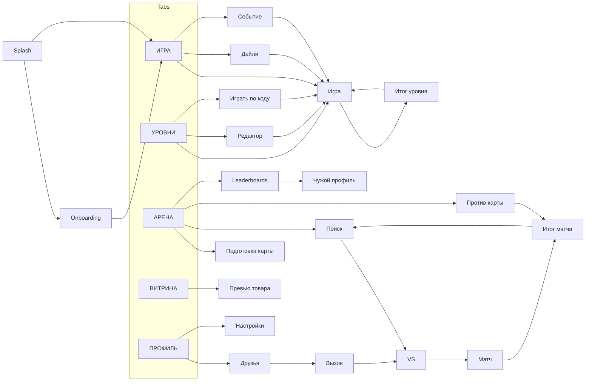

# ТЗ PELENGE: мобильное приложение (React Native + Go)

Версия от 27.09.2026. Полное техническое задание: продукт, дизайн, движок, API, клиент, бэкенд, админка, сценарии QA и план.

## Содержание

1. Продукт и игровая логика
2. Креативный бриф
3. Дизайн-система
4. Экраны
5. Тексты интерфейса
6. Спецификация движка
7. API-контракт
8. Клиент (React Native)
9. Бэкенд (Go)
10. Админка
11. Сценарии и крайние случаи
12. Бэклог и план
13. Ревью ТЗ

# Часть 1. Продукт и игровая логика
ТЗ состоит из тринадцати частей. Эта часть — продукт и игровая логика: правила, режимы, экономика, API верхнего уровня. Для дизайнера: «Креативный бриф», «Дизайн-система», «Экраны», «Тексты интерфейса». Для разработчиков: «Спецификация движка» (нормативная, при расхождении главнее этой части), «API-контракт», «Клиент (React Native)», «Бэкенд (Go)», «Админка». Для QA: «Сценарии и крайние случаи». Для PO и команды: «Бэклог и план», «Ревью ТЗ».

## 1. Общие сведения

PELENGE — мобильная логическая игра для iOS и Android: игрок ищет скрытые цели на поле по пеленгу (расстоянию кратчайшего пути). Клиент пишется на React Native (Expo), сервер на Go. Основа — текущий веб-прототип «Пеленг» (100 уровней, дейли, редактор, коды уровней) и визуальный концепт v82.

### 1.1 Цели продукта

- Сделать новую кампанию из 100 уровней с новыми элементами поля, бомбой и фишками (уровни прототипа — только пример).
- Добавить пошаговую PvP-арену: каждый игрок строит карту, соперник ищет на ней цели.
- Удерживать игроков через дейли, серии, лиги, сезоны и события.
- Зарабатывать на рекламе. Косметика продаётся за внутреннюю валюту и не влияет на результат.

### 1.2 Платформы и языки

| Параметр | Значение |
| --- | --- |
| Платформы | iOS 15+, Android 8.0+ (API 26+) |
| Ориентация | Только портретная |
| Языки | RU, EN; язык берётся из системы, меняется в настройках |
| Темы | Светлая и тёмная; по умолчанию тёмная, как в концепте |
| Устройства | Телефоны от 360 pt по ширине; на планшете колонка шириной 470 pt по центру |

### 1.3 Глоссарий

| Термин | Значение |
| --- | --- |
| Цель (сигнал) | Скрытая клетка, которую нужно найти. На поле 1–5 целей |
| Тап / ход | Открытие одной клетки. Базовая стоимость — 1 ход |
| Пеленг | Число на открытой клетке: длина кратчайшего пути до ближайшей ненайденной цели |
| Забор | Стена на ребре между двумя клетками, путь через неё закрыт (в движке — риф) |
| Ручей | Клетка, вход в которую стоит 3 (в движке — течение) |
| Скала | Непроходимая клетка, по ней нельзя тапнуть |
| ×2-блок | Клетка, вход в которую стоит 2 |
| Мост | Клетка ручья, вход в которую стоит 1 |
| Бомба | Скрытая клетка-ловушка. В уровнях тап по ней стоит 2 хода, в PvP соперник пропускает следующий ход |
| Звёзды | Оценка прохождения уровня кампании, 1–3 |
| Кубки | Рейтинговые очки арены |
| Лига | Диапазон кубков: Bronze, Silver, Gold, Platinum, Diamond, Master; внутри лиги дивизионы III–I |
| Сезон | Период рейтинга длиной 28 дней |
| ◆ Изумруды | Премиальная валюта |
| ● Монеты | Мягкая валюта |

### 1.4 Состав MVP

| Входит в MVP | После MVP |
| --- | --- |
| Новая кампания из 100 уровней с фишками (3.8), звёзды, лимит ходов | Чат, кланы |
| Дейли и серии | Встроенные покупки (IAP) |
| Арена: live-матч, бот, асинхронный матч, кубки, лиги, сезоны | Турниры |
| Витрина, коллекция, экипировка | Конструктор косметических сетов |
| Редактор и коды уровней | Реплеи матчей |
| События (Live Events) | Публичный каталог пользовательских уровней |
| Реклама: rewarded и interstitial |  |
| Админка: товары, версии, аналитика |  |

В MVP также входят вход через Apple и Google, друзья и вызов друга в матч (раздел 7.2).

### 1.5 Нефункциональные требования

- Холодный старт до 2,5 с на среднем Android 2022 года.
- Отклик на тап до 50 мс в уровнях (движок работает локально). В PvP до 250 мс при пинге до 100 мс.
- Кампания и дейли работают офлайн. Прогресс синхронизируется при появлении сети.
- Размер сборки до 60 МБ.
- Crash-free sessions не ниже 99,5%.
- Сервер держит 10 000 одновременных PvP-матчей, горизонтально масштабируется.

### 1.6 Принятые допущения

- «100 уровней»: кампания создаётся заново (решено). 100 новых уровней строятся вокруг всех элементов и новых фишек (разделы 3.1 и 3.8). Уровни прототипа (levels.js) — только пример и источник тест-векторов; прогресс прототипа не переносится.
- Встроенных покупок и отключения рекламы за деньги в MVP нет, они планируются после MVP. ◆ зарабатываются за рекламу, события, лиги и достижения. Архитектура оставляет место для IAP.
- Размер PvP-карты — 5×5, 7×7 или 9×9, по умолчанию 7×7.

### 1.7 KPI продукта

| Метрика | Цель soft launch |
| --- | --- |
| Прохождение туториала | ≥ 85 % |
| Удержание D1 / D7 / D30 | 40 % / 15 % / 6 % |
| Средняя сессия | ≥ 8 мин |
| Игроки с ≥ 1 матчем арены к D7 | ≥ 35 % |
| Поиск матча p50 / p90 | ≤ 10 с / ≤ 30 с |
| Crash-free sessions | ≥ 99,5 % |
| Rewarded-просмотры на DAU | 2,5–4 |

Пороги «не выходим глобально» и риски — во вкладке «Бэклог и план», раздел 5. Каждая метрика считается из событий раздела 12.1 и видна в отчётах админки (11.4).

## 2. Игровая механика

Ядро игры — детерминированный движок: одинаковая карта и одинаковые тапы всегда дают одинаковый результат. Он реализуется дважды (TypeScript на клиенте, Go на сервере) и проверяется общими тест-векторами.

### 2.1 Поле

- Прямоугольная сетка от 4×4 до 9×9. В уровнях размер задаёт уровень, в PvP — 5×5, 7×7 или 9×9.
- Координаты \[row, col\] с нуля. В интерфейсе подпись «буква столбца + номер строки»: A1…I9.
- Соседство 4-связное (вверх, вниз, влево, вправо). Диагоналей нет.

### 2.2 Элементы поля

| Элемент | Где стоит | Стоимость входа в пути | Виден ищущему | Можно тапнуть | Может быть целью |
| --- | --- | --- | --- | --- | --- |
| Обычная клетка | Клетка | 1 | Да | Да | Да |
| Забор | Ребро между соседями | Переход закрыт | Да | — | — |
| Ручей | Клетка | 3 | Да | Да | Да |
| Мост | Клетка ручья | 1 | Да | Да | Да |
| ×2-блок | Клетка | 2 | Да | Да | Да |
| Скала | Клетка | Непроходима | Да | Нет | Нет |
| Бомба | Клетка | 1 (на путь не влияет) | Нет, пока не открыта | Да | Нет |
| Цель | Клетка | Как у её типа клетки | Нет, пока не найдена | Да | — |

Правила совместимости: на клетке один тип (обычная, ручей, ×2, скала). Мост — модификатор только для ручья. Цель и бомба — скрытый слой поверх проходимой клетки, вместе на одной клетке не стоят. Забор не ставится на внешней границе поля.

### 2.3 Расчёт пеленга

1. От тапнутой клетки запускается Дейкстра. Стоимость ребра = стоимость входа в соседнюю клетку по таблице 2.2.
2. Ребро с забором и вход в скалу исключаются.
3. Пеленг = минимум расстояния до ещё не найденных целей.
4. Стоимость самой стартовой клетки не учитывается. Цель на ручье даёт +3 на последнем шаге.
5. Недостижимые клетки запрещены валидацией (2.7), поэтому пеленг всегда конечен.

Масштаб — до 81 клетки, так что перебор без кучи, как сейчас в engine.js, допустим.

### 2.4 Разрешение тапа

| Ситуация | Уровни | PvP |
| --- | --- | --- |
| Клетка уже открыта | Игнор, ход не списывается, лёгкая вибрация | То же, таймер идёт дальше |
| Скала | Тап недоступен | То же |
| Обычная, ручей, мост, ×2 | − 1 ход, показать пеленг | Ход переходит к сопернику, показать пеленг |
| Цель | − 1 ход, цель найдена; если это последняя — победа | Цель найдена, ход переходит; если последняя — правило равных ходов (5.4) |
| Бомба | − 2 хода вместо 1, бомба открыта, пеленг не показывается | Бомба открыта, пеленг не показывается, игрок пропускает свой следующий ход |

Если в уровне оставался 1 ход и игрок попал на бомбу, счётчик становится 0 (не отрицательным) и засчитывается поражение.

### 2.5 Бомба: лимиты

- В уровнях число бомб задаёт дизайн уровня, не больше лимита по формуле ниже.
- Лимит бомб на карте = min(5, ⌊проходимые клетки / 12⌋).

| Поле | Максимум бомб (без скал) |
| --- | --- |
| 5×5 (25) | 2 |
| 7×7 (49) | 4 |
| 9×9 (81) | 5 |

- В уровнях и PvP на экране всегда показано число бомб на карте (но не их места), чтобы игрок мог учитывать риск. Счётчик показывает, сколько бомб ещё не взорвано: иконка мины и число (было 3, одна взорвана — показано 2).

**Индикатор «Рядом бомба».** Если игрок открыл клетку, а в одной из четырёх соседних клеток лежит невзорванная бомба, на открытой клетке появляется значок мины.

- Соседи — сверху, справа, снизу, слева. Диагональ не считается. Забор между клетками не мешает: соседство считается по сетке, а не по пути.
- Значок говорит только «рядом есть хотя бы одна», без числа и направления.
- Появляется на клетках с пеленгом (все режимы подсказки) и на найденных целях. Считается в момент тапа и остаётся как история, как и числа пеленга.
- Взорванная бомба видна на поле и новых значков не даёт.
- Работает в уровнях, дейли и PvP; в PvP значок видят оба игрока. В кампании объясняется на первом уровне с бомбой (3.7).
- Выключается флагом уровня `bombHint: false` (для экспертных уровней) и ключом remote config `arena.bombHint` для арены. По умолчанию включён.

Почему 4 соседа, а не 8: при 4 бомбах на поле 7×7 значок может стоять самое большее на 16 клетках из 49, а с диагоналями — на 32, и подсказка перестаёт что-то значить. Индикатор делает бомбу более предсказуемой, поэтому кривую сложности уровней с бомбами нужно перепроверить в плейтесте.

### 2.6 Режимы подсказки

| Режим | Что видит игрок | Где |
| --- | --- | --- |
| Число | Пеленг числом и цвет: HOT / WARM / COLD по относительным порогам от размера карты (Спецификация движка, 3.1) | Уровни, дейли, PvP |
| Курс | Стрелка на соседа с меньшим пеленгом; при равенстве порядок вверх, вправо, вниз, влево | Уровни (мир 6+, с уровня 68) |
| Горячо/холодно | Сравнение с предыдущим тапом: теплее / холоднее / так же. Первый тап — «—» | Уровни (мир 7+, с уровня 75) |

После находки цели уже открытые числа не пересчитываются: они остаются как история и сереют. Новые тапы считаются по оставшимся целям.

### 2.7 Валидация карты

Карта принимается только при выполнении всех правил. Проверяют и клиент (подсветка ошибки в редакторе), и сервер (отказ с кодом ошибки).

1. Размер в допустимых пределах, координаты внутри поля, нет дублей.
2. Все проходимые клетки связны (с учётом заборов и скал).
3. Целей 1–5, не на скале, не на бомбе.
4. Бомб не больше лимита (2.5).
5. Мост только на ручье.
6. Скалы занимают не более 25% поля.
7. Для PvP — лимиты элементов из настроек матча (5.2).
8. Для уровней — лимит ходов не меньше результата бота-решателя + 20% (проверяется скриптом в CI для всех 100 уровней).

### 2.8 Мост: варианты развития

В MVP мост делает клетку ручья проходимой за 1. Варианты на будущее:

| Вариант | Правило | Что даёт игре |
| --- | --- | --- |
| Переправа (MVP) | Вход в ручей с мостом стоит 1 | Просто объяснить, создаёт «быстрые тропы» |
| Проход через забор | Мост стоит на ребре с забором и открывает переход за 2 | Ворота в длинных стенах, больше вариантов маршрута |
| Парный мост (тоннель) | Две клетки-опоры соединены ребром стоимостью 1 через всё поле | Неочевидные числа, глубокие головоломки поздних уровней |
| Разводной мост | Переключается между 1 и «закрыт» каждые N ходов | Динамика, но усложняет чтение чисел; только для событий |

Рекомендую следующим добавить «проход через забор»: он остаётся статичным и не ломает детерминизм.

### 2.9 Формат карты и общий движок

Карта хранится в JSON, версия схемы 2:

```json
{
  "v": 2,
  "rows": 7, "cols": 7,
  "targets": [[1, 5], [4, 2]],
  "fences": [[[2, 3], [2, 4]]],
  "streams": [[3, 0], [3, 1]],
  "bridges": [[3, 1]],
  "heavy": [[5, 5]],
  "rocks": [[0, 0]],
  "bombs": [[6, 3]],
  "probeMode": "distance",
  "moveLimit": 12,
  "stars": [8, 10]
}
```

- `stars`: пороги потраченных ходов для 3★ и 2★. Победа в пределах лимита — 1★.
- Формат v1 из прототипа (`reefWalls`, `currents`) читается и конвертируется в v2.
- Пакет `@pelenge/engine` (TypeScript, без зависимостей): валидация, расчёт пеленга, разрешение тапа, коды уровней, генератор дейли. Переносится из engine.js, levels.js, daily.js, levelCode.js.
- Пакет Go `engine` — та же логика для сервера.
- Общие тест-векторы (карта + последовательность тапов → ожидаемые ответы) лежат в репозитории и гоняются в CI для обеих реализаций. Расхождение хотя бы в одном векторе блокирует сборку.

## 3. Режим «Уровни»

Кампания — 100 новых уровней в 8 мирах (12–13 уровней в мире) с жёстким лимитом ходов и оценкой 1–3 звезды. Вся логика работает локально и офлайн, сервер только синхронизирует прогресс и начисляет награды.

### 3.1 Структура кампании

| Мир | Уровни | Поле / цели | Режим подсказки | Новое (уровни показа → проверки → поворота) | Экзамен |
| --- | --- | --- | --- | --- | --- |
| 1 Тихая бухта | 1–12 | 4×4–5×5 / 1 | Число | Основы пеленга (1–3), маяк (4–6), флажки (7) | 12 |
| 2 Рифы | 13–24 | 5×5–6×6 / 1 | Число | Забор (13–15), забор + маяк (19–21) | 24 |
| 3 Течения | 25–36 | 6×6 / 1 | Число | Ручей (25–27), мост (31–33) | 36 |
| 4 Стая | 37–48 | 6×6–7×7 / 2–3 | Число | Несколько целей (37–39), ×2-блок (43–45) | 48 |
| 5 Минная гавань | 49–61 | 7×7 / 1–2 | Число | Бомба и индикатор «Рядом бомба» (49–51), буй (55–57) | 61 |
| 6 Скалистый берег | 62–74 | 7×7 / 1–2 | Число → Курс | Скала (62–64), режим «курс» (68–70) | 74 |
| 7 Туман | 75–87 | 7×7–8×8 / 2 | Горячо/холодно, чередование | Режим «горячо/холодно» (75–77), туман (81–83) | 87 |
| 8 Открытое море | 88–100 | 8×8–9×9 / 2–3 | Все | Порядок целей (88–90), далее сочетания всего | 100 (финал) |

Все 100 уровней делаются заново; уровни прототипа только показывают формат. Правила построения и кривая сложности — во вкладке «Спецификация движка», раздел 8. В каждом мире помимо троек ввода есть уровни на сочетание нового с уже изученным и один «отдых» — лёгкий уровень после сложного. Каждый уровень проходит валидацию 2.7 в CI. Уровни вшиты в приложение и обновляются с сервера пакетом контента (раздел 11).

### 3.2 Разблокировка

- Состояния уровня: закрыт, доступен, текущий, пройден (1–3★).
- Уровень N+1 открывается после победы в N с любым числом звёзд.
- Закрытый уровень не открывается, тап показывает тост «Сначала пройди уровень N».
- Пройденные уровни можно переигрывать сколько угодно. Сохраняется лучший результат.
- Завершение мира открывает тему поля этого мира в коллекции (как сейчас themes.js).

### 3.3 Ходы, победа, звёзды

- У уровня есть `moveLimit`. Счётчик ходов идёт вниз и постоянно виден.
- Победа: найдены все цели до того, как счётчик стал 0. Последняя цель на последнем ходе — победа.
- Поражение: счётчик 0, а цели ещё остались.
- Звёзды по потраченным ходам: 3★ ≤ `stars[0]`, 2★ ≤ `stars[1]`, иначе 1★. Штраф бомбы считается как потраченные ходы.
- Победа после продолжения (3.5) даёт максимум 1★.
- Сумма звёзд показывается в шапке экрана «Уровни» (х / 300) и в профиле.

### 3.4 Экран игры

- Шапка: номер и название уровня, ходы (осталось / лимит), цели (найдено / всего), бомбы на карте, режим подсказки, кнопки «Пауза» и «Заново».
- Поле с видимыми элементами (заборы, ручьи, мосты, ×2, скалы) в теме из коллекции игрока.
- Панель флажков (как FlagTray в прототипе): игрок может помечать клетки долгим тапом, метки ходы не тратят.
- Пауза: продолжить, заново, выйти к уровням, правила элементов.
- При выходе из приложения или с экрана состояние партии сохраняется локально. При возврате — вопрос «Продолжить или начать заново?».
- «Заново» бесплатно и без лимита, с подтверждением, если сделан хотя бы один ход.

### 3.5 Поражение и продолжение

- При поражении открывается окно: «+3 хода за рекламу», «+3 хода за ◆ 15», «Заново», «К уровням».
- Продолжение за рекламу — не более 2 раз в сутки на аккаунт (как SAVE\_ROUND\_LIMIT\_PER\_DAY сейчас). В одной партии — не более 1 продолжения любым способом.
- Реклама не досмотрена или не загрузилась — ходы не начисляются, лимит не списывается, тост «Реклама недоступна».
- Офлайн: кнопка рекламы неактивна; оплата ◆ работает с отложенным списанием и проверкой баланса на сервере.

### 3.6 Награды

| Событие | Награда |
| --- | --- |
| Первая победа в уровне | ● 20 / 30 / 50 за 1 / 2 / 3★ |
| Улучшение результата | Разница между новой и старой наградой |
| Повторная победа без улучшения | ● 5 |
| Завершение мира | ◆ 10 + тема поля |
| Все уровни мира на 3★ | ◆ 25 + бейдж |

Награды начисляет сервер по истории тапов (пересчёт движком в Go), офлайн-награды — при синхронизации.

### 3.7 Обучение

- Уровень 1 — интерактивное обучение: подсветка клетки, пояснение числа, второй тап, находка. Можно пропустить.
- При первом появлении элемента или режима — карточка с анимацией правила. Правила всех встреченных элементов доступны из паузы.
- Арена открывается после уровня 12, до этого вкладка показывает замок и условие.

### 3.8 Фишки уровней

Новая кампания использует все элементы поля и четыре фишки, которых не было в прототипе. Фишки работают только в уровнях, событиях и редакторе; в дейли — маяк и туман по тиру, в PvP — нет. Правила для движка — Спецификация движка, 2.5.

| Фишка | Как работает | Зачем | Первое появление |
| --- | --- | --- | --- |
| Маяк | Клетка открыта с начала уровня и уже показывает пеленг (и значок «рядом бомба», если есть). Ходов не стоит. До 3 на уровень | Начальная улика: можно решать от первого тапа, делать поля больше и лимит жёстче | 4 |
| Буй | Скрытая клетка-бонус. Тап стоит 1 ход, даёт +3 хода к лимиту и показывает пеленг. Число буёв видно в шапке, как и бомб. До 2 на уровень | Пара к бомбе: риск и награда на одном поле, смысл исследовать края | 55 |
| Туман | Числа видны только у последних N открытых клеток (N = 2–4, задаёт уровень). Старые клетки остаются открытыми без числа; значок «рядом бомба» и флажки остаются | На память и планирование; флажки становятся нужным инструментом | 81 |
| Порядок целей | Цели пронумерованы. Пеленг ведёт только к следующей по номеру ненайденной цели. Цель, найденная раньше своей очереди, засчитывается без штрафа | Меняет стратегию мультицелевых уровней: числа перестают быть «до ближайшей» | 88 |

Идеи после MVP (для событий): движущаяся цель, поворотный мост (2.8), одноразовый сонар 3×3.

## 4. Ежедневный уровень и серии

«Пеленг дня» — один уровень для всех игроков на сутки, с дневным лидербордом. Его прохождение поддерживает серию.

### 4.1 Генерация

- Игровые сутки начинаются в 00:00 UTC (03:00 по Москве), чтобы лидерборд был общим. В прототипе сейчас локальная дата — это меняется.
- Уровень строится детерминированно из сида `YYYY-MM-DD` (FNV + mulberry32, как в daily.js). Клиент генерирует его офлайн, сервер — тем же алгоритмом на Go для проверки.
- Сложность растёт с числом дней от эпохи и выходит на плато. Новые элементы добавляются по тирам: бомбы с тира 5, скалы с тира 8, ×2 с тира 10, мосты с тира 12.
- День недели задаёт тему: по выходным — большее поле (9×9) и 2–3 цели.
- Админка может подменить уровень конкретного дня ручным (праздники, события). Клиент забирает переопределения на 7 дней вперёд и кэширует.

### 4.2 Правила прохождения

- Одна зачётная попытка в день. Она идёт в лидерборд и даёт награду.
- После зачётной попытки можно переигрывать без награды и без влияния на лидерборд.
- Лимит ходов и звёзды — как в кампании. Продолжение за рекламу разрешено, но результат помечается и в лидерборд не попадает.
- Ранжирование лидерборда: меньше потраченных ходов, затем меньшее время, затем раньше отправлен. Показываются топ-100 и место игрока (перцентиль).
- Попытка, сыгранная офлайн, засчитывается, если отправлена до конца следующих суток. В лидерборд — только если отправлена в свои сутки.
- Сервер проверяет попытку пересчётом тапов. Невозможные результаты (найдено за 1 тап при времени < 1 с серией и т.п.) помечаются для античита.

### 4.3 Серия

- День засчитывается, если сыграна зачётная попытка дейли (победа или поражение — не важно).
- Пропущен 1 день: в течение следующих суток серию можно восстановить за рекламу или за ◆ 30. Не более 1 восстановления за 7 дней.
- Пропущено 2+ дня — серия сбрасывается в 0. Лучшая серия сохраняется в профиле.
- Счётчик серии ведёт сервер (источник истины). Клиент показывает локальный прогноз до синхронизации.

### 4.4 Награды и напоминания

| Событие | Награда |
| --- | --- |
| Зачётная попытка | ● 30, при победе +● 10 за звезду |
| Серия 3 / 7 / 14 / 30 дней | ◆ 5 / 15 / 30 / 60 |
| Серия 7 и 30 дней | Бейджи «7 DAY STREAK» и «30 DAY STREAK» |
| Топ-10 дневного лидерборда | ◆ 10 по итогам суток |

- Push «Пеленг дня ждёт» в 19:00 по локальному времени, если дейли ещё не сыгран.
- Push «Серия сгорит» за 3 часа до конца игровых суток, если серия ≥ 3.
- Не больше 1 push в сутки по дейли; отключается в настройках.

Дейли доступен с главного экрана (карточка «Сегодня») и становится доступен после уровня 6 кампании.

## 5. Арена (PvP)

Арена — пошаговая дуэль: каждый игрок ищет цели на карте соперника, ходы по очереди по 5 секунд, побеждает тот, кто первым нашёл все цели. Сервер авторитарен: карта соперника (цели и бомбы) не попадает на клиент до конца матча.

### 5.1 Режимы

| Режим | Как начинается | Кубки |
| --- | --- | --- |
| Live-матч | Поиск соперника по кубкам | 100% |
| Матч с ботом | Автоматически, если соперник не найден за 20 с | 50% |
| Асинхронный матч | Игрок выбирает «Против карты» или соглашается на него во время поиска | 50% |
| Дружеский матч | Вызов друга из списка друзей (MVP); по коду комнаты — после MVP | Нет |

### 5.2 Формат матча и подготовка карты

Оба игрока играют в одном формате: одинаковый размер поля и число целей. Формат задаёт лига (редактируется из админки):

| Лига | Поле | Цели | Заборы | Ручьи | ×2 | Скалы | Мосты | Бомбы |
| --- | --- | --- | --- | --- | --- | --- | --- | --- |
| Bronze | 5×5 | 1 | ≤ 3 | ≤ 3 | ≤ 1 | ≤ 2 | ≤ 1 | ≤ 2 |
| Silver | 7×7 | 2 | ≤ 5 | ≤ 5 | ≤ 2 | ≤ 4 | ≤ 2 | ≤ 3 |
| Gold | 7×7 | 2 | ≤ 8 | ≤ 7 | ≤ 3 | ≤ 6 | ≤ 2 | ≤ 4 |
| Platinum+ | 9×9 | 3 | ≤ 12 | ≤ 10 | ≤ 4 | ≤ 10 | ≤ 3 | ≤ 5 |

Забор считается по одному ребру. Лимит бомб дополнительно ограничен формулой 2.5 — скалы уменьшают число проходимых клеток и, следовательно, лимит бомб.

Время на ход зависит от поля: 5×5 — 5 с, 7×7 — 7 с, 9×9 — 10 с. Значения хранятся в `arena.formats[].turnSec` и меняются из админки без релиза.

Редактор карты (экран «Подготовить карту»):

- Инструменты: ЦЕЛЬ, ЗАБОР, РУЧЕЙ, ×2 БЛОК, СКАЛА, МОСТ, БОМБА, СТЕРЕТЬ, RANDOM.
- Забор ставится тапом по границе между клетками (зона попадания 12 pt по обе стороны ребра) или свайпом вдоль нескольких рёбер. Повторный тап убирает забор.
- Счётчики «осталось элементов» на каждом инструменте. При превышении лимита инструмент неактивен.
- Живая валидация (2.7): нарушение подсвечивается красным, кнопка «Сохранить» неактивна с пояснением.
- Кнопка «Проверить карту»: бот-решатель показывает ожидаемое число ходов до решения.
- До 3 сохранённых карт на каждый формат, одна из них активная. Карты хранятся на сервере.
- Если для формата нет карты (например, после перехода в новую лигу), перед поиском предлагается собрать карту или взять случайную валидную.
- Карта отображается сопернику в экипированных стилях автора (поле, забор, ручей и т.д.).

### 5.3 Подбор соперника

1. Игрок нажимает «В бой». Сервер проверяет активную карту и ставит его в очередь формата.
2. Диапазон поиска: ±100 кубков, расширяется на 50 каждые 5 с до ±400. Предпочтение сопернику с тем же регионом сервера.
3. Не подбирать того же соперника более 2 раз подряд.
4. Через 20 с без соперника — матч с ботом. На экране поиска в любой момент доступны «Отмена» и «Играть против карты» (асинхрон).
5. Найден соперник: экран «VS» на 3 с (аватары, ники, лиги, кубки). Подтверждение не требуется.

### 5.4 Ход матча

- Первый ход — случайно (серверный жребий, показывается анимацией).
- Ход = один тап по карте соперника. Время на ход зависит от формата (5.2): 5×5 — 5 с, 7×7 — 7 с, 9×9 — 10 с, плюс 300 мс на сетевую задержку. Таймер виден кругом вокруг аватара; последние 2 с — красным с вибрацией.
- Экран матча: сверху мини-карта своей карты с тапами соперника, в центре карта соперника, счётчики найденных целей у обоих, номер хода.
- Во время чужого хода своя карта неактивна, но можно ставить флажки.
- Тайм-аут: ход пропущен, очередь переходит сопернику. 3 тайм-аута подряд — техническое поражение (AFK).
- Бомба: игрок, попавший на бомбу, пропускает свой следующий ход, соперник ходит дважды подряд. Две бомбы подряд = два пропуска. Пропуск из-за бомбы не считается тайм-аутом.
- Победа: игрок первым находит все цели на карте соперника.
- Правило равных ходов (подтверждено): если последнюю цель нашёл игрок, ходивший первым, и у второго на один ход меньше, второй получает финальный ход. Нашёл свою последнюю цель — ничья. Это убирает преимущество первого хода.
- Лимит матча — 40 ходов на игрока. По истечении побеждает нашедший больше целей, при равенстве — ничья.
- Сдаться можно в любой момент с подтверждением. Сдача = поражение.

### 5.5 Сеть, обрывы, сворачивание

| Ситуация | Поведение |
| --- | --- |
| Обрыв связи у игрока | Таймеры идут; соперник видит «Соперник переподключается» |
| Возврат в течение 30 с | Полное состояние матча приходит снапшотом, игра продолжается |
| Нет связи 30+ с | Тайм-ауты накапливаются → техническое поражение |
| Приложение свёрнуто | Как обрыв связи |
| Оба игрока отключились | Матч аннулируется без изменения кубков |
| Падение игрового сервера | Матч аннулируется, игрокам показывается извинение |
| Попытка войти в поиск с другого устройства во время матча | Отказ, предложение вернуться в текущий матч |

### 5.6 Бот

- Карту бота сервер генерирует случайно в лимитах формата, или берёт сохранённую карту реального игрока.
- Ходы: решатель хранит множество кандидатов в цели, совместимых с ответами, и выбирает клетку, сильнее всего сокращающую множество.
- Сложность зависит от кубков: с вероятностью p (Bronze 40%, Gold 20%, Diamond 5%) бот делает случайный ход среди кандидатов.
- Время «раздумья» бота — случайно 1,2–4 с, иногда тайм-аут (2%).
- Тот же решатель используется для «Проверить карту», валидации уровней и нормы асинхронных карт.

**Пометка бота.** На экране VS, в матче, в итогах и истории матчей у бота стоит подпись «Тренировочный соперник» и значок. Имя бота берётся из отдельного пула и не совпадает с никами игроков. Кубки за матч с ботом — ×0,5 (Спецификация движка, 5.2). Бот учитывает индикатор «Рядом бомба» (2.5) и избегает клеток с высокой вероятностью бомбы.

### 5.7 Асинхронный матч («Против карты»)

- Сервер выбирает сохранённую активную карту другого игрока того же формата и близких кубков (не свою, не сыгранную за последние 7 дней).
- Игрок решает карту в одиночку с тем же таймером 5 с на ход. Бомба добавляет +1 ход к итогу, тайм-аут — тоже +1.
- Результат сравнивается с нормой карты: ожидание бота-решателя, а после 20 прохождений — медиана реальных игроков. Меньше нормы — победа, равно — ничья, больше — поражение.
- Автор карты получает «защиту»: ● 5 за каждое поражение игрока на его карте (не более ● 100 в сутки) и сводку в профиле. Кубки автора не меняются.

### 5.8 Кубки, лиги, сезоны

- Кубки за live-матч: победа +clamp(round(30 + Δ/25), 10, 50), поражение −clamp(round(30 − Δ/25), 10, 50), ничья clamp(round(Δ/50), −5, 5), где Δ — кубки соперника минус свои. Бот и асинхрон — ×0,5. Нормативная формула и тест-векторы — Спецификация движка, 5.2.
- В Bronze поражение стоит не больше −15. Ниже 0 кубки не падают.
- После выхода в новую лигу нельзя упасть ниже её нижней границы в течение сезона (между дивизионами — можно).

| Лига | Кубки | Дивизионы |
| --- | --- | --- |
| Bronze | 0–799 | III–I по \~267 |
| Silver | 800–1999 | III–I по 400 |
| Gold | 2000–3199 | III–I по 400 |
| Platinum | 3200–4399 | III–I по 400 |
| Diamond | 4400–5599 | III–I по 400 |
| Master | 5600+ | Без дивизионов, рейтинг внутри лиги |

- RP (очки сезона): +10 за победу, +4 за ничью, +3 за поражение. RP двигают сезонный трек наград (●, ◆, сезонная рамка и эффект) и не сгорают внутри сезона.
- Сезон — 28 дней. По окончании: награда по пиковой лиге сезона, мягкий сброс кубков: выше 2000 → 2000 + (кубки − 2000) / 2, RP обнуляются.
- Матчи, идущие в момент смены сезона, доигрываются и засчитываются в старый сезон. Поиск блокируется на 2 минуты смены.
- Награда за победу: ● 40; первые 3 победы за сутки — ещё ◆ 3.

### 5.9 Лидерборды

- Неделя (кубки, заработанные с понедельника 00:00 UTC), сезон (текущие кубки), дейли (раздел 4).
- Срезы: глобально, по стране (по региону стора).
- Показываются топ-100 + ±2 соседа игрока (как в концепте: «#42 Ты»). Тап по строке открывает профиль.
- Кэш обновляется не реже раза в 60 с.

### 5.10 После матча

- Обе карты раскрываются полностью: цели, бомбы, история тапов.
- Итог: результат, изменение кубков с анимацией шкалы лиги, RP, награды, повышение или понижение дивизиона.
- Кнопки: «Ещё бой», «На арену», «Пожаловаться» (оскорбительный ник или подозрение на чит).
- Interstitial-реклама — по правилам 6.5, не чаще 1 раза в 3 матча.

### 5.11 Античит

- Вся логика матча на сервере. Клиент шлёт только «тап по клетке N на ходу K».
- Ход вне очереди, повтор номера хода, тап по открытой клетке или скале отклоняются с кодом ошибки, ход не тратится.
- Статистика для ручной проверки: доля побед с невероятно малым числом ходов, стабильное время хода < 200 мс, победы между одними и теми же аккаунтами (бустинг).
- Санкции из админки: обнуление кубков сезона, временный и постоянный бан арены.

### 5.12 Онбординг арены

1. Первый вход после разблокировки: три карточки правил (ходите по очереди, на ход 5–10 секунд в зависимости от поля; бомба = пропуск хода; кто первым нашёл все цели — побеждает).
2. Тренировочный матч против лёгкого бота на готовой карте: 10 с на ход, подсказки поверх поля, кубки не меняются, поражение невозможно закончить досрочно (кнопка «Сдаться» скрыта).
3. Редактор карты в режиме обучения: шаблон уже заполнен, игрок ставит 2 цели и 1 бомбу, валидатор объясняет каждую ошибку.
4. Первый рейтинговый матч: подбор идёт как обычно, но при отсутствии соперника за 20 с — бот уровня «лёгкий».
5. Флаг `onboardingDone` хранится на сервере (GET /arena); шаги можно пропустить кнопкой «Я знаю правила», кроме создания карты.

Арена открывается после уровня 12, когда игрок ещё не видел забор, ручей, мост, ×2, скалу и бомбу. Их объясняют короткие карточки перед тренировочным матчем (те же, что в кампании, 3.7), а формат Bronze использует минимум элементов (5.2).

События аналитики: arena\_onboarding\_step {step, skipped}, arena\_training\_end {result, turns}.

## 6. Витрина и экономика

Витрина продаёт только косметику за ◆ и ●. Деньги приносит реклама; все списания и начисления — только на сервере.

### 6.1 Валюты

| Валюта | Источники | Траты |
| --- | --- | --- |
| ◆ Изумруды | Завершение миров, серии, топ дейли, первые победы на арене, сезонный трек, события, rewarded-реклама (◆ 5, до 5 раз в сутки) | Эксклюзивные и праздничные товары, наборы, продолжение уровня, восстановление серии |
| ● Монеты | Уровни, дейли, победы на арене, защита карты, события | Элементы, простые поля, аватары, рамки, эффекты тапа |
| Кубки | Только арена | Не тратятся, это рейтинг |

- В шапке приложения показываются ◆ и ● (в концепте сейчас показаны кубки вместо ◆ — это исправляется в дизайне).
- Тап по балансу открывает окно «Как заработать» с кнопкой rewarded-рекламы.
- История транзакций хранится на сервере (журнал изменений баланса с причиной) и видна в админке.

### 6.2 Каталог

| Вкладка | Типы предметов | Валюта |
| --- | --- | --- |
| Эксклюзив | Предметы любого типа с окном продаж | ◆ |
| Праздничное | Предметы текущего события или праздника | ◆ |
| Элементы | Скины забора, ручья, скалы, ×2, моста, бомбы (после взрыва), маркера цели | ● |
| Поля | Скин клеток и подложки поля | ● / ◆ |
| Наборы | Поле + элементы + эффект, скидка от 20% | ◆ |
| Профиль | Аватар, рамка, бейдж, титул | ● / ◆ |
| Эффекты | Эффект тапа, эффект открытия цели, эффект победы | ● / ◆ |

Карточка предмета: превью, название (RU/EN), тип, редкость (обычная, редкая, эпическая, легендарная), цена, статус (купить / экипировать / экипировано), таймер для лимитированных. Каталог целиком приходит с сервера; ассеты грузятся с CDN и кэшируются.

### 6.3 Лимитированные товары

- У товара есть окно продаж (начало, конец в UTC) и необязательный лимит тиража.
- Баннер «LIMITED DROP» наверху витрины с обратным отсчётом («6 ДНЕЙ», после 24 ч — чч:мм).
- Покупка, начатая до конца окна, проходит, если запрос дошёл до сервера в течение 10 с после конца. После — отказ «Предложение завершено».
- После конца окна товар пропадает из витрины, но остаётся у владельцев навсегда.
- Повторный запуск того же товара возможен из админки новым окном.

### 6.4 Покупка и экипировка

1. Тап по товару → нижний лист с превью. Поле и элементы — живое мини-поле, эффекты — проигрываются по тапу.
2. «◆ цена» → если цена ≥ ◆ 500, дополнительное подтверждение.
3. Запрос на сервер с ключом идемпотентности. Сервер в одной транзакции проверяет окно продаж, баланс и владение, списывает и выдаёт предмет.
4. Успех → анимация, кнопки «Экипировать» и «Позже».

| Ошибка | Что видит игрок |
| --- | --- |
| Не хватает валюты | Сколько не хватает + «Как заработать» |
| Уже куплено (другое устройство) | Кнопка меняется на «Экипировать», деньги не списаны |
| Предложение завершено / тираж раскуплен | Сообщение, товар убирается из списка |
| Нет сети | Кнопка покупки неактивна, подпись «Нужен интернет» |
| Тайм-аут ответа | Повтор с тем же ключом; двойного списания нет |

- Набор, часть которого уже есть: цена уменьшается на стоимость имеющихся предметов, но не ниже 30% исходной. Если есть всё — набор помечен «Собрано».
- Экипировка — по одному предмету в слоте: поле, забор, ручей, скала, ×2, мост, бомба, маркер цели, аватар, рамка, бейдж (до 3), титул, 3 эффекта. Хранится на сервере.
- Бейджи за достижения (серия, лига, мир на 3★) не продаются. В витрине — только декоративные.

### 6.5 Реклама

| Место | Тип | Награда / правило |
| --- | --- | --- |
| Поражение в уровне | Rewarded | +3 хода, до 2 раз в сутки |
| Пропущенная серия | Rewarded | Восстановление серии |
| Баланс / «Как заработать» | Rewarded | ◆ 5, до 5 раз в сутки |
| Экран победы уровня | Rewarded | Удвоить ● за уровень, до 5 раз в сутки |
| Событие | Rewarded | +event tokens, лимит задаёт событие |
| Между уровнями и матчами | Interstitial | После каждого 3-го завершённого уровня или матча, не чаще 1 раза в 3 мин |

- Interstitial не показывается: до уровня 10, в первые 10 минут первой сессии, сразу после rewarded, во время матча и уровня.
- Награда за rewarded выдаётся по серверному подтверждению (SSV от рекламной сети), а не по слову клиента.
- Сети: AdMob с медиацией (мир) и Yandex Mobile Ads (РФ, где AdMob ограничен). Сеть выбирается сервером по региону.
- Согласия: ATT на iOS, окно согласия GDPR (Google UMP) для ЕЭЗ. Без согласия — неперсонализированная реклама.
- Частота, лимиты и награды — в remote config, меняются без релиза.

### 6.6 Косметика не влияет на результат

- Скрытые клетки (обычная, цель, бомба) рендерятся байт-в-байт одинаково — ни один скин не может их выдать. В PvP клиент и не знает, где они.
- Скины элементов проходят проверку контраста: ручей, ×2, скала и мост должны оставаться различимы в обеих темах и для дальтоников (каждый элемент имеет ещё и форму/иконку, а не только цвет).
- В настройках есть «Показывать чужие скины в PvP» (выключение = стандартный стиль у себя).

### 6.7 Модель баланса экономики

Цены концепта (◆1180–2100 за скин) без модели дохода не проверить. Базовая модель дохода изумрудов в день:

| Источник | Казуальный игрок | Вовлечённый игрок |
| --- | --- | --- |
| Дейли + серия | ◆3 | ◆5 |
| Rewarded-реклама (лимит 5/день по ◆5) | ◆5 | ◆25 |
| Первые 3 победы на арене | ◆0 | ◆9 |
| Сезонный трек, события, достижения (в среднем) | ◆2 | ◆6 |
| **Итого** | **≈ ◆10/день, ◆300/мес** | **≈ ◆45/день, ◆1350/мес** |

Коридоры цен (правило: вовлечённый игрок покупает 1 эпический предмет в месяц, казуальный — 1 обычный в 2–3 недели):

| Редкость | Цена ◆ | Дней вовлечённому / казуальному |
| --- | --- | --- |
| Обычный | 150–250 | 4–6 / 15–25 |
| Редкий | 400–600 | 9–13 / 40+ |
| Эпический | 900–1200 | 20–27 / — |
| Легендарный / лимитированный | 1500–2100 | 33–47 / — |
| Набор | −30…−45 % от суммы, пересчёт за уже купленное | — |

- Лимитированный товар держится в витрине не меньше 14 дней, чтобы вовлечённый игрок успел накопить.
- Монеты ● — мягкая валюта для обычных предметов и продолжений; её сток проверяется так же: доход ● за месяц не должен превышать 1,5× стоимости обычного каталога.
- Все цены и лимиты рекламы лежат в remote config; аналитик раз в неделю сверяет медианный баланс ◆ по когортам с моделью (отчёт «Экономика» в админке).

## 7. Профиль, друзья, события, редактор, настройки, аккаунт

### 7.1 Профиль

- Шапка: аватар в рамке, ник, титул, уровень аккаунта, лига и кубки, до 3 бейджей.
- Уровень аккаунта растёт от XP: уровень кампании +10, дейли +15, матч +5 (победа +10). Каждый уровень даёт ● 50.
- Ник: 3–16 символов, буквы RU/EN, цифры, `_`. Проверка на уникальность и стоп-слова. Первая смена бесплатна, далее ◆ 100, не чаще раза в 30 дней.
- Статистика: пройдено уровней, звёзды, победы/поражения/ничьи и винрейт, пик кубков, текущая и лучшая серия, среднее число ходов до цели, подорвано на бомбах, «защита» карты.
- Коллекция: сетка слотов (ПОЛЕ, ЗАБОР, РУЧЕЙ, СКАЛА, ×2, МОСТ, БОМБА, ЦЕЛЬ, АВАТАР, РАМКА, ТИТУЛ, FX). Тап открывает список имеющихся предметов слота и ссылку «Ещё в витрине».
- Чужой профиль (из лидерборда, матча, друзей): шапка, публичная статистика, кнопки «Добавить в друзья», «Вызвать», «Пожаловаться», «Заблокировать».

### 7.2 Друзья и вызов

- Добавление: по нику, по дружескому коду (8 символов), по ссылке-приглашению (deep link через системный «Поделиться»).
- Заявки: входящие, исходящие, принять/отклонить. До 200 друзей.
- Список друзей: статус (онлайн, в матче, не в сети), лига, кнопка «Вызвать».
- Вызов: друг получает push и внутриигровое окно, на ответ 60 с. Формат выбирает пригласивший. Кубки не меняются, история личных встреч сохраняется.
- По ссылке можно пригласить человека без игры: после установки и обучения он сразу попадает в друзья, оба получают ◆ 20 (не более 10 приглашений с наградой).
- Лидерборд друзей — ещё один срез в 5.9 и дейли.
- Чата нет. В матче — только 6 готовых эмоций (с кулдауном 5 с, можно заглушить соперника).

### 7.3 События (Live Events)

- Событие создаётся в админке: название RU/EN, даты, обложка, набор карт, трек наград, связанные товары витрины.
- Игрок проходит короткие карты события и собирает event tokens: за карту (10–30 по звёздам), за победы на арене в период события (+5), за рекламу.
- Трек наград — шкала с порогами (как «680 / 1000» в концепте). Награда забирается тапом, незабранные выдаются автоматически после конца события.
- После конца токены сгорают. Одновременно активно не более 1 события.
- Точки входа: баннер на главной, кнопка в настройках (как в концепте) и баннер в витрине.

### 7.4 Редактор и коды уровней

- Редактор пользовательских уровней — тот же компонент, что и редактор PvP-карты, но без лимитов формата: размер 4×4–9×9, все элементы, режим подсказки, лимит ходов (по умолчанию — оценка бота + 50%), название.
- «Сыграть самому» — тестовый прогон с открытыми целями (без наград).
- До 20 сохранённых уровней на аккаунт (на сервере, с локальным черновиком).
- Код уровня: `PELENG2-` + base64url JSON v2 (сжатые ключи, как в levelCode.js). Старые коды `PELENG1-` поддерживаются. Код работает без сервера.
- Поделиться: код текстом и deep link `pelenge://play?c=…` / https-ссылка (если игры нет — ведёт в стор).
- Играть по коду: вставка кода или переход по ссылке → валидация → игра. Ошибки: «Неверный код», «Код из более новой версии — обновите игру», «Уровень не проходит проверку».
- Вызов автора (`challenge`): число ходов автора, которое нужно побить; после игры — экран сравнения.
- Пользовательские уровни наград не дают (защита от фарма). Публичного каталога уровней в MVP нет.

### 7.5 Настройки

| Пункт | Значения |
| --- | --- |
| Звук / Музыка | Вкл/выкл + громкость |
| Вибрация | Вкл/выкл |
| Уведомления | Дейли, серия, вызовы друзей, события — по отдельности |
| Язык | Русский / English |
| Тема | Светлая / тёмная / как в системе |
| Чужие скины в PvP | Вкл/выкл |
| Подтверждение тапа в PvP | Выкл (по умолчанию) / двойной тап |
| Аккаунт | Статус привязки, привязать Apple/Google, выйти, удалить аккаунт |
| Конфиденциальность | Настройки рекламного согласия, политика, условия |
| Поддержка | Форма обращения (с ID игрока и версией), FAQ и правила |
| События | Переход на экран события |
| Версия | Номер версии и сборки, ID игрока (копируется тапом) |

### 7.6 Аккаунт и авторизация

- Первый запуск: гостевой аккаунт создаётся молча (device ID + серверный ID), можно сразу играть.
- Привязка Sign in with Apple / Google предлагается: после уровня 6, перед первым матчем арены, перед первой покупкой за ◆ и при добавлении друзей. Не обязательна, но друзья и вызовы требуют привязки.
- Сессии: access JWT 15 мин + refresh 90 дней с ротацией, хранятся в Keychain / Keystore.

| Сценарий | Поведение |
| --- | --- |
| Гость привязывает новый Apple/Google | Прогресс гостя становится постоянным аккаунтом |
| Гость входит в Apple/Google, уже привязанный к другому аккаунту | Выбор: «Загрузить сохранённый» (гостевой прогресс теряется) или «Отмена». Слияния прогресса нет |
| Новое устройство | Вход через Apple/Google → полное восстановление |
| Два устройства одновременно | Разрешено; PvP только с одного; прогресс кампании сливается по максимуму звёзд |
| Удаление аккаунта | Подтверждение вводом ника → удаление через 30 дней (можно отменить входом). Требование App Store |
| Бан | Экран с причиной, сроком и кнопкой обжалования; бан арены не блокирует кампанию |

## 8. UI/UX

Навигация — нижний таб-бар из 5 разделов как в концепте v82, остальные экраны открываются поверх стеком или нижним листом. Визуальный язык и палитра берутся из концепта, размеры — по правилам ниже.

### 8.1 Карта экранов

| Экран | Как попасть | Содержимое |
| --- | --- | --- |
| Сплэш / загрузка | Запуск | Логотип, проверка версии (принудительное обновление), авторизация, remote config |
| Онбординг | Первый запуск | Выбор языка (если система не RU/EN), согласия, обучающий уровень 1 |
| ИГРА (главная) | Таб 1 | Текущий уровень с полем и «ИГРАТЬ», карточка дейли, баннер события, быстрые ссылки Арена / Витрина, «Сегодня»: серия, кубки, место |
| УРОВНИ | Таб 2 | Сумма звёзд, миры-главы, список уровней со статусами, автопрокрутка к текущему; входы в редактор и «Играть по коду» |
| Игра (уровень / дейли / код / событие) | Из табов 1–2, deep link | Раздел 3.4; таб-бар скрыт |
| Итог уровня | Конец игры | Победа: звёзды, ходы, награды, «Удвоить», «Дальше», «Ещё раз». Поражение: раздел 3.5 |
| АРЕНА | Таб 3 | Шапка (кубки, лига, сезон и таймер), «В бой», «Против карты», активная карта + «Изменить», сезонный трек, лидеры; до уровня 12 — замок |
| Подготовить карту | Арена | Раздел 5.2 |
| Поиск → VS → Матч → Итог | «В бой», вызов | Разделы 5.3–5.10; таб-бар скрыт, системный «назад» в матче = диалог «Сдаться?» |
| Лидерборды | Арена, дейли | Неделя / сезон / дейли × глобально / страна / друзья |
| ВИТРИНА | Таб 4 | Шапка, LIMITED DROP, 7 вкладок, сетка товаров, лист превью |
| ПРОФИЛЬ | Таб 5 | Раздел 7.1; входы в друзей и настройки |
| Друзья | Профиль | Список, заявки, добавление, вызов |
| Чужой профиль | Лидерборд, матч, друзья | Раздел 7.1 |
| Настройки | Профиль | Раздел 7.5 |
| События | Главная, настройки, витрина | Раздел 7.3 |
| Редактор уровня / Играть по коду | Уровни | Раздел 7.4 |
| Принудительное обновление / техработы / бан | По ответу сервера | Полноэкранная заглушка с действием |

Бейджи-точки на табах: дейли не сыгран (Игра), есть награда сезона (Арена), новый дроп (Витрина), заявка в друзья (Профиль).

### 8.2 Состояния экранов

Каждый экран с данными сервера описывается в дизайне в четырёх состояниях:

| Состояние | Правило |
| --- | --- |
| Загрузка | Скелетон по форме контента; если есть кэш — показать кэш и обновить тихо |
| Пусто | Пояснение + действие («Нет друзей — Пригласить») |
| Ошибка | Текст причины + «Повторить»; технический код мелко для поддержки |
| Офлайн | Плашка «Нет сети» сверху; Арена, Витрина (покупки), Друзья, Лидерборды — в режиме чтения кэша или заглушки; кампания, дейли, редактор работают |

- Тосты — для коротких подтверждений (1,5 с, над таб-баром). Нижние листы — для выбора и подтверждения. Центрированные диалоги — только для необратимых действий (сдаться, удалить аккаунт).
- Очередь всплывающих окон при входе: технические (обновление, бан) → итог сезона → серия сгорела / восстановить → новое событие. Не больше 2 за запуск, остальные — бейджами.

### 8.3 Визуальный стиль

- Дизайн-токены из концепта: `bg`, `surface`, `surface2`, `text`, `muted`, `line`, `cyan #18d7df`, `blue #647cff`, `pink #ff5d9a`, `gold #ffc84e`, `green #3ed49b`, `danger #ff6d72`, `board1–3` — в светлом и тёмном варианте.
- Размеры шрифтов в концепте (5–8 px) не пригодны для телефона. Минимум 11 pt для подписей, 15 pt для текста, 17 pt для кнопок; пропорции сохранить. Поддержка системного масштаба текста до 130%.
- Зоны нажатия ≥ 44×44 pt. Клетка 9×9 на экране 360 pt ≈ 36 pt — допустимо только для поля, с подсветкой клетки под пальцем до отпускания.
- Иконки табов и элементов — векторные (SVG), без символов Unicode из концепта.

### 8.4 Анимации, звук, вибрация

| Событие | Анимация | Вибрация |
| --- | --- | --- |
| Тап по клетке | Нажатие + волна (ripple), число вырастает за 180 мс; эффект тапа из коллекции | Лёгкая |
| Цель найдена | Эффект открытия + золотая подсветка | Средняя, успех |
| Бомба | Взрыв, тряска поля 250 мс, счётчик ходов мигает красным („−2“ или «Пропуск хода») | Сильная, ошибка |
| Победа | Эффект победы из коллекции, звёзды по одной | Успех |
| Последние 2 с хода в PvP | Таймер краснеет и пульсирует | Лёгкая каждую секунду |

Анимации — Reanimated на UI-потоке, 60 fps. При системном «Уменьшить движение» тряска и частицы отключаются.

### 8.5 Доступность

- VoiceOver / TalkBack: у каждой клетки метка «C4, ручей, пеленг 3», заборы озвучиваются стороной («забор справа»).
- Контраст текста ≥ 4.5:1 в обеих темах. HOT/WARM/COLD дублируются числом, не только цветом.
- Дополнительного времени на ход в live-PvP нет: это нарушило бы честность. Кампания, дейли и редактор работают без таймера.

## 9. Клиент (React Native)

Клиент — Expo (managed workflow + config plugins) на TypeScript в монорепозитории вместе с движком и админкой. Игровая логика живёт в `@pelenge/engine` и не зависит от React.

### 9.1 Стек

| Задача | Библиотека |
| --- | --- |
| Платформа и сборка | Expo SDK (последний стабильный), EAS Build, EAS Submit |
| Язык | TypeScript strict |
| Навигация | Expo Router (табы + стеки + модалки, deep links) |
| Локальное состояние | Zustand |
| Серверное состояние | TanStack Query (кэш, повторы, персист в MMKV) |
| Хранилище | react-native-mmkv; токены — expo-secure-store |
| Сеть | fetch-клиент, сгенерированный из OpenAPI; WebSocket (нативный) для матча |
| Графика поля | @shopify/react-native-skia — поле, эффекты и частицы; react-native-svg — иконки; стили — react-native-unistyles (подробно — вкладка «Клиент») |
| Анимации и жесты | react-native-reanimated, react-native-gesture-handler |
| Локализация | i18next + expo-localization, строки в JSON RU/EN |
| Авторизация | expo-apple-authentication, @react-native-google-signin/google-signin |
| Push | expo-notifications (APNs, FCM) |
| Реклама | react-native-google-mobile-ads (+ UMP), Yandex Mobile Ads через нативный модуль; ATT — expo-tracking-transparency |
| Звук и вибрация | expo-audio, expo-haptics |
| Ошибки и крэши | Sentry (@sentry/react-native) |
| Аналитика | Собственный сбор событий в бэкенд (раздел 12) |
| OTA-обновления | expo-updates (EAS Update) |
| Тесты | Jest + React Native Testing Library, Maestro для e2e |

### 9.2 Структура репозитория

```
pelenge/
  apps/mobile/        # Expo-приложение
    app/              # маршруты Expo Router
    src/features/     # campaign, daily, arena, shop, profile, friends, events, editor, settings
    src/ui/           # дизайн-система, Board, Cell, токены
    src/services/     # api, ws, ads, push, auth, analytics, sync
  apps/admin/         # веб-админка (раздел 11)
  packages/engine/    # движок TS + тест-векторы
  packages/api/       # типы и клиент из OpenAPI
  packages/content/   # 100 уровней в JSON v2
  server/             # Go (раздел 10)
```

pnpm workspaces + Turborepo. Тест-векторы из `packages/engine/vectors` читает и Go-пакет.

### 9.3 Офлайн и синхронизация

- Кампания, дейли и редактор работают полностью локально. Результат партии попадает в очередь отправки (MMKV) с логом тапов и уникальным `attemptId`.
- Очередь отправляется пачками при появлении сети, при старте и при сворачивании. Повторы идемпотентны по `attemptId`.
- Сервер пересчитывает каждую попытку и возвращает авторитетное состояние (звёзды, балансы, серия). Клиент заменяет локальный прогноз ответом.
- Конфликты: прогресс кампании — максимум звёзд по уровню; валюта и инвентарь — всегда сервер.
- Офлайн-попытки старше 7 дней принимаются для прогресса, но без валютных наград.

### 9.4 Версии и конфигурация

- При старте клиент запрашивает `GET /v1/bootstrap`: минимальная и рекомендуемая версия для платформы, remote config, фичефлаги, версия контента, статус техработ.
- Версия ниже минимальной — экран «Обновите игру» без возможности пропустить. Ниже рекомендуемой — окно с «Позже» (не чаще раза в сутки).
- OTA: JS-изменения выкатываются через EAS Update в рамках `runtimeVersion`. Каналы: `production`, `staging`. Откат — публикацией предыдущего апдейта.
- Каждый запрос несёт заголовки `X-App-Version`, `X-Platform`, `X-Locale` — сервер может ответить `426 Upgrade Required`.

### 9.5 Работа с матчем

- Одно WebSocket-соединение на время поиска и матча. Пинг каждые 5 с, реконнект с экспоненциальной задержкой 0,5–4 с.
- Клиент не считает таймер сам: он показывает обратный отсчёт до `deadline` из сообщения сервера с поправкой на смещение часов (измеряется при подключении).
- Тап отображается сразу как «отправлено» (пульсация клетки), результат — по ответу сервера. Повторные тапы до ответа блокируются.
- При возврате из фона или реконнекте клиент запрашивает снапшот матча и перерисовывает состояние целиком.
- Во время матча экран не гаснет (expo-keep-awake), входящие push игры подавляются.

## 10. Бэкенд (Go)

Бэкенд — модульный монолит из трёх бинарников (api, game, worker) на одной кодовой базе с PostgreSQL и Redis. Это дешевле микросервисов для MVP и позволяет масштабировать игровой сервер отдельно.

### 10.1 Сервисы и стек

| Сервис | Отвечает за | Масштабирование |
| --- | --- | --- |
| api | REST: авторизация, профиль, прогресс, дейли, витрина, друзья, события, лидерборды, аналитика, админ-API | Без состояния, горизонтально |
| game | WebSocket: подбор соперника, комнаты матчей, боты, вызовы друзей | С состоянием; матч живёт на одной ноде, маршрутизация по matchId через Redis |
| worker | Фоновые задачи и cron (10.6), отправка push | 1–N с блокировками задач в Postgres |

| Задача | Выбор |
| --- | --- |
| Язык | Go 1.23+ |
| HTTP | chi + oapi-codegen (контракт OpenAPI 3.1 — источник истины для клиента и админки) |
| WebSocket | github.com/coder/websocket, сообщения JSON |
| БД | PostgreSQL 16, pgx + sqlc, миграции goose |
| Кэш и очереди | Redis 7: очереди подбора, лидерборды (sorted sets), rate limit, pub/sub между нодами game, снапшоты матчей |
| Аналитика | ClickHouse (сырые события + агрегаты для отчётов) |
| Файлы | S3-совместимое хранилище + CDN для ассетов витрины и пакетов контента |
| Push | APNs (HTTP/2) и FCM HTTP v1 напрямую |
| Наблюдаемость | slog (JSON), OpenTelemetry, Prometheus + Grafana, Sentry |
| Деплой | Docker, Kubernetes (или managed-контейнеры), окружения dev / staging / prod |

### 10.2 Модель данных (PostgreSQL)

| Таблица | Ключевые поля |
| --- | --- |
| users | id, nickname, locale, country, created\_at, banned\_until, ban\_reason, deleted\_at, xp, level |
| identities | user\_id, provider (device / apple / google), subject, created\_at |
| sessions | id, user\_id, refresh\_hash, device, expires\_at, revoked\_at |
| wallets | user\_id, emeralds, coins, version (оптимистичная блокировка) |
| wallet\_ledger | id, user\_id, currency, delta, balance\_after, reason, ref\_id, idempotency\_key (unique), created\_at |
| level\_progress | user\_id, level\_id, best\_stars, best\_moves, first\_cleared\_at |
| attempts | id (attemptId клиента), user\_id, mode (campaign / daily / event / code), ref, taps jsonb, result, moves, duration\_ms, flagged, created\_at |
| daily\_results | date, user\_id, moves, duration\_ms, stars, continued, ranked |
| streaks | user\_id, current, best, last\_day, last\_restore\_at |
| arena\_profiles | user\_id, trophies, peak\_trophies, league, season\_id, rp, wins, losses, draws, afk\_count |
| arena\_maps | id, user\_id, format, map jsonb, active, benchmark\_moves, plays, defended |
| matches | id, mode, format, season\_id, p1, p2 (null = бот), p1\_map, p2\_map, first\_player, result, reason, trophies\_delta\_p1/p2, started\_at, ended\_at |
| match\_moves | match\_id, turn, player, cell, outcome, at |
| seasons | id, starts\_at, ends\_at, config jsonb |
| season\_rewards | season\_id, user\_id, peak\_league, claimed\_at |
| catalog\_items | id, type, slot, rarity, names jsonb, price\_emeralds, price\_coins, asset\_url, available\_from, available\_to, stock\_limit, sold, tags, status |
| bundles | id, item\_ids, price, available\_from, available\_to |
| inventory | user\_id, item\_id, acquired\_at, source |
| loadouts | user\_id, slot, item\_id |
| friends | user\_id, friend\_id, status (pending / accepted / blocked), created\_at |
| invites | code, inviter\_id, used\_by, rewarded |
| events | id, names jsonb, starts\_at, ends\_at, config jsonb (карты, трек) |
| event\_progress | event\_id, user\_id, tokens, claimed\_steps |
| custom\_levels | id, user\_id, title, map jsonb, created\_at |
| ad\_rewards | id, user\_id, placement, network, ssv\_tx\_id (unique), rewarded\_at |
| push\_tokens | user\_id, platform, token, locale, tz, updated\_at |
| reports | id, reporter\_id, target\_id, match\_id, reason, status |
| app\_versions | platform, min\_version, recommended\_version, store\_url, message jsonb |
| remote\_config | key, value jsonb, updated\_by, updated\_at |
| admin\_users, admin\_audit | роль, журнал всех действий администраторов |

Баланс меняется только в одной транзакции с записью в wallet\_ledger. Дубль `idempotency_key` возвращает сохранённый результат без повторного списания.

### 10.3 REST API (v1)

| Группа | Эндпоинты |
| --- | --- |
| Старт | `GET /bootstrap` |
| Авторизация | `POST /auth/guest`, `POST /auth/apple`, `POST /auth/google`, `POST /auth/link`, `POST /auth/refresh`, `POST /auth/logout` |
| Профиль | `GET /me`, `PATCH /me` (ник, язык), `DELETE /me`, `POST /me/restore`, `GET /users/{id}` |
| Прогресс | `GET /progress`, `POST /attempts:batch` (кампания, дейли, события), `POST /continue` (за ◆) |
| Контент | `GET /content/manifest`, `GET /daily/{date}` (переопределения) |
| Серия | `GET /streak`, `POST /streak/restore` |
| Арена | `GET /arena` (профиль, сезон, формат), `GET/POST/PUT/DELETE /arena/maps`, `POST /arena/maps/{id}/activate`, `POST /arena/maps/validate`, `POST /arena/async` (старт), `POST /arena/async/{id}/finish`, `GET /arena/matches` (история), `GET /arena/season/track`, `POST /arena/season/claim` |
| Лидерборды | `GET /leaderboards/{board}?scope=global\|country\|friends` (board: weekly, season, daily) |
| Витрина | `GET /shop`, `POST /shop/purchase`, `GET /inventory`, `PUT /loadout` |
| Друзья | `GET /friends`, `POST /friends/requests`, `POST /friends/requests/{id}:accept\|decline`, `DELETE /friends/{id}`, `POST /friends/{id}/block`, `GET /friends/search?nick=`, `POST /invites` |
| События | `GET /events/current`, `POST /events/{id}/claim` |
| Свои уровни | `GET/POST/PUT/DELETE /levels/custom` |
| Реклама | `POST /ads/intent` (выдаёт одноразовый токен для SSV), `GET /ads/ssv/admob`, `GET /ads/ssv/yandex` (колбэки сетей) |
| Прочее | `PUT /push-token`, `POST /reports`, `POST /analytics/events` |

Ошибки — единый формат `{"code": "INSUFFICIENT_FUNDS", "message": "...", "details": {}}` с локализованным message по `X-Locale`. Все записывающие запросы принимают `Idempotency-Key`. Rate limit — по пользователю и IP, `429` с `Retry-After`.

### 10.4 WebSocket-протокол матча

Подключение: `wss://game.…/v1/ws?token=<access>`. Каждое сообщение — `{"t": "<тип>", "seq": N, ...}`.

| Направление | Тип | Поля |
| --- | --- | --- |
| Клиент → сервер | `queue.join` | format, mapId |
|  | `queue.leave` | — |
|  | `challenge.send` / `challenge.accept` / `challenge.decline` | friendId / challengeId |
|  | `match.tap` | matchId, turn, cell \[r, c\] |
|  | `match.emote` | matchId, emoteId |
|  | `match.surrender` | matchId |
|  | `match.resync` | matchId |
|  | `ping` | clientTime |
| Сервер → клиент | `queue.status` | waitedSec, range |
|  | `match.found` | matchId, opponent (ник, аватар, лига, кубки, рамка), format, opponentMapPublic (без целей и бомб), opponentSkins, bombCount |
|  | `match.turn` | turn, player, deadline (unix ms), skipped (bomb / timeout) |
|  | `match.tapResult` | turn, player, cell, outcome (pelang / target / bomb), value, targetsFound |
|  | `match.opponentStatus` | connected / reconnecting |
|  | `match.emote` | player, emoteId |
|  | `match.snapshot` | полное состояние для восстановления |
|  | `match.end` | result, reason (targets / surrender / afk / turnLimit / annulled), обе карты целиком, trophiesDelta, rp, rewards |
|  | `error` | code (NOT\_YOUR\_TURN, CELL\_REVEALED, CELL\_ROCK, STALE\_TURN, MATCH\_OVER), refSeq |
|  | `pong` | clientTime, serverTime |

Состояния матча: `created → intro (3 с) → coinflip → playing → finalTurn? → ended`, либо `annulled`. Переход хода и тайм-ауты считает только сервер. После каждого хода снапшот пишется в Redis (TTL 1 ч): при падении ноды матч поднимается на другой, если оба игрока вернулись за 30 с, иначе аннулируется. Результат пишется в Postgres одной транзакцией (matches + arena\_profiles + wallet\_ledger).

### 10.5 Серверная валидация

- Попытки кампании и дейли переигрываются Go-движком по логу тапов. Несовпадение с заявленным результатом — попытка отклоняется и помечается.
- Награды за уровень выдаются один раз (уникальность по user + level + stars).
- Карты арены валидируются при сохранении и повторно при входе в очередь (лимиты формата могли измениться).
- Rewarded-награды — только по SSV-колбэку с проверкой подписи и уникальности `ssv_tx_id`. Клиент узнаёт о начислении опросом до 10 с.
- Дневные лимиты (реклама, продолжения, защита карты) считаются по игровым суткам UTC.

### 10.6 Фоновые задачи

| Задача | Когда |
| --- | --- |
| Итоги дейли, награды топ-10 | 00:05 UTC ежедневно |
| Проверка серий (сброс пропустивших 2+ дня) | 00:10 UTC ежедневно |
| Недельный лидерборд: снимок и обнуление | Понедельник 00:00 UTC |
| Смена сезона: награды, мягкий сброс, новый сезон | По seasons.ends\_at |
| Завершение события: автовыдача наград | По events.ends\_at |
| Пересчёт нормы асинхронных карт | Каждый час |
| Push: дейли 19:00 локально, «серия сгорит» | Каждые 15 мин по часовым поясам |
| Удаление аккаунтов после 30 дней | Ежедневно |
| Агрегаты аналитики для админки | Каждый час + суточные |
| Очистка старых attempts и match\_moves (старше 180 дней) | Еженедельно |

## 11. Админ-панель

Веб-админка входит в MVP и решает три задачи: временные эксклюзивные товары в витрине, версионирование приложения, аналитика и отчёты. Без неё живая игра не обслуживается, поэтому в MVP есть и служебные разделы (11.5).

### 11.1 Доступ

- Стек: React + Vite + TypeScript, тот же OpenAPI-клиент, компоненты поля из `@pelenge/engine` для превью.
- Вход: отдельные админ-аккаунты + обязательный TOTP, доступ только через VPN или allowlist IP.
- Роли: администратор (всё), контент-менеджер (витрина, события, дейли), релиз-менеджер (версии, техработы, remote config), аналитик (только отчёты), поддержка (игроки, компенсации в пределах лимита).
- Каждое изменение пишется в журнал аудита: кто, когда, что было и стало.

### 11.2 Эксклюзивные товары на время

1. Создать предмет: тип и слот, название и описание RU/EN, редкость, загрузка ассетов (PNG/SVG/Lottie для эффектов), проверка размеров и веса.
2. Превью «как в приложении»: поле 7×7 со всеми элементами в светлой и тёмной теме + автоматическая проверка контраста (6.6).
3. Цена в ◆ и/или ●, вкладка (Эксклюзив / Праздничное / …), порядок сортировки.
4. Окно продаж: начало и конец (UTC, с подсказкой по Москве), лимит тиража (необязательно), фильтр по стране и минимальной версии приложения.
5. Баннер LIMITED DROP: заголовок, текст, картинка, кнопка → товар или набор; одновременно один активный баннер.
6. Наборы: выбор предметов, цена, расчёт скидки от суммы.
7. Статусы: черновик → запланирован → в продаже → завершён. Расписание срабатывает автоматически, клиенты получают каталог при следующем запросе (кэш до 5 мин).
8. Досрочно снять с продажи или продлить — с подтверждением. Цену товара в продаже менять нельзя (только новым окном), удалить купленный предмет нельзя.
9. Карточка товара показывает продажи по дням, потраченную валюту, конверсию «просмотр превью → покупка», долю экипировавших.

### 11.3 Версионирование приложения

- По каждой платформе: минимальная версия (принудительное обновление), рекомендуемая (мягкое), ссылка на стор, текст окна RU/EN.
- Перед повышением минимальной версии админка показывает, сколько игроков за 7 дней сидят на более старых версиях, и требует подтверждения.
- Режим техработ: включить сейчас или по расписанию, текст RU/EN, ожидаемое время окончания. Кампания офлайн при этом работает; за 15 минут до начала блокируется поиск матчей.
- Remote config и фичефлаги: редактор значений с валидацией по схеме, таргетинг по версии приложения, платформе, стране и проценту игроков (постепенная выкатка). Примеры ключей: таймер хода, форматы лиг, частота рекламы, награды.
- Версии контента: публикация пакета уровней (исправления баланса) с автопроверкой 2.7 и откатом на предыдущую версию. Прогресс игроков при этом не меняется.
- История: список всех изменений версий и конфига с автором и возможностью отката.

### 11.4 Аналитика и отчёты

Все отчёты фильтруются по периоду, платформе, стране, версии приложения и выгружаются в CSV.

| Отчёт | Метрики |
| --- | --- |
| Аудитория | DAU / WAU / MAU, новые игроки, сессии на игрока, длина сессии, доля привязанных аккаунтов |
| Удержание | Когорты D1 / D7 / D30 по дате установки |
| Воронка кампании | По каждому уровню: старты, победы, поражения, продолжения, средние ходы, распределение звёзд, отток (где игроки бросают) |
| Дейли и серии | Участие в дейли, доля побед, распределение серий, восстановления |
| Арена | Матчи по режимам, среднее ожидание соперника, доля ботов, винрейт первого хода, ничьи, AFK и сдачи, попадания на бомбы, распределение по лигам |
| Экономика | Начислено и потрачено ◆ и ● по источникам, средний баланс, инфляция |
| Витрина | Продажи по товарам и вкладкам, конверсия превью, результат каждого лимитированного дропа |
| Реклама | Показы и доход по местам и сетям (импорт из API AdMob и Yandex), eCPM, ARPDAU, fill rate, показы на игрока |
| События | Участники, токены, достижение ступеней трека |
| Технические | Распределение по версиям, crash-free (из Sentry), ошибки API, пинг и реконнекты в матчах |

Дашборд «Сегодня» на главной: DAU, новые, матчи сейчас, доход рекламы вчера, активный дроп и событие.

### 11.5 Служебные разделы

| Раздел | Что можно |
| --- | --- |
| Игроки | Поиск по ID / нику; профиль, баланс, журнал валюты, инвентарь, матчи; компенсация (с причиной), бан и разбан, сброс ника |
| Модерация | Очередь жалоб и помеченных античитом попыток, просмотр ходов матча |
| События | Создание и расписание (7.3), карты события через редактор поля |
| Дейли | Календарь с превью сгенерированных уровней на 30 дней, подмена дня ручным |
| Сезоны и лиги | Даты сезона, форматы лиг, сезонный трек наград |
| Push-рассылки | Ручная рассылка по сегменту (страна, язык, активность) с превью и лимитом 1 в сутки |

## 12. Аналитика, безопасность, тестирование, релиз

### 12.1 События аналитики

Клиент копит события и отправляет пачками в `POST /analytics/events` (офлайн — хранит до 1000). Сервер дополняет их серверными событиями (покупки, матчи, награды) и пишет в ClickHouse. Общие поля: user\_id, session\_id, ts, platform, app\_version, country, locale.

| Событие | Параметры |
| --- | --- |
| `app_open`, `session_end` | source (push / deep link / icon), duration |
| `tutorial_step`, `tutorial_complete` | step |
| `level_start`, `level_end` | level\_id, result, moves, stars, bombs\_hit, duration, continued |
| `continue_offer`, `continue_used` | method (ad / emeralds) |
| `daily_start`, `daily_end` | date, result, moves, rank |
| `streak_lost`, `streak_restored` | length, method |
| `arena_queue`, `arena_match_start`, `arena_match_end` | format, wait\_sec, mode, opponent\_type, result, reason, turns, trophies\_delta |
| `arena_map_saved` | format, elements |
| `shop_view`, `item_preview`, `purchase` | tab, item\_id, price, currency |
| `equip` | slot, item\_id |
| `ad_request`, `ad_shown`, `ad_reward` | placement, network, type |
| `friend_added`, `challenge_sent`, `invite_shared` | channel |
| `event_claim` | event\_id, step |
| `level_code_shared`, `level_code_played` | — |
| `push_opened` | campaign |

### 12.2 Безопасность и приватность

- Весь трафик — TLS 1.2+. JWT подписываются асимметричным ключом с ротацией, refresh-токены хранятся хэшем.
- Секреты (ключи APNs/FCM, SSV, БД) — в менеджере секретов, не в репозитории и не в клиенте.
- Персональные данные минимальны: ID провайдера, ник, страна, push-токен. E-mail из Apple/Google не сохраняется.
- 152-ФЗ: данные игроков из РФ должны первично записываться и храниться на серверах в РФ. GDPR: согласие на рекламу, выгрузка и удаление данных по запросу. Регион хостинга — раздел 12.6.
- Сторы: Privacy Nutrition Labels (App Store) и Data safety (Google Play), удаление аккаунта из приложения, возрастной рейтинг 12+ (реклама, сетевое взаимодействие), без таргетинга на детей.
- Ники проходят фильтр стоп-слов RU/EN; названия пользовательских уровней видны только тем, кому передан код.
- Защита от фарма: лимит гостевых аккаунтов на устройство, App Attest / Play Integrity для наградных запросов, rate limit.

### 12.3 Тестирование

| Уровень | Что проверяем | Инструмент |
| --- | --- | --- |
| Движок | Общие тест-векторы TS ↔ Go (все элементы, бомба, несколько целей, все режимы), валидация, property-based тесты связности | Jest, go test |
| Контент | Все 100 уровней и 365 дней дейли проходят валидацию и решаются ботом в лимит | CI-скрипт |
| Бэкенд | Юнит + интеграционные с реальными Postgres/Redis: кошелёк, идемпотентность, лимитированные товары на границе окна, смена сезона | go test + testcontainers |
| Матч | Сценарии: тайм-ауты, 3 тайм-аута подряд, бомба и две бомбы подряд, правило равных ходов, лимит 40 ходов, сдача, реконнект, падение ноды | go test с фейковыми часами |
| Нагрузка | 10 000 одновременных матчей, 2 000 RPS на api, p95 < 150 мс | k6 |
| Баланс | Симуляция бот против бота (винрейт первого хода 45–55%, влияние бомб) | Скрипт на Go |
| Клиент | Компоненты, сторы, очередь синхронизации | Jest + RNTL |
| E2E | Онбординг, прохождение уровня, поражение + продолжение, дейли, покупка и экипировка, матч с ботом, привязка аккаунта, офлайн → онлайн | Maestro на iOS и Android |

### 12.4 Критерии приёмки MVP

- [ ] Все 100 уровней проходятся; звёзды, лимит ходов и бомба (−2 хода) работают по разделам 2–3.
- [ ] Кампания и дейли работают в авиарежиме, прогресс синхронизируется без потерь и дублей наград.
- [ ] Live-матч проходит все сценарии 12.3 «Матч»; карта соперника не видна в трафике до конца матча (проверка прокси).
- [ ] Бот подключается через 20 с, асинхронный матч считает результат против нормы карты.
- [ ] Кубки, лиги, RP и смена сезона отрабатывают на staging с ускоренным сезоном (1 час).
- [ ] Покупка не списывает валюту дважды при обрыве связи и повторе; лимитированный товар появляется и исчезает по расписанию из админки.
- [ ] Rewarded-награды начисляются только по SSV; лимиты и правила interstitial соблюдаются.
- [ ] Повышение минимальной версии в админке показывает экран обновления на старой сборке; техработы включаются и выключаются без релиза.
- [ ] Отчёты 11.4 строятся на данных staging и совпадают с базой с точностью ±1%.
- [ ] Весь интерфейс переведён на RU и EN, нет обрезанных строк на экране 360 pt.
- [ ] Crash-free ≥ 99,5% на закрытом бета-тесте (TestFlight + Google Play Internal) в течение 7 дней.

### 12.5 Инфраструктура и релиз

- Окружения: dev, staging (копия prod, ускоренные таймеры сезонов), prod. Отдельные сборки приложения на каждое окружение.
- CI (GitHub Actions): линтеры, тесты, тест-векторы TS ↔ Go, валидация контента, проверка совместимости OpenAPI, сборка образов. CD: staging — автоматически, prod — по тегу с ручным подтверждением.
- Миграции БД только обратно совместимые (expand → migrate → contract). API версионируется (`/v1`), старые версии клиента поддерживаются до повышения минимальной версии.
- Мониторинг и алерты: ошибки 5xx > 1%, p95 > 300 мс, очередь подбора > 30 с, рост аннулированных матчей, падение crash-free.
- Релиз в сторах: поэтапный выпуск (Android staged rollout 10% → 50% → 100%, iOS phased release). Софт-лонч в 1–2 странах перед глобальным запуском.
- Бэкапы Postgres: PITR, хранение 14 дней, ежемесячная проверка восстановления.

### 12.6 Хостинг и регион

На MVP всё работает в одном регионе в РФ (Москва): Kubernetes, PostgreSQL, Redis, ClickHouse, S3 и game-ноды. Основной провайдер — Yandex Cloud (Managed Kubernetes, Managed PostgreSQL и ClickHouse, Object Storage), запасной — Selectel. Скины и пакеты уровней раздаёт глобальный CDN: это контент без персональных данных.

Почему один регион, а не два:

- 152-ФЗ требует первичной записи и хранения данных россиян в РФ, а RU — основная аудитория.
- Игра пошаговая, ход длится 5–10 с. Задержка 60–120 мс для игроков из Европы и Азии незаметна; на сеть уже заложено 300 мс к каждому ходу.
- Один пул игроков. При малом онлайне на старте два региона удлинили бы поиск соперника и разорвали лидерборды.
- Один кластер и одна база без межрегиональной репликации — дешевле и проще в эксплуатации.

Англоязычная аудитория:

- Soft launch EN — в странах вне ЕС.
- Перед выходом в ЕС юрист проверяет, можно ли по GDPR хранить данные игроков из ЕС в РФ. Если нет, после MVP добавляется регион ЕС только для персональных данных аккаунтов из ЕС (профиль, привязки входа, push-токены). Матчмейкинг, лидерборды и игровая логика остаются общими и работают по псевдонимным userId.
- Чтобы этот переход был дешёвым, персональные данные с MVP хранятся в отдельных таблицах (`identities`, `devices`), а игровые таблицы ссылаются только на userId.
- Sentry — self-hosted в том же регионе. Рекламные SDK не получают данных сверх технических идентификаторов и согласия на рекламу.

### 12.6 Открытые вопросы

- [x] Бот помечается: подпись «Тренировочный соперник», кубки ×0,5 (раздел 5.6).
- [x] Регион хостинга: на MVP один регион в РФ и общий пул игроков; регион ЕС — только для данных игроков из ЕС, если этого потребует юрист (раздел 12.6). Нужна проверка юристом.
- [x] Встроенные покупки и отключение рекламы за деньги — только после MVP (раздел 1.6).
- [x] Правило равных ходов и ничья подтверждены (раздел 5.4).
- [x] Таймер хода зависит от формата: 5×5 — 5 с, 7×7 — 7 с, 9×9 — 10 с (раздел 5.2).
- [x] Число бомб на карте показывается; добавлен индикатор «Рядом бомба» (раздел 2.5).


# Часть 2. Креативный бриф

Бриф отвечает на вопрос «какой должна быть игра и почему», а «Дизайн-система» и «Экраны» — на «из чего и как устроена». При конфликте с концептом v82 приоритет у брифа: концепт — отправная точка, а не финал.

## 1. Суть игры

**Одно число — и ты уже чувствуешь, где сигнал.** PELENGE — короткая игра на дедукцию: игрок тапает клетку, получает расстояние до скрытого сигнала и за несколько ходов вычисляет его место. В арене игрок ещё и прячет свои сигналы и бомбы от соперника.

Питч для стора: «Мини-детектив на минуту. Слушай пеленг, обходи заборы и ручьи, избегай бомб — и найди сигнал раньше соперника».

### 1.1 Четыре опоры

| Опора | Что это значит для дизайна |
| --- | --- |
| **Честная логика** | Никакой случайности. Интерфейс чистый и точный, каждый элемент поля читается мгновенно. Красиво — но никогда за счёт понятности |
| **Минута на партию** | Уровень 1–3 мин, матч 2–4 мин. От запуска до первого тапа — один тап. Никаких экранов-прослоек |
| **Дуэль умов** | Арена — это не реакция, а хитрость: я строю ловушку и разгадываю чужую. Дизайн подчёркивает противостояние и авторство карты |
| **Стиль собирается** | Косметика — способ выразить себя и показать статус. Скины должны быть желанными с первого взгляда на карточке витрины |

### 1.2 Место среди других игр

| Игра | Что берём | Чем отличаемся |
| --- | --- | --- |
| Сапёр | Дедукция по числам на клетках | Дружелюбнее (бомба — штраф, а не конец), современный визуал, PvP |
| Wordle | Ежедневный ритуал, шаринг результата без спойлера | Плюс кампания и арена |
| Two Dots, Monument Valley | Мягкая эстетика, тактильный отклик | Больше соревнования, короче сессии |
| Clash Royale | Лиги, кубки, VS-экран, сезонный трек | Без «плати за силу»: косметика не влияет на результат |

## 2. Аудитория

Основная аудитория — 18–40 лет, RU и EN, играют в короткие паузы (транспорт, очередь, перерыв), одной рукой, часто без звука. Смартфоны от бюджетных Android до флагманских iPhone.

### 2.1 Персоны

|  | «Пауза для головы» | «Соперник» | «Ритуал» |
| --- | --- | --- | --- |
| Кто | Марина, 27, маркетолог | Данияр, 19, студент | Олег, 44, инженер |
| Когда играет | Метро, обед, 5–10 минут | Вечером сериями по 20–40 минут | Утром с кофе, 5 минут |
| Играет сейчас | Two Dots, Block Blast, Wordle | Clash Royale, Brawl Stars, шахматы онлайн | Судоку, кроссворды, «Слово дня» |
| Хочет | Переключиться, почувствовать себя умной, красивую картинку | Обыгрывать живых людей, расти в лиге, хвастаться скинами | Привычку и понятный прогресс, без суеты |
| Раздражает | Реклама после каждого уровня, сложные меню | Нечестный подбор, долгое ожидание, «плати чтобы победить» | Мелкий текст, мерцание, таймеры и спешка |
| Главный режим | Кампания | Арена | Дейли |
| Дизайн должен | Вести в игру одним тапом, дарить приятные микромоменты | Дать адреналин VS-экрана, читаемый таймер, статусные рамки и лиги | Дать крупный текст, спокойный режим, календарь серии |

Вывод для дизайна: интерфейс спокойный и чистый (Марина, Олег), а арена — яркая и состязательная (Данияр). Это два регистра одного стиля: «тихая гавань» для одиночной игры и «штормовое море» для арены (раздел 6).

## 3. Эмоции и ключевые моменты

Дуга одной партии: **любопытство** (первый тап) → **напряжение** («теплее… холоднее…») → **озарение** («ага, он за забором!») → **триумф** (сигнал найден) → **гордость** (звёзды, рекорд). Дизайн усиливает каждую точку и не мешает между ними.

### 3.1 Геройские моменты

Те моменты, за которые игру запоминают. На них дизайнер тратит самую большую долю времени и показывает их первыми на ревью.

| # | Момент | Эмоция | Как её создать |
| --- | --- | --- | --- |
| 1 | Первый тап и первое число | «О, так вот как это работает» | Клетка мягко прогибается, от неё бежит сонарная волна по полю, число «всплывает» с пружиной; звук «пинг» |
| 2 | HOT-клетка | Азарт, «совсем рядом» | Тёплое свечение, более высокий тон звука, вибрация сильнее |
| 3 | Сигнал найден | Триумф, облегчение | Клетка «взрывается» золотом, три волны сигнала, искры, аккорд — мини-праздник за секунду |
| 4 | Бомба | Досада с улыбкой (не страх) | Мультяшный «пуф» с дымком и короткой тряской, «−2» летит к счётчику. Никаких реалистичных взрывов, крови, огня |
| 5 | Победа в уровне | Гордость | Поле засвечивается волной, звёзды падают по одной с нарастающим звуком; «Новый рекорд» заметен, если есть |
| 6 | VS-экран | Адреналин, «ну, поехали» | Два цвета сталкиваются, аватары влетают, «VS» бьёт по центру, музыка меняется |
| 7 | Последние 2 секунды хода | Спешка | Кольцо таймера краснеет и пульсирует в такт тиканью, лёгкая вибрация |
| 8 | Соперник попал на мою бомбу | Злорадство, «ловушка сработала» | Взрыв на мини-карте + яркая плашка «Ловушка сработала! Ходи ещё раз» |
| 9 | Повышение лиги | Статус | Полноэкранный момент: старая эмблема раскалывается, новая вырастает, лучи, кнопка «Поделиться» |
| 10 | Первая игра в новом скине | «Моё, красивое» | Скин «надевается» на поле волной слева направо прямо в превью и при первом входе в уровень |
| 11 | Серия 7 дней | Удовлетворение привычкой | Огонёк растёт с каждым днём (5 стадий), на вехах — новая форма |

### 3.2 Когда игра должна молчать

Меню, списки, настройки, витрина — спокойные, без постоянных анимаций и бейджей-крикунов. Праздник должен быть заслуженным: если всё блестит, ничего не блестит.

## 4. Характер бренда и тон

Характер — **любопытный штурман**: точный, спокойный, дружелюбный, с лёгкой иронией. Не кричит, не давит, не сюсюкает.

| Мы — | Но не — | Пример |
| --- | --- | --- |
| Точные | Сухие | «Сигнал в 3 шагах», а не «Расстояние: 3» |
| Дружелюбные | Фамильярные | «Почти! Попробуешь ещё?», а не «Упс, ты проиграл 😭» |
| С иронией | С сарказмом | Бомба: «Бум. Минус два хода», а не «Ты что, слепой?» |
| Уверенные | Хвастливые | «Сезон 08 начался», а не «САМЫЙ ЭПИЧНЫЙ СЕЗОН!!!» |
| Краткие | Загадочные | «+3 хода за рекламу», а не «Бонус!» |

- Обращение на «ты» (RU), простой разговорный EN.
- Морские и радиотермины — дозированно, как приправа: «пеленг», «сигнал», «сезон» — да; игровые исходы (победа, ничья, поражение) — обычными словами. Понятность важнее стилизации.
- Эмодзи — только в push и шаринге, не в интерфейсе.

### 4.1 Логотип и иконка (бриф)

- Имя: **PELENGE** (от «пеленг» — направление на источник сигнала), теглайн **SIGNAL HUNT**.
- Знак: стилизованная сонарная волна / луч пеленгатора, сходящийся в точку-сигнал. Сохранить конический градиент из концепта (cyan → blue → pink → gold) как фирменный приём.
- Иконка приложения: фрагмент поля 3×3 с сияющей золотой клеткой-сигналом и волной. Читается на рабочем столе при 29 pt, не содержит текста. 3 варианта на A/B-тест стора (Product Page Optimization / Store Listing Experiments).

## 5. Референсы и настроение

Образ — **ночное море и сонар**: глубокая вода, стеклянные плитки, светящиеся сигналы, круги от импульса, навигационная карта. Мягкий объём и свет, а не реализм.

### 5.1 Два регистра одного стиля

|  | «Тихая гавань» — кампания, дейли, меню | «Штормовое море» — арена |
| --- | --- | --- |
| Настроение | Сосредоточенность, уют, утро / сумерки | Дуэль, энергия, гроза и вспышки |
| Цвет | Бирюза, мята, песок, мягкий синий | Глубокий синий, электрический циан vs пинк (я vs соперник), золото лиг |
| Свет | Рассеянный, без резких теней | Контровый, свечения, блики |
| Движение | Медленные волны, мягкие пружины | Резкие въезды, удары, тряска |
| Звук | Эмбиент, сонарные «пинги» | Пульсирующий бит, тиканье таймера |

### 5.2 Референсы — что именно брать

| Референс | Берём | Не берём |
| --- | --- | --- |
| Monument Valley | Мягкую геометрию, пастельные градиенты, тишину интерфейса | Изометрию |
| Two Dots | Тактильный отклик на каждое касание, чистую плоскую графику, спокойные меню | Карту уровней-серпантин с сотнями точек |
| Alto’s Odyssey | Градиентные неба и смену времени суток для миров кампании | — |
| Mini Metro | Ясность линий и соединений — для заборов и ручьев | Минимализм без объёма |
| Clash Royale | VS-экран, эмблемы лиг, сезонный трек, ощущение статуса | Перегруженные экраны, сундуки, таймеры ожидания |
| Duolingo | Огонёк серии, дружелюбную обратную связь, празднование вех | Навязчивые напоминания, маскота |
| Wordle | Шаринг результата сеткой без спойлера | Аскетичный визуал |
| Интерфейсы сонаров и радаров, анимация осадков в Apple Weather | Вращающийся луч, круги импульсов, свечение точек | Военную эстетику, зелёный монохром |

Задача дизайнера на старте — собрать мудборд на 20–30 изображений по каждому регистру и согласовать его до начала концептов (этап 0, раздел 8).

## 6. Арт-дирекшн

### 6.1 Мир и фоны

- Экраны — как листы навигационной карты над тёмной водой: глубокий градиент + едва заметная сетка координат и концентрические круги сонара (непрозрачность 4–6%).
- Геро-карточки — «иллюминаторы»: градиент + мягкий блик + лёгкая зернистость (grain 2–3%).
- Стекло (glassmorphism) — только для шапки, таб-бара и листов, не для карточек с текстом.

### 6.2 Поле и элементы — метафоры

Поле — **стеклянные плитки на тёмной воде**: у каждой плитки есть толщина, верхний блик и мягкая тень; нажатие ощущается как нажатие на клавишу. Все элементы из одного морского мира.

| Элемент | Метафора | Как рисовать | Как двигается |
| --- | --- | --- | --- |
| Сигнал (цель) | Маячок / буй с источником света | Золотисто-коралловая плитка с точкой-источником и дугами сигнала | Дуги медленно расходятся (цикл 2 с) |
| Забор | Бон — плавучий барьер из буёв | Золотая светящаяся линия с поплавками-столбиками | Лёгкое покачивание свечения |
| Ручей | Течение | Полупрозрачная бирюзовая вода с бликами-волнами, соседние клетки сливаются в русло | Волны текут (цикл 4 с) |
| Мост | Деревянные мостки через течение | Тёплые доски поперёк русла, верёвочные перила | Статичен, вода под ним течёт |
| ×2-блок | Мель: песок и водоросли, плыть труднее | Янтарно-песчаная плитка с рябью и меткой «×2» | Водоросли едва качаются |
| Скала | Риф / камень из воды | Серый фасетчатый камень выше плиток, с пеной у основания | Пена у края |
| Бомба | Морская мина — милая, круглая, с рожками | Тёмный шарик с рожками и огоньком, мультяшный, не страшный | Взрыв — «пуф» с кольцом брызг и дымком; после — потухшая мина на ожоге |

Слово «бомба» в интерфейсе сохраняем (так решил заказчик), а рисуем её как мирную морскую мину-игрушку: это держит возрастной рейтинг и тон.

### 6.3 Миры кампании

Мир меняет только фон экрана игры, подложку поля и обложку в списке уровней. Клетки и числа остаются в скине игрока.

| Мир | Время / погода | Палитра фона | Мотив |
| --- | --- | --- | --- |
| 1 Тихая бухта | Раннее утро | Мята → бирюза | Спокойная вода, чайки вдали, маяк на мысу |
| 2 Рифы | День | Лазурь + коралловые акценты | Кораллы по краям |
| 3 Течения | После полудня | Глубокий синий | Потоки света в воде, деревянные мостки |
| 4 Стая | Золотой час | Тёплый синий + золото | Стаи рыб силуэтами |
| 5 Минная гавань | Пасмурно, ветер | Стальной синий + красные сигнальные акценты | Красно-белые буи, силуэты игрушечных мин на горизонте |
| 6 Скалистый берег | Закат | Коралловый + тёмный камень | Скалы и прибой, стрелка компаса в обложке |
| 7 Туман | Сумерки в тумане | Фиолетовый + циан, дымка | Туман стелется по фону, тёплый и холодный свет сквозь него |
| 8 Открытое море | Ночь | Чернильный + северное сияние | Звёздное небо, отражения, созвездия-номера целей |

### 6.4 Лиги

Эмблемы — навигационные инструменты, сложность и блеск растут с лигой: Bronze — медный компас; Silver — секстант; Gold — штурвал; Platinum — маяк; Diamond — кристалл-сонар; Master — Полярная звезда в венце. Дивизион III–I — 1–3 засечки на ободе. Все 6 эмблем узнаваемы по силуэту при 24 pt.

### 6.5 Аватары и иллюстрации

- 12 бесплатных аватаров — дружелюбные морские обитатели в одном стиле (кит, осьминог, краб, чайка, морская черепаха, скат, пингвин, тюлень, медуза, фугу, морской конёк, дельфин): крупные формы, без обводок, мягкие градиенты, читаются при 32 pt.
- Иллюстрации пустых и системных состояний — в том же стиле (осьминог чинит антенну — техработы; кит с пустой сетью — нет друзей).
- Платные аватары и рамки — богаче по деталям и анимированы (Rive), чтобы их было видно и хотелось.

## 7. Чего избегать

- Реалистичных взрывов, огня, оружия, военной символики — игра 12+ и дружелюбная.
- Казино-эстетики: монетных дождей на каждый тап, сундуков, «слотовых» анимаций — это подрывает опору «честная логика».
- Красных бейджей с цифрами на каждом элементе и мигающих кнопок «КУПИ!».
- Мелкого текста из концепта (5–8 px) и серого текста на сером фоне.
- Декора, который перекрывает поле или числа, и скинов, в которых ручей путается с обычной клеткой.
- Стоковых 3D-иконок и разностильных иллюстраций, собранных из разных библиотек.
- Генерируемых изображений без доработки и без проверки прав — все ассеты должны быть нашей собственностью.
- Прямого копирования референсов: берём принципы, а не формы и палитры.

## 8. Этапы дизайна и приёмка

Каждый этап заканчивается ревью с заказчиком и техлидом; следующий этап не начинается без подписанной приёмки предыдущего.

| Этап | Срок | Артефакты | Критерии приёмки |
| --- | --- | --- | --- |
| 0. Направление | 1 нед. | Мудборды «Тихая гавань» и «Штормовое море», 3 стилевых направления (поле + одна карточка + цвет + шрифт) | Выбрано одно направление; сформулированы правки |
| 1. Ключевые экраны | 2 нед. | Главная, игра (все состояния клетки), матч, витрина — в обеих темах; кликабельный прототип уровня | Коридорный тест на 5–8 игроках: все поняли смысл числа без подсказок, различили все элементы поля; контраст проверен |
| 2. Дизайн-система | 2 нед. (параллельно с этапом 3) | Variables, стили текста, все компоненты из каталога | Экспорт токенов работает в CI; Storybook совпадает с Figma |
| 3. Все экраны | 4 нед. | Все экраны из вкладки «Экраны» со состояниями, RU/EN | Чек-лист «Ready for dev» по каждому экрану |
| 4. Иллюстрации и моушн | 3 нед. | Лиги, миры, аватары, пустые состояния; Lottie/Rive для 11 геройских моментов | Все анимации в лимитах размера, проверены на устройстве |
| 5. Косметика старта | 3 нед. | 16 предметов из концепта + 1 лимитированный набор | Проходят автопроверку админки |
| 6. Стор и маркетинг | 1 нед. | Иконка (3 варианта), скриншоты RU/EN, feature graphic | По требованиям сторов |
| 7. Сопровождение | вся разработка | Дизайн-ревью сборок, правки | Каждый экран принят дизайнером на устройстве |

Суммарно ≈ 12–14 недель до готового макета при одном дизайнере интерфейса и одном иллюстраторе / моушн-дизайнере (с параллельными этапами). Разработка стартует после этапа 1 (см. «Бэклог и план»).


# Часть 3. Дизайн-система

## 1. Принципы, инструменты, структура файла

Дизайн-система строится в Figma на Variables и экспортируется в код автоматически: дизайнер меняет токен — в приложении меняется цвет без ручного переноса. Визуальная основа — концепт v82 (бирюзово-синий градиент, объёмные клетки, тёмная тема по умолчанию), доведённая до мобильных размеров и состояний.

### 1.1 Принципы

1. **Число — главный герой.** Пеленг на клетке читается с вытянутой руки и в любом скине. Декор никогда не перекрывает число.
2. **Честность видна.** Скрытые клетки (обычная, цель, бомба) выглядят идентично. Видимые элементы (забор, ручей, ×2, скала, мост) различимы и формой, и цветом.
3. **Одна рука.** Все частые действия — в нижних 2/3 экрана. Главная кнопка экрана — в зоне большого пальца.
4. **Отклик на каждое касание.** Любой тап получает визуальный ответ до 100 мс (нажатие, вибрация, звук).
5. **Награда — событие.** Находка цели, победа, повышение лиги и покупка имеют свою анимацию и звук. Обычные переходы быстрые и тихие.
6. **Косметика не ломает интерфейс.** Любой скин меняет только слои поля и эффекты, а не кнопки, текст или навигацию.

### 1.2 Инструменты дизайнера

| Задача | Инструмент | Результат для разработки |
| --- | --- | --- |
| Макеты, компоненты, прототипы | Figma (Professional/Organization) | Ссылки на фреймы, Dev Mode |
| Токены (цвет, размеры, радиусы, длительности) | Figma Variables, коллекции Primitives / Semantic / Component, режимы Light / Dark | JSON в формате W3C Design Tokens через плагин экспорта (Tokens Studio или Variables Export) |
| Схемы потоков | FigJam | Карты переходов по разделам |
| Сложные эффекты (победа, находка цели, взрыв, косметические FX) | After Effects + Bodymovin или LottieFiles | Lottie JSON (+ dotLottie для сжатия) |
| Интерактивные анимации со состояниями (маскот/радар на главной, анимированные аватары) | Rive | .riv с описанной state machine |
| Иконки | Figma, сетка 24 pt | SVG, собираются в иконочный шрифт/компоненты |
| Звук | Заказ у саунд-дизайнера или лицензионные библиотеки | WAV 48 кГц (исходник) → M4A/OGG |
| Иллюстрации и скины | Figma / Illustrator / Blender (для объёмных рендеров) | SVG или PNG @2x/@3x, WebP для больших картинок |
| Проверка контраста и дальтонизма | Плагины Stark / Contrast | Отметки в компонентах |

### 1.3 Структура Figma-файлов

| Файл | Страницы |
| --- | --- |
| PELENGE — Foundations (библиотека) | Cover, Changelog, Colors, Typography, Spacing & Radius, Elevation, Icons, Motion, Sound map |
| PELENGE — Components (библиотека) | Buttons, Chips & Pills, Cards, Lists, Navigation, Sheets & Dialogs, Toasts, Inputs & Toggles, Timers & Progress, Avatars & Badges, Skeletons & Empty |
| PELENGE — Board (библиотека) | Cell anatomy, Elements, Cell states, Board sizes 4×4–9×9, Default skin, Cosmetic skins |
| PELENGE — App | Flows (ссылки на FigJam), разделы по табам (Игра, Уровни, Арена, Витрина, Профиль), Системные экраны, EN-версия, Prototypes, Ready for dev, Archive |
| PELENGE — Store & Marketing | Иконка приложения, скриншоты сторов RU/EN, баннеры событий и дропов |
| PELENGE — Admin | Макеты админки на базе готового UI-кита (см. вкладку «Админка») |

### 1.4 Рабочие размеры и правила

- Базовый фрейм 390×844 pt (iPhone 15). Каждый экран проверяется на 360×780 (маленький Android) и 430×932 (Pro Max). На планшете — колонка шириной до 480 pt по центру, фон растягивается.
- Все экраны — на Auto Layout, без абсолютного позиционирования (кроме оверлеев эффектов).
- Каждый экран сдаётся в светлой и тёмной теме (переключение режима Variables, а не копия фрейма) и во всех состояниях: загрузка, пусто, ошибка, офлайн.
- Имена компонентов и свойств совпадают с кодом: `Button` с свойствами `variant=primary|secondary|ghost|danger`, `size=l|m|s`, `state=default|pressed|disabled|loading`.
- Тексты в макетах — финальные или помеченные «TBD», у каждой строки есть ключ локализации в аннотации (`home.play`, `arena.search.cancel`).
- Статус фрейма фиксируется меткой Dev Mode: In progress → Ready for dev → Implemented. Изменения после Ready for dev — только через Changelog.

## 2. Цвет

Цвета задаются в три слоя: примитивы (сырая палитра) → семантические токены (смысл, с режимами Light/Dark) → токены компонентов. В макетах и коде используются только семантические и компонентные токены, hex напрямую запрещён. Значения ниже взяты из концепта v82 и поправлены по контрасту.

### 2.1 Семантические токены интерфейса

| Токен | Light | Dark | Где |
| --- | --- | --- | --- |
| `bg.base` | #EEF5F8 | #06131E | Фон экрана |
| `bg.surface` | #FFFFFF | #0D202D | Карточки, таб-бар, листы |
| `bg.sunken` | #E7F0F5 | #122D3C | Активные табы, чипы, поля ввода |
| `bg.overlay` | rgba(4,15,24,0.72) | rgba(0,0,0,0.72) | Затемнение под модалками + blur 8 |
| `bg.toast` | #102B3D | #F2F8FB | Тосты (инверсия) |
| `text.primary` | #102534 | #F2F8FB | Основной текст |
| `text.secondary` | #536878 | #91A8B8 | Подписи (в концепте #6E8290 — не проходит 4.5:1 на светлом фоне) |
| `text.disabled` | #9AABB7 | #4E6676 | Неактивные элементы |
| `text.inverse` | #FFFFFF | #06131E | Текст на тосте |
| `text.onAccent` | #FFFFFF | #FFFFFF | Текст на градиентных кнопках и геро-карточках |
| `border.default` | #D5E2E9 | #213C4D | Рамки карточек и разделители |
| `border.strong` | #B3C6D1 | #33566B | Поля ввода, выделение |
| `focus.ring` | #18D7DF | #18D7DF | Фокус (клавиатура, доступность) |
| `accent.cyan` | #0FB8C0 | #18D7DF | Акцентный текст (eyebrow), иконки |
| `accent.blue` | #5068F5 | #647CFF | Вторичный акцент |
| `accent.pink` | #F24C8C | #FF5D9A | Текущий уровень, «Играть», теги дропов |
| `gradient.primary` | #18D7DF → #647CFF, 135° | то же | Главные кнопки, активные вкладки |
| `gradient.hot` | #FF4F9D → #FF7B69, 135° | то же | Текущий уровень, теги таймера дропа |
| `gradient.done` | #36D4B0 → #5E86FF, 135° | то же | Пройденный уровень |
| `hero.home` | #102E43 → #187E9D 48% → #6653B8, 145° + блик | то же | Геро-карточка главной |
| `hero.arena` | #112F45 → #205C79 50% → #6953B6 | то же | Шапка арены |
| `hero.shop` | #122E42 → #167D98 52% → #7352B7 | то же | Шапка витрины |
| `hero.event` | #182E48 → #4D4DA1 | то же | События |

### 2.2 Статусы, валюты, лиги, редкость

| Токен | Light | Dark | Где |
| --- | --- | --- | --- |
| `status.success` | #1FB27E | #3ED49B | Успех, победа, «+» кубки |
| `status.warning` | #E0A21E | #FFC84E | Предупреждения, серия сгорает |
| `status.danger` | #E5484F | #FF6D72 | Ошибки, поражение, «−» кубки, сдаться |
| `status.info` | #3D8BFF | #6FA8FF | Информационные плашки |
| `currency.emerald` | #12B886 | #3ED49B | ◆ изумруды (иконка и число) |
| `currency.coin` | #E0A21E | #FFC84E | ● монеты |
| `currency.trophy` | #C98A1E | #FFD36D | Кубки |
| `league.bronze` | #B8743F | #D6955F | Значок и рамка лиги |
| `league.silver` | #8D9BA8 | #B8C4CF |  |
| `league.gold` | #E0A21E | #FFC84E |  |
| `league.platinum` | #25B8A8 | #6FE3D4 |  |
| `league.diamond` | #4F7EF0 | #86AEFF |  |
| `league.master` | #A34CE0 | #D27BFF |  |
| `rarity.common` | #7F95A4 | #9FB3C1 | Рамка карточки товара |
| `rarity.rare` | #2F86F0 | #4FA3FF |  |
| `rarity.epic` | #9150F0 | #B06BFF |  |
| `rarity.legendary` | #F09A1E | #FFB23E | + перелив (shimmer) |

### 2.3 Поле и элементы (скин по умолчанию)

| Токен | Light | Dark | Примечание |
| --- | --- | --- | --- |
| `board.frame` | #183E52 → #081F2F, 145° | то же | Подложка поля, внутренний блик |
| `cell.top / mid / bottom` | #DFF8FA / #BFE4EA / #8EC8D2 | #2B687D / #1D4D61 / #133444 | Градиент закрытой клетки + блик 25%/18% |
| `cell.revealed` | то же, saturate 0.9 | то же | Открытая клетка без находки |
| `cell.number` | #103044 | #F2F8FB | Число пеленга |
| `feedback.hot` | #FF5A4E | #FF6D5D | Пеленг ≤ 2: обводка + свечение |
| `feedback.warm` | #FF9F3D | #FFB65D | Пеленг 3–4 |
| `feedback.cold` | #3D9BF0 | #5FB8FF | Пеленг ≥ 5 |
| `element.target` | #FFF0A7 → #FFB65D → #FF6F61 | то же | Найденная цель |
| `element.stream` | #8CEAF0 → #31BFD0 → #217DA2 | то же | Ручей + волнистая текстура |
| `element.bridge` | #E4C083 → #9C6C3D → #69432A | то же | Доски поверх ручья |
| `element.heavy` | #FFD36D → #D99337 → #8C5624 | то же | ×2-блок + метка «×2» |
| `element.rock` | #B8C2C9 → #657481 → #3E4D59 | то же | Скала, фасетки |
| `element.fence` | #FFC84E + свечение 35% | то же | Забор на ребре |
| `element.bomb` | #2A2F3A, фитиль #FF6D5D | то же | Только после взрыва, на клетке с тёмным ожогом |
| `timer.normal` / `timer.danger` | #18D7DF / #FF6D72 | то же | Кольцо таймера хода |
| `player.me` / `player.opponent` | #18D7DF / #FF5D9A | то же | Цвет игрока в PvP (тапы, счётчики) |

### 2.4 Правила цвета

- Контраст текста ≥ 4.5:1, крупного текста (≥ 20 pt) и иконок ≥ 3:1. Белый текст на `gradient.primary` допустим только полужирный ≥ 15 pt.
- Смысл никогда не передаётся только цветом: HOT/WARM/COLD — ещё число и толщина обводки; ручей — волны; ×2 — метка; скала — фасетки.
- Пары цветов элементов проверяются симуляцией протанопии, дейтеранопии и тританопии.
- Геро-градиенты одинаковы в обеих темах, текст на них всегда белый (`text.onAccent`), подписи — белый 70%.

## 3. Типографика

Два шрифта с кириллицей и свободной лицензией OFL: **Unbounded** — заголовки, числа на клетках и счётчики (игровой характер); **Inter** — весь интерфейсный текст (уже в концепте). Шрифты вшиваются в сборку, только используемые начертания: Unbounded 700/800, Inter 500/600/700/800.

### 3.1 Шкала

Размеры в концепте (5–8 px) — это масштаб превью. Для телефона нужна шкала ниже.

| Стиль | Шрифт | Размер / интерлиньяж, pt | Начертание | Трекинг | Где |
| --- | --- | --- | --- | --- | --- |
| `display.xl` | Unbounded | 40 / 44 | 800 | −2% | Итог матча («ПОБЕДА»), номер уровня в геро |
| `display.l` | Unbounded | 32 / 36 | 800 | −2% | Заголовки разделов («Уровни», «Арена») |
| `display.m` | Unbounded | 26 / 30 | 700 | −1% | Заголовки геро-карточек, листов |
| `title.l` | Inter | 22 / 28 | 800 | −1% | Заголовки модалок |
| `title.m` | Inter | 18 / 24 | 700 | 0 | Заголовки секций |
| `title.s` | Inter | 16 / 22 | 700 | 0 | Названия уровней и товаров |
| `body.l` | Inter | 17 / 24 | 500 | 0 | Основной текст обучения и правил |
| `body.m` | Inter | 15 / 22 | 500 | 0 | Описания, списки |
| `body.s` | Inter | 13 / 18 | 500 | 0 | Подписи в строках |
| `caption` | Inter | 12 / 16 | 600 | +1% | Метки, статусы, таймеры дропов |
| `eyebrow` | Inter | 11 / 14 | 800 | +12%, UPPERCASE | Надзаголовки («ТЕКУЩАЯ ИГРА») |
| `tab` | Inter | 11 / 13 | 800 | +4%, UPPERCASE | Подписи таб-бара |
| `button.l` | Inter | 17 / 22 | 800 | +2% | Главные кнопки |
| `button.m` | Inter | 15 / 20 | 800 | +2% | Вторичные кнопки |
| `button.s` | Inter | 13 / 18 | 800 | +2% | Чипы, вкладки витрины |
| `number.cell` | Unbounded | 45% стороны клетки (мин. 14, макс. 28) | 800 | 0, табличные цифры | Пеленг на клетке |
| `number.counter` | Unbounded | 20 / 24 | 700 | табличные | Ходы, цели, валюты, статистика |
| `number.timer` | Unbounded | 28 / 32 | 800 | табличные | Секунды таймера хода |

### 3.2 Правила

- Все числа, которые меняются на глазах (ходы, таймеры, балансы), — с табличными цифрами, чтобы текст не «прыгал».
- Разделитель тысяч: RU — узкий неразрывный пробел («18 420»), EN — запятая («18,420»). От 100 000 — сокращение «124 тыс.» / «124K».
- UPPERCASE — только eyebrow, таб-бар, короткие кнопки и теги («6 ДНЕЙ»). Остальной текст — с заглавной буквы.
- Заголовки — максимум 2 строки, описания в карточках — максимум 2 строки с многоточием. Макеты проверяются на самой длинной языковой версии (обычно RU длиннее EN на 20–30%).
- Масштабирование системного шрифта поддерживается до 130% для `body`, `title`, `caption`. Числа на клетках, таб-бар и `display` не масштабируются (ограничены геометрией).
- Дизайнер создаёт стили текста в Figma с теми же именами (`display/l`, `body/m`), их экспортируют вместе с токенами.

## 4. Сетка, отступы, радиусы, тени, размеры

Все размеры кратны 4 pt (исключение — 2 pt для тонких зазоров). Каждое значение — токен в Figma Variables и в коде.

### 4.1 Отступы

| Токен | pt | Типичное применение |
| --- | --- | --- |
| `space.1` | 2 | Зазор иконка–число в бейдже |
| `space.2` | 4 | Внутренние зазоры поля 9×9, подпись под заголовком |
| `space.3` | 8 | Зазоры в сетках карточек, между строками списка |
| `space.4` | 12 | Паддинг чипов и компактных карточек |
| `space.5` | 16 | Боковые поля экрана, паддинг карточек |
| `space.6` | 20 | Паддинг геро-карточек и листов |
| `space.7` | 24 | Между секциями экрана |
| `space.8` | 32 | Верхний отступ полноэкранных экранов итога |
| `space.9` | 40 | Пустые состояния |
| `space.10` | 48 | Отступ контента над таб-баром (+ высота бара) |

### 4.2 Сетка

- Одна колонка, боковые поля 16 pt, максимальная ширина контента 480 pt.
- Вложенные сетки: 2 колонки (товары, быстрые ссылки, награды события), 3 колонки (статистика, инструменты редактора), 4 колонки (коллекция). Зазор 8 pt. На экранах < 360 pt 4 колонки → 3, 3 → 2.
- Игровое поле: ширина = min(ширина экрана − 32, 400) pt, квадрат. На экране игры и матча поле должно помещаться вместе с шапкой и панелью без прокрутки на экране 360×640 полезной области.

| Поле | Паддинг подложки | Зазор между клетками | Радиус клетки | Клетка при ширине 358 pt |
| --- | --- | --- | --- | --- |
| 4×4 | 10 | 8 | 16 | ≈ 78 pt |
| 5×5 | 10 | 6 | 14 | ≈ 62 pt |
| 6×6 | 8 | 6 | 12 | ≈ 52 pt |
| 7×7 | 8 | 5 | 12 | ≈ 44 pt |
| 8×8 | 8 | 4 | 10 | ≈ 39 pt |
| 9×9 | 6 | 4 | 9 | ≈ 35 pt |

### 4.3 Радиусы

| Токен | pt | Где |
| --- | --- | --- |
| `radius.xs` | 6 | Теги, мини-бейджи |
| `radius.s` | 10 | Чипы, мини-аватары, поля ввода |
| `radius.m` | 14 | Кнопки, карточки настроек |
| `radius.l` | 18 | Строки уровней, стат-карточки |
| `radius.xl` | 22 | Карточки товаров, блоки арены, таб-бар (20) |
| `radius.xxl` | 28 | Геро-карточки, верх нижнего листа |
| `radius.board` | 24 | Подложка поля |
| `radius.full` | 999 | Круглые кнопки-иконки, кольцо таймера |

Аватары — скруглённый квадрат (радиус 30% стороны), как в концепте. Для иконки приложения — системные маски.

### 4.4 Тени и свечения

| Токен | Light | Dark | Где |
| --- | --- | --- | --- |
| `elevation.1` | 0 8 24 rgba(32,69,91,0.10) | 0 10 28 rgba(0,0,0,0.30) | Карточки, строки |
| `elevation.2` | 0 14 40 rgba(20,55,75,0.18) | 0 14 40 rgba(0,0,0,0.40) | Таб-бар, плавающие кнопки |
| `elevation.3` | 0 −20 60 rgba(0,0,0,0.25) | 0 −20 60 rgba(0,0,0,0.45) | Нижние листы, диалоги |
| `elevation.hero` | 0 25 55 rgba(40,75,125,0.25) | то же | Геро-карточки |
| `glow.primary` | 0 11 23 rgba(75,130,222,0.22) | то же | Главная кнопка |
| `glow.target` | 0 0 0 6 rgba(255,204,85,0.18) + 0 18 36 rgba(255,143,76,0.30) | то же | Найденная цель |
| `glow.hot` | 0 0 0 5 rgba(255,104,93,0.13) + 0 12 22 rgba(255,104,93,0.23) | то же | HOT-клетка |

На Android тени с цветом и размытием отрисовываются через `boxShadow` (новая архитектура RN) — дизайнеру не нужно упрощать тени, но не более 2 слоёв на элемент.

### 4.5 Размеры элементов

| Элемент | Размер, pt |
| --- | --- |
| Минимальная зона касания | 44×44 (клетки 9×9 — исключение, см. «Игровое поле») |
| Кнопка L / M / S | высота 56 / 48 / 36 |
| Круглая кнопка-иконка | 44 (иконка 24) |
| Шапка экрана | 56 + safe area, blur 14 |
| Таб-бар | 64, плавающий, отступ 10 от краёв и низа (плюс safe area), blur 18 |
| Иконки | 16 / 20 / 24 / 32 |
| Аватары | 32 (списки), 48 (матч), 72 (профиль), 96 (VS-экран) |
| Строка уровня | 72, плитка номера 56×56 |
| Кольцо таймера | 56, толщина 4 |
| Тост | высота от 44, максимум 2 строки, 12 над таб-баром |

### 4.6 Слои (z-order)

Контент → липкая шапка → таб-бар → эффекты поля (частицы) → тост → нижний лист → диалог → полноэкранные системные экраны (обновление, бан).

## 5. Иконки, иллюстрации, арт-дирекшн

Тема — «радар и морской пеленг» в современной казуальной подаче: глянцевые объёмные плитки, мягкие градиенты, свечение сигнала, без реализма и мелких деталей. Иконки из Unicode в концепте (⌂ ◇ ◈ ▣ ○) заменяются собственным набором.

### 5.1 Иконки

- Сетка 24×24 pt, рабочая область 20×20, линия 2 pt, скруглённые концы и углы. Два варианта: outline (по умолчанию) и filled (активный таб, выбранный инструмент).
- Цвет берётся из токена текста (`currentColor`). Многоцветные только валюты, лиги и элементы поля.
- Поставка: SVG с одним path, имя `icon-<name>-<variant>.svg`, без трансформаций и масок.

| Группа | Иконки |
| --- | --- |
| Навигация | play (Игра), levels (Уровни), arena (Арена), shop (Витрина), profile (Профиль), back, close, chevron-right, chevron-down, more |
| Игра | pause, restart, flag, rules, target, bomb, fence, stream, bridge, heavy, rock, eraser, dice (random), eye (проверить карту), moves, timer |
| Награды и валюты | star, star-empty, emerald, coin, trophy, rp, gift, chest, crown, fire (серия), calendar (дейли), ticket (event token), ad (смотреть рекламу) |
| Социальные | friends, add-friend, swords (вызов), emote, share, copy, link, report, block, search |
| Настройки и система | settings, sound, music, vibration, bell, globe, theme-light, theme-dark, account, apple, google, logout, trash, edit, info, lock, check, warning, wifi-off, update, maintenance, shield, support |

### 5.2 Иллюстрации и графика

| Ассет | Кол-во | Требования |
| --- | --- | --- |
| Иконка приложения | 1 + сезонные варианты | 1024×1024, без прозрачности (iOS); adaptive icon foreground/background + monochrome (Android 13) |
| Логотип (знак + надпись PELENGE / SIGNAL HUNT) | 1 | Вектор, светлая и тёмная версии; знак — конический градиент из концепта |
| Сплэш | 1 | Знак по центру на `bg.base` тёмной темы, 288×288 |
| Эмблемы лиг | 6 лиг × 3 дивизиона + Master | SVG, 3 размера (24, 64, 160); дивизион — число засечек/звёзд |
| Обложки миров | 8 | Горизонтальные баннеры 358×96 для заголовка мира |
| Иллюстрации онбординга | 3 | «Тапай», «Читай число», «Найди сигнал» |
| Карточки правил элементов | 9 (число, несколько целей, забор, ручей, мост, ×2, скала, бомба, режимы подсказки) | Мини-поле 3×3 или 4×4 + анимация пути (Lottie, до 4 с, зациклена) |
| Пустые состояния | 6 (нет друзей, нет матчей, пустая коллекция слота, нет своих уровней, нет события, лидерборд пуст) | 160×120, одна палитра |
| Системные экраны | 5 (обновление, техработы, нет сети, бан, ошибка) | 200×160 |
| Стандартные аватары | 12 | Бесплатные, 256×256, скруглённый квадрат |
| Шаблоны баннеров | событие, LIMITED DROP, сезон | Слои для быстрой замены из админки (картинка 1029×420 WebP) |
| Эмоции матча | 6 (привет, хороший ход, упс, думаю, GG, смех) | Иконка + Lottie до 1,5 с |

### 5.3 Скриншоты сторов

По 6 скриншотов RU и EN: iPhone 6.9″ (1320×2868), iPhone 6.5″ (1284×2778), Android телефон (1080×1920 и выше), Feature graphic Google Play 1024×500. Сюжеты: поле с пеленгом, бомба, арена 1нр1, редактор карты, витрина скинов, дейли и серия.

## 6. Игровое поле

Поле — главный компонент игры и главный объект косметики. Его слои фиксированы: скин может заменить графику слоя, но не порядок, размеры и слой числа.

### 6.1 Анатомия

Слои снизу вверх:

1. **Подложка поля** (`board.frame`, радиус 24, внутренний блик сверху 1 pt, тень 0 18 34 rgba(0,0,0,.22)).
2. **Основа клетки** — градиент `cell.top/mid/bottom`, блик в левом верхнем углу (радиальный, 38% белого, радиус 20%), верхняя внутренняя грань 2 pt белым 70%, нижняя «толщина» 4 pt (тень 0 4 0 rgba(9,44,59,.18)).
3. **Слой элемента** — ручей, мост, ×2, скала (виден всегда).
4. **Слой состояния** — обводка HOT/WARM/COLD, подсветка последнего тапа, затемнение неактивного поля.
5. **Слой числа / результата** — пеленг, стрелка курса, метка «теплее/холоднее», цель, бомба.
6. **Слой метки игрока** — флажок (правый верхний угол, 40% клетки).
7. **Заборы** — поверх клеток, на рёбрах.
8. **Слой эффектов** — ripple, частицы, взрыв, эффекты косметики; выходит за границы поля, не перехватывает касания.

### 6.2 Элементы

| Элемент | Как выглядит (скин по умолчанию) | Число после открытия | Отличие без цвета |
| --- | --- | --- | --- |
| Забор | Планка 4 pt (5×5 — 5 pt, 9×9 — 3 pt), длина 70% ребра, по центру зазора между клетками, скруглённые концы, свечение. Соседние заборы на одной линии соединяются в сплошную линию, в углах — столбик | — | Линия с столбиками |
| Ручей | Голубая заливка + 2–3 волны, сдвиг волн за 4 с (цикл). Соседние клетки ручья визуально сливаются (углы на стыке скруглены меньше) | На тёмной полупрозрачной плашке | Волны |
| Мост | Доски поперёк клетки ручья + 2 перила; ориентация поперёк русла ручья | На плашке | Доски |
| ×2-блок | Золотистый блок с фаской + метка «×2» в левом верхнем углу (caption) | По центру, метка «×2» остаётся | Метка |
| Скала | Серый фасетчатый камень, чуть выше клетки (тень глубже) | Никогда — не открывается | Форма камня |
| Цель (найдена) | Золото-коралловая клетка `element.target` + иконка сигнала (точка + 2 дуги) + `glow.target` | — | Иконка |
| Бомба (взорвана) | Тёмный ожог на клетке + иконка морской мины (шар с рожками), в обезвреженном состоянии — без свечения | — | Иконка |
| Рядом бомба (индикатор) | Иконка мины в правом верхнем углу открытой клетки: 10 pt на 7×7, 12 pt на 5×5, 8 pt на 9×9; цвет element.bomb с непрозрачностью 80%. При появлении — одна волна «пинг» от иконки за 300 мс. Не перекрывает число пеленга и стрелку курса | Число остаётся по центру | Форма иконки мины; в подписи для VoiceOver/TalkBack добавляется «рядом бомба» |
| Маяк | Открытая клетка со светлой рамкой и маленькой башней маяка в левом верхнем углу; луч света медленно вращается (цикл 6 с, выключается в «Уменьшить движение») | По центру, как у обычной открытой клетки | Иконка башни |
| Буй (найден) | Красно-белый поплавок в углу клетки; при находке — всплеск и «+3» над счётчиком ходов | По центру | Иконка поплавка |
| Туман (число скрыто) | Открытая клетка под полупрозрачной дымкой, число заменено точкой; значок «рядом бомба» и флажок видны поверх дымки | Скрыто | Дымка + точка |
| Номер цели (порядок) | Невскрытые цели не видны; в шапке — ряд кружков 1…k, текущий подсвечен; найденная цель показывает свой номер | — | Цифра в кружке |
| Скрытая цель / бомба | **Неотличимы от обычной клетки.** В редакторе и при раскрытии после матча — полупрозрачные иконки цели и бомбы | — | — |

### 6.3 Состояния клетки

| Состояние | Отображение |
| --- | --- |
| Закрыта | Основа + слой элемента |
| Под пальцем | Сдвиг вниз 3 pt, масштаб 0.96, «толщина» 1 pt; на 9×9 — ещё увеличенная лупа-подсказка над пальцем (координата «C4») |
| С флажком | Иконка флажка цвета `accent.pink`; долгий тап (400 мс) ставит и убирает |
| Отправлена (PvP, ждём сервер) | Пульсация обводки `player.me`, 600 мс цикл |
| Открыта: число | Число `number.cell`; обводка и свечение по уровню: HOT (≤ 2) — обводка 3 pt + `glow.hot`; WARM (3–4) — 2 pt; COLD (≥ 5) — 1 pt |
| Открыта: курс | Стрелка на соседа (4 направления), если клетка рядом с целью — стрелка пульсирует |
| Открыта: горячо/холодно | Метка «↑ теплее» / «↓ холоднее» / «= так же» / «—» (первый тап), цвет hot/cold |
| Открыта, устарела | После находки цели старые числа сереют (60% непрозрачности), обводка убирается |
| Последний тап | Тонкая белая рамка 2 pt до следующего тапа |
| Цель найдена | См. 6.2 + эффект открытия |
| Бомба | См. 6.2 + взрыв |
| Поле неактивно (чужой ход, пауза, конец) | Затемнение поля 25% + надпись сверху «Ход соперника»; флажки ставить можно |
| Подсказка обучения | Пульсирующее кольцо `accent.cyan` + рука-указатель, остальное поле затемнено 50% |
| Редактор: ошибка | Красная штриховка на недостижимых клетках, красная рамка у недопустимого элемента |
| Редактор: наведение на ребро | Пунктир будущего забора под пальцем |

### 6.4 Поле в PvP

- Главное поле — карта соперника в его скине. Мои тапы обведены `player.me`.
- Мини-поле своей карты (высота 96–120 pt) показывает мои цели и бомбы открыто (я их сам расставил) и тапы соперника точками `player.opponent`. Тап по мини-полю разворачивает его в лист на время удержания.

### 6.5 Координаты

Подписи A–I и 1–9 по краям поля (`caption`, `text.secondary`) показываются в редакторах, в истории матча и при включённой настройке «Показывать координаты». В обычной игре скрыты.

## 7. Каталог компонентов

Каждый компонент оформляется в Figma как Component Set с свойствами из колонки «Варианты» и «Состояния» и так же называется в коде. Для каждого — светлая и тёмная тема, RU и EN с самым длинным текстом.

### 7.1 Базовые

| Компонент | Варианты | Состояния | Примечания |
| --- | --- | --- | --- |
| `Button` | primary (градиент), secondary (surface + рамка), ghost, danger, reward (золотой, иконка рекламы), price (иконка валюты + число); размеры L/M/S; с иконкой слева / без | default, pressed (масштаб 0.97, тень меньше), disabled (40%), loading (спиннер вместо текста, ширина не меняется), success (галочка 600 мс) | На экране одна primary. Price-кнопка при нехватке валюты — число `status.danger` |
| `IconButton` | surface, transparent, onHero; 44 / 36 | default, pressed, disabled, с бейджем-точкой | Обязательна подпись для скринридера |
| `Chip` | filter, tag, onHero pill (белый 10%), countdown (`gradient.hot`) | default, selected, disabled | «8 ХОДОВ», «6 ДНЕЙ», «SIGNAL HUNT» |
| `Tabs` | scroll (витрина, фильтры), segmented (лидерборды, тема) | default, active (градиент / подложка), с бейджем | Активная вкладка прокручивается в видимую область |
| `Input` | text (ник, поиск), code (вставка кода уровня, моноширинный, кнопка «Вставить») | default, focus, filled, error (текст ошибки под полем), disabled | Счётчик символов для ника (3–16) |
| `Toggle`, `Slider`, `Stepper` | — | on/off/disabled; слайдер громкости; степпер «− 2 +» с мин/макс | Степпер заменяет select из концепта (настройки редактора уровня) |
| `SettingsRow` | с переключателем, со значением + шеврон, деструктивная | default, pressed, disabled | Группируются в карточки с заголовком секции |

### 7.2 Навигация и каркас

| Компонент | Варианты | Состояния | Примечания |
| --- | --- | --- | --- |
| `TabBar` | 5 пунктов: ИГРА, УРОВНИ, АРЕНА, ВИТРИНА, ПРОФИЛЬ | active (подложка `bg.sunken`, filled-иконка), inactive, бейдж-точка, locked (Арена до уровня 12 — замок) | Плавающий, blur; скрывается на экранах игры и матча |
| `TopBar` | бренд + кошелёк (табы), назад + заголовок + слот справа (вложенные), прозрачная (поверх геро) | при прокрутке — фон + blur + тонкая линия | Переключатель темы из концепта перенесён в настройки |
| `WalletChip` | emerald, coin, trophy | default, pressed, анимация изменения (счётчик крутится, +N всплывает) | Тап → лист «Как заработать» |
| `SectionHeader` | заголовок + подпись справа / + ссылка «Все» | — | «СЕГОДНЯ · быстрый обзор» |
| `ScreenTitle` | eyebrow + display.l + слот справа (счётчик) | — | «ПУТЬ СИГНАЛА / Уровни / 214 ★» |

### 7.3 Карточки и списки

| Компонент | Варианты | Состояния | Примечания |
| --- | --- | --- | --- |
| `HeroCard` | home, arena, shop, event | default, locked (арена до уровня 12) | Слоты: eyebrow, заголовок, мета, правый чип, контент (поле/статы), CTA |
| `StatCard` | число + подпись, с иконкой, с динамикой (↑ 12) | default, skeleton | Сетка по 3 |
| `LevelRow` | locked, available, current, done (1–3 ★) | default, pressed, locked-pressed (тряска + тост) | Плитка номера 56, название, описание, значки элементов уровня, статус справа |
| `WorldHeader` | с обложкой, свёрнутый | locked, in progress, completed, perfect (все 3★) | Прогресс звёзд «31 / 48» |
| `ProductCard` | поле (мини-поле), элемент, аватар, рамка, бейдж, титул, эффект, набор | default, pressed, owned («В коллекции»), equipped (галочка), limited (таймер), sold out, skeleton | Рамка цвета редкости, легендарные — перелив |
| `FeaturedBanner` | limited drop, событие, сезон | default, ending soon (< 24 ч, таймер чч:мм), ended | Картинка из админки + текст + CTA |
| `RankRow` | обычная, моя (подсветка `bg.sunken` + «твоя позиция»), топ-3 (медаль) | default, pressed, skeleton | Место, аватар, ник, лига, значение |
| `FriendRow` | друг, входящая заявка, исходящая, результат поиска | online, in match, offline | Кнопки: вызвать / принять / отклонить / добавить |
| `CollectionSlot` | 12 слотов | с предметом, по умолчанию, новое (точка) | Превью экипированного предмета |

### 7.4 Игровые

| Компонент | Варианты | Состояния | Примечания |
| --- | --- | --- | --- |
| `Board`, `Cell`, `Fence` | размеры 4×4–9×9; mini (превью, мини-карта) | См. раздел 6 | Мини-поле без чисел, только цвета |
| `HudCounter` | ходы (осталось / лимит), цели (найдено / всего), бомбы, номер хода PvP | normal, warning (≤ 3 ходов — жёлтый), danger (1 ход — красный + пульс), change (всплывающее «−2») | Числа `number.counter` |
| `TimerRing` | мой ход, ход соперника | normal, danger (≤ 2 с), paused (реконнект), skipped (перечёркнут) | Кольцо вокруг аватара 48 |
| `MatchPlayerBar` | я / соперник | active turn, waiting, reconnecting, bot (метка «Тренировочный») | Аватар + рамка, ник, лига, цели найдено, таймер |
| `ToolPalette` | редактор PvP-карты, редактор уровня | tool default / selected / exhausted (лимит) | Иконка + название + «осталось N»; горизонтальная прокрутка или сетка 3×3 |
| `StarRating` | 3 звезды; S (список), L (итог) | 0–3, анимация появления по одной |  |
| `RewardList` | ◆, ●, кубки, RP, XP, предмет | появление, «удвоено» | Монеты летят в кошелёк в шапке |
| `LeagueProgress` | шкала дивизиона с эмблемами | рост, падение, повышение, понижение | Итог матча, шапка арены |
| `SeasonTrack` | горизонтальная лента ступеней | step locked / claimable (пульс) / claimed | Также для трека события |
| `EmotePicker`, `EmoteBubble` | 6 эмоций | cooldown (серые), muted | Пузырь у аватара на 1,5 с |
| `CoachMark` | стрелка вверх/вниз, с кнопкой «Далее» | — | Обучение, первое появление функции |

### 7.5 Обратная связь и служебные

| Компонент | Варианты | Примечания |
| --- | --- | --- |
| `Toast` | info, success, error, reward | 1,5 с (error — 3 с), не больше одного, новый заменяет старый |
| `BottomSheet` | preview (товар), confirm, list (выбор предмета слота), info (правила) | Хваталка, закрытие свайпом вниз и тапом по фону; высоты: auto / 60% / 90% |
| `Dialog` | destructive (сдаться, удалить), choice (продолжить или заново) | Только для решений, которые нельзя отменить |
| `InlineBanner` | offline, warning, info | Вверху экрана под шапкой |
| `EmptyState`, `ErrorState` | с иллюстрацией + текст + кнопка |  |
| `Skeleton` | строка, карточка, поле, геро | Перелив 1,2 с, при «Уменьшить движение» — статичный |
| `Avatar` | 32 / 48 / 72 / 96; с рамкой, с точкой статуса, с эмблемой лиги | Плейсхолдер — первая буква ника на градиенте |
| `Badge`, `LeagueEmblem`, `RarityTag` | размеры S / M / L |  |
| `ProgressBar` | событие, сезон, загрузка ассетов | Градиент cyan → gold |

## 8. Моушн

Анимация работает на понятность и ощущение игры: интерфейсные переходы быстрые (до 320 мс), игровые события — выразительные, но не блокируют следующий тап. Дизайнер задаёт токены и спецификацию каждой анимации, разработчик собирает её на Reanimated / Skia или вставляет готовый Lottie/Rive.

### 8.1 Токены

| Токен | Значение | Где |
| --- | --- | --- |
| `duration.instant` | 80 мс | Нажатие, смена цвета |
| `duration.fast` | 150 мс | Тосты, чипы, переключатели |
| `duration.base` | 220 мс | Переход между экранами, открытие числа |
| `duration.slow` | 320 мс | Нижние листы, модалки |
| `duration.slower` | 480 мс | Прогресс-бары, счётчики валют |
| `duration.celebrate` | 800–1600 мс | Находка цели, победа, повышение лиги |
| `easing.standard` | cubic-bezier(0.2, 0, 0, 1) | Большинство переходов |
| `easing.decelerate` | cubic-bezier(0.05, 0.7, 0.1, 1) | Появление элементов |
| `easing.accelerate` | cubic-bezier(0.3, 0, 0.8, 0.15) | Исчезновение |
| `spring.snappy` | damping 18, stiffness 260, mass 1 | Нажатия клеток и кнопок |
| `spring.bouncy` | damping 11, stiffness 180, mass 1 | Звёзды, награды, число пеленга |
| `spring.gentle` | damping 22, stiffness 120, mass 1 | Листы, перетаскивание |

### 8.2 Каталог анимаций

| Событие | Что происходит | Длительность | Технология |
| --- | --- | --- | --- |
| Нажатие клетки | Сдвиг вниз 3 pt, масштаб 0.96, отпускание — пружина | instant / snappy | Reanimated |
| Открытие числа | Волна от центра клетки, число из scale 0.4 в 1 + прозрачность, обводка HOT/WARM/COLD вырастает | 180–220 мс / bouncy | Reanimated + Skia (волна) |
| Эффект тапа из коллекции | Заменяет стандартную волну | ≤ 600 мс | Lottie или Skia-пресет |
| Цель найдена | Клетка подпрыгивает, цвет перетекает в `element.target`, 3 кольца сигнала расходятся, 20–30 искр, счётчик целей пульсирует | 900 мс (тап разрешён через 300 мс) | Lottie (эффект открытия) + Skia (искры) |
| Бомба | Вспышка, кольцо ударной волны, тряска поля (±6 pt, 3 колебания), ожог появляется, «−2» вылетает из клетки к счётчику ходов (в PvP — плашка «Пропуск хода») | 700 мс | Lottie (взрыв) + Reanimated (тряска, полёт «−2») |
| Тап по уже открытой / скале | Микро-тряска клетки ±2 pt | 180 мс | Reanimated |
| Победа в уровне | Все клетки волной подсвечиваются от последней цели → эффект победы → панель итога выезжает снизу, звёзды по одной с интервалом 250 мс | 1600 мс, можно пропустить тапом | Reanimated + Lottie (эффект победы) |
| Поражение | Поле сереет, цели проступают полупрозрачными (после отказа от продолжения), лист выезжает | 480 мс | Reanimated |
| Списание хода | Цифра счётчика прокручивается вверх | 150 мс | Reanimated |
| Смена хода PvP | Таймер переезжает к другому игроку, поле светлеет / затемняется, плашка «Твой ход» | 220 мс | Reanimated |
| Жребий первого хода | Монета-радар крутится и останавливается на аватаре | 1200 мс | Rive или Lottie |
| VS-экран | Аватары въезжают с двух сторон, «VS» с ударом, лиги и кубки появляются | 3000 мс (серверное интро) | Reanimated |
| Поиск соперника | Радар с вращающимся лучом, точки-игроки мигают | цикл 2 с | Rive (state machine: searching / found / bot) |
| Итог матча | «ПОБЕДА» / «ПОРАЖЕНИЕ» / «НИЧЬЯ» с ударом, раскрытие карт клетка за клеткой (снаком, 15 мс на клетку), счётчик кубков крутится | 2000 мс | Reanimated + Lottie |
| Повышение лиги / дивизиона | Эмблема старой лиги раскалывается, новая вырастает, лучи | 1600 мс | Lottie (по одному на лигу) |
| Начисление валюты | 5–12 иконок летят по дуге в чип кошелька, чип подпрыгивает, число крутится | 800 мс | Reanimated / Skia |
| Покупка | Карточка вспыхивает цветом редкости, конфетти, кнопка → «Экипировать» | 900 мс | Skia + Reanimated |
| Новая серия / серия сгорела | Огонёк разгорается / гаснет, число дней | 1200 мс | Lottie |
| Переходы экранов | Стек — сдвиг справа (нативный), табы — fade + сдвиг 5 pt (как в концепте), модалки — снизу | base / slow | Нативные переходы + Reanimated |
| Скелетоны | Перелив слева направо | цикл 1200 мс | Reanimated |
| Идл-анимации | Волны ручья, мерцание выбранной кнопки «Играть» каждые 6 с, пульс ступени «забрать» | цикл 4–6 с | Reanimated / Skia |

### 8.3 Требования к форматам

- **Lottie**: только векторные фигуры; без эффектов AE (blur, glow, turbulent displace), без выражений, без растровых картинок; 60 fps; размер до 150 КБ (эффекты косметики — до 80 КБ). Цвета, которые должны меняться по теме, называются слоями `color_*` для подмены в коде. Проверка в LottieFiles preview на iOS и Android.
- **Rive**: один artboard на анимацию, state machine с именованными входами (`isSearching: bool`, `found: trigger`, `isBot: bool`), описание входов — в аннотации к файлу.
- **Skia-эффекты (частицы, волны)**: дизайнер сдаёт референс-видео и параметры: число частиц, форма, цвета, скорость, гравитация, время жизни, затухание.
- **Спецификация каждой анимации в Figma**: триггер, свойства, откуда → куда, длительность, кривая или пружина, задержка, можно ли прервать + видео-прототип.
- **«Уменьшить движение»**: для каждой анимации указана упрощённая версия (обычно — короткий fade без тряски, частиц и масштаба).

## 9. Звук и вибрация

Звук и вибрация — часть игровой обратной связи, а не декор. Главная идея: тон открытия клетки тем выше, чем ближе цель — игрок «слышит» пеленг. Всё отключается в настройках по отдельности (звуки, музыка, вибрация) и уважает беззвучный режим iOS.

### 9.1 Карта звуков и вибрации

| Событие | Звук (файл) | Характер | Вибрация |
| --- | --- | --- | --- |
| Тап по кнопке | `ui_tap` | Короткий мягкий клик, 40 мс | selection |
| Переключатель, вкладка | `ui_toggle` | Двойной клик | selection |
| Открытие листа / закрытие | `ui_sheet_open` / `ui_sheet_close` | Воздушный свип | — |
| Открытие клетки | `cell_reveal` (1 сэмпл, высота меняется в коде) или 5 сэмплов `cell_reveal_1..5` | Сонарный «пинг»: пеленг 1–2 — высокий, ≥ 7 — низкий | impactLight; HOT — impactMedium |
| Тап по открытой / скале | `cell_blocked` | Глухой стук | notificationWarning (слабая) |
| Флажок поставлен / снят | `flag_on` / `flag_off` | Лёгкий щелчок | selection |
| Цель найдена | `target_found` | Яркий аккорд + эхо сонара, 700 мс | notificationSuccess |
| Бомба | `bomb_explode` | Игрушечный «бум», без резких низов, 600 мс | impactHeavy + notificationError |
| Последние 3 хода | `moves_low` | Тихий сигнал при переходе в warning | — |
| Победа в уровне | `level_win` + `star_1/2/3` | Короткий джингл 1,5 с, звёзды — восходящие ноты | notificationSuccess |
| Поражение | `level_lose` | Нисходящая фраза, не обидная | notificationWarning |
| Твой ход (PvP) | `turn_start` | Короткий сигнал | impactLight |
| Таймер ≤ 2 с | `timer_tick` | Тиканье раз в секунду | impactLight раз в секунду |
| Тайм-аут хода | `timer_timeout` | Гудок | notificationWarning |
| Соперник нашёл цель на моей карте | `opponent_found` | Приглушённый тревожный сигнал | impactMedium |
| Соперник подорвался на моей бомбе | `opponent_bomb` | Дальний «бум» + радостный акцент | notificationSuccess |
| Соперник найден | `match_found` | Захват цели радаром | notificationSuccess |
| Победа / поражение / ничья в матче | `match_win` / `match_lose` / `match_draw` | Джинглы 2 с | success / warning / — |
| Повышение / понижение лиги | `league_up` / `league_down` | Торжественный / сдержанный | success / — |
| Начисление валюты | `coin_collect` (серия коротких звонов) | 5–12 звонов по числу летящих иконок | impactLight на первой и последней |
| Покупка | `purchase` | Кассовый «дзынь» + блеск | notificationSuccess |
| Эмоция | `emote_pop` | Лёгкий поп | — |
| Серия +1 / сгорела | `streak_up` / `streak_lost` | Огонёк вспыхивает / гаснет | success / — |
| Ошибка | `error` | Короткий низкий сигнал | notificationError |

### 9.2 Музыка

| Трек | Где | Характер |
| --- | --- | --- |
| `music_menu` | Табы | Спокойный эмбиент с сонарными мотивами, 90–100 BPM |
| `music_puzzle` | Уровни, дейли, редактор | Тихий, не отвлекающий |
| `music_arena` | Поиск и матч | Напряжённый, усиливается, когда у кого-то осталась 1 цель (второй слой) |
| `music_event_*` | События | По теме события, загружается с CDN |

### 9.3 Технические требования

- Исходники WAV 48 кГц / 24 бит. В сборку — AAC (.m4a) 128 кбит/с, моно для SFX.
- Громкость: SFX −16 LUFS, музыка −20 LUFS, пик −1 dBTP. Старт звука без тишины (задержка ≤ 5 мс).
- SFX ≤ 50 КБ, музыкальные лупы 60–120 с с бесшовной склейкой (точки цикла указаны).
- Музыка приглушается на 50% во время джинглов и останавливается на время рекламы.
- Вибрация — не чаще раза в 80 мс, на Android старше API 30 — упрощённые шаблоны.

## 10. Косметика: требования и форматы

Каждый предмет витрины — это пакет ассетов по строгому шаблону. Пакет загружается в админке, проходит автопроверку и раздаётся с CDN — новый скин не требует релиза приложения.

### 10.1 Типы предметов

| Тип | Что меняет | Формат и размер | Лимит |
| --- | --- | --- | --- |
| Поле (FIELD) | Подложку, основу клетки, цвет числа, оттенок открытой клетки | `skin.json` (цвета градиентов, блик, радиусы в % клетки) + необязательные текстуры WebP 256×256 (бесшовные) | 400 КБ |
| Элемент (ELEMENT): забор, ручей, мост, ×2, скала, бомба (после взрыва), маркер цели | Слой элемента | SVG в viewBox 0 0 100 100 (клетка = 100). Забор: сегмент 100×8 + столбик 12×12. Ручей: основа + слой волн (анимируется кодом сдвигом) | 100 КБ |
| Набор (SET) | Поле + элементы + эффект | Ссылки на предметы, обложка набора | — |
| Аватар (AVATAR) | Изображение игрока | WebP 512×512 или Rive (анимированный, idle-цикл + реакция на победу) | 150 КБ |
| Рамка (FRAME) | Обводку аватара | SVG или WebP 512×512 с прозрачным центром (безопасная зона 80%) | 120 КБ |
| Бейдж (BADGE) | Значок в профиле | SVG 128×128 | 40 КБ |
| Титул (TITLE) | Подпись под ником | JSON: текст RU/EN + стиль (градиент из палитры, иконка) | — |
| Эффект тапа (CLICK FX) | Волна при открытии клетки | Lottie, центр в клетке, область 200×200 ед. (до 2 клеток), ≤ 600 мс | 80 КБ |
| Эффект открытия цели (REVEAL FX) | Находка цели | Lottie, область 300×300 ед., ≤ 900 мс | 100 КБ |
| Эффект победы (VICTORY FX) | Победа в уровне и матче | Lottie на всё поле + 20% за краями, ≤ 2 с | 150 КБ |

Каждый предмет также имеет превью для витрины (WebP 512×512) и, при необходимости, баннер 1029×420.

### 10.2 Структура пакета

```
neon_signal_field/
  manifest.json      # id, type, slot, version, rarity, min_app_version, files, checksums
  preview.webp       # 512×512
  skin.json          # для FIELD: цвета light/dark, радиусы, блик
  textures/cell.webp # необязательно
  fx/click.json      # Lottie, если есть
```

### 10.3 Обязательные правила для художника

1. Скрытая клетка одна для всех: нельзя рисовать случайные вариации по клеткам (вариация — только по координате шахматным порядком, без связи с содержимым).
2. Контраст числа к клетке ≥ 4.5:1 на всех типах клеток (обычная, ручей, мост, ×2).
3. Ручей, мост, ×2, скала отличаются от обычной клетки и друг от друга формой или узором, а не только цветом.
4. Забор виден поверх любого скина поля (контраст к зазору ≥ 3:1).
5. Скин поля имеет светлый и тёмный варианты — либо помечен «одна тема» и тогда меняет только поле, не интерфейс.
6. Эффекты не закрывают число дольше 300 мс и не содержат мерцания чаще 3 раз в секунду (риск эпиприступов).
7. Админка прогоняет автопроверки 1–4 и размеры; не прошедший пакет нельзя поставить в продажу.

## 11. Доступность и локализация

### 11.1 Доступность

- Целевой уровень — WCAG 2.2 AA для интерфейса (контраст, размеры касания, подписи). Игровое поле — максимально возможное приближение.
- Для каждого интерактивного элемента в макете есть аннотация: роль (кнопка, вкладка, переключатель), подпись для скринридера, порядок фокуса.
- Клетка для VoiceOver/TalkBack: «Клетка C4, ручей, закрыта» → после тапа «Клетка C4, пеленг 3, тепло». Заборы — в описании клетки: «забор справа и снизу».
- Режим «Высокий контраст поля» в настройках: скины отключаются, элементы — плоские с усиленными паттернами, числа чёрные на белом.
- Дизайнер готовит вариант главных экранов с размером шрифта 130% и проверяет, что ничего не обрезается.

### 11.2 Локализация RU / EN

- Все строки — ключи в макете, единый словарь терминов: пеленг = bearing, цель / сигнал = signal, забор = fence, ручей = stream, мост = bridge, ×2-блок = ×2 block, скала = rock, бомба = bomb, ход = move, кубки = trophies, изумруды = emeralds, монеты = coins, витрина = shop, дейли = daily.
- Множественное число для RU — три формы (1 ход, 2 хода, 5 ходов); в макете показывать самую длинную.
- Даты и время — локальные форматы; таймеры: «6 ДНЕЙ» / «6 DAYS», «05:12:40».
- Для каждой кнопки и чипа заложен запас +30% длины; если не помещается — сокращённый вариант текста, а не уменьшение шрифта.
- Текст внутри иллюстраций и Lottie запрещён — только текстовые слои в коде (исключение — «VS» и «×2»).

## 12. Передача в разработку

Источник истины для стилей — Figma Variables. Их экспорт попадает в репозиторий и автоматически превращается в TypeScript-темы для Unistyles (подробно — во вкладке «Клиент», раздел «Стили»).

### 12.1 Конвейер токенов

1. Дизайнер меняет переменные в библиотеке Foundations и публикует её.
2. Плагин экспорта (Tokens Studio с синхронизацией в GitHub) создаёт pull request с `tokens/*.json` в формате W3C Design Tokens.
3. CI запускает Style Dictionary: генерирует `theme.light.ts`, `theme.dark.ts`, `motion.ts`, `typography.ts` и CSS-переменные для админки.
4. Разработчик проверяет скриншоты Storybook в PR и мерджит.

### 12.2 Что сдаёт дизайнер

| Артефакт | Формат |
| --- | --- |
| Токены | Figma Variables → JSON (автоматически) |
| Компоненты | Component Sets со всеми состояниями + страница документации на каждый |
| Экраны | Фреймы 390×844 в обеих темах, все состояния, аннотации (ключи строк, доступность, поведение) |
| Прототипы | Кликабельные потоки Figma: онбординг, уровень, матч, покупка |
| Иконки | SVG, один path, `currentColor` |
| Иллюстрации | SVG или WebP @2x/@3x |
| Анимации | Lottie JSON / .riv + видео-референс + спецификация параметров |
| Звуки | WAV-исходники + M4A по карте звуков |
| Косметика | Пакеты по шаблону раздела 10 |
| Иконка, сплэш, скриншоты сторов | По требованиям App Store и Google Play |

### 12.3 Чек-лист «Ready for dev»

- [ ] Все цвета, отступы, радиусы — из переменных, без «голых» значений.
- [ ] Экран есть в светлой и тёмной теме, в RU и EN.
- [ ] Нарисованы состояния: загрузка, пусто, ошибка, офлайн, и все варианты из вкладки «Экраны».
- [ ] Проверено на 360×780 и 430×932, с шрифтом 130%.
- [ ] У строк есть ключи локализации, у интерактивных элементов — подписи доступности.
- [ ] Анимации описаны (триггер, длительность, кривая, reduced motion).
- [ ] Контраст проверен плагином, элементы поля — симуляцией дальтонизма.
- [ ] Ассеты экспортируются из Dev Mode и названы по соглашению.

### 12.4 Процесс

- Дизайн опережает разработку на 1 спринт. Порядок: фундамент → поле и компоненты → кампания → арена → витрина и профиль → события → админка.
- Каждый компонент принимает дизайнер по Storybook (на устройстве), каждый экран — по тестовой сборке (дизайн-ревью перед закрытием задачи).
- Изменения после Ready for dev — запись в Changelog + задача в трекере.


# Часть 4. Экраны

Каждый экран описан по одной схеме: назначение → состав сверху вниз → действия → состояния → крайние случаи. Компоненты — из вкладки «Дизайн-система», правила игры — из «Продукт и игровая логика». Ключи маршрутов (`/arena/match`) совпадают с маршрутами в коде.

## 1. Общие правила

### 1.1 Каркас экрана с таб-баром

1. Статус-бар системы (светлые иконки в тёмной теме и над геро).
2. `TopBar`: знак + PELENGE / SIGNAL HUNT слева; справа `WalletChip` ◆ и ●. Липкий, при прокрутке получает фон и blur.
3. `InlineBanner` (офлайн / техработы скоро), если есть.
4. Контент с боковыми полями 16 pt, прокручивается; снизу отступ = высота таб-бара + 24.
5. `TabBar` плавающий.

### 1.2 Каркас вложенного экрана

`TopBar` с кнопкой «Назад», заголовком по центру и слотом справа; таб-бар скрыт. Свайп от левого края (iOS) и системный «назад» (Android) работают везде, кроме игры и матча (там — пауза или диалог «Сдаться?»).

### 1.3 Полноэкранный игровой экран

Без таб-бара и кошелька. Поле всегда целиком в зоне видимости, без прокрутки. Экран не гаснет.

### 1.4 Общие правила

- Safe areas: всё интерактивное — вне выреза и домашнего индикатора; фоны и геро-градиенты уходят под статус-бар.
- Pull-to-refresh на Главной, Арене, Витрине, Профиле, Друзьях, Лидербордах.
- Повторный тап по активному табу — прокрутка наверх и возврат к корню стека.
- Табы сохраняют положение прокрутки и выбранную вкладку при переключении.
- Клавиатура не перекрывает поля ввода и кнопку отправки.
- Горизонтальная ориентация заблокирована.

## 2. Сплэш, онбординг, согласия, обучение

### 2.1 Сплэш (`/splash`)

- Системный сплэш (знак на тёмном фоне) → сразу в приложение с тем же знаком, который «раскрывается» волной сонара в первый экран.
- В это время: `GET /bootstrap`, авторизация, загрузка кэша. Максимум 2,5 с; если сеть медленная — вход с кэшем и плашкой «Обновляем…».
- Исходы: принудительное обновление → экран обновления; техработы → экран техработ (с кнопкой «Играть офлайн»); бан → экран бана; первый запуск → онбординг; иначе → Главная (или экран из deep link / push).
- Нет сети и нет кэша (первый запуск офлайн) → создаётся локальный гость, доступна кампания; аккаунт регистрируется при появлении сети.

### 2.2 Онбординг (`/onboarding`)

Цель — за 60 секунд привести игрока к первой находке цели. Без слайдов с текстом: игрок сразу играет.

1. **Язык** — только если язык системы не RU и не EN: два больших варианта.
2. **Согласия** — в ЕЭЗ системное окно UMP; на iOS ATT показывается не здесь, а перед первой рекламой с пред-экраном «Зачем это».
3. **Уровень 1 с подсказками** (поле 4×4, 1 цель):
   - Шаг 1: затемнение, подсвечена одна клетка, `CoachMark` «Тапни по клетке».
   - Шаг 2: появилось число → «Число — сколько шагов до сигнала», анимация пути по клеткам.
   - Шаг 3: «Тапни ближе» — подсвечены клетки на расстоянии 1 от первой.
   - Шаг 4: игрок находит цель сам; лимит ходов на этом уровне не применяется.
4. **Победа** → упрощённый итог (3★ всегда) → «Дальше» → Уровень 2 с короткой подсказкой про лимит ходов.
5. После Уровня 3 — первый вход на Главную с коуч-марками: «Здесь твой текущий уровень», «Все уровни — здесь».

Кнопка «Пропустить» в правом верхнем углу на шагах 1–3 (ведёт на Главную, Уровень 1 считается непройденным).

### 2.3 Карточка нового элемента (модалка перед уровнем)

Показывается при первом появлении забора, ручья, нескольких целей, бомбы, скалы, ×2, моста, маяка, буя, тумана, порядка целей, режима «курс» и «горячо/холодно» (уровни — «Продукт» 3.1). В шапке игры при буях появляется счётчик буёв, при порядке — ряд номеров целей.

- Состав: eyebrow «НОВЫЙ ЭЛЕМЕНТ», название, Lottie-демонстрация на мини-поле, 1–2 предложения правила («Ручей: шаг в него стоит 3. Путь в обход может быть короче»), кнопка «Понятно».
- Для бомбы: «Бомба спрятана на поле. Тап по ней стоит 2 хода и не даёт пеленга. Сколько бомб на карте — видно вверху», затем вторая карточка при первом значке: «Значок мины — бомба в соседней клетке: сверху, снизу, слева или справа» (поле затемняется, подсвечены клетка со значком и её 4 соседа).
- Повторно доступна из паузы → «Правила».

## 3. Главная «Игра» (`/home`)

Назначение: за один тап вернуть игрока в игру и показать, что сегодня нового.

### 3.1 Состав сверху вниз

1. `TopBar` с кошельком.
2. **Геро «Текущая игра»** (`HeroCard.home`): eyebrow «ТЕКУЩАЯ ИГРА», «Уровень 27» (display.xl), название уровня и мира, чип «12 ХОДОВ», значки элементов уровня; мини-превью поля уровня (видимые элементы без целей, неинтерактивное, в скине игрока); внизу чип SIGNAL HUNT и кнопка «ИГРАТЬ». Если есть незаконченная партия — «ПРОДОЛЖИТЬ» и прогресс «найдено 1 / 2».
   - В концепте поле на главной интерактивное. В приложении оно только превью: тап по нему = «ИГРАТЬ», чтобы не тратить ходы случайно.
3. **Карточка «Пеленг дня»**: дата, статус (не сыгран / победа N ходов, место #N / поражение), огонёк серии с числом дней, таймер до нового дейли. До уровня 6 — заблокирована с подписью «Откроется после уровня 6».
4. **Баннер события** (если активно): название, прогресс трека, таймер.
5. **Быстрые ссылки** (2 колонки): «АРЕНА · PvP» (с лигой и кубками, или замок до уровня 12), «ВИТРИНА · COLLECTION» (с таймером дропа, если есть).
6. **«СЕГОДНЯ»** — 3 `StatCard`: серия, кубки, место в недельном лидерборде (до арены — звёзды кампании вместо кубков и места).
7. **Вызовы друзей** (если есть входящие): строка с аватаром и кнопками «Принять» / «Отклонить».

### 3.2 Состояния

| Состояние | Поведение |
| --- | --- |
| Все 100 уровней пройдены | Геро: «Кампания пройдена», сумма звёзд, кнопки «Собрать 3★» (первый уровень не на 3★) и «Пеленг дня» |
| Офлайн | Плашка «Нет сети»; кубки, место, события — из кэша с пометкой времени; игра и дейли работают |
| Первая загрузка без кэша | Скелетоны карточек, геро уровня — сразу (локальный прогресс) |
| Новый сезон / итог сезона | Модалка поверх главной (очередь окон, см. «Продукт» 8.2) |
| Серия пропущена, можно восстановить | Карточка дейли с потухшим огоньком и кнопкой «Восстановить» |

## 4. Уровни (`/levels`)

Назначение: карта прогресса, выбор уровня, вход в редактор и игру по коду.

### 4.1 Состав

1. `ScreenTitle`: eyebrow «ПУТЬ СИГНАЛА», «Уровни», справа чип «★ 214 / 300».
2. Ряд из двух кнопок secondary: «Редактор», «Играть по коду».
3. Список миров (виртуализированный): `WorldHeader` (обложка, номер и название мира, подзаголовок — новый элемент/режим, «★ 31 / 48», диапазон «25–40»), далее `LevelRow` уровней мира.
4. `LevelRow`: плитка номера (done — галочка на `gradient.done`, current — `gradient.hot`, locked — замок), название, описание, иконки элементов и размер поля («7×7 · 2 цели · 1 бомба»), справа — звёзды или «ИГРАТЬ» для текущего.

### 4.2 Поведение

- При открытии — автопрокрутка к текущему уровню (по центру экрана). Плавающая кнопка «К текущему» появляется, когда текущий уровень вне экрана.
- Тап по уровню → нижний лист «Уровень N»: превью поля, элементы, лимит ходов, пороги звёзд («3★ — до 8 ходов»), лучший результат, кнопка «Играть». Для текущего уровня — сразу в игру.
- Тап по закрытому → микро-тряска + тост «Сначала пройди уровень 26».
- Закрытый мир свёрнут: обложка в оттенках серого + «Пройди мир N, чтобы открыть».
- Мир завершён на 3★ — золотая рамка заголовка и бейдж.

## 5. Экран игры (`/play/:mode/:id`)

Один экран для кампании, дейли, уровня по коду и карты события; отличаются шапка и награды.

### 5.1 Состав

1. **Шапка**: кнопка «Пауза» слева; по центру «Уровень 27» + название (для дейли — «Пеленг дня · 26 сентября», для кода — название автора и «Вызов: 9 ходов»); справа кнопка «Заново».
2. **HUD** — три `HudCounter` в ряд: ходы «9 / 12», цели «1 / 2», бомбы «× 1» — сколько ещё не взорвано (если есть). На открытых клетках рядом с бомбой — значок мины в углу (Дизайн-система, таблица элементов). Под ними тонкая шкала звёзд: отметки 3★ и 2★ на полосе ходов — игрок видит, когда теряет звезду.
3. **Режим подсказки** — чип «Число» / «Курс» / «Горячо-холодно» с иконкой ℹ (тап → правило).
4. **Поле** — по центру, максимальный размер.
5. **Панель под полем**: последний результат крупно («C4 → 3 · тепло»), переключатель режима флажка (альтернатива долгому тапу: в режиме флажка обычный тап ставит флажок).

### 5.2 Действия

| Действие | Результат |
| --- | --- |
| Тап по закрытой клетке | Разрешение по таблице «Продукт» 2.4 + анимация, звук, вибрация |
| Долгий тап (400 мс) | Флажок поставлен / снят, ход не тратится |
| Тап по флажку | Обычный тап (открывает клетку) |
| Тап по открытой клетке | Тултип «C4: пеленг 3 (до находки первой цели)», ход не тратится |
| «Заново» | Если сделан хотя бы 1 ход — диалог «Начать заново?»; в дейли после первого хода зачётной попытки — «Зачётная попытка будет засчитана как поражение» |
| «Пауза», системный «назад», сворачивание | Меню паузы (сворачивание — состояние сохраняется) |

### 5.3 Меню паузы (нижний лист)

«Продолжить» (primary), «Начать заново», «Правила» (список карточек элементов, встреченных игроком), переключатели «Звук» и «Музыка», «Выйти к уровням». Выход сохраняет партию (кроме дейли: там партия тоже сохраняется, но таймер идёт для рейтинга по времени — сказать об этом подписью).

### 5.4 Крайние случаи

- Входящий звонок / уведомление — автопауза.
- Последний ход был бомбой — сначала анимация взрыва, потом лист поражения (через 700 мс).
- Тапы во время анимации находки цели: следующий тап принимается через 300 мс, ранее — игнорируется.
- Мультитач (два пальца на двух клетках) — обрабатывается только первое касание.
- Палец соскользнул с клетки до отпускания — тап отменён (как у кнопок).

## 6. Итог уровня

### 6.1 Победа (нижний лист 90% высоты поверх поля)

1. «СИГНАЛ НАЙДЕН» (display.l) + `StarRating` L с анимацией.
2. Строка: «8 ходов из 12 · лучший: 7», «Новый рекорд!» если улучшил.
3. `RewardList`: ●, XP, ◆ за завершение мира, тема мира, бейдж.
4. `Button.reward` «Удвоить ● за рекламу» (если лимит не исчерпан).
5. «ДАЛЬШЕ» (primary, следующий уровень) + «Ещё раз» + «К уровням».
6. Для дейли: место в дневном лидерборде (или «Считаем…»), серия +1, кнопка «Поделиться результатом» (картинка-сетка тапов без спойлера, в духе Wordle). Для кода: сравнение с вызовом автора.
7. Закрытие листа свайпом — остаётся раскрытое поле с кнопкой «Дальше» внизу.

### 6.2 Поражение (нижний лист)

1. «Ходы закончились» + «Найдено 1 из 2».
2. «+3 хода» — две кнопки: `Button.reward` (реклама, подпись «осталось 1 сегодня») и `Button.price` (◆ 15). Подпись «После продолжения — максимум 1★».
3. «Начать заново» (secondary), «К уровням» (ghost).
4. После отказа от продолжения — цели и бомбы показываются полупрозрачными только в кампании (в дейли — после конца суток, чтобы не было спойлеров).

Состояния кнопки рекламы: загрузка (спиннер), недоступна (серая + «Реклама недоступна»), лимит (скрыта), офлайн (серая). Если ◆ не хватает — цена красная, тап → лист «Как заработать».

## 7. Дейли и серия (`/daily`)

Открывается с карточки на Главной и из push. Назначение — запустить дейли, показать серию и место среди других.

### 7.1 Состав

1. Шапка «Пеленг дня», дата, таймер до следующего («Новый через 05:12:40»).
2. Карточка сегодня: превью поля (размер, элементы, лимит ходов), статус и главная кнопка: «ИГРАТЬ» / «ПРОДОЛЖИТЬ» / «Сыграно: 7 ходов, #134» + «Сыграть ещё (без награды)».
3. Виджет серии: огонёк + число, лучшая серия, шкала с вехами 3 / 7 / 14 / 30 и наградами, следующая веха подсвечена.
4. Календарь за 30 дней: победа (заливка `status.success` + звёзды), поражение (контур), пропуск (пусто), восстановлен (иконка пластыря), сегодня (рамка). Прошлые дейли не переигрываются.
5. Лидерборд дня: вкладки «Все / Страна / Друзья», топ-10 + моя строка, «Показать всех». До своей попытки игрок видит только топ и медиану («В среднем 9 ходов»).

### 7.2 Состояния

| Состояние | Поведение |
| --- | --- |
| Серия пропущена вчера | Карточка «Серия 12 дней прервалась» + «Восстановить за рекламу» / «за ◆ 30» + таймер «ещё 14 ч» |
| Восстановление недоступно (уже было за 7 дней) | Подпись «Восстановление доступно раз в неделю» |
| Офлайн | Играть можно, лидерборд — заглушка «Результат отправится, когда появится сеть» |
| Смена суток во время игры | Партия доигрывается и засчитывается за день начала; экран обновляется после выхода |
| Дейли закрыт (уровень < 6) | Экран недоступен, карточка на Главной с замком |

## 8. Арена

### 8.1 Главная арены (`/arena`)

1. **Шапка** (`HeroCard.arena`): eyebrow «ARENA», «Сигнал против сигнала.», эмблема лиги 64 pt, 3 стата: кубки / лига (GOLD II) / сезон (07 · ещё 12 дн.), `LeagueProgress` до следующего дивизиона.
2. **Кнопки**: «В БОЙ» (primary L, широкая) + «Против карты» (secondary). Под кнопками — формат лиги: «7×7 · 2 цели · 5 с на ход».
3. **Моя карта**: мини-превью активной карты (с целями и бомбами — игрок видит свою), оценка «бот решает за \~11 ходов», «защита: 14 побед», кнопки «Изменить» и «Сменить карту» (выбор из 3 сохранённых).
4. **Сезонный трек** (`SeasonTrack`): RP, ступени с наградами, кнопка «Забрать» на доступных.
5. **Лидеры**: сегмент «Неделя / Сезон», топ-3 + моя строка с соседями, «Все лидерборды».
6. **История матчей**: последние 5 (соперник, результат, ходы, ±кубки), тап → детали (обе карты и тапы).

Закрыта (уровень < 12): геро с замком, «Пройди уровень 12, чтобы открыть арену», прогресс «9 / 12», кнопка «К уровням». Нет сети: «В БОЙ» неактивна, подпись «Нужен интернет». Привязки аккаунта нет: перед первым матчем — лист «Сохрани прогресс» с кнопками Apple / Google и «Позже».

### 8.2 Подготовка карты (`/arena/map/:id`)

1. Шапка: «Назад», «Карта 1» (переименование тапом), «Сохранить» справа.
2. Формат: «7×7 · GOLD» (не редактируется — задаётся лигой).
3. Поле с координатами, в скине игрока.
4. `ToolPalette` сеткой 3×3: ЦЕЛЬ (2/2), ЗАБОР (5/8), РУЧЕЙ, ×2, СКАЛА, МОСТ, БОМБА (1/4), СТЕРЕТЬ, RANDOM. Цифра — сколько поставлено / лимит.
5. Строка проверки: «✓ карта валидна · бот решает за \~11 ходов» или ошибка «✖ клетки D5–E6 отрезаны заборами» с подсветкой на поле.
6. Кнопки: «СОХРАНИТЬ КАРТУ» (primary), «Проверить карту» (анимация бота, решающего карту за 5 с), «Очистить».

Взаимодействия:

| Инструмент | Жест | Поведение |
| --- | --- | --- |
| Цель, ручей, ×2, скала, бомба | Тап по клетке | Ставит / снимает элемент; на занятой клетке — заменяет (с проверкой совместимости) |
| Ручей, скала | Провести пальцем | Рисует на нескольких клетках до лимита |
| Забор | Тап по границе между клетками или свайп вдоль границ | Пунктир под пальцем → забор; повторный тап убирает |
| Мост | Тап по клетке ручья | На не-ручье — тряска + «Мост ставится на ручей» |
| Стереть | Тап / провести | Убирает любой элемент и заборы клетки |
| RANDOM | Тап | Диалог «Заменить карту случайной?» (если карта не пустая) → валидная случайная карта в лимитах |
| Отмена / повтор | Кнопки ← → в шапке | 30 шагов истории |

Выход с несохранёнными изменениями — диалог «Сохранить изменения?» (Сохранить / Не сохранять / Отмена). Невалидную карту можно сохранить как черновик, но нельзя сделать активной.

### 8.3 Поиск соперника (`/arena/search`)

- Полноэкранно: радар (Rive) по центру, «Ищем соперника…», таймер ожидания 0:07, формат, моя карта мини-превью.
- Кнопки: «Отмена» (ghost). С 10 с появляется «Играть против карты». На 20 с — переход в матч с ботом (радар «захватывает» сигнал).
- Сворачивание во время поиска → поиск отменяется; возврат — тост «Поиск остановлен».

### 8.4 VS-экран (3 с)

Две половины экрана цветами `player.me` и `player.opponent`: аватар 96 в рамке, ник, титул, эмблема лиги, кубки; по центру «VS». Для бота — метка «Тренировочный соперник». Затем анимация жребия «Первым ходит: Kira».

### 8.5 Матч (`/arena/match/:id`)

1. Верх: `MatchPlayerBar` соперника (аватар + `TimerRing`, ник, «сигналы 1 / 2», статус связи) и справа мини-карта моего поля с его тапами.
2. Центр: плашка состояния хода («ТВОЙ ХОД» / «Ход соперника» / «Ты пропускаешь ход — бомба» / «Соперник пропускает ход — ходи ещё» / «Финальный ход!»), под ней поле соперника на всю ширину.
3. Низ: `MatchPlayerBar` мой (аватар + таймер, «найдено 0 / 2», бомбы на карте соперника «× 3»), кнопки «Эмоции», «Флажок», «Меню» (сдаться, звук, заглушить эмоции).
4. Номер хода «Ход 7 / 40» мелко под полем.

| Событие | Отображение |
| --- | --- |
| Мой ход | Поле яркое, мой таймер идёт, звук `turn_start` |
| Ход соперника | Поле затемнено 25%, мини-карта подсвечена; его тап — точка + результат на мини-карте |
| Соперник нашёл мою цель | Вспышка на мини-карте, его счётчик +1, тревожный звук |
| Соперник на моей бомбе | Взрыв на мини-карте, плашка «Соперник пропускает ход» |
| Я на бомбе | Взрыв на главном поле, мой таймер перечёркнут на следующий ход |
| Тайм-аут | Тост «Время вышло — ход пропущен (1/3)»; на 2/3 — предупреждение «Ещё один пропуск — поражение» |
| Соперник переподключается | Иконка wifi-off у его аватара, его таймер идёт |
| Я переподключаюсь | Полноэкранный оверлей «Восстанавливаем связь…» поверх поля, счётчик секунд |
| Сдача | Диалог «Сдаться? Ты потеряешь 30 кубков» (точное число) |

### 8.6 Итог матча (`/arena/result/:id`)

1. Заголовок «ПОБЕДА» / «ПОРАЖЕНИЕ» / «НИЧЬЯ» + причина («все цели найдены за 9 ходов», «сдача соперника», «соперник покинул матч», «лимит ходов», «матч аннулирован»).
2. Две карты рядом (моя и соперника), раскрыты целиком с тапами; тап — увеличение.
3. Кубки «+32» (счётчик) + `LeagueProgress`, при смене дивизиона — отдельный полноэкранный момент.
4. `RewardList`: RP, ●, ◆ (если среди первых 3 побед), XP, event tokens.
5. Кнопки: «ЕЩЁ БОЙ» (primary), «На арену», «Добавить в друзья» (если не друг и не бот), меню «…» → «Пожаловаться» / «Заблокировать».

### 8.7 Асинхронный матч

Тот же экран матча без верхнего бара соперника; вместо него — карточка автора карты (аватар, ник, лига) и «Норма: 11 ходов». Таймер 5 с есть. Итог: «Ты: 9 ходов · Норма: 11 → ПОБЕДА».

### 8.8 Лидерборды (`/leaderboards`)

Два уровня вкладок: «Неделя / Сезон / Дейли» × «Все / Страна / Друзья». Список топ-100 с медалями для топ-3, моя строка прилипает к низу экрана, если я не в видимой части. Таймер до обнуления недели / сезона. Пусто у друзей — «Добавь друзей».

### 8.9 Итог сезона (модалка при первом входе после смены)

«Сезон 07 завершён», пиковая лига с эмблемой, место, награды (забрать), сброс кубков «3 120 → 2 560» с анимацией, «Сезон 08 начался».

## 9. Витрина (`/shop`)

### 9.1 Состав

1. **Шапка** (`HeroCard.shop`): eyebrow «ВИТРИНА», «Собери свой сигнал.», подпись «Косметика меняет поле, профиль и эффекты. Результат игры остаётся честным», живое превью поля в текущем скине игрока.
2. **LIMITED DROP** (`FeaturedBanner`): баннер из админки, тег таймера, кнопка «Открыть набор». Нет дропа — блок скрыт.
3. **Вкладки** (прокручиваемые): Эксклюзив, Праздничное, Элементы, Поля, Наборы, Профиль, Эффекты. Пустая вкладка скрывается.
4. **Сетка товаров** (2 колонки, `ProductCard`): превью, название, тип + «видно в матче», цена. Сортировка: лимитированные → новые → по редкости; уже купленные — в конце.
5. Фильтр «Скрыть купленное» (чип над сеткой).

### 9.2 Превью товара (нижний лист 90%)

1. Тип + редкость, название, описание (1–2 строки).
2. Живое превью по типу: поле / элемент — интерактивное поле 5×5 со всеми элементами (тапы показывают числа и эффекты); аватар/рамка — на моём профиле и в баре матча; эффект — кнопка «Повторить»; набор — карусель состава.
3. Переключатель светлая / тёмная для полей.
4. Для набора: состав с пометками «уже есть», цена со скидкой и зачёркнутая сумма.
5. Кнопки: «Закрыть» + `Button.price` / «Экипировать» / «Экипировано ✓» (неактивная). Таймер для лимитированных.

### 9.3 Покупка

| Шаг | Отображение |
| --- | --- |
| Тап по цене (≥ ◆ 500) | Диалог «Купить Storm Holiday Field за ◆ 1 400?» |
| Запрос | Кнопка → loading, превью нельзя закрыть 2 с |
| Успех | Анимация покупки, баланс в шапке уменьшается, кнопки «Экипировать» / «Позже» |
| Не хватает | Лист «Не хватает ◆ 240» + способы заработать (реклама ◆ 5 с счётчиком, дейли, арена, событие) |
| Ошибки | По таблице «Продукт» 6.4 |

### 9.4 Лист «Как заработать» (из кошелька)

Балансы ◆ и ●, список источников с кнопками-переходами: «Смотреть рекламу: +◆ 5 (3/5 сегодня)», «Пеленг дня», «Победы на арене», «Сезонный трек», «Событие», «Пригласи друга: +◆ 20».

## 10. Профиль, коллекция, друзья

### 10.1 Профиль (`/profile`)

1. **Шапка**: аватар 72 в рамке (тап → выбор аватара), ник (тап → редактирование), титул, «Уровень 18 · GOLD II · 2 640 кубков», полоса XP, до 3 бейджей, иконка настроек справа сверху.
2. **Друзья**: строка «Друзья · 12 · 3 онлайн» + аватарки, бейдж входящих заявок.
3. **Статистика**: сетка `StatCard` 3×2: уровни, звёзды, победы / винрейт, пик кубков, серия / лучшая, защита карты; «Подробнее» → экран статистики (по режимам, средние ходы, бомбы).
4. **Коллекция**: сетка `CollectionSlot` 4×3. Тап → лист слота: имеющиеся предметы (первый — «По умолчанию»), выбор = экипировка с мгновенным превью, внизу «Ещё в витрине».
5. **Достижения / бейджи**: полученные и закрытые (с условием), выбор 3 для показа.
6. Кнопка «Настройки» (secondary, внизу).

Гость: под шапкой карточка «Сохрани прогресс» с кнопками Apple / Google.

### 10.2 Редактирование ника (лист)

Поле со счётчиком 3–16, живая проверка («Занято», «Недопустимые символы», «Недопустимое слово»), подпись «Первая смена бесплатна» или «◆ 100, следующая смена через 30 дней», кнопка «Сохранить».

### 10.3 Чужой профиль (`/user/:id`)

Шапка как у своего (без редактирования), публичная статистика, история личных встреч («3 : 2»), кнопки: «Добавить в друзья» / «Заявка отправлена» / «Вызвать» (для друзей), меню «…»: пожаловаться, заблокировать, удалить из друзей.

### 10.4 Друзья (`/friends`)

1. Шапка «Друзья» + кнопка «Добавить».
2. Вкладки: «Друзья» / «Заявки (2)».
3. Список `FriendRow`: сначала онлайн, потом «в матче», потом офлайн («был 2 ч назад»). Кнопка «Вызвать» активна только для онлайн.
4. Лист «Добавить»: поиск по нику, поле дружеского кода, мой код «K7F2-QX9M» с кнопкой «Скопировать», «Пригласить по ссылке» (системный «Поделиться»).
5. Пусто: иллюстрация + «Играть с друзьями веселее» + «Пригласить».

### 10.5 Вызов друга

- Исходящий: лист выбора формата (5×5 / 7×7 / 9×9) и карты → экран ожидания с аватаром друга и таймером 60 с, «Отменить».
- Входящий (в приложении): верхняя плашка поверх любого экрана (кроме матча и игры): аватар, «Kira вызывает на дуэль · 7×7», «Принять» / «Отклонить», полоска таймера. Во время игры — отклоняется автоматически с статусом «занят».
- Отказ / тайм-аут — тост у пригласившего «Kira не может сейчас».

## 11. События, редактор, игра по коду

### 11.1 Событие (`/event/:id`)

1. Шапка (`HeroCard.event`): eyebrow «LIVE EVENT», название, описание, `ProgressBar` «680 / 1000», таймер «6 дней», баннер-иллюстрация из админки.
2. Карты события: список 5–10 коротких уровней (как `LevelRow`, с наградой токенами). Открываются по одной в день или все сразу (настройка события).
3. Трек наград (`SeasonTrack`): ступени с наградами, «Забрать».
4. Способы получить токены: карты, победы на арене, реклама (счётчик).
5. «Смотреть праздничную коллекцию» → Витрина, вкладка «Праздничное».

Нет активного события: заглушка «Следующее событие скоро» (+ дата, если запланировано). Событие закончилось, пока экран открыт: плашка «Событие завершено, награды начислены».

### 11.2 Редактор уровня (`/editor`, `/editor/:id`)

1. Список моих уровней (до 20): мини-превью, название, размер, дата; кнопка «Новый уровень». Свайп влево — удалить (с подтверждением).
2. Новый уровень: лист параметров — размер (степперы строк/столбцов 4–9), режим подсказки.
3. Экран редактора — как «Подготовка карты», но без лимитов формата (кроме 2.5 и 2.7 «Продукта») + поле названия и степпер «Лимит ходов» (подсказка «бот решает за \~8»).
4. Кнопки: «Сыграть самому» (игра с полупрозрачными целями), «Поделиться» (становится доступной после валидации), «Сохранить».
5. «Поделиться» → лист: код `PELENG2-…` в моноширинном поле, «Скопировать», «Поделиться ссылкой» (системный лист), переключатель «Добавить вызов: мой результат N ходов» (если автор прошёл уровень).

### 11.3 Играть по коду (`/play-code`)

Лист: поле ввода с кнопкой «Вставить» (автоматически предлагается, если в буфере есть код) → превью уровня (название, размер, элементы, вызов автора) → «Играть». Ошибки — под полем. Диплинк открывает сразу превью.

## 12. Настройки, аккаунт, системные экраны

### 12.1 Настройки (`/settings`)

Группы `SettingsRow` в карточках:

| Группа | Строки |
| --- | --- |
| Игра | Звуки (слайдер), Музыка (слайдер), Вибрация, Показывать координаты, Подтверждение тапа в PvP, Чужие скины в PvP, Высокий контраст поля |
| Оформление | Тема: светлая / тёмная / как в системе (сегмент), Язык: Русский / English |
| Уведомления | Пеленг дня, Серия, Вызовы друзей, События и дропы (если системные уведомления выключены — плашка «Включить в настройках») |
| Аккаунт | Статус («Гость» / «Вход через Apple»), Привязать Apple / Google, Выйти (только для привязанных), Удалить аккаунт (красная) |
| Конфиденциальность | Настройки рекламы (UMP), Политика конфиденциальности, Условия использования |
| Помощь | Правила игры, FAQ, Написать в поддержку, События |
| О приложении | Версия и сборка, ID игрока (тап — скопировать), Оценить игру |

### 12.2 Удаление аккаунта

Лист с перечнем того, что удалится (прогресс, валюта, коллекция, друзья) → поле «Введи свой ник» → красная кнопка «Удалить навсегда» → экран «Аккаунт будет удалён 26 октября. Войди до этой даты, чтобы отменить».

### 12.3 Привязка аккаунта (лист)

«Сохрани прогресс», 3 пункта пользы (не потеряешь при смене телефона, друзья, игра на нескольких устройствах), системные кнопки Sign in with Apple (обязательно первой на iOS) и Google, «Позже». Конфликт аккаунтов — диалог с двумя карточками прогресса («Это устройство: ур. 12, 240 ★» / «Сохранённый: ур. 58, GOLD I») и выбором.

### 12.4 Системные экраны

| Экран | Состав | Действия |
| --- | --- | --- |
| Принудительное обновление | Иллюстрация, «Доступна новая версия», текст из админки | «Обновить» → стор. Незакрываемый |
| Мягкое обновление | Нижний лист с тем же текстом | «Обновить» / «Позже» |
| Техработы | Иллюстрация, текст, «Завершим примерно в 15:30» | «Играть офлайн» (кампания), «Проверить снова» |
| Бан | Причина, срок (или «навсегда»), ID игрока | «Обжаловать» (форма), для бана арены — «К кампании» |
| Критическая ошибка | «Что-то пошло не так», код ошибки | «Перезапустить», «Написать в поддержку» |
| Пред-экран ATT (iOS) | «Помоги нам показывать подходящую рекламу…» | «Продолжить» → системный запрос |
| Пред-экран push | Показывается после первого дейли или первого друга: «Напомнить о пеленге дня?» | «Да» → системный запрос / «Не сейчас» |

## 13. Push-уведомления

Не больше 2 push в сутки на игрока (вызовы друзей не в лимите), не с 22:00 до 9:00 по локальному времени. Тап открывает указанный экран.

| Тип | Текст RU | Текст EN | Открывает |
| --- | --- | --- | --- |
| Дейли | Пеленг дня ждёт. Найдёшь сигнал быстрее всех? | Today’s bearing is live. Can you find the signal first? | `/daily` |
| Серия сгорает | Серия 12 дней сгорит через 3 часа 🔥 | Your 12-day streak ends in 3 hours 🔥 | `/daily` |
| Вызов друга | Kira вызывает тебя на дуэль | Kira challenges you to a duel | Принятие вызова |
| Заявка в друзья | Milo хочет добавить тебя в друзья | Milo wants to be friends | `/friends` (Заявки) |
| Защита карты (раз в сутки, сводка) | Твоя карта остановила 7 игроков: +● 35 | Your map stopped 7 players: +● 35 | `/arena` |
| Конец сезона | До конца сезона 24 часа. Успей подняться в GOLD I | 24 hours left in the season. Climb to GOLD I | `/arena` |
| Новый дроп / событие | Текст из админки | Текст из админки | `/shop` или `/event/:id` |

Иконка уведомления Android — монохромный знак 24×24 dp, цвет акцента `accent.cyan`. Каналы Android: «Дейли и серия», «Друзья», «Арена», «События».

## 14. Вайрфреймы: главная, уровни, игра, итог

Вайрфреймы задают иерархию и пропорции, а не визуал. Дизайнер может менять форму блоков, но не порядок важности и не зоны большого пальца. Цифры справа — высота блока в pt на экране 390×844.

### 14.1 Главная

```
┌───────────────────────────────────┐
│ ◉ PELENGE          ◆ 2 640  ● 18 420 │ 56  TopBar
├───────────────────────────────────┤
│ ╭─ ТЕКУЩАЯ ИГРА ─────── 12 ХОДОВ ╮ │
│ │ Уровень 27                        │ │
│ │ Мель и мост · Слепой пеленг   │ │
│ │      ┌─────────────────┐          │ │ ~380  Геро: 45% экрана
│ │      │  превью поля 7×7 │          │ │      поле — главный объект
│ │      │  (без целей)     │          │ │
│ │      └─────────────────┘          │ │
│ │ ▣▣▣ элементы    [   ИГРАТЬ   ]   │ │  ← главная кнопка в зоне пальца
│ ╰─────────────────────────────────╯ │
│ ╭ 🔥 12 · Пеленг дня · 05:12:40  [▶] ╮ │ 72  Дейли
│ ╭ АРЕНА · GOLD II ╮ ╭ ВИТРИНА · 6д ╮ │ 64  Быстрые ссылки
│  СЕГОДНЯ                            │
│ [ Серия 12 ] [ Кубки 2640 ] [ #42 ] │ 72  Статы
│                                      │
│ ╭ ⌂ ИГРА ◇ УРОВНИ ◈ АРЕНА ▣ ○ ╮ │ 64  TabBar
└───────────────────────────────────┘
```

### 14.2 Уровни

```
┌───────────────────────────────────┐
│ ПУТЬ СИГНАЛА                        │
│ Уровни                  [★ 214/300] │
│ [ Редактор ]  [ Играть по коду ]    │
│ ╭── обложка мира 5 ────────────────╮ │
│ │ 5 · Слепой пеленг   25–40  ★ 31/48 │ │ 96  WorldHeader
│ ╰─────────────────────────────────╯ │
│ [✓] 25 Первая мина  7×7·1💣   ★★★  │ 72  LevelRow done
│ [✓] 26 Обход мин     7×7·2💣   ★★☆  │
│ [27] Мель и мост  7×7·2◎   [ИГРАТЬ] │ 72  current (акцент)
│ [🔒] 28 …                              │ 72  locked 40%
│                     [ ↓ К текущему ] │  ← плавающая, если текущий вне экрана
│ ╭ ⌂  ◇  ◈  ▣  ○ ╮                    │
└───────────────────────────────────┘
```

### 14.3 Игра (уровень)

```
┌───────────────────────────────────┐
│ [‖]     Уровень 27 · Мель и мост  [↻] │ 56
│  ХОДЫ 9/12   ЦЕЛИ 1/2   💣 × 2      │ 48  HUD (числа крупно)
│  ━━━━━━━━━▲★★★━━━━▲★★━━━━━━━━━   │ 12  шкала звёзд
│  (ℹ Курс)                            │ 28  режим подсказки
│ ┌─────────────────────────────────┐ │
│ │  ▢ ▢ ▢ ▢ ▢ ▢ ▢                   │ │
│ │  ▢ ≈ ≈ ▢ 3 ▢ ▢    ≈ ручей         │ │
│ │  ▢ ▢ ┃ ▢ ▢ ▲ ▢    ┃ забор ▲ скала  │ │ 358 ПОЛЕ — центр экрана
│ │  ▢ ▢ ┃ ▢ ▢ ▢ ▢                   │ │
│ │  ▢ ×2▢ ▢ ◎ ▢ ▢    ◎ найденный     │ │
│ │  ▢ ▢ ▢ ▢ ▢ ▢ ▢      сигнал         │ │
│ │  ▢ ▢ ▢ ▢ ▢ ▢ ▢                   │ │
│ └─────────────────────────────────┘ │
│   E2 → 3 · тепло                      │ 56  последний результат
│                          [ ⚑ Флажок ] │ 56  режим флажка
└───────────────────────────────────┘
```

Правило: поле и HUD помещаются без прокрутки на 360×640; при нехватке места сначала скрывается шкала звёзд, затем строка режима подсказки (уходит в паузу), поле не уменьшается ниже 300 pt.

### 14.4 Итог уровня (победа / поражение)

```
┌───────────────────────────────────┐      ┌───────────────────────────────────┐
│   (поле сверху, затемнено)           │      │   (поле сверху, серое)               │
│╭──────────────────────────────────╮│      │╭──────────────────────────────────╮│
││     СИГНАЛ НАЙДЕН              ││      ││   Ходы закончились             ││
││        ★  ★  ★                  ││      ││   Найдено 1 из 2                 ││
││  8 из 12 · Новый рекорд!         ││      ││ [ ▶ +3 хода за рекламу ]      ││
││  +● 50   +XP 10   +◆ 10           ││      ││ [ ◆ 15 · +3 хода ]             ││
││ [ ▶ Удвоить ● ]                  ││      ││  после продолжения — макс. 1★  ││
││ [        ДАЛЬШЕ         ]       ││      ││ [   Начать заново   ]           ││
││  Ещё раз      К уровням        ││      ││      К уровням                 ││
│╰──────────────────────────────────╯│      │╰──────────────────────────────────╯│
└───────────────────────────────────┘      └───────────────────────────────────┘
```

## 15. Вайрфреймы: арена

### 15.1 Главная арены

```
┌───────────────────────────────────┐
│ ◉ PELENGE          ◆ 2 640  ● 18 420 │
│ ╭─ ARENA ──────────────────────────╮ │
│ │  ☸   Сигнал против сигнала.       │ │
│ │ 64pt КУБКИ 2640 · GOLD II · S07 12д  │ │ 220 геро
│ │ ━━━━━━━━━━━━━━━━━━━━━━━━━━━━━━━━ 2800 │ │     прогресс дивизиона
│ ╰─────────────────────────────────╯ │
│ [      В  Б  О  Й      ] [Против    │ 56 главное действие
│                              карты]  │
│   7×7 · 2 цели · 5 с на ход            │
│ ╭ МОЯ КАРТА ──────────────────────╮ │
│ │ [мини]  бот: ~11 ходов              │ │ 120
│ │ [карта] защита: 14   [Изменить]  │ │
│ ╰─────────────────────────────────╯ │
│ СЕЗОННЫЙ ТРЕК  RP 340      → →     │
│ [✓][✓][ЗАБРАТЬ][ ][ ][ ]  ← скролл →     │ 96
│ ЛИДЕРЫ  [Неделя|Сезон]               │
│  1 Nova 3820 · 2 Kira · 3 Milo       │
│ ▸ 42 Ты 2640                         │ ← подсвечено
│ ╭ ⌂  ◇  ◈  ▣  ○ ╮                    │
└───────────────────────────────────┘
```

### 15.2 Подготовка карты

```
┌───────────────────────────────────┐
│ [←]  Карта 1 ✎     [↶][↷]  [Сохранить]│ 56
│ 7×7 · GOLD                            │
│    A B C D E F G                      │
│  1 ▢ ▢ ▢ ▢ ▢ ▢ ▢                    │
│  2 ▢ ◎ ▢ ┃ ▢ ▢ ▢   (свои цели и      │ 340 поле с координатами
│  3 ▢ ≈ ≈ ┃ ▢ 💣▢    бомбы видны)   │
│  …                                    │
│ ✓ Карта валидна · бот ~11 ходов     │ 32 статус валидации
│ ╭────────╮╭────────╮╭────────╮           │
│ │◎ ЦЕЛЬ ││┃ЗАБОР ││≈ РУЧЕЙ│           │
│ │  2/2   ││  5/8   ││  2/7   │           │
│ │×2 БЛОК││▲ СКАЛА││═ МОСТ │           │ 3×3 палитра, 64 pt плитка
│ │💣 БОМБА││⌫ СТЕР.││⚄ RANDOM│           │
│ ╰────────╯╰────────╯╰────────╯           │
│ [ Проверить ]  [ СОХРАНИТЬ КАРТУ ] │ 56
└───────────────────────────────────┘
```

### 15.3 Матч

```
┌───────────────────────────────────┐
│ (◐K) Kira · GOLD I   сигн. 1/2  [мини]│ 64 соперник + моя карта
│  таймер кольцом              [карта]│      (её тапы — розовые)
│ ╭──────── ТВОЙ ХОД ─────────╮           │ 36 состояние хода
│ ┌─────────────────────────────────┐ │
│ │      карта соперника 7×7          │ │ 358 поле (её скин)
│ │      мои тапы обведены цианом      │ │
│ └─────────────────────────────────┘ │
│          Ход 7 / 40                   │
│ (◑Я) Ты · GOLD II  найдено 0/2  💣×3 │ 64 я
│ [☺ Эмоции]     [⚑ Флажок]   [≡ Меню] │ 56
└───────────────────────────────────┘
```

Мой игрок всегда снизу, соперник сверху (как за столом). Цвет игрока проходит через все элементы: рамка аватара, таймер, счётчик, обводки тапов.

### 15.4 Итог матча

```
┌───────────────────────────────────┐
│             П О Б Е Д А              │ display.xl
│     все цели найдены за 9 ходов        │
│  [моя карта]      [карта Kira]       │ 150 обе раскрыты
│              +32 кубка                 │
│  GOLD II ━━━━━━━━━━━━━━━━━━━━━ GOLD I      │
│   +10 RP   +● 40   +◆ 3   +XP 10      │
│ [          ЕЩЁ БОЙ          ]       │
│  На арену   + В друзья   …           │
└───────────────────────────────────┘
```

## 16. Вайрфреймы: витрина и профиль

### 16.1 Витрина и превью

```
┌───────────────────────────────────┐      ┌───────────────────────────────────┐
│ ◉ PELENGE          ◆ 2 640  ● 18 420 │      │ (витрина под затемнением)       │
│ ╭ LIMITED DROP · STORM SIGNAL  6Д ╮  │      │╭──────── ─── ────────────────────╮│
│ │   [баннер-иллюстрация]  [Открыть] │  │      ││ FIELD · ЭПИЧЕСКИЙ                ││
│ ╰────────────────────────────────╯  │      ││ Storm Holiday Field             ││
│ [Эксклюзив][Праздник][Элементы]→  │      ││ ┌────────────────────┐ [☀|☾]   ││
│  □ Скрыть купленное                │      ││ │ интерактивное 5×5 │          ││
│ ╭───────────────╮ ╭───────────────╮  │      ││ │ тапы показывают  │          ││
│ │  [превью 1:1] │ │  [превью 1:1] │  │      ││ │ эффекты          │          ││
│ │ Neon Signal   │ │ Champion Set  │  │      ││ └────────────────────┘          ││
│ │ FIELD · в матче│ │ SET · 4 предм.│  │      ││ Поле и блики шторма…          ││
│ │ ◆ 1 180      │ │ ◆ 2 100      │  │      ││ ⏱ осталось 5д 14ч              ││
│ ╰───────────────╯ ╰───────────────╯  │      ││ [Закрыть]      [ ◆ 1 400 ]      ││
│ ╭ ⌂  ◇  ◈  ▣  ○ ╮                    │      │╰──────────────────────────────────╯│
└───────────────────────────────────┘      └───────────────────────────────────┘
```

Карточка товара: превью занимает ≥ 60% карточки — товар продаёт картинка, а не название. Рамка цвета редкости, легендарки — с переливом.

### 16.2 Профиль

```
┌───────────────────────────────────┐
│                                   [⚙] │
│ ╭────╮  PELENGE Player ✎              │
│ │ 72 │  MASTER TITLE                   │ 120 шапка
│ │ават│  Ур. 18 · GOLD II · 2 640         │
│ ╰────╯  ━━━━━━━━ XP        [бейдж×3]  │
│ ╭ Друзья · 12 · 3 онлайн  (○)(○)(○) →╮│ 56
│ СТАТИСТИКА                   Подробнее │
│ [Уровни 64][★ 214][Победы 37 · 61%] │ 144 сетка 3×2
│ [Пик 2 910][Серия 12/19][Защита 14] │
│ КОЛЛЕКЦИЯ                            │
│ [ПОЛЕ][ЗАБОР][РУЧЕЙ][СКАЛА]         │ сетка 4×3, превью экипированного
│ [ ×2 ][МОСТ ][БОМБА][ ЦЕЛЬ]         │
│ [АВАТ][РАМКА][ТИТУЛ][ FX ]          │
│ ╭ ⌂  ◇  ◈  ▣  ○ ╮                    │
└───────────────────────────────────┘
```

## 17. Карта переходов и ключевые пути

### 17.1 Карта переходов



### 17.2 Ключевые пути и целевое число тапов

| Путь | Шаги | Тапов до цели (макс.) |
| --- | --- | --- |
| Новый игрок → первый найденный сигнал | Запуск → обучение → 3–4 тапа по полю | 0 тапов интерфейса, ≤ 60 с |
| Вернувшийся игрок → текущий уровень | Запуск → «ИГРАТЬ» | 1 |
| Push → дейли | Тап по push → «ИГРАТЬ» | 2 |
| Матч подряд | Итог → «ЕЩЁ БОЙ» | 1 |
| Первый матч | Таб «Арена» → «В бой» → (привязка или «Позже») → карта собирается автоматически → матч обучения | 3 |
| Покупка скина и экипировка | Витрина → товар → цена → (подтвердить) → «Экипировать» | 4–5 |
| Вызов друга | Профиль → Друзья → «Вызвать» → формат | 4 |
| Поделиться уровнем | Редактор → «Поделиться» → канал | 2 |

Если макет требует больше тапов, чем в таблице, это повод пересмотреть макет, а не таблицу.


# Часть 5. Тексты интерфейса (RU / EN)

Здесь — базовый словарь строк. Он становится исходником `packages/i18n/ru.json` и `en.json`; дизайнер берёт тексты отсюда, а не придумывает в макете. Новые строки сначала попадают сюда, потом в макет и код.

## 1. Правила

- Ключ = `раздел.сущность.действие` латиницей: `home.play`, `arena.search.cancel`, `errors.INSUFFICIENT_FUNDS`.
- Переменные — в фигурных скобках `{{count}}`, `{{name}}`. Числа форматирует код по локали.
- Множественное число: RU — `_one` / `_few` / `_many`, EN — `_one` / `_other`. В таблицах ниже формы через «/».
- Кнопки — глагол или короткое действие (≤ 18 символов RU). Угадываемые слова вместо общих: «Играть», «Ещё бой», а не «ОК».
- UPPERCASE задаёт стиль, а не текст: в словаре строки в обычном регистре.
- Тон — как в «Креативном брифе», раздел 4.

## 2. Навигация, общие, онбординг

| Ключ | RU | EN |
| --- | --- | --- |
| `tabs.play` | Игра | Play |
| `tabs.levels` | Уровни | Levels |
| `tabs.arena` | Арена | Arena |
| `tabs.shop` | Витрина | Shop |
| `tabs.profile` | Профиль | Profile |
| `common.back` / `close` / `cancel` | Назад / Закрыть / Отмена | Back / Close / Cancel |
| `common.retry` | Повторить | Try again |
| `common.later` | Позже | Later |
| `common.offline` | Нет сети. Кампания и дейли работают без интернета | You’re offline. Campaign and daily work without internet |
| `common.updatedAt` | Обновлено {{time}} | Updated {{time}} |
| `home.eyebrow` | Текущая игра | Now playing |
| `home.level` | Уровень {{n}} | Level {{n}} |
| `home.moves` | {{count}} ход / хода / ходов | {{count}} move / moves |
| `home.play` | Играть | Play |
| `home.continue` | Продолжить | Continue |
| `home.campaignDone` | Кампания пройдена | Campaign complete |
| `home.today` | Сегодня | Today |
| `home.stats.streak` / `trophies` / `rank` | Серия / Кубки / Место | Streak / Trophies / Rank |
| `onboarding.tapCell` | Тапни по любой клетке | Tap any tile |
| `onboarding.number` | Число — сколько шагов до сигнала | The number is how many steps to the signal |
| `onboarding.closer` | Тапни ближе — число уменьшится | Tap closer — the number will drop |
| `onboarding.find` | Теперь найди сигнал сам | Now find the signal yourself |
| `onboarding.skip` | Пропустить | Skip |
| `onboarding.movesLimit` | На уровень даётся ограниченное число ходов. Чем меньше потратишь, тем больше звёзд | Each level has a move limit. Fewer moves, more stars |

## 3. Игра, уровни, элементы, дейли

| Ключ | RU | EN |
| --- | --- | --- |
| `levels.eyebrow` / `title` | Путь сигнала / Уровни | Signal path / Levels |
| `levels.editor` / `playCode` | Редактор / Играть по коду | Editor / Play a code |
| `levels.locked` | Сначала пройди уровень {{n}} | Beat level {{n}} first |
| `levels.worldLocked` | Пройди мир {{n}}, чтобы открыть | Finish world {{n}} to unlock |
| `levels.toCurrent` | К текущему | To current |
| `levels.starsRule` | 3★ — до {{a}} ходов, 2★ — до {{b}} | 3★ in {{a}} moves or fewer, 2★ in {{b}} |
| `play.hud.moves` / `targets` / `bombs` | Ходы / Цели / Бомбы | Moves / Signals / Bombs |
| `play.mode.distance` / `direction` / `hotcold` | Число / Курс / Горячо-холодно | Distance / Heading / Hot & cold |
| `play.probe.hot` / `warm` / `cold` | горячо / тепло / холодно | hot / warm / cold |
| `play.probe.warmer` / `colder` / `same` | теплее / холоднее / так же | warmer / colder / same |
| `play.last` | {{cell}} → {{value}} · {{heat}} | {{cell}} → {{value}} · {{heat}} |
| `play.flagMode` | Флажок | Flag |
| `play.found` | Сигнал найден! | Signal found! |
| `play.bomb` | Бум. Минус два хода | Boom. Two moves lost |
| `play.restartConfirm` | Начать заново? Ходы сбросятся | Restart? Your moves will reset |
| `play.pause.resume` / `restart` / `rules` / `exit` | Продолжить / Начать заново / Правила / К уровням | Resume / Restart / Rules / Back to levels |
| `result.win.title` | Сигнал найден | Signal found |
| `result.win.moves` | {{used}} из {{limit}} · лучший: {{best}} | {{used}} of {{limit}} · best: {{best}} |
| `result.win.record` | Новый рекорд! | New best! |
| `result.win.next` / `again` | Дальше / Ещё раз | Next / Play again |
| `result.double` | Удвоить монеты | Double coins |
| `result.lose.title` | Ходы закончились | Out of moves |
| `result.lose.found` | Найдено {{found}} из {{total}} | Found {{found}} of {{total}} |
| `result.continue.ad` | +3 хода за рекламу | +3 moves for an ad |
| `result.continue.gems` | +3 хода | +3 moves |
| `result.continue.note` | После продолжения — не больше 1★ | After continuing — 1★ max |
| `result.continue.left` | Осталось {{count}} сегодня | {{count}} left today |
| `rules.stream` | Ручей: шаг в него стоит 3. Путь в обход может быть короче | Stream: stepping in costs 3. Going around may be shorter |
| `rules.fence` | Забор стоит между клетками. Сигнал обходит его | A fence sits between tiles. The signal goes around it |
| `rules.bridge` | Мост через ручей: шаг стоит 1 | Bridge over a stream: a step costs 1 |
| `rules.heavy` | Мель (×2): шаг стоит 2 | Shallows (×2): a step costs 2 |
| `rules.rock` | Скала: сюда нельзя ни тапнуть, ни пройти | Rock: you can’t tap it or pass through it |
| `rules.bomb` | Бомба спрятана на поле. Тап по ней стоит 2 хода и не даёт пеленга. Сколько бомб — видно вверху | A bomb is hidden on the board. Tapping it costs 2 moves and gives no reading. The bomb count is shown at the top |
| `rules.bombNear` | Значок мины на открытой клетке — бомба в соседней клетке: сверху, снизу, слева или справа | A mine icon on an opened cell means a bomb is next to it: above, below, left or right |
| `game.bombNear.a11y` | рядом бомба | bomb nearby |
| `hud.bombsLeft` | Осталось бомб: {{count}} | Bombs left: {{count}} |
| `rules.beacon` | Маяк уже светит: число на нём показано бесплатно | The beacon is already lit: its reading is free |
| `rules.buoy` | На поле спрятан буй. Найдёшь — получишь +3 хода | A buoy is hidden on the board. Find it for +3 moves |
| `rules.fog` | Туман: видны только последние {{count}} числа. Ставь флажки, чтобы не забыть | Fog: only the last {{count}} readings stay visible. Use flags to remember |
| `rules.order` | Сигналы ищем по порядку: пеленг ведёт к следующему номеру | Find the signals in order: the reading points to the next number |
| `hud.buoysLeft` | Буёв: {{count}} | Buoys: {{count}} |
| `rules.multi` | Число показывает путь до ближайшего ненайденного сигнала | The number shows the path to the nearest unfound signal |
| `rules.direction` | Стрелка показывает, куда сигнал ближе | The arrow points toward the signal |
| `rules.hotcold` | Теплее или холоднее — по сравнению с прошлым тапом | Warmer or colder — compared to your last tap |
| `daily.title` | Пеленг дня | Daily bearing |
| `daily.next` | Новый через {{time}} | New one in {{time}} |
| `daily.done` | Сыграно: {{moves}} · #{{rank}} | Done: {{moves}} · #{{rank}} |
| `daily.replay` | Сыграть ещё (без награды) | Play again (no reward) |
| `daily.median` | В среднем {{count}} ход / хода / ходов | Average: {{count}} moves |
| `streak.days` | {{count}} день / дня / дней подряд | {{count}}-day streak |
| `streak.lost` | Серия {{count}} дней прервалась | Your {{count}}-day streak ended |
| `streak.restore` | Восстановить серию | Restore streak |
| `streak.weekly` | Восстановление — раз в неделю | Restore is available once a week |
| `daily.share` | Пеленг {{date}} · {{moves}} ходов · серия {{streak}} | PELENGE {{date}} · {{moves}} moves · streak {{streak}} |

## 4. Арена

| Ключ | RU | EN |
| --- | --- | --- |
| `arena.title` | Сигнал против сигнала. | Signal vs signal. |
| `arena.locked` | Пройди уровень 12, чтобы открыть арену | Beat level 12 to unlock the Arena |
| `arena.fight` | В бой | Fight |
| `arena.async` | Против карты | Vs a map |
| `arena.format` | {{size}} · {{count}} цели · {{sec}} с на ход | {{size}} · {{count}} signals · {{sec}}s per turn |
| `arena.myMap` | Моя карта | My map |
| `arena.botEstimate` | Бот решает за \~{{count}} ходов | Bot solves in \~{{count}} moves |
| `arena.defended` | Защита: {{count}} | Defended: {{count}} |
| `map.valid` | Карта в порядке | Map is valid |
| `map.err.isolated` | Клетки {{cells}} отрезаны заборами или скалами | Tiles {{cells}} are cut off by fences or rocks |
| `map.err.targets` | Нужно {{count}} цели | You need {{count}} signals |
| `map.err.limit` | Лимит: {{max}} | Limit: {{max}} |
| `map.err.bridge` | Мост ставится на ручей | Bridges go on streams |
| `map.random.confirm` | Заменить карту случайной? | Replace with a random map? |
| `map.unsaved` | Сохранить изменения? | Save changes? |
| `search.title` | Ищем соперника… | Finding an opponent… |
| `search.stopped` | Поиск остановлен | Search stopped |
| `vs.bot` | Тренировочный соперник | Practice opponent |
| `vs.first` | Первым ходит: {{name}} | {{name}} goes first |
| `match.yourTurn` | Твой ход | Your turn |
| `match.theirTurn` | Ход соперника | Opponent’s turn |
| `match.youSkip` | Ты пропускаешь ход — бомба | You skip a turn — bomb |
| `match.botLabel` | Тренировочный соперник | Training opponent |
| `match.botTrophies` | За матч с тренировочным соперником — половина кубков | Training matches give half trophies |
| `match.turnTime` | На ход: {{sec}} с | Turn time: {{sec}} s |
| `match.theySkip` | Ловушка сработала! Ходи ещё раз | Trap sprung! Go again |
| `match.finalTurn` | Финальный ход! | Final turn! |
| `match.turn` | Ход {{n}} / {{max}} | Turn {{n}} / {{max}} |
| `match.found` | сигналы {{found}}/{{total}} | signals {{found}}/{{total}} |
| `match.timeout` | Время вышло — ход пропущен ({{n}}/3) | Time’s up — turn skipped ({{n}}/3) |
| `match.timeoutWarn` | Ещё один пропуск — поражение | One more skip and you lose |
| `match.reconnecting` | Восстанавливаем связь… | Reconnecting… |
| `match.oppReconnecting` | Соперник переподключается | Opponent is reconnecting |
| `match.surrender.confirm` | Сдаться? Ты потеряешь {{count}} кубков | Give up? You’ll lose {{count}} trophies |
| `result.pvp.win` / `lose` / `draw` | Победа / Поражение / Ничья | Victory / Defeat / Draw |
| `result.pvp.reason.targets` | Все сигналы найдены за {{count}} ходов | All signals found in {{count}} moves |
| `result.pvp.reason.surrender` / `afk` / `turnLimit` / `annulled` | Сдача соперника / Соперник покинул матч / Лимит ходов / Матч отменён, кубки не изменились | Opponent gave up / Opponent left / Turn limit / Match cancelled, trophies unchanged |
| `result.pvp.again` | Ещё бой | Fight again |
| `league.up` / `down` | Новая лига: {{league}} / Ты в лиге {{league}} | New league: {{league}} / You’re in {{league}} |
| `season.ended` / `started` | Сезон {{n}} завершён / Сезон {{n}} начался | Season {{n}} ended / Season {{n}} started |
| `season.claim` | Забрать | Claim |

Правило для RU: о других игроках не используем глаголы прошедшего времени («нашёл / нашла», «сдался / сдалась») — пол игрока неизвестен. Формулировки безличные: «сигналы 1/2», «Сдача соперника», «{{name}} вызывает на дуэль» (настоящее время).

## 5. Витрина, экономика, профиль, друзья, настройки

| Ключ | RU | EN |
| --- | --- | --- |
| `shop.eyebrow` / `title` | Витрина / Собери свой сигнал. | Shop / Build your signal. |
| `shop.subtitle` | Косметика меняет поле, профиль и эффекты. Результат игры остаётся честным | Cosmetics change your board, profile and effects. The game stays fair |
| `shop.tabs.*` | Эксклюзив / Праздничное / Элементы / Поля / Наборы / Профиль / Эффекты | Exclusive / Holiday / Elements / Boards / Sets / Profile / Effects |
| `shop.hideOwned` | Скрыть купленное | Hide owned |
| `shop.drop.left` | Ещё {{time}} | {{time}} left |
| `shop.owned` / `equip` / `equipped` | В коллекции / Экипировать / Экипировано | Owned / Equip / Equipped |
| `shop.confirm` | Купить «{{item}}» за {{price}}? | Buy “{{item}}” for {{price}}? |
| `shop.bought` | Добавлено в коллекцию | Added to your collection |
| `shop.notEnough` | Не хватает {{amount}} | You need {{amount}} more |
| `shop.set.have` / `complete` | Уже есть / Собрано | Owned / Complete |
| `shop.soldOut` / `ended` | Тираж раскуплен / Предложение завершено | Sold out / Offer ended |
| `earn.title` | Как заработать | Ways to earn |
| `earn.ad` | Смотреть рекламу: +{{amount}} ({{left}}/{{max}} сегодня) | Watch an ad: +{{amount}} ({{left}}/{{max}} today) |
| `earn.adTomorrow` | Снова завтра | Back tomorrow |
| `earn.daily` / `arena` / `season` / `invite` | Пеленг дня / Победы на арене / Сезонный трек / Пригласи друга | Daily bearing / Arena wins / Season track / Invite a friend |
| `currency.emeralds` / `coins` / `trophies` | Изумруды / Монеты / Кубки | Emeralds / Coins / Trophies |
| `profile.level` | Ур. {{n}} | Lv {{n}} |
| `profile.friends` | Друзья · {{count}} · {{online}} онлайн | Friends · {{count}} · {{online}} online |
| `profile.stats.*` | Уровни / Звёзды / Победы / Пик кубков / Серия / Защита | Levels / Stars / Wins / Peak trophies / Streak / Defended |
| `profile.collection` / `moreInShop` | Коллекция / Ещё в витрине | Collection / More in the shop |
| `profile.saveProgress` | Сохрани прогресс | Save your progress |
| `profile.saveProgress.body` | Не потеряешь его при смене телефона и сможешь играть с друзьями | Keep it when you switch phones and play with friends |
| `nick.rules` | 3–16 символов: буквы, цифры, \_ | 3–16 characters: letters, digits, \_ |
| `nick.taken` / `invalid` / `banned` | Уже занято / Недопустимые символы / Недопустимое слово | Already taken / Invalid characters / Not allowed |
| `friends.title` / `requests` / `add` | Друзья / Заявки / Добавить | Friends / Requests / Add |
| `friends.myCode` / `copy` / `invite` | Мой код / Скопировать / Пригласить по ссылке | My code / Copy / Invite via link |
| `friends.status.online` / `inMatch` / `lastSeen` | Онлайн / В матче / В сети {{time}} | Online / In a match / Seen {{time}} |
| `friends.challenge` | Вызвать | Challenge |
| `friends.challenge.incoming` | {{name}} вызывает на дуэль · {{size}} | {{name}} challenges you · {{size}} |
| `friends.challenge.accept` / `decline` | Принять / Отклонить | Accept / Decline |
| `friends.challenge.noAnswer` | Друг не ответил | No answer |
| `friends.empty` | Играть с друзьями веселее | It’s more fun with friends |
| `settings.*` | Звуки / Музыка / Вибрация / Показывать координаты / Подтверждение тапа в PvP / Чужие скины в PvP / Высокий контраст поля / Тема / Язык | Sounds / Music / Haptics / Show coordinates / Confirm taps in PvP / Others’ skins in PvP / High-contrast board / Theme / Language |
| `settings.theme.*` | Светлая / Тёмная / Как в системе | Light / Dark / System |
| `settings.account.guest` | Гость | Guest |
| `settings.account.delete` | Удалить аккаунт | Delete account |
| `settings.account.deleteBody` | Удалятся прогресс, валюта, коллекция и друзья. Введи свой ник, чтобы подтвердить | Your progress, currency, collection and friends will be deleted. Type your nickname to confirm |
| `settings.account.deleteScheduled` | Аккаунт будет удалён {{date}}. Войди до этой даты, чтобы отменить | Your account will be deleted on {{date}}. Sign in before then to cancel |

## 6. Ошибки и системные сообщения

Ключи `errors.*` совпадают с кодами сервера («API-контракт», раздел 2). Текст ошибки объясняет, что случилось и что делать, без технических слов.

| Ключ | RU | EN |
| --- | --- | --- |
| `errors.generic` | Что-то пошло не так. Попробуй ещё раз | Something went wrong. Please try again |
| `errors.NETWORK` | Нет связи с сервером | Can’t reach the server |
| `errors.INSUFFICIENT_FUNDS` | Не хватает валюты | Not enough currency |
| `errors.ALREADY_OWNED` | Это уже в твоей коллекции | You already own this |
| `errors.OFFER_ENDED` / `SOLD_OUT` | Предложение завершено / Тираж раскуплен | Offer ended / Sold out |
| `errors.PRICE_CHANGED` | Цена изменилась — проверь и подтверди снова | The price changed — check and confirm again |
| `errors.LIMIT_REACHED` | На сегодня всё. Заходи завтра | That’s all for today. Come back tomorrow |
| `errors.MAP_INVALID` | Карту нужно исправить перед боем | Fix your map before the match |
| `errors.IN_MATCH` | У тебя уже идёт матч на другом устройстве | You have a match running on another device |
| `errors.QUEUE_UNAVAILABLE` | Поиск временно недоступен | Matchmaking is temporarily unavailable |
| `errors.CODE_INVALID` / `CODE_NEWER` | Неверный код / Код из более новой версии — обнови игру | Invalid code / This code needs a newer app version |
| `errors.FRIENDS_LIMIT` | Достигнут лимит друзей (200) | Friend limit reached (200) |
| `errors.RATE_LIMITED` | Слишком часто. Подожди немного | Too many tries. Wait a moment |
| `ads.unavailable` | Реклама сейчас недоступна | No ad available right now |
| `ads.rewardLater` | Награда придёт чуть позже | Your reward is on its way |
| `ads.att.title` | Помоги нам показывать подходящую рекламу | Help us show you relevant ads |
| `ads.att.body` | Игра бесплатна благодаря рекламе. Разрешение не даёт нам твои личные данные | The game is free thanks to ads. This doesn’t share your personal data with us |
| `push.prompt` | Напоминать о пеленге дня? | Remind you about the daily bearing? |
| `system.update.title` / `body` / `cta` | Доступна новая версия / Обнови игру, чтобы продолжить / Обновить | Update available / Update the game to continue / Update |
| `system.maintenance.title` / `body` / `cta` | Немного чиним антенну / Завершим примерно в {{time}} / Играть офлайн | Tuning the antenna / Back around {{time}} / Play offline |
| `system.banned.title` / `body` | Доступ ограничен / Причина: {{reason}}. До {{date}} | Access restricted / Reason: {{reason}}. Until {{date}} |
| `system.banned.appeal` | Обжаловать | Appeal |
| `system.crash` | Что-то сломалось. Перезапусти игру | Something broke. Please restart the game |

Тексты push — во вкладке «Экраны», раздел 13. Правовые тексты (политика конфиденциальности, условия) готовит юрист — это задача в бэклоге.


# Часть 6. Спецификация движка и контента

Эта вкладка — нормативная. Если текст в других вкладках расходится с псевдокодом здесь, прав псевдокод. TS (`@pelenge/engine`) и Go (`internal/engine`) реализуют его 1-в-1 и проходят одни и те же тест-векторы (раздел 9).

## 1. Модель данных

Клетки адресуются индексом `i = r · cols + c` (по строкам). Во внешних форматах (JSON, API) — пары `[r, c]`.

```ts
type Idx = number                                   // 0 … rows*cols-1
type CellKind = 'open' | 'stream' | 'heavy' | 'rock'
type EdgeKey = number                               // min(a,b) * 128 + max(a,b), a,b — соседние индексы

interface Board {
  rows: number; cols: number                        // 4–9
  kinds: CellKind[]                                 // длина rows*cols
  bridges: Set<Idx>                                 // только клетки kind = 'stream'
  fences: Set<EdgeKey>
  targets: Idx[]                                    // 1–5, скрыты от игрока
  bombs: Idx[]                                      // 0–5, скрыты от игрока
}

type ProbeMode = 'distance' | 'direction' | 'hotcold'
interface LevelRules {
  probeMode: ProbeMode; moveLimit: number | null; stars: [three: number, two: number] | null
  bombHint: boolean                                 // индикатор «Рядом бомба», по умолчанию true (раздел 2.4)
}

type Reveal =
  | { kind: 'distance'; value: number; heat: 'hot' | 'warm' | 'cold'; epoch: number; bombNear: boolean }
  | { kind: 'direction'; dir: 'N' | 'E' | 'S' | 'W'; epoch: number; bombNear: boolean }
  | { kind: 'hotcold'; cmp: 'warmer' | 'colder' | 'same' | 'none'; value: number; epoch: number; bombNear: boolean }
  | { kind: 'target'; bombNear: boolean }
  | { kind: 'bomb' }

interface GameState {
  board: Board; rules: LevelRules; dist: Int16Array  // таблица расстояний N×N (раздел 2.1)
  revealed: Map<Idx, Reveal>
  found: Set<Idx>; bombsHit: Set<Idx>
  movesUsed: number; bonusMoves: number; continued: boolean
  epoch: number                                     // +1 при каждой найденной цели (старые числа сереют)
  lastValue: number | null                          // для hotcold
  heatD: number                                     // масштаб для HOT/WARM/COLD (раздел 3.1)
  status: 'playing' | 'won' | 'lost'
}
```

Инварианты: `targets ∩ bombs = ∅`; цели и бомбы не на `rock`; каждый `bridge` — на `stream`; все не-`rock` клетки связны (раздел 6.1).

## 2. Пеленг и разрешение тапа

### 2.1 Стоимость и расстояния

```text
enterCost(i):
  rock            → ∞ (непроходимо)
  stream + bridge → 1
  stream          → 3
  heavy           → 2
  open            → 1
  (бомба и цель не меняют стоимость: стоимость определяется kind клетки)

neighbors(i): вверх, вправо, вниз, влево — в пределах поля,
              без ребра в fences и без rock

dijkstra(src): dist[src] = 0 (стоимость самой стартовой клетки НЕ учитывается),
  dist[n] = min(dist[n], dist[u] + enterCost(n)) для каждого n ∈ neighbors(u)

allPairs(board): dist[a][b] = dijkstra(a)[b] для всех проходимых a  — считается один раз при старте

probeValue(state, i) = min { dist[i][t] : t ∈ targets, t ∉ found }
```

Расстояние несимметрично: `dist[a][b] ≠ dist[b][a]`, если у a и b разная стоимость входа (цель на ручье). Используется всегда `dist[тап][цель]`. Целые числа, без float.

### 2.2 Тап в уровне (кампания, дейли, код, событие)

```text
applyTap(s, i) → (s', events[]):
  if s.status ≠ playing              → return (s, [])
  if kind(i) = rock                  → return (s, [blocked(i)])
  if i ∈ s.revealed                  → return (s, [alreadyRevealed(i)])

  if i ∈ bombs:
     s.movesUsed += 2
     s.revealed[i] = {bomb}; s.bombsHit += i
     events += bomb(i, penalty=2)                 // lastValue НЕ меняется
  elif i ∈ targets:
     s.movesUsed += 1
     s.revealed[i] = {target, bombNear: bombNear(s, i)}
     s.found += i; s.epoch += 1; s.lastValue = null
     events += targetFound(i, left = |targets| − |found|)
     if |found| = |targets| → s.status = won; events += win(stars(s)); return
  else:
     s.movesUsed += 1
     s.revealed[i] = probe(s, i) + {bombNear: bombNear(s, i)}   // раздел 3
     events += reveal(i, s.revealed[i])

  if s.rules.moveLimit ≠ null and s.movesUsed ≥ limit(s):
     s.movesUsed = min(s.movesUsed, limit(s))     // счётчик не уходит в минус
     s.status = lost; events += lose()

limit(s) = s.rules.moveLimit + s.bonusMoves

bombNear(s, i) =
  s.rules.bombHint and ∃ n ∈ N4(i): n ∈ bombs and n ∉ s.bombsHit
// N4 — соседи по сетке вверх/вправо/вниз/влево внутри поля; заборы и стоимость клеток не учитываются

continueGame(s):                                  // +3 за рекламу или ◆
  require s.status = lost and s.continued = false
  s.bonusMoves += 3; s.continued = true; s.status = playing   // += : буи тоже пишут в bonusMoves
```

Порядок важен: проверка победы — раньше проверки лимита (последняя цель на последнем ходе = победа).

### 2.3 Тап в PvP

Та же функция с `moveLimit = null` и одним отличием: бомба не добавляет штрафный ход, а возвращает событие `bomb(i, skipNext=1)`. Пропуск и очередь ходов — в автомате матча (раздел 4.2). Режим подсказки в PvP всегда `distance`.

### 2.4 Индикатор «Рядом бомба»

`bombNear` считается один раз, в момент тапа, и больше не пересчитывается. Правила:

- Соседи — только N4 (без диагоналей). Забор на ребре не разрывает соседство.
- Взорванные бомбы (`bombsHit`) не считаются. Уже показанные значки после взрыва не снимаются.
- На самой бомбе значка нет: `Reveal.bomb` не содержит `bombNear`.
- `bombHint = false` → поле всегда `false`, клиент не рисует значок.
- PvP: `bombNear` считает сервер по карте соперника и отдаёт в `match.tapResult`; сами бомбы на клиент не уходят. Флаг арены — `arena.bombHint`.
- Бот и решатель хранят множество кандидатов в бомбы, совместимых со всеми `bombNear`, и выбирают тап по ожидаемой стоимости: `выигрыш информации − P(бомба) · штраф` (штраф = 2 хода в уровне, 1 пропуск в PvP). Норма уровней и асинхронных карт считается с учётом индикатора.

### 2.5 Фишки уровней: маяк, буй, туман, порядок

Расширение типов и изменения в applyTap. В PvP все четыре поля пустые или выключены.

```ts
interface Board {
  // … поля из раздела 1
  beacons: Idx[]            // 0–3, открыты с начала
  buoys: Idx[]              // 0–2, скрыты
  targetOrder: boolean      // true → targets[k] имеет номер k+1
}
interface LevelRules {
  // … поля из раздела 1
  fog: number | null        // сколько последних чисел видно (2–4), null = без тумана
}
```

```text
initGame(board, rules):
  s = … (как раньше)
  for b in board.beacons:                         // бесплатно, movesUsed не меняется
     s.revealed[b] = probe(s, b) + {bombNear: bombNear(s, b), beacon: true}
  // lastValue после маяков остаётся null: «горячо/холодно» сравнивает только тапы игрока

applyTap: новая ветка перед else
  elif i ∈ buoys:
     s.movesUsed += 1; s.bonusMoves += 3
     s.revealed[i] = probe(s, i) + {bombNear: bombNear(s, i), buoy: true}
     events += buoy(i, bonus=3)

probe при targetOrder:
  цель для расчёта = ненайденная цель с наименьшим номером (а не ближайшая)
  тап по цели вне очереди → обычная ветка target (найдена, epoch++), в Reveal пишется order = k+1

туман (fog = N):
  движок хранит все Reveal; представление показывает число/стрелку/сравнение только
  у N последних по времени клеток с пеленгом; маяки видны всегда; bombNear виден всегда
  серверная проверка попыток туман не учитывает — на результат он не влияет
```

Новые коды валидатора: `BEACON_ON_HIDDEN` (маяк на цели, бомбе или буе), `BEACON_ON_ROCK`, `BEACON_LIMIT` (> 3), `BUOY_OVERLAP` (буй на цели, бомбе или скале), `BUOY_LIMIT` (> 2), `FOG_RANGE` (N вне 2–4), `ORDER_SINGLE_TARGET` (порядок при одной цели), `FEATURE_IN_PVP` (любая фишка в контексте pvp). Код уровня: ключи `bc`, `by`, `fg`, `or`; старый декодер видит новые ключи → `CODE_NEWER`. Решатель считает норму с учётом маяков и порядка; буи в норму не входят (игрок может их не найти), туман норму не меняет, но снижает целевой % 3★ в 8.2 на 5 п.п.

## 3. Режимы подсказки

### 3.1 Число и HOT / WARM / COLD

Абсолютные пороги (≤ 2 / 3–4 / ≥ 5) не работают на больших полях с ручьями, поэтому пороги относительные:

```text
heatD  = max { probeValue(все цели не найдены, i) : i проходима }   // считается один раз при старте
hotMax  = max(2, ceil(0.20 · heatD))
warmMax = max(hotMax + 1, ceil(0.45 · heatD))
heat(v) = v ≤ hotMax ? hot : v ≤ warmMax ? warm : cold
```

На поле 5×5 без элементов (heatD ≈ 8) это даёт ≤ 2 / 3–4 / ≥ 5, как раньше; на 9×9 с ручьями (heatD ≈ 24) — ≤ 5 / 6–11 / ≥ 12.

### 3.2 Курс (direction)

```text
direction(s, i):
  cand = [ (d, n) for d, n in [(N,up),(E,right),(S,down),(W,left)] if n ∈ neighbors(i) ]
  best = argmin over cand of probeValue(s, n)      // при равенстве — первый в порядке N, E, S, W
  return best.d
```

Метрика соседа — пеленг **из** соседа, а не стоимость входа в него. Если у клетки нет ни одного соседа (невозможно при валидной карте с ≥ 2 проходимыми клетками), — ошибка валидации.

### 3.3 Горячо / холодно

```text
hotcold(s, i):
  v = probeValue(s, i)
  cmp = s.lastValue = null ? none : v < s.lastValue ? warmer : v > s.lastValue ? colder : same
  s.lastValue = v
  return { cmp, value: v }       // value хранится, но игроку не показывается
```

- Первый тап и первый тап после находки цели — `none` («—»).
- Бомба не меняет `lastValue`: сравнение идёт с последним тапом, давшим ответ.

### 3.4 Устаревшие ответы

Ответ с `epoch < s.epoch` рисуется серым и без обводки HOT/WARM/COLD: он был посчитан с учётом уже найденной цели. Заново не пересчитывается.

## 4. Конечные автоматы

### 4.1 Уровень

| Состояние | Событие | Условие | Новое состояние | Побочные эффекты |
| --- | --- | --- | --- | --- |
| `ready` | первый тап | — | `playing` | старт таймера партии (для дейли), `level_start` |
| `playing` | тап | раздел 2.2 | `playing` / `won` / `lost` | сохранение в MMKV после каждого тапа |
| `playing` | пауза / сворачивание | — | `paused` | — |
| `paused` | продолжить | — | `playing` | — |
| `lost` | продолжение (реклама / ◆) | `continued = false`, лимит рекламы или баланс | `playing` | `continue_used` |
| `won` / `lost` | финализация | — | `finished` | попытка в outbox, `level_end`, награды (прогноз) |
| любое | «Заново» | — | `ready` | новая попытка (новый attemptId) |

### 4.2 Матч

Состояние матча на сервере:

```text
turnsUsed[p]   // ходы игрока p, включая тайм-ауты и пропуски из-за бомбы
skip[p]        // сколько ходов p должен пропустить (бомбы)
timeoutsRow[p] // тайм-ауты подряд
current        // чей ход
MAX_TURNS = 40
```

Завершение хода игрока `p` (после тапа или тайм-аута):

```text
endTurn(p, outcome):
  turnsUsed[p] += 1
  if outcome = timeout: timeoutsRow[p] += 1; if timeoutsRow[p] = 3 → finish(winner = other(p), reason = afk)
  else: timeoutsRow[p] = 0
  if outcome = bomb: skip[p] += 1

  if found[p] = all targets:
     q = other(p)
     while turnsUsed[q] < turnsUsed[p]:
        if skip[q] > 0: skip[q] -= 1; turnsUsed[q] += 1       // пропуск съедает финальный ход
        else: state = finalTurn; current = q; startTimer(q); return
     finish(winner = p, reason = targets)

  if turnsUsed[A] ≥ MAX_TURNS and turnsUsed[B] ≥ MAX_TURNS:
     finish(winner = больше found, иначе draw, reason = turnLimit)

  next = other(p)
  while skip[next] > 0:                                     // не более 2 итераций: взаимные пропуски гасятся
     skip[next] -= 1; turnsUsed[next] += 1; emit turn(next, skipped = bomb)
     next = other(next)
  current = next; startTimer(next)

finalTurn: после хода q → если found[q] = all → draw, иначе winner = p
```

| Состояние | Событие | Новое состояние |
| --- | --- | --- |
| `created` | оба игрока подключились (или 5 с) | `intro` (3 с) |
| `intro` | таймер | `playing`, current = жребий (crypto/rand) |
| `playing` | tap / timeout | `playing` / `finalTurn` / `ended` |
| `playing` | surrender(p) | `ended`, winner = other(p) |
| `playing` | оба офлайн 30 с, падение ноды без восстановления | `annulled` |
| `finalTurn` | tap / timeout / surrender | `ended` |

Если один игрок не подключился за 5 с после `match.found`, матч стартует, и его ходы уходят в тайм-аут (→ AFK через 3 хода).

## 5. Формулы

Все константы — в remote config под указанными ключами; числа ниже — значения по умолчанию. Округление — математическое (half away from zero), одинаково в TS и Go.

### 5.1 Звёзды

```text
stars(s) = s.continued ? 1 : s.movesUsed ≤ rules.stars[0] ? 3 : s.movesUsed ≤ rules.stars[1] ? 2 : 1
```

### 5.2 Кубки (`rating.*`)

```text
Δ = trophies(соперник) − trophies(я)                    // на момент старта матча
win  = +clamp(round(30 + Δ / 25), 10, 50)              // сильнее соперник → больше за победу
loss = −clamp(round(30 − Δ / 25), 10, 50)              // сильнее соперник → меньше потеря
draw = clamp(round(Δ / 50), −5, 5)

modifiers:
  матч с ботом или асинхрон   → × 0.5, round
  дружеский матч                → 0
  поражение в Bronze             → max(loss, −15)
newTrophies = max(0, max(t + δ, seasonFloor))             // seasonFloor = нижняя граница лиги, достигнутой в сезоне
```

Пример: я 2 640, соперник 2 740 → Δ = 100 → победа +34, поражение −26, ничья +2.

### 5.3 Лиги и дивизионы

```text
league(t): Bronze [0, 800) · Silver [800, 2000) · Gold [2000, 3200) · Platinum [3200, 4400) · Diamond [4400, 5600) · Master [5600, ∞)
division(t) = III, II, I — трети диапазона лиги: floor((t − min) / ((max − min) / 3)); Master — без дивизионов
сброс в конце сезона: t > 2000 → 2000 + floor((t − 2000) / 2); иначе t без изменений
```

### 5.4 RP и сезонный трек

```text
rp: победа 10, ничья 4, поражение 3; бот / асинхрон → ceil(× 0.5); дружеский → 0
ступень трека каждые 50 RP, 30 ступеней (1 500 RP ≈ 110 матчей за 28 дней при 50% побед)
```

### 5.5 XP и уровень аккаунта

```text
xp: первая победа в уровне 10, повторная 2, дейли 15, матч 5, победа в матче +5
xpToNext(level) = 50 + 25 · (level − 1)                // 1→2: 50, 10→11: 275, 30→31: 775
```

## 6. Валидатор и генераторы

### 6.1 Валидатор

`validate(board, rules, context) → ValidationError[]` — возвращает все ошибки, а не первую. `context` = `campaign` | `custom` | `pvp(format)` | `daily`.

| Код | Проверка | Данные ошибки |
| --- | --- | --- |
| `SIZE` | rows, cols ∈ \[4, 9\]; в pvp — равны размеру формата | — |
| `OUT_OF_BOUNDS`, `DUPLICATE` | Координаты внутри поля, без повторов | cells |
| `FENCE_NOT_ADJACENT` | Забор между соседними клетками | edge |
| `NOT_CONNECTED` | BFS по проходимым клеткам с учётом заборов покрывает все не-rock | отрезанные cells |
| `TARGET_COUNT` | 1–5; в pvp — ровно по формату | expected, actual |
| `TARGET_ON_ROCK`, `BOMB_ON_ROCK`, `BOMB_ON_TARGET` | Инварианты раздела 1 | cells |
| `BRIDGE_NOT_ON_STREAM` | Мост только на ручье | cells |
| `TOO_MANY_BOMBS` | bombs ≤ min(5, floor(проходимые / 12)) и ≤ лимита формата | max |
| `TOO_MANY_ROCKS` | rocks ≤ 25% клеток | max |
| `ELEMENT_LIMIT` | pvp: лимиты формата по каждому элементу | element, max |
| `TRIVIAL` | pvp/custom: норма бота ≥ 3 хода (карта не решается «сразу») | norm |
| `MOVE_LIMIT` | campaign/daily: moveLimit ≥ ceil(1.2 · норма); stars\[0\] ≤ stars\[1\] ≤ moveLimit | norm |

### 6.2 Детерминированный ГПСЧ

`seed = FNV-1a-32(utf8(key))`, далее **mulberry32** на uint32 (как в текущем daily.js). В Go — та же арифметика на `uint32` с переполнением. `randInt(a, b)` = `a + floor(rng() · (b − a + 1))`. Первые 10 чисел для ключа `"2026-09-26"` фиксируются в тест-векторах.

### 6.3 Генератор дейли

```text
generateDaily(dateKey):
  tier = min(20, 1 + floor(daysSince(EPOCH, dateKey) / 7))
  for attempt in 0..49:
     rng = mulberry32(FNV(dateKey + "#" + attempt))
     board = buildByTier(rng, tier)            // таблица ниже
     if validate(board, context=daily) = []:
        norm = botNorm(board, probeMode)
        return level(board, moveLimit = ceil(1.3 · norm), stars = [ceil(norm), ceil(1.15 · norm)])
  return fallbackLevel(dateKey)                 // фиксированный набор из 30 ручных уровней
```

| Тиры | Поле | Цели | Заборы (линии с проходом) | Ручьи | ×2 | Скалы | Мосты | Бомбы | Режим |
| --- | --- | --- | --- | --- | --- | --- | --- | --- | --- |
| 1–2 | 5×5 | 1 | 0 | 0 | 0 | 0 | 0 | 0 | число |
| 3–4 | 6×6 | 1 | 1 | 0–1 линия | 0 | 0 | 0 | 0 | число |
| 5–7 | 6×6 – 7×7 | 1–2 | 1 | 1 | 0–1 | 0 | 0 | 1 | число |
| 8–10 | 7×7 | 2 | 1–2 | 1 | 1–2 | 1–3 | 0 | 1–2 | число / курс |
| 11–14 | 7×7 – 8×8 | 2 | 2 | 1–2 | 1–2 | 2–4 | 1 | 2 | любой |
| 15–20 | 8×8 – 9×9 | 2–3 | 2 | 2 | 2–3 | 3–6 | 1–2 | 2–3 | любой |

Суббота и воскресенье: поле +1 к размеру тира и +1 цель. Заборы строятся только хелперами «линия с одним проходом» (как в текущем levels.js), чтобы не отрезать области.

### 6.4 Случайная PvP-карта (RANDOM, карта бота)

Для каждого элемента количество = randInt(0, floor(0.7 · лимита формата)); цели — ровно по формату, не ближе 2 ходов друг к другу. Принимается карта с нормой бота в диапазоне \[0.8, 1.3\] × медиана норм карт формата (медиана пересчитывается раз в сутки и приходит в remote config). До 30 попыток, иначе — лучшая из них.

## 7. JSON-схемы

Схемы хранятся в `contracts/schemas/*.schema.json` (JSON Schema 2020-12); zod-схемы и Go-структуры генерируются из них.

### 7.1 Уровень (`level.schema.json`)

```json
{
  "$id": "level/v2", "type": "object",
  "required": ["v", "id", "rows", "cols", "targets", "probeMode"],
  "properties": {
    "v": { "const": 2 },
    "id": { "type": "string", "pattern": "^(c|d|e|u)-[a-z0-9-]{1,40}$" },
    "title": { "type": "object", "properties": { "ru": { "type": "string", "maxLength": 40 }, "en": { "type": "string", "maxLength": 40 } } },
    "world": { "type": "integer", "minimum": 1, "maximum": 8 },
    "rows": { "type": "integer", "minimum": 4, "maximum": 9 },
    "cols": { "type": "integer", "minimum": 4, "maximum": 9 },
    "targets": { "$ref": "#/$defs/cells", "minItems": 1, "maxItems": 5 },
    "bombs":   { "$ref": "#/$defs/cells", "maxItems": 5 },
    "streams": { "$ref": "#/$defs/cells" },
    "bridges": { "$ref": "#/$defs/cells" },
    "heavy":   { "$ref": "#/$defs/cells" },
    "rocks":   { "$ref": "#/$defs/cells" },
    "fences":  { "type": "array", "items": { "type": "array", "items": { "$ref": "#/$defs/cell" }, "minItems": 2, "maxItems": 2 } },
    "probeMode": { "enum": ["distance", "direction", "hotcold"] },
    "moveLimit": { "type": ["integer", "null"], "minimum": 1, "maximum": 99 },
    "stars": { "type": ["array", "null"], "items": { "type": "integer" }, "minItems": 2, "maxItems": 2 },
    "introduces": { "enum": [null, "fence", "stream", "multi", "bomb", "rock", "heavy", "bridge", "direction", "hotcold"] }
  },
  "$defs": {
    "cell":  { "type": "array", "items": { "type": "integer", "minimum": 0, "maximum": 8 }, "minItems": 2, "maxItems": 2 },
    "cells": { "type": "array", "items": { "$ref": "#/$defs/cell" }, "uniqueItems": true }
  }
}
```

Префиксы id: `c-` кампания, `d-` дейли, `e-` событие, `u-` пользовательский. Семантические правила (связность и т.д.) проверяет валидатор из раздела 6.1, схема — только форму.

Поле правил `bombHint: boolean` (по умолчанию `true`) хранится рядом с `probeMode`. В коде уровня это ключ `bh`; если ключа нет (в том числе в PELENG1), считается `true`.

### 7.2 Код уровня

```text
code = "PELENG2-" + base64url(deflateRaw(utf8(JSON.stringify(compact(level))))) + "-" + crc8(payload)
compact: { v, n: title, r: rows, c: cols, t: targets, b: bombs, s: streams, g: bridges, h: heavy, k: rocks, f: fences, m: probeMode, l: moveLimit, x: challenge }
```

Декодер принимает и `PELENG1-` (формат прототипа: `w` → fences, `k` → streams). Максимум 600 символов; неверный crc → `CODE_INVALID`, `v` больше поддерживаемого → `CODE_NEWER`.

### 7.3 Скин поля (`skin.schema.json`, сокращённо)

```json
{
  "id": "neon_signal_field", "type": "FIELD", "version": 3, "minAppVersion": "1.2.0", "themes": "both",
  "light": {
    "frame":  { "gradient": ["#183E52", "#081F2F"], "angle": 145 },
    "cell":   { "stops": ["#DFF8FA", "#BFE4EA", "#8EC8D2"], "highlight": 0.38, "radiusPct": 22, "texture": "textures/cell.webp" },
    "number": "#103044",
    "elements": { "stream": "elements/stream.svg", "fence": "elements/fence.svg" }
  },
  "dark": { "…": "те же поля" },
  "fx": { "click": "fx/click.json" }
}
```

### 7.4 Remote config (ключевые ключи)

| Ключ | Тип | По умолчанию |
| --- | --- | --- |
| `arena.formats` | массив {league, size, targets, limits, turnSec} | таблица «Продукт» 5.2 |
| `arena.maxTurns` | int | 40 |
| `arena.botAfterSec` / `asyncAfterSec` | int | 20 / 10 |
| `mm.startRange` / `step` / `stepSec` / `maxRange` | int | 100 / 50 / 5 / 400 |
| `rating.base` / `divisor` / `min` / `max` / `bronzeLossCap` | int | 30 / 25 / 10 / 50 / 15 |
| `rewards.*` | объект | «Продукт» 3.6, 4.4, 5.8, 6.7 |
| `ads.interstitial.everyN` / `minIntervalSec` / `minLevel` | int | 3 / 180 / 10 |
| `ads.rewarded.dailyLimit.*` | объект | continue 2, gems 5, double 5 |
| `continue.gemPrice` / `bonusMoves` | int | 15 / 3 |
| `streak.restoreGemPrice` / `restoreCooldownDays` | int | 30 / 7 |
| `heat.hotPct` / `warmPct` | number | 0.20 / 0.45 |
| `features.*` | bool | фичефлаги (events, friends, asyncMatch, integrityEnforce) |
| `arena.formats[].turnSec` | int | 5×5 → 5, 7×7 → 7, 9×9 → 10 |
| `arena.bombHint / levels.bombHintDefault` | bool | true / true |
| `arena.botLabel` | bool | true (подпись «Тренировочный соперник») |

## 8. Левел-дизайн и кривая сложности

### 8.1 Принципы

1. **Одна новая идея за раз.** Новый элемент вводится тройкой уровней: **показ** (элемент очевидно влияет на число, поле маленькое, запас ходов большой) → **проверка** (без элемента не решить) → **поворот** (элемент в сочетании с уже известными).
2. **Первое число информативно.** Любой первый тап должен отсекать не меньше 40% кандидатов (проверяет скрипт контента).
3. **Бомбы — риск, а не лотерея.** Не ставить бомбу в клетку, которую бот выбирает первым ходом; на уровнях обучения бомбы — в зонах, куда логика не ведёт.
4. **Запас ходов уменьшается плавно** (таблица 8.2) — без резких «стен»; после сложного уровня — лёгкий (ритм «пилой»).
5. **Последний уровень мира — «экзамен»** мира: сочетание всего изученного.

### 8.2 Кривая по мирам

| Мир | Поле | Цели | Запас ходов (moveLimit / норма) | Целевой % побед с 1-й попытки | Целевой % 3★ |
| --- | --- | --- | --- | --- | --- |
| 1 | 4×4 – 5×5 | 1 | 2.0 → 1.6 | 90% | 60% |
| 2 | 5×5 – 6×6 | 1 | 1.7 → 1.5 | 85% | 50% |
| 3 | 6×6 | 1 | 1.6 → 1.45 | 80% | 45% |
| 4 | 6×6 – 7×7 | 2–3 | 1.55 → 1.4 | 75% | 40% |
| 5 | 7×7 | 1–2 | 1.5 → 1.35 | 70% | 35% |
| 6 | 7×7 | 1–2 | 1.45 → 1.3 | 65% | 30% |
| 7 | 7×7 – 8×8 | 2 | 1.4 → 1.25 | 55% | 25% |
| 8 | 8×8 – 9×9 | 2–3 | 1.35 → 1.2 | 45% | 20% |

Пороги звёзд: `stars[0] = ceil(норма)`, `stars[1] = ceil(1.15 · норма)`.

### 8.3 Процесс и контроль

- Уровни создаются в редакторе админки (тот же движок) и хранятся в `packages/content`.
- Скрипт `pnpm content:check` для каждого уровня считает: валидность, норму бота, запас ходов, информативность первого тапа — и строит график кривой для 100 уровней. Отклонение от таблицы 8.2 больше 10% — предупреждение в CI.
- Плейтест: каждый мир проходят 5 тестеров без подсказок; уровни с победой с первой попытки ниже цели на 15+ п.п. переделываются.
- После запуска — отчёт «Воронка кампании» в админке; уровни с оттоком выше соседних в 2 раза балансируются пакетом контента без релиза.

**Производство 100 новых уровней.** Уровни прототипа не переносятся: из них берутся только тест-векторы расстояний. На уровень закладывается 2–3 часа (проект, сборка, правки после плейтеста), всего ≈ 7 недель геймдизайнера. Порядок: миры 1–2 (24 уровня) к концу этапа 1 для первого плейтеста; миры 3–5 — этапы 2–3; миры 6–8 — этапы 4–5; баланс всех 100 — этап 6. Каждый мир оформляется карточкой: фишки, тройки ввода, экзамен, целевые цифры из 8.2.

## 9. Тест-векторы

Файлы `packages/engine/vectors/*.json`. Каждый вектор — уровень + последовательность действий + ожидаемые события и итоговое состояние. TS-тесты (Jest) и Go-тесты читают одни и те же файлы.

```json
{
  "name": "bomb-on-last-move-loses",
  "level": { "v": 2, "id": "u-test", "rows": 4, "cols": 4, "targets": [[3,3]], "bombs": [[0,3]], "probeMode": "distance", "moveLimit": 2, "stars": [1, 2] },
  "actions": [ { "tap": [0,0] }, { "tap": [0,3] } ],
  "expect": {
    "events": [
      { "type": "reveal", "cell": [0,0], "value": 6, "heat": "cold" },
      { "type": "bomb", "cell": [0,3], "penalty": 2 },
      { "type": "lose" }
    ],
    "state": { "movesUsed": 2, "status": "lost" }
  }
}
```

Обязательный набор (≥ 60 векторов):

| Группа | Что покрывает |
| --- | --- |
| Расстояния | Пустое поле; забор с обходом; ручей дешевле обхода и дороже; мост; ×2; скалы; цель на ручье (несимметрия); несколько целей |
| Тапы | Повторный тап; скала; бомба в середине / на предпоследнем / на последнем ходе; последняя цель на последнем ходе; продолжение и второе поражение; маяк рядом с бомбой; буй на последнем ходе (лимит растёт до проверки поражения); буй + продолжение; порядок: цель №2 найдена раньше №1; туман не меняет состояние; bombNear: бомба сбоку (true) / по диагонали (false) / за забором (true) / уже взорвана (false) / на найденной цели / bombHint = false |
| Режимы | HOT/WARM/COLD на 5×5 и 9×9; курс с ничьей; курс у забора; hotcold: первый тап, после бомбы, после находки цели |
| Звёзды | Границы 3★/2★/1★; после продолжения; с бомбой |
| Матч | Пропуск за бомбу; взаимные пропуски; финальный ход → ничья / победа; финальный ход съеден пропуском; 3 тайм-аута; лимит 40 |
| Формулы | Кубки (Δ = −500, −1, 0, 100, 1000), Bronze-cap, пол лиги, бот ×0.5, сброс сезона, дивизионы на границах |
| ГПСЧ и дейли | 10 чисел mulberry32; уровни дейли для 5 дат (включая выходные и тир 20) |
| Валидатор | По одному негативному вектору на каждый код ошибки |
| Коды | PELENG1 → v2; круговой encode/decode; повреждённый crc; более новая версия |


# Часть 7. API-контракт

Вкладка — исходник для `contracts/openapi.yaml` и `contracts/ws/*.schema.json`. После переноса в YAML источником истины становится YAML, а эта вкладка — обзором.

## 1. Общие соглашения

| Тема | Правило |
| --- | --- |
| Базовый URL | `https://api.pelenge.app/v1`, WebSocket `wss://game.pelenge.app/v1/ws` |
| Формат | JSON UTF-8, `camelCase`, время — RFC 3339 в UTC (`2026-09-26T12:00:00Z`), ID — UUID v7 строкой, клетки — `[r, c]` |
| Заголовки запроса | `Authorization: Bearer <access>`, `X-App-Version: 1.2.0`, `X-Platform: ios\|android`, `X-Locale: ru\|en`, `X-Request-Id: <uuid>`, `Idempotency-Key: <uuid>` (для POST/PUT/DELETE) |
| Заголовки ответа | `X-Request-Id`, `X-Server-Time` (для синхронизации часов), `Retry-After` при 429/503 |
| Статусы | 200 / 201 успех; 400 валидация; 401 токен; 403 бан / нет прав; 404; 409 конфликт состояния; 422 бизнес-правило; 426 обновить приложение; 429 лимит; 503 техработы |
| Ошибка | `{"error": {"code": "INSUFFICIENT_FUNDS", "message": "Не хватает валюты", "details": {"need": 240}}}`; `message` локализован по `X-Locale`, но клиент показывает свой текст по `code` |
| Пагинация | Курсорная: `?limit=50&cursor=<opaque>` → `{"items": [...], "nextCursor": "..." \| null}` |
| Идемпотентность | Повтор с тем же `Idempotency-Key` и тем же телом → сохранённый ответ (24 ч); с другим телом → 409 `IDEMPOTENCY_MISMATCH` |
| Версионирование | Добавление полей — без смены версии (клиент игнорирует неизвестные поля); удаление или смена смысла — только в `/v2` или после повышения минимальной версии клиента |
| Деньги и валюты | Целые числа; каждый ответ, меняющий баланс, содержит `wallet: {emeralds, coins}` |

## 2. Каталог кодов ошибок

| Код | HTTP | Когда | Действие клиента |
| --- | --- | --- | --- |
| `VALIDATION` | 400 | Тело не соответствует схеме (`details.fields`) | Баг — Sentry, общий текст |
| `UNAUTHORIZED` | 401 | Нет / истёк access | Refresh и повтор |
| `SESSION_REVOKED` | 401 | Refresh отозван или переиспользован | Выход; привязанный — экран входа |
| `BANNED` | 403 | Бан (`details.scope`: `all` / `arena`, `until`, `reason`) | Экран бана |
| `FORBIDDEN` | 403 | Нет прав (админ-API) | — |
| `NOT_FOUND` | 404 | Сущность не найдена | Тост / назад |
| `IDEMPOTENCY_MISMATCH` | 409 | Тот же ключ, другое тело | Баг — Sentry |
| `ALREADY_OWNED` | 409 | Предмет уже есть | Кнопка → «Экипировать» |
| `IN_MATCH` / `ALREADY_QUEUED` | 409 | Активный матч / билет | Предложить вернуться |
| `NICK_TAKEN` | 409 | Ник занят | Ошибка под полем |
| `ACCOUNT_CONFLICT` | 409 | Apple/Google уже привязан к другому аккаунту (`details.other`: краткая сводка) | Диалог выбора |
| `INSUFFICIENT_FUNDS` | 422 | Не хватает валюты (`details.need`) | Лист «Как заработать» |
| `OFFER_ENDED` / `SOLD_OUT` | 422 | Окно продаж закрыто / тираж | Обновить каталог |
| `PRICE_CHANGED` | 422 | Клиентская цена устарела (`details.price`) | Показать новую, подтвердить |
| `LIMIT_REACHED` | 422 | Дневной лимит (`details.kind`, `resetAt`) | Скрыть кнопку |
| `MAP_INVALID` | 422 | Карта не прошла валидатор (`details.errors[]` с кодами из «Спецификации движка» 6.1) | Подсветить на поле |
| `ATTEMPT_REJECTED` | 422 | Пересчёт попытки не совпал (в батче — на уровне элемента) | Принять серверный результат |
| `STREAK_NOT_RESTORABLE` | 422 | Пропущено > 1 дня или кулдаун | — |
| `FRIENDS_LIMIT` | 422 | 200 друзей | Тост |
| `LINK_REQUIRED` | 422 | Действие доступно только привязанным (друзья) | Лист привязки |
| `UPGRADE_REQUIRED` | 426 | Версия ниже минимальной | Экран обновления |
| `RATE_LIMITED` | 429 | Лимит запросов | Повтор после `Retry-After` |
| `MAINTENANCE` | 503 | Техработы (`details.until`, `message`) | Экран техработ |
| `INTERNAL` | 500 | Непредвиденная ошибка | Общий текст, повтор |

## 3. Авторизация, bootstrap, профиль

### `GET /bootstrap` (без авторизации допустим)

```json
{
  "serverTime": "2026-09-26T12:00:00Z",
  "version": { "min": "1.1.0", "recommended": "1.2.0", "storeUrl": "https://apps.apple.com/app/id000", "message": "Новые скины и быстрее поиск" },
  "maintenance": null,
  "config": { "arena.maxTurns": 40, "ads.interstitial.everyN": 3, "features.events": true },
  "contentVersion": "2026.09.20-1",
  "adsNetwork": "yandex",
  "dayKey": "2026-09-26", "nextDayAt": "2026-09-27T00:00:00Z"
}
```

### `POST /auth/guest`

```json
// запрос
{ "deviceId": "d9a3…", "platform": "android", "integrityToken": "…" }
// 201
{ "accessToken": "eyJ…", "refreshToken": "r_8f…", "expiresIn": 900, "user": { "id": "0192…", "nickname": "Player4821", "isGuest": true } }
```

### `POST /auth/apple` · `POST /auth/google` · `POST /auth/link`

```json
// /auth/link — привязать провайдера к текущему гостю
{ "provider": "apple", "identityToken": "eyJ…", "nonce": "…" }
// 200 — привязано;  409 ACCOUNT_CONFLICT — у этого Apple ID уже есть аккаунт:
{ "error": { "code": "ACCOUNT_CONFLICT", "details": { "other": { "level": 58, "league": "GOLD I", "stars": 212 } } } }
// далее клиент выбирает: POST /auth/apple → вход в сохранённый (гостевой брошен)
```

### `POST /auth/refresh` · `POST /auth/logout`

`{ "refreshToken": "r_8f…" }` → новая пара токенов; старый refresh больше не действует.

### `GET /me`

```json
{
  "id": "0192…", "nickname": "Nova", "isGuest": false, "providers": ["apple"],
  "level": 18, "xp": 340, "xpToNext": 475,
  "wallet": { "emeralds": 2640, "coins": 18420 },
  "arena": { "trophies": 2640, "league": "GOLD", "division": 2, "peak": 2910, "rp": 340, "seasonId": 7 },
  "loadout": { "field": "neon_signal_field", "fence": "default", "avatar": "orbit_avatar", "frame": "signal_frame", "badges": ["streak_7"], "title": "master", "fxClick": "comet_tap" },
  "flags": { "nickChangeFreeAvailable": false, "nickChangeAvailableAt": "2026-10-20T00:00:00Z", "deletionScheduledAt": null },
  "friendCode": "K7F2QX9M"
}
```

### Прочее

| Метод | Тело | Ответ / ошибки |
| --- | --- | --- |
| `PATCH /me` | `{ "nickname"?: "Nova", "locale"?: "en" }` | `me`; `NICK_TAKEN`, `VALIDATION`, `INSUFFICIENT_FUNDS` (платная смена), `LIMIT_REACHED` (30 дней) |
| `DELETE /me` | `{ "confirmNickname": "Nova" }` | `{ "deletionScheduledAt": "…" }` |
| `POST /me/restore` | — | Отмена удаления |
| `GET /users/{id}` | — | Публичный профиль + `headToHead: {wins, losses, draws}` + `friendship: none\|pending_out\|pending_in\|friends\|blocked` |
| `PUT /push-token` | `{ "platform": "ios", "token": "…", "tz": "Europe/Moscow", "locale": "ru", "channels": {"daily": true, "friends": true, "arena": true, "events": false} }` | 204 |

## 4. Прогресс, дейли, серия

### `POST /attempts:batch`

Клиент отправляет завершённые попытки из outbox (до 50 за раз). Сервер переигрывает каждую и возвращает результат по каждой + итоговое состояние.

```json
// запрос
{
  "attempts": [
    {
      "attemptId": "0192a…", "mode": "campaign", "ref": "c-27", "contentVersion": "2026.09.20-1",
      "startedAt": "2026-09-26T08:01:10Z", "finishedAt": "2026-09-26T08:03:02Z",
      "taps": [[3,1],[5,2],[4,4],[4,5]], "continued": false, "continueMethod": null,
      "claimed": { "result": "won", "movesUsed": 5, "stars": 3 }
    },
    { "attemptId": "0192b…", "mode": "daily", "ref": "d-2026-09-26", "taps": [[2,2],[0,4]], "claimed": { "result": "won", "movesUsed": 2, "stars": 3 }, "durationMs": 41800 }
  ]
}
// 200
{
  "results": [
    { "attemptId": "0192a…", "status": "accepted", "result": "won", "stars": 3, "rewards": [{ "currency": "coin", "amount": 50, "reason": "level_first_win" }, { "xp": 10 }] },
    { "attemptId": "0192b…", "status": "accepted", "daily": { "rank": 134, "percentile": 88, "ranked": true }, "streak": { "current": 13, "best": 19 } }
  ],
  "progress": { "currentLevel": 28, "totalStars": 217 },
  "wallet": { "emeralds": 2640, "coins": 18470 }
}
```

Статусы элемента: `accepted`, `duplicate` (уже принят, возвращается прошлый результат), `corrected` (сервер пересчитал иначе — в ответе серверный итог), `rejected` (неизвестный уровень, тапы вне поля), `late` (офлайн-попытка старше 7 дней — прогресс без наград).

### Остальные

| Метод | Тело / параметры | Ответ |
| --- | --- | --- |
| `GET /progress` | — | `{ currentLevel, levels: [{id, bestStars, bestMoves}], worldsCompleted: [1,2,3,4] }` |
| `POST /continue` | `{ attemptId, method: "emeralds" }` или `{ attemptId, method: "ad", adIntentId }` | `{ granted: true, bonusMoves: 3, wallet }`; `LIMIT_REACHED`, `INSUFFICIENT_FUNDS` |
| `GET /content/manifest` | `?since=2026.09.01-1` | `{ version, levels: [{id, url, sha256}], dailyOverrides: [{date, url}] }` — файлы на CDN |
| `GET /daily/{date}` | — | `{ date, override: null \| level, leaderboardPreview: {top: [...], median: 9}, me: {played, result, rank} }` |
| `GET /streak` | — | `{ current, best, lastDay, restorable: true, restoreUntil, restoreMethods: ["ad","emeralds"], price: 30 }` |
| `POST /streak/restore` | `{ method: "emeralds" }` / `{ method: "ad", adIntentId }` | `{ streak, wallet }`; `STREAK_NOT_RESTORABLE` |
| `GET /levels/custom` · `POST` · `PUT /{id}` · `DELETE /{id}` | level v2 | Список / сохранённый уровень; `LIMIT_REACHED` (20), `MAP_INVALID` |

## 5. Арена (REST)

### `GET /arena`

```json
{
  "profile": { "trophies": 2640, "league": "GOLD", "division": 2, "divisionMin": 2400, "divisionMax": 2800, "peak": 2910, "rp": 340, "wins": 37, "losses": 24, "draws": 3 },
  "season": { "id": 7, "endsAt": "2026-10-08T00:00:00Z", "track": [{ "step": 1, "rp": 50, "reward": { "currency": "coin", "amount": 200 }, "state": "claimed" }, { "step": 7, "rp": 350, "reward": { "item": "season7_frame" }, "state": "locked" }] },
  "format": { "size": 7, "targets": 2, "turnSec": 7, "bombHint": true, "limits": { "fence": 8, "stream": 7, "heavy": 3, "rock": 6, "bridge": 2, "bomb": 4 } },
  "activeMapId": "0192c…", "unlocked": true, "onboardingDone": true
}
```

### Карты

| Метод | Тело | Ответ |
| --- | --- | --- |
| `GET /arena/maps` | — | `[{ id, name, format, map, valid, active, botNorm, plays, defended }]` |
| `POST /arena/maps` | `{ name, format: 7, map: level v2 без moveLimit }` | Карта; сервер считает `valid`, `errors[]`, `botNorm`; `LIMIT_REACHED` (3 на формат) |
| `PUT /arena/maps/{id}` | то же | Карта |
| `DELETE /arena/maps/{id}` | — | 204; активную удалить нельзя → 409 |
| `POST /arena/maps/{id}/activate` | — | `{ activeMapId }`; `MAP_INVALID` |
| `POST /arena/maps/validate` | `{ format, map }` | `{ valid, errors: [{code, cells}], botNorm }` — без сохранения |
| `POST /arena/maps/random` | `{ format }` | `{ map, botNorm }` |

### Асинхронный матч

```json
// POST /arena/async  → 201
{ "asyncId": "0192d…", "author": { "id": "…", "nickname": "Kira", "league": "GOLD", "avatar": "…" },
  "map": { "rows": 7, "cols": 7, "fences": [...], "streams": [...], "rocks": [...], "heavy": [...], "bridges": [...] },
  "bombCount": 3, "targetsCount": 2, "norm": 11, "turnSec": 7, "bombHint": true, "skin": { "field": "storm_holiday_field" } }

// тапы идут по одному, сервер отвечает результатом (цели не уходят на клиент)
// POST /arena/async/{id}/tap  { "turn": 3, "cell": [4,2] }
{ "turn": 3, "outcome": "pelang", "value": 2, "bombNear": true, "turnsUsed": 3, "deadline": "2026-09-26T12:00:05.300Z" }

// итог — когда найдены все цели или 40 ходов
{ "finished": true, "result": "win", "turnsUsed": 9, "norm": 11, "trophiesDelta": 16, "rp": 5, "rewards": [...], "map": { "targets": [[1,5],[4,2]], "bombs": [[3,3]] } }
```

Тайм-ауты в асинхроне считает сервер по `deadline`: если следующий тап пришёл позже, пропущенные ходы добавляются к `turnsUsed`. Закрытое приложение > 60 с — поражение.

### Прочее

| Метод | Ответ |
| --- | --- |
| `GET /arena/matches?cursor` | `{ items: [{ matchId, mode, opponent, result, reason, turns, trophiesDelta, endedAt }], nextCursor }` |
| `GET /arena/matches/{id}` | Полная история: обе карты, ходы с результатами |
| `POST /arena/season/claim` | `{ step }` → `{ reward, wallet, inventoryAdded }`; повтор — `duplicate` без ошибки |
| `GET /leaderboards/{board}?scope=global\|country\|friends&cursor` | `{ items: [{ rank, user: {id, nickname, avatar, frame, league}, value }], me: { rank, value, neighbors: [...] }, resetsAt }`; board = `weekly` \| `season` \| `daily:2026-09-26` |

## 6. Витрина, инвентарь, реклама

### `GET /shop`

```json
{
  "featured": { "id": "drop_storm", "image": "https://cdn.pelenge.app/b/storm.webp", "title": "STORM SIGNAL", "subtitle": "Поле, забор, ручей и победный эффект", "endsAt": "2026-10-02T12:00:00Z", "target": { "bundle": "storm_set" } },
  "tabs": [
    { "id": "exclusive", "items": [
      { "id": "neon_signal_field", "type": "FIELD", "slot": "field", "rarity": "epic", "name": "Neon Signal Field", "description": "…",
        "price": { "emeralds": 1180 }, "preview": "https://cdn…/neon/preview.webp", "package": { "url": "https://cdn…/neon.zip", "sha256": "…", "version": 3 },
        "availableTo": null, "stockLeft": null, "owned": false, "equipped": false }
    ] }
  ],
  "bundles": [{ "id": "storm_set", "items": ["storm_field", "storm_fence", "storm_stream", "thunder_victory"], "basePrice": { "emeralds": 2400 }, "price": { "emeralds": 1400 }, "ownedItems": ["storm_fence"], "availableTo": "2026-10-02T12:00:00Z" }],
  "cacheTtlSec": 300
}
```

### `POST /shop/purchase`

```json
// запрос (Idempotency-Key обязателен)
{ "itemId": "neon_signal_field", "expectedPrice": { "emeralds": 1180 } }      // или { "bundleId": "storm_set", "expectedPrice": {...} }
// 200
{ "purchaseId": "0192e…", "granted": ["neon_signal_field"], "wallet": { "emeralds": 1460, "coins": 18420 } }
// ошибки: INSUFFICIENT_FUNDS, ALREADY_OWNED, OFFER_ENDED, SOLD_OUT, PRICE_CHANGED
```

| Метод | Тело | Ответ |
| --- | --- | --- |
| `GET /inventory` | — | `{ items: [{ itemId, slot, acquiredAt, source }] }` |
| `PUT /loadout` | `{ "field": "neon_signal_field", "fxVictory": null }` (частично) | `loadout`; предмета нет в инвентаре → 422 `NOT_OWNED` |

### Реклама (rewarded)

```json
// 1. POST /ads/intent  { "placement": "gems" | "continue" | "double" | "streak" | "event", "ref": "attemptId / eventId" }
{ "adIntentId": "0192f…", "customData": "0192f…", "network": "yandex", "unitId": "R-M-XXXX-1", "leftToday": 3 }
// 2. клиент показывает рекламу с customData = adIntentId
// 3. сеть вызывает GET /ads/ssv/{network}?...&custom_data=0192f…&signature=…  (сервер ↔ сервер)
// 4. GET /ads/intent/{id}  (клиент опрашивает раз в секунду до 10 с)
{ "status": "pending" | "rewarded" | "expired", "reward": { "currency": "emerald", "amount": 5 }, "wallet": {...} }
```

Intent живёт 15 минут. Для `continue` / `streak` награда — право вызвать `POST /continue` или `POST /streak/restore` с этим `adIntentId` (одноразово).

## 7. Друзья, события, прочее

| Метод | Тело / параметры | Ответ / ошибки |
| --- | --- | --- |
| `GET /friends` | — | `{ friends: [{ user, status: online\|in_match\|offline, lastSeenAt, headToHead }], incoming: [...], outgoing: [...] }` |
| `GET /friends/search?q=kir` | ≥ 3 символа | До 20 пользователей с `friendship` |
| `POST /friends/requests` | `{ userId }` или `{ friendCode }` | `{ state: pending_out \| friends }` (встречная заявка → friends); `LINK_REQUIRED`, `FRIENDS_LIMIT`, `NOT_FOUND` |
| `POST /friends/requests/{userId}:accept` · `:decline` | — | `{ state }` |
| `DELETE /friends/{userId}` | — | 204 |
| `POST /friends/{userId}/block` · `DELETE .../block` | — | 204; блокировка удаляет дружбу и заявки |
| `POST /invites` | — | `{ code: "INV-7Q2K", url: "https://pelenge.app/i/INV-7Q2K", rewardedLeft: 7 }` |
| `POST /invites/redeem` | `{ code }` | `{ friendAdded: true, reward }`; повторно — `duplicate` |
| `GET /events/current` | — | `{ event: { id, title, description, banner, startsAt, endsAt, tokens, track: [{step, tokens, reward, state}], maps: [{ id, level, unlocked, stars }], sources: [...] } \| null, next: { startsAt } \| null }` |
| `POST /events/{id}/claim` | `{ step }` | `{ reward, wallet }` |
| `POST /reports` | `{ targetUserId, matchId?, reason: "nickname"\|"cheating"\|"other", comment? }` | 204; не более 10 в сутки |
| `POST /analytics/events` | `{ events: [{ name, ts, sessionId, props }] }` — до 200 | 202 |
| `POST /support/tickets` | `{ topic, message, diagnostics: { appVersion, device, userId } }` | `{ ticketId }` |

## 8. WebSocket

### 8.1 Конверт и подключение

- Общий вход: `wss://game.pelenge.app/v1/ws?token=<access>` — поиск, вызовы, присутствие. Матч: `wss://game-N.pelenge.app/v1/match/{matchId}?ticket=<одноразовый>`.
- Каждое сообщение: `{ "t": "<тип>", "id": "<uuid клиента>"?, "seq": <серверный порядковый номер>?, "d": { … } }`. Клиентские сообщения с `id` получают `ack` или `error` с тем же `id`.
- Коды закрытия: 4001 токен, 4003 бан, 4009 подключение с другого устройства, 4010 матч на другой ноде (`reason` = новый endpoint), 4026 обновить приложение, 4503 техработы.

### 8.2 Сообщения с примерами

```json
// → клиент
{ "t": "queue.join", "id": "c1", "d": { "format": 7, "mapId": "0192c…" } }
{ "t": "queue.leave", "id": "c2" }
{ "t": "challenge.send", "id": "c3", "d": { "friendId": "…", "format": 7, "mapId": "…" } }
{ "t": "challenge.answer", "id": "c4", "d": { "challengeId": "…", "accept": true, "mapId": "…" } }
{ "t": "match.tap", "id": "c5", "d": { "turn": 7, "cell": [4, 2] } }
{ "t": "match.emote", "d": { "emote": "gg" } }
{ "t": "match.surrender", "id": "c6" }
{ "t": "match.resync", "id": "c7" }
{ "t": "ping", "d": { "c": 1727352000123 } }

// ← сервер
{ "t": "ack", "id": "c1" }
{ "t": "queue.status", "d": { "waitedSec": 7, "range": 150, "asyncAvailable": false } }
{ "t": "match.found", "d": { "matchId": "…", "endpoint": "wss://game-3.pelenge.app/v1/match/…", "ticket": "…",
   "opponent": { "id": "…", "nickname": "Kira", "league": "GOLD", "division": 1, "trophies": 2710, "avatar": "…", "frame": "…", "title": "…", "isBot": false, "label": null },
   "format": { "size": 7, "targets": 2, "turnSec": 7, "bombHint": true, "maxTurns": 40 } } }
{ "t": "match.state", "seq": 1, "d": { "state": "intro", "opponentMap": { "fences": [...], "streams": [...], "bridges": [...], "heavy": [...], "rocks": [...] },
   "opponentBombs": 3, "opponentSkin": { "field": "storm_holiday_field" }, "introEndsAt": "…" } }
{ "t": "match.turn", "seq": 2, "d": { "turn": 1, "player": "me", "deadline": "2026-09-26T12:00:08.000Z", "skipped": [] } }
{ "t": "match.tapResult", "seq": 3, "d": { "turn": 1, "player": "me", "cell": [4,2], "outcome": "pelang", "value": 3, "bombNear": false, "found": { "me": 0, "opponent": 0 } } }
{ "t": "match.tapResult", "seq": 9, "d": { "turn": 3, "player": "opponent", "cell": [2,5], "outcome": "bomb" } }
{ "t": "match.turn", "seq": 10, "d": { "turn": 4, "player": "me", "deadline": "…", "skipped": [{ "player": "opponent", "reason": "bomb" }] } }
{ "t": "match.turn", "seq": 15, "d": { "turn": 6, "player": "opponent", "deadline": "…", "final": true } }
{ "t": "match.opponent", "seq": 16, "d": { "connection": "reconnecting" } }
{ "t": "match.emote", "d": { "player": "opponent", "emote": "gg" } }
{ "t": "match.snapshot", "seq": 21, "d": { "state": "playing", "turn": 8, "current": "me", "deadline": "…", "myTaps": [...], "opponentTaps": [...], "found": {...}, "timeoutsRow": { "me": 1 }, "skip": {...} } }
{ "t": "match.end", "seq": 30, "d": { "result": "win", "reason": "targets", "turns": { "me": 9, "opponent": 8 },
   "maps": { "mine": { "targets": [...], "bombs": [...] }, "opponent": { "targets": [...], "bombs": [...] } },
   "trophies": { "before": 2640, "after": 2672, "delta": 32 }, "league": { "changed": false }, "rp": 10, "rewards": [...] } }
{ "t": "error", "id": "c5", "d": { "code": "NOT_YOUR_TURN" } }   // также CELL_REVEALED, CELL_ROCK, STALE_TURN, MATCH_OVER
{ "t": "challenge.incoming", "d": { "challengeId": "…", "from": { … }, "format": 7, "expiresAt": "…" } }
{ "t": "presence", "d": { "userId": "…", "status": "online" } }
{ "t": "pong", "d": { "c": 1727352000123, "s": 1727352000180 } }
```

### 8.3 Последовательности

```mermaid
sequenceDiagram
  participant A as Клиент A
  participant G as game (общий вход)
  participant N as game-3 (нода матча)
  participant B as Клиент B
  A->>G: queue.join
  B->>G: queue.join
  G-->>A: match.found (endpoint, ticket)
  G-->>B: match.found
  A->>N: connect(ticket)
  B->>N: connect(ticket)
  N-->>A: match.state intro
  N-->>B: match.state intro
  N-->>A: match.turn (me)
  N-->>B: match.turn (opponent)
  A->>N: match.tap
  N-->>A: match.tapResult
  N-->>B: match.tapResult
  Note over N: бомба → skip; последняя цель → finalTurn / end
  N-->>A: match.end
  N-->>B: match.end
```

Реконнект: клиент подключается к `endpoint` с `?resume=1` (билет не нужен, достаточно access-токена участника) → сервер сразу шлёт `match.snapshot`. Если у клиента пропущен `seq`, он отправляет `match.resync`.

### 8.4 Индикатор бомбы, таймер и бот

- `bombNear` приходит в каждом `match.tapResult` и ответе `POST /arena/async/{id}/tap` с `outcome` = `pelang` или `target`. Если в формате `bombHint = false`, поле всегда `false`. Правило — Спецификация движка, 2.4.
- `format.turnSec` берётся из `arena.formats`: 5×5 → 5, 7×7 → 7, 9×9 → 10. `deadline` в `match.turn` = начало хода + `turnSec` + 300 мс.
- Бот: `opponent.isBot = true`, `label = "training"`. Клиент показывает подпись «Тренировочный соперник» на VS, в матче и в истории (`GET /arena/matches` отдаёт те же поля). `match.end.trophies.delta` уже учитывает ×0,5.

## 9. Админ-API (`/admin/v1`)

Отдельный роутер с cookie-сессией администратора, CSRF-токеном и RBAC. Каждый записывающий запрос требует поле `comment` и пишется в аудит.

| Группа | Эндпоинты |
| --- | --- |
| Сессия | `POST /auth/login {email, password}` → `POST /auth/totp {code}` · `POST /auth/logout` · `GET /me` (роль, права) |
| Витрина | `GET/POST /catalog/items` · `GET/PATCH /catalog/items/{id}` · `POST /catalog/items/{id}:schedule {availableFrom, availableTo, stockLimit, countries, minAppVersion}` · `POST .../{id}:unpublish` · `POST /assets:presign {filename, contentType}` → `{uploadUrl, assetKey}` · `POST /assets/{key}:validate` → результат автопроверок · `GET/POST/PATCH /bundles` · `GET/PUT /featured` · `GET /catalog/items/{id}/stats` |
| Версии и конфиг | `GET/PUT /app-versions/{platform}` (ответ содержит `affectedShare` — долю игроков ниже новой минимальной) · `GET/PUT /maintenance` · `GET /config` · `PUT /config/{key} {value, targeting: {platforms, countries, minVersion, rolloutPct}}` · `GET /config/history` · `POST /config/{key}:rollback {version}` |
| Контент | `GET/PUT /content/levels/{id}` · `POST /content/levels:validate` · `POST /content/releases` (публикация пакета) · `POST /content/releases/{v}:rollback` · `GET /daily/calendar?from&to` · `PUT /daily/{date}/override` |
| Игроки | `GET /users?q=` · `GET /users/{id}` · `GET /users/{id}/ledger` · `POST /users/{id}/grant {currency, amount}` · `POST /users/{id}/items {itemId}` · `POST /users/{id}/ban {scope, until, reason}` · `DELETE /users/{id}/ban` · `POST /users/{id}/reset-nickname` · `POST /users/{id}/export` |
| Модерация | `GET /reports?status=open` · `PATCH /reports/{id} {status, decision}` · `GET /flags` (античит) · `GET /matches/{id}` |
| События и сезоны | `GET/POST/PATCH /events` · `GET/POST/PATCH /seasons` · `PUT /arena/formats` |
| Push | `POST /push/campaigns {segment, texts: {ru, en}, url, sendAt}` · `POST /push/campaigns/{id}:test` · `GET /push/campaigns/{id}` (охват) |
| Отчёты | `GET /reports/{name}?from&to&platform&country&version&groupBy&format=json\|csv` |
| Система | `GET/POST /admins` · `PATCH /admins/{id} {role}` · `POST /admins/{id}:reset-totp` · `GET /audit?actor&entity&from&to` |


# Часть 8. Клиент: архитектура и стек (React Native)

## 1. Итоговое решение

Клиент — **Expo (новая архитектура RN, Hermes, dev client) + TypeScript**, структура по **Feature-Sliced Design**, игровая логика вынесена в чистый TS-пакет `@pelenge/engine`, поле рисуется на **Skia**, стили — **Unistyles 3** на токенах из Figma, анимации — **Reanimated 4**, серверные данные — **TanStack Query**, локальное состояние — **Zustand + MMKV**.

### 1.1 Почему так

| Решение | Почему | Что отбросили |
| --- | --- | --- |
| Expo + dev client, а не «голый» RN CLI | EAS Build/Submit/Update, config plugins вместо ручной правки натива, OTA-обновления, свои нативные модули через Expo Modules API (нужно для Yandex Ads) | RN CLI — больше ручной работы с Xcode/Gradle; Expo Go — нельзя свои нативные модули |
| Новая архитектура (Fabric, TurboModules) | Обязательна для Reanimated 4 и Unistyles 3, синхронный доступ к нативу, `boxShadow` на Android | Старая архитектура выводится из экосистемы |
| Feature-Sliced Design | Предсказуемая структура для 30+ экранов и нескольких разработчиков, запрет циклических зависимостей линтером | «Папки по типу» (components/, hooks/) — расползается на таком объёме |
| Движок — отдельный пакет без React | Тестируется изолированно, совпадает с Go по общим векторам, переиспользуется админкой; переносится из текущего engine.js | Логика в компонентах |
| Поле на Skia | Один canvas вместо 81 вью, скины — данные (цвета, текстуры, SVG-пути), частицы и волны в том же слое, 120 fps | Клетки как View — проще с доступностью, но хуже со скинами и эффектами (доступность решена оверлеем, раздел 8) |
| Unistyles 3 | Темы и варианты 1-в-1 как в Figma, смена темы без перерендера (C++-ядро), типизация | NativeWind, Tamagui, Restyle — сравнение в разделе 3 |
| TanStack Query + Zustand | Серверный кэш и локальное состояние разделены, минимум бойлерплейта, персист в MMKV | Redux Toolkit + RTK Query — тяжелее без выигрыша; MobX — неявная реактивность |

### 1.2 Слои клиента

```
Expo Router (app/)        — маршруты, тонкие обёртки над screens
  screens                 — композиция виджетов экрана
    widgets               — Board, MatchHud, ShopGrid, LevelList, SeasonTrack
      features            — tap-cell, place-element, purchase-item, equip, claim-reward, challenge-friend
        entities          — level, match, user, wallet, item, event, friend (модели + запросы + маленькие UI)
          shared          — ui-kit, theme, api, ws, storage, i18n, analytics, lib
@pelenge/engine           — чистая игровая логика (без React, без RN)
```

Импорты только сверху вниз; слайсы одного слоя не импортируют друг друга. Проверяется линтером в CI (раздел 5).

### 1.3 Принципы

1. **Offline-first для одиночной игры**: кампания, дейли, редактор не ждут сеть; сервер подтверждает постфактум.
2. **Server-authoritative для PvP и экономики**: клиент не знает целей соперника и не меняет баланс сам.
3. **Один источник стилей**: все цвета и размеры — из сгенерированных токенов, литералы цветов в коде запрещены линтером.
4. **UI-поток для анимаций**: никаких анимаций через `setState` и `Animated` из RN core.
5. **Типы из контрактов**: REST-типы генерируются из OpenAPI, WS-типы — из JSON Schema; ручных дублей нет.

## 2. Полный стек пакетов

Версии фиксируются на старте проекта по совместимости с текущим Expo SDK (`npx expo install` подбирает совместимые). Обновление SDK — раз в полгода отдельной задачей.

### 2.1 Основа

| Задача | Пакет | Зачем | Альтернатива (не берём) |
| --- | --- | --- | --- |
| Платформа | `expo` (последний стабильный SDK), `expo-dev-client` | Сборка, модули, dev client с нативными модулями | RN CLI |
| Язык | TypeScript strict + React Compiler (включён в Expo) | Автомемоизация, меньше ручных `useMemo` | — |
| Навигация | `expo-router` | Файловые маршруты, типизированные ссылки, deep links из коробки | React Navigation напрямую (Router построен на нём) |
| Стили | `react-native-unistyles` v3 | См. раздел 3 | NativeWind, Tamagui, Restyle |
| Градиенты, размытие | `expo-linear-gradient`, `expo-blur` | Геро-карточки, кнопки, шапка и таб-бар с blur | Рисовать всё в Skia |
| Иконки, SVG | `react-native-svg` + `react-native-svg-transformer` | SVG из Figma импортируются как компоненты с `currentColor` | Иконочные шрифты |
| Шрифты | `expo-font` (config plugin, шрифты вшиты в сборку) | Нет мигания шрифта при старте | Загрузка в рантайме |
| Картинки | `expo-image` | Кэш на диске, WebP, плейсхолдеры, предзагрузка ассетов витрины | `react-native-fast-image` (не поддерживается) |
| Списки | `@shopify/flash-list` v2 | Лидерборды, уровни, витрина без лагов | FlatList |
| Нижние листы | `@gorhom/bottom-sheet` v5 | Листы превью, паузы, итога, жесты, динамическая высота | Системные formSheet (меньше контроля над видом) |
| Safe area, клавиатура | `react-native-safe-area-context`, `react-native-keyboard-controller` | Отступы и плавное поднятие полей ввода | `KeyboardAvoidingView` |

### 2.2 Анимации и графика

| Задача | Пакет | Зачем |
| --- | --- | --- |
| Интерфейсные анимации | `react-native-reanimated` v4 + `react-native-worklets` | CSS-подобные анимации и переходы + worklets на UI-потоке, layout-анимации списков |
| Жесты | `react-native-gesture-handler` | Тап / долгий тап / свайп по полю и редактору, листы |
| Поле и эффекты | `@shopify/react-native-skia` | Отрисовка поля, частицы, волны, шейдеры скинов, перелив легендарок |
| Готовые анимации дизайнера | `lottie-react-native` | Взрыв, победа, лиги, эффекты-косметика (JSON с CDN) |
| Интерактивные анимации | `rive-react-native` | Радар поиска, анимированные аватары (state machine) |

### 2.3 Данные и сеть

| Задача | Пакет | Зачем | Альтернатива |
| --- | --- | --- | --- |
| Серверное состояние | `@tanstack/react-query` v5 + `@tanstack/query-async-storage-persister` (адаптер на MMKV) | Кэш, ретраи, инвалидация, офлайн-персист | RTK Query, SWR |
| Локальное состояние | `zustand` v5 (+ middleware `persist`, `immer`) | Простые сторы с селекторами, работают вне React (WS-клиент) | Redux, Jotai |
| Хранилище | `react-native-mmkv` | Синхронное, в \~30 раз быстрее AsyncStorage; прогресс, настройки, очередь | AsyncStorage |
| Секреты | `expo-secure-store` | Refresh-токен в Keychain / Keystore | — |
| REST-клиент | `openapi-typescript` (генерация типов) + `openapi-fetch` | Типы запросов и ответов из контракта Go, 6 КБ | axios + ручные типы, orval |
| WebSocket | Собственный клиент на нативном `WebSocket` (раздел 9) | Контроль над реконнектом, seq, синхронизацией часов | socket.io (не нужен, утяжеляет бэкенд) |
| Валидация данных | `zod` v4 | WS-сообщения, коды уровней, remote config, формы | yup, valibot |
| Формы | `react-hook-form` + `@hookform/resolvers/zod` | Ник, поиск друзей, поддержка | Ручной state |
| Сеть устройства | `@react-native-community/netinfo` | Офлайн-баннер, слив очереди, onlineManager для Query | — |
| Даты | `Intl` (Hermes) + `date-fns` | Таймеры, UTC-сутки, форматы RU/EN | moment |

### 2.4 Платформенные интеграции

| Задача | Пакет |
| --- | --- |
| Реклама (мир) | `react-native-google-mobile-ads` (AdMob + UMP-согласия + SSV) |
| Реклама (РФ) | Собственный Expo-модуль `modules/yandex-ads` над Yandex Mobile Ads SDK (Swift/Kotlin) |
| ATT (iOS) | `expo-tracking-transparency` |
| Push | `expo-notifications` (нативные токены APNs/FCM, отправка — с нашего Go-бэкенда) |
| Вход | `expo-apple-authentication`, `@react-native-google-signin/google-signin` |
| Звук | `expo-audio` (предзагрузка SFX в пул плееров) |
| Вибрация | `expo-haptics` |
| Экран не гаснет | `expo-keep-awake` |
| Поделиться / буфер | `Share` из RN, `expo-sharing` (картинка результата), `expo-clipboard` |
| Скриншот результата дейли | `react-native-view-shot` или `makeImageSnapshot` из Skia |
| Оценка в сторе | `expo-store-review` |
| Локаль, устройство, версия | `expo-localization`, `expo-device`, `expo-application` |
| Обновления | `expo-updates` (EAS Update) |
| Целостность приложения | App Attest (iOS) / Play Integrity (Android) через собственный Expo-модуль `modules/app-integrity` |
| Сплэш и иконки | `expo-splash-screen`, `expo-system-ui`, конфиг иконок в `app.config.ts` |

### 2.5 Качество и инструменты

| Задача | Пакет |
| --- | --- |
| Локализация | `i18next`, `react-i18next`, `i18next-parser` (извлечение ключей) |
| Ошибки и производительность | `@sentry/react-native` (+ загрузка source maps в EAS) |
| Линтеры | ESLint flat config: `typescript-eslint`, `eslint-plugin-react-hooks`, `eslint-plugin-react-compiler`, `eslint-plugin-boundaries` (правила FSD), запрет литералов цвета; Prettier |
| Git-хуки | `husky` + `lint-staged` |
| Юнит-тесты | `jest` + `jest-expo`, `@testing-library/react-native` |
| Моки API | `msw` |
| E2E | Maestro |
| Каталог компонентов | Storybook for React Native (on-device) |
| Перф-тесты Android | Flashlight |
| Монорепозиторий | pnpm workspaces + Turborepo |
| Токены | Style Dictionary (Figma JSON → TS-темы) |

## 3. Стили: Unistyles 3 + токены из Figma

Рекомендация — **react-native-unistyles v3**. Она даёт темы, варианты и брейкпоинты в API обычного `StyleSheet`, меняет тему без перерендера React (ядро на C++ обновляет нативные стили напрямую) и полностью типизирована от сгенерированных токенов.

### 3.1 Сравнение

| Критерий | Unistyles 3 | NativeWind (Tailwind) | Tamagui | Restyle (Shopify) | Чистый StyleSheet |
| --- | --- | --- | --- | --- | --- |
| Светлая / тёмная тема | Встроено, без перерендера | Через `dark:` и CSS-переменные | Встроено | Через ThemeProvider (перерендер дерева) | Вручную |
| Варианты компонентов (как в Figma) | `variants` в стилях | Через сторонние cva/tv | Встроено | `createVariant` | Вручную |
| Типизация токенов | Полная | Строки классов (частично) | Полная | Полная | Нет |
| Производительность | Уровень StyleSheet | Хорошая, есть рантайм-парсинг | Хорошая с компилятором | Средняя | Максимальная |
| Совместимость с Reanimated | Да (стили + shared values) | Да, с ограничениями | Да | Да | Да |
| Сложность входа | Низкая (как StyleSheet) | Низкая для знающих Tailwind | Высокая (компилятор, своя экосистема) | Средняя | Низкая |
| Подходит для «игрового» UI с градиентами и анимациями | Да | Да, но длинные строки классов | Да, но тяжёлый фреймворк | Да | Да, но темы вручную |

Если команда уже хорошо знает Tailwind, NativeWind — допустимая замена: токены тем же конвейером генерируются в `tailwind.config`. Решение фиксируется до начала разработки и не меняется.

### 3.2 Конвейер Figma → код

```
Figma Variables (Primitives / Semantic / Component, режимы Light / Dark)
   ↓ Tokens Studio: sync → GitHub PR
packages/tokens/src/*.json            (W3C Design Tokens)
   ↓ Style Dictionary (CI, кастомные трансформы)
packages/tokens/dist/
   theme.light.ts, theme.dark.ts      → Unistyles themes
   typography.ts, motion.ts           → типографика и пружины Reanimated
   tokens.css                         → админка
```

Имена совпадают с дизайн-системой: `bg.surface` в Figma = `theme.colors.bg.surface` в коде.

### 3.3 Пример компонента

```tsx
// shared/ui/button/Button.styles.ts
import { StyleSheet } from 'react-native-unistyles'

export const styles = StyleSheet.create(theme => ({
  root: {
    borderRadius: theme.radius.m,
    alignItems: 'center',
    justifyContent: 'center',
    variants: {
      size: {
        l: { height: 56, paddingHorizontal: theme.space[6] },
        m: { height: 48, paddingHorizontal: theme.space[5] },
        s: { height: 36, paddingHorizontal: theme.space[4] },
      },
      variant: {
        primary: {},                       // градиент рисует LinearGradient
        secondary: { backgroundColor: theme.colors.bg.surface, borderWidth: 1, borderColor: theme.colors.border.default },
        ghost: { backgroundColor: 'transparent' },
        danger: { backgroundColor: theme.colors.status.danger },
      },
      disabled: { true: { opacity: 0.4 } },
    },
  },
}))
```

### 3.4 Правила

- Настройка темы: `adaptiveThemes` (следование системе) + ручной выбор в настройках (`UnistylesRuntime.setTheme`), выбор хранится в MMKV.
- Градиенты — только через `shared/ui/Gradient` с именами токенов (`gradient.primary`), а не массивы цветов в коде.
- Тени — CSS-синтаксис `boxShadow` из токенов `elevation.*`.
- Текст — только компонент `Text` с пропом `variant="body.m"`; `maxFontSizeMultiplier` задаётся по стилю (1.3 для body, 1.0 для display и чисел поля).
- Скины поля не входят в Unistyles-тему: это данные для Skia (`skin.json`), загружаемые с CDN.

## 4. Анимации и графика

Четыре инструмента с чёткими границами: **Reanimated 4** — всё, что двигает обычные View; **Skia** — всё, что рисуется на поле и частицы; **Lottie** — готовые анимации дизайнера; **Rive** — интерактивные анимации со состояниями.

### 4.1 Что чем делаем

| Задача | Инструмент | Примечания |
| --- | --- | --- |
| Нажатия кнопок, появление карточек, счётчики, прогресс-бары | Reanimated (CSS-анимации / `withSpring`, `withTiming`) | Пружины и длительности — из `motion.ts` (токены) |
| Появление / исчезновение элементов списков | Reanimated layout animations (`entering`, `exiting`, `layout`) | Звёзды итога, награды, тосты |
| Листы и свайпы | Gesture Handler + Reanimated (внутри bottom-sheet) | — |
| Поле: клетки, элементы, заборы, числа | Skia `Canvas` + shared values Reanimated | Нажатие клетки, открытие числа, тряска — shared values, которые читает Skia без перерендера React |
| Волна тапа, искры, конфетти, монеты в кошелёк | Skia (частицы в слое эффектов) | Один оверлейный `Canvas` на экран с `pointerEvents="none"` |
| Перелив легендарных товаров, скелетоны | Skia (градиент/шейдер) или Reanimated + LinearGradient | — |
| Взрыв бомбы, победа, повышение лиги, серия, эмоции | Lottie | Файлы от дизайнера, подмена цветов по теме через `colorFilters` |
| Эффекты-косметика (тап, открытие, победа) | Lottie (с CDN, кэш на диске) | Загружаются при экипировке, не в момент тапа |
| Радар поиска, анимированные аватары, жребий | Rive | State machine: входы управляются из кода |
| Переходы экранов | Нативные (react-native-screens) + fade табов на Reanimated | Не писать кастомные переходы стека |

Не используем: `Animated` из RN core, Moti (лишняя прослойка поверх Reanimated 4, где уже есть CSS-анимации), GIF/APNG, видео для эффектов.

### 4.2 Примеры

Нажатие кнопки на токенах:

```tsx
const pressed = useSharedValue(0)
const style = useAnimatedStyle(() => ({
  transform: [{ scale: withSpring(pressed.value ? 0.97 : 1, motion.spring.snappy) }],
}))
```

Открытие числа в Skia (без перерендера поля):

```tsx
// прогресс открытия клетки i хранится в shared value
const reveal = useSharedValue(0)
reveal.value = withSpring(1, motion.spring.bouncy)
const numberTransform = useDerivedValue(() => [{ scale: 0.4 + 0.6 * reveal.value }])
// <Group transform={numberTransform} origin={cellCenter}><Text ... /></Group>
```

### 4.3 Правила

- Все длительности и пружины — из `motion.ts`; числа в коде запрещены на ревью.
- `useReducedMotion()` → упрощённая версия из дизайн-спецификации (fade вместо тряски, без частиц, Lottie — последний кадр).
- Игровая логика не ждёт анимацию: состояние меняется сразу, анимация — его отражение. Блокировка ввода — только там, где описано в экранах (300 мс после находки цели).
- Lottie-файлы предзагружаются до показа (вход на экран игры / матча). Одновременно не больше 2 Lottie на экране.
- Контроль качества: 60 fps на Android уровня Samsung A15 / Redmi Note 12 при тапах по полю 9×9 и взрыве (замер Flashlight).

## 5. Структура проекта

### 5.1 Монорепозиторий

```
pelenge/
  apps/
    mobile/                 # Expo-приложение
    admin/                  # веб-админка (Vite)
  packages/
    engine/                 # @pelenge/engine: движок, валидатор, бот-решатель, дейли, коды
      vectors/              # общие тест-векторы TS ↔ Go (JSON)
    content/                # 100 уровней JSON v2 + скрипт валидации
    tokens/                 # дизайн-токены + Style Dictionary
    api/                    # сгенерированные типы OpenAPI и WS-схемы
    i18n/                   # словари RU/EN (общие для мобайла и админки)
  server/                   # Go (вкладка «Бэкенд»)
  contracts/
    openapi.yaml            # REST-контракт (источник истины)
    ws/*.schema.json        # сообщения WebSocket
```

### 5.2 Мобильное приложение

```
apps/mobile/
  app/                               # Expo Router: только маршруты и layout'ы
    _layout.tsx                      # провайдеры, сплэш, гварды
    (tabs)/_layout.tsx               # кастомный TabBar
    (tabs)/index.tsx                 # → screens/home
    (tabs)/levels.tsx | arena.tsx | shop.tsx | profile.tsx
    play/[mode]/[id].tsx
    arena/map/[id].tsx | search.tsx | match/[id].tsx | result/[id].tsx
    daily.tsx | leaderboards.tsx | friends.tsx | user/[id].tsx
    event/[id].tsx | editor/index.tsx | editor/[id].tsx | play-code.tsx
    settings.tsx | onboarding.tsx | system/update.tsx | system/maintenance.tsx | system/banned.tsx
  src/
    app/          providers/ (Query, Unistyles, i18n, Sentry, Gesture, BottomSheet), bootstrap.ts
    screens/      home/, levels/, play/, arena-home/, arena-map/, match/, match-result/, shop/, profile/, …
    widgets/      board/, hud/, level-list/, match-header/, shop-grid/, season-track/, wallet-bar/, tab-bar/
    features/     tap-cell/, flag-cell/, place-element/, purchase-item/, equip-item/, claim-reward/,
                  continue-for-ad/, restore-streak/, challenge-friend/, link-account/, share-level/
    entities/     level/, progress/, daily/, match/, arena-map/, user/, wallet/, item/, event/, friend/, season/
                  (каждый: model/ (типы, стор), api/ (queries/mutations), ui/ (маленькие компоненты))
    shared/       ui/ (дизайн-система), theme/, api/ (http клиент), ws/, storage/, i18n/,
                  analytics/, ads/, audio/, haptics/, config/, lib/
  modules/        yandex-ads/, app-integrity/   # собственные Expo-модули (Swift/Kotlin)
  assets/         fonts/, sounds/, lottie/, rive/, images/
  app.config.ts   eas.json
```

### 5.3 Правила импортов

- Слои: `app → screens → widgets → features → entities → shared`; импорт только вниз. `@pelenge/engine` доступен слоям `entities` и выше.
- Каждый слайс экспортирует публичный API через `index.ts`; глубокие импорты запрещены.
- Правила проверяет `eslint-plugin-boundaries` в CI; нарушение блокирует мердж.
- Файлы маршрутов в `app/` содержат только `export default` экрана и опции навигации.

## 6. Состояние и данные

### 6.1 Где что хранится

| Данные | Где | Персист |
| --- | --- | --- |
| Профиль, кошелёк, инвентарь, арена, лидерборды, друзья, каталог, события | TanStack Query | MMKV (persist для офлайн-показа), `staleTime` 30 с–10 мин по типу |
| Прогресс кампании (звёзды, текущий уровень) | Zustand `progressStore` | MMKV; синхронизация с сервером по максимуму |
| Текущая партия (уровень / дейли / код) | Zustand `gameSessionStore` поверх редьюсера движка | MMKV (возобновление партии) |
| Текущий матч | Zustand `matchStore`, обновляется только сообщениями WS | Нет (источник — сервер, `match.snapshot`) |
| Очередь отправки (попытки, аналитика) | Zustand `outboxStore` | MMKV |
| Настройки (звук, тема, язык, координаты) | Zustand `settingsStore` | MMKV |
| Сессия | Zustand `authStore` (access в памяти) | refresh — SecureStore |
| Черновики редактора | Zustand `editorStore` (с историей undo/redo) | MMKV |
| Состояние форм | react-hook-form | Нет |

### 6.2 Игровая сессия

Движок экспортирует чистый редьюсер; стор только держит состояние и запускает побочные эффекты (звук, вибрация, аналитика).

```ts
// @pelenge/engine
export type GameEvent =
  | { type: 'reveal'; cell: Cell; value: Probe }
  | { type: 'targetFound'; cell: Cell; left: number }
  | { type: 'bomb'; cell: Cell; penalty: 2 }
  | { type: 'win'; moves: number; stars: 1 | 2 | 3 }
  | { type: 'lose' }

export function applyTap(state: GameState, cell: Cell): { state: GameState; events: GameEvent[] }
```

```ts
// entities/level/model/gameSessionStore.ts
tap: (cell) => {
  const { state, events } = applyTap(get().state, cell)
  set({ state })
  events.forEach(dispatchEffects)        // звук, вибрация, анимация, аналитика
  if (isFinished(state)) outbox.enqueueAttempt(state)
}
```

### 6.3 Матч

- `matchStore` — явный конечный автомат: `idle → searching → found → intro → myTurn | opponentTurn → finalTurn → ended`, плюс флаги `reconnecting`, `pendingTap`.
- Переходы вызываются только серверными сообщениями; клиентские действия (тап, сдача) только отправляют сообщение.
- При росте сложности (турниры, дружеские комнаты) автомат переносится на XState v5; в MVP — Zustand.

### 6.4 Синхронизация и офлайн

- Записывающие запросы — `useMutation` с `Idempotency-Key` (UUID v7, создаётся один раз на действие).
- Оптимистичные обновления только для экипировки, флажков и настроек. Валюта и покупки — только после ответа сервера.
- `outboxStore` отправляется: при старте, при переходе NetInfo в online, при сворачивании, и раз в 60 с при наличии записей. Ошибка 4xx — запись удаляется и логируется; 5xx / сеть — экспоненциальный повтор.
- `onlineManager` TanStack Query подключён к NetInfo, `focusManager` — к AppState (перезапрос при возврате в приложение).
- Миграции локального хранилища: у каждого persist-стора `version` + функция `migrate`; прогресс из веб-прототипа не переносится (другая платформа).

## 7. Навигация и deep links

- Expo Router с типизированными маршрутами (`experiments.typedRoutes`). Дерево маршрутов — в разделе 5.2, совпадает с ключами экранов во вкладке «Экраны».
- Гварды в корневом `_layout`: принудительное обновление → `system/update`; техработы → `system/maintenance`; бан → `system/banned`; нет онбординга → `onboarding`. Реализация через `Stack.Protected` / `Redirect`.
- Вкладки — кастомный `TabBar` из дизайн-системы (плавающий, blur, бейджи); экраны игры и матча — вне группы `(tabs)`, презентация `fullScreenModal`, `gestureEnabled: false`.
- Нижние листы — `@gorhom/bottom-sheet` (не маршруты), кроме превью товара: `shop/item/[id]` — маршрут-лист, чтобы на него вели deep link и push.
- Android «назад» на экранах игры / матча перехватывается (`BackHandler`) → пауза / диалог сдачи.

| Deep link | Экран |
| --- | --- |
| `pelenge://daily`, `https://pelenge.app/daily` | Дейли |
| `pelenge://play?c=PELENG2-…`, `https://pelenge.app/l/<code>` | Превью уровня по коду |
| `https://pelenge.app/i/<inviteCode>` | Приглашение в друзья (применяется после онбординга, даже если игра была установлена по ссылке) |
| `pelenge://shop/item/<id>` | Превью товара |
| `pelenge://event/<id>` | Событие |
| `pelenge://challenge/<id>` | Принятие вызова (из push) |

Universal Links (iOS, `apple-app-site-association`) и App Links (Android, `assetlinks.json`) размещаются на домене `pelenge.app`. Для отложенного deep link (игра не установлена) веб-страница приглашения кладёт код в буфер обмена и отправляет в стор; при первом запуске приложение предлагает применить код из буфера (Android — ещё Install Referrer).

## 8. Игровое поле: реализация

Поле — один Skia `Canvas` с одним обработчиком жестов на всю площадь. Это даёт 120 fps, скины как данные и эффекты в том же слое.

### 8.1 Состав компонента `widgets/board`

```
<BoardView board={BoardModel} skin={SkinData} mode="play|pvp|editor|preview" onTap onLongPress onEdgeTap>
  <GestureDetector gesture={Exclusive(LongPress(400ms), Tap)}>
    <Canvas>
      <BoardFrame/>            // подложка
      <CellsLayer/>            // основа клеток + элементы (SVG-пути скина через Skia.Path)
      <StateLayer/>            // обводки HOT/WARM/COLD, последний тап, затемнение
      <NumbersLayer/>          // числа / стрелки / метки (Skia Text с вшитым шрифтом Unbounded)
      <FlagsLayer/> <FencesLayer/> <FxLayer/>
    </Canvas>
  </GestureDetector>
  {screenReaderEnabled && <A11yOverlay/>}   // прозрачные View на каждую клетку с подписями
</BoardView>
```

### 8.2 Правила реализации

- Геометрия (размер клетки, зазор, радиус) считается один раз из ширины и таблицы дизайн-системы 4.2.
- Хит-тест: координаты жеста → индекс клетки (зазоры относятся к ближайшей клетке). В редакторе — ещё ребро: если касание ближе 12 pt к границе.
- Состояние клеток — массив в shared value (`useSharedValue<CellVisual[]>`), чтобы анимация одной клетки не перерисовывала React-дерево. React-рендер поля — только при смене уровня или скина.
- Скин: `skin.json` → `SkinData` (Skia-паинты, градиенты, `SkImage` текстур, распарсенные SVG-пути). Загружается и кэшируется до входа на экран; пока не готов — скин по умолчанию.
- Доступность: при включённом VoiceOver/TalkBack поверх канваса рендерится сетка прозрачных `Pressable` с `accessibilityLabel` и `accessibilityActions` («открыть», «флажок»).
- Превью и мини-карты — тот же `BoardView` в режиме `preview` (без жестов, без чисел). Для списков с множеством превью — снапшот в `SkImage` и кэш.
- Координаты A–I / 1–9 рисуются обычными `Text` снаружи канваса.

### 8.3 Тесты поля

- Юнит: хит-тест (все размеры, границы, рёбра), расчёт геометрии, парсинг скинов.
- Скриншотные: Storybook-истории для всех состояний клетки и элементов в обеих темах (сравнение с эталоном в CI).
- Перф: 50 быстрых тапов по 9×9 без падения ниже 55 fps на эталонном Android.

## 9. Сеть

### 9.1 REST

- Типы: `openapi-typescript contracts/openapi.yaml -o packages/api/src/schema.ts` в CI и по команде `pnpm api:gen`. Изменение контракта без регенерации — ошибка CI.
- Клиент `openapi-fetch` с middleware: заголовки `Authorization`, `X-App-Version`, `X-Platform`, `X-Locale`, `X-Request-Id`; обновление access-токена по 401 (один одновременный refresh, остальные запросы ждут); 426 → экран обновления; 503 с `maintenance` → экран техработ.
- Повторы (TanStack Query): сеть и 5xx — 3 раза, задержка 1 / 2 / 4 с; 4xx — без повтора. Тайм-аут запроса 10 с.
- Ошибки: код из ответа (`INSUFFICIENT_FUNDS`) → ключ i18n `errors.INSUFFICIENT_FUNDS`; неизвестный код → общий текст + отправка в Sentry.

### 9.2 WebSocket-клиент (`shared/ws`)

| Функция | Поведение |
| --- | --- |
| Подключение | При входе в поиск, вызов или матч; токен в query, обновляется перед подключением. Для входящих вызовов и онлайн-статуса друзей — постоянное соединение, пока приложение на экране |
| Heartbeat | `ping` каждые 5 с; нет `pong` 10 с → реконнект |
| Реконнект | Экспоненциально 0,5 → 1 → 2 → 4 с (+ джиттер), до 30 с в матче; после подключения — `match.resync` |
| Синхронизация часов | Смещение = медиана по 5 пингам `serverTime − (clientSend + rtt/2)`; таймеры считаются от `deadline` сервера |
| Порядок | Сообщения с `seq`; пропуск seq → `match.resync` |
| Валидация | Входящие сообщения проверяются zod-схемами, сгенерированными из `contracts/ws/*.schema.json`; невалидное — в Sentry, игнор |
| Фон | AppState `background` → соединение закрывается через 5 с (вне матча — сразу); `active` → переподключение + resync |
| API для сторов | `ws.on(type, handler)`, `ws.send(type, payload)`; `matchStore` подписывается вне React |

## 10. Нативные интеграции

### 10.1 Реклама (`shared/ads`)

- Единый интерфейс `AdsProvider` с двумя реализациями: AdMob (`react-native-google-mobile-ads`) и Yandex (собственный Expo-модуль). Какую сеть использовать, сообщает `bootstrap` по стране.
- Предзагрузка: rewarded — при входе в уровень и на Витрине; interstitial — после 2-го завершённого уровня/матча в цикле.
- Rewarded-поток: `POST /ads/intent` → получаем `customData` → показ с `serverSideVerificationOptions` → сеть дергает SSV-колбэк бэкенда → клиент опрашивает статус intent (до 10 с) → награда.
- Правила частоты и лимиты — из remote config, проверяет клиент (для UX) и сервер (для наград).
- Согласия: UMP при старте (ЕЭЗ), ATT — перед первой рекламой с пред-экраном. Без согласия — `requestNonPersonalizedAdsOnly`.
- На время рекламы: музыка на паузу, игра на паузу, аналитика `ad_shown` / `ad_reward`.

### 10.2 Push

- `expo-notifications`: запрос разрешения после пред-экрана; `getDevicePushTokenAsync()` (нативный APNs/FCM-токен) → `PUT /push-token` с языком и часовым поясом. Сервис Expo Push не используем — бэкенд шлёт напрямую.
- Каналы Android создаются при старте. Тап по push → маршрут из `data.url` (те же deep links). Push во время матча не показываются (`setNotificationHandler`).
- Локальные уведомления не используем (все напоминания — с сервера, чтобы соблюдать общие лимиты).

### 10.3 Вход

- Apple: `expo-apple-authentication` → `identityToken` + `nonce` → `POST /auth/apple`.
- Google: `@react-native-google-signin/google-signin` → `idToken` → `POST /auth/google`.
- Гость: `POST /auth/guest` с устройством; device ID хранится в SecureStore (переживает переустановку на iOS благодаря Keychain).

### 10.4 Звук и вибрация (`shared/audio`, `shared/haptics`)

- `expo-audio`: при старте предзагружаются игровые SFX (пул из 2–3 плееров на частые звуки). Звук открытия клетки — 5 сэмплов по высоте или `playbackRate` для питча.
- Режим аудиосессии: уважать беззвучный режим iOS, не прерывать музыку других приложений (если играет сторонняя музыка — наша музыка не включается).
- `expo-haptics`: обёртка `haptic('success' | 'impactLight' | …)` с проверкой настройки и троттлингом 80 мс. Карта событий — в дизайн-системе, раздел 9.

### 10.5 Собственные Expo-модули

| Модуль | Язык | API для JS |
| --- | --- | --- |
| `yandex-ads` | Swift + Kotlin, Expo Modules API | `init(appId)`, `loadRewarded(unitId)`, `showRewarded(customData) → {rewarded}`, `loadInterstitial`, `showInterstitial`, события `onAdLoaded/onAdFailed` |
| `app-integrity` | Swift (DeviceCheck App Attest) + Kotlin (Play Integrity) | `getToken(nonce) → string` для наградных запросов |

Оба модуля подключаются через config plugins, без ручной правки `ios/` и `android/` (папки генерируются `expo prebuild` и не коммитятся).

## 11. Локализация, темы, доступность

- **i18n**: i18next + react-i18next, языки `ru`, `en`; fallback — `en`. Стартовый язык — из `expo-localization`, затем из настроек. Неймспейсы по разделам (`home`, `play`, `arena`, `shop`, `errors`, `push`). Множественное число — через `Intl.PluralRules` (ключи `_one`, `_few`, `_many`, `_other`).
- Ключи извлекаются `i18next-parser`; CI падает, если в RU или EN нет ключа. Строки в JSX без `t()` запрещены линтером.
- Серверные тексты (товары, события, баннеры) приходят сразу на языке из `X-Locale`.
- Смена языка в настройках — без перезапуска; кэш Query с локализованными данными инвалидируется.
- **Темы**: Unistyles `adaptiveThemes` + ручной выбор; статус-бар и системная панель Android (`expo-system-ui`) обновляются при смене темы.
- **Доступность**: `accessibilityRole` / `accessibilityLabel` / `accessibilityState` на всех интерактивных элементах (проверяет `eslint-plugin-react-native-a11y`); `AccessibilityInfo.announceForAccessibility` для игровых событий («Сигнал найден», «Твой ход»); оверлей поля (раздел 8); `useReducedMotion`; `maxFontSizeMultiplier` по стилям текста.

## 12. Качество, CI/CD, окружения

### 12.1 Окружения и сборки

| Профиль EAS | Назначение | API | Канал OTA | Дистрибуция |
| --- | --- | --- | --- | --- |
| `development` | Dev client для разработчиков | dev | — | Внутренняя |
| `preview` | QA, дизайн-ревью, заказчик | staging | `staging` | TestFlight / Google Play Internal |
| `production` | Сторы | prod | `production` | App Store / Google Play |

- Конфиг — `app.config.ts` с переменными из EAS Environment Variables; разные bundle ID для dev/preview/prod, чтобы ставить рядом.
- Версии: semver в `version`, `buildNumber` / `versionCode` — автоинкремент EAS; `runtimeVersion` — политика `fingerprint` (OTA попадает только на совместимые нативные сборки).

### 12.2 CI (GitHub Actions)

1. На каждый PR: `pnpm install` → lint → typecheck → jest (engine + mobile) → тест-векторы → валидация 100 уровней → проверка ключей i18n → регенерация API-типов без диффа → скриншотные тесты Storybook.
2. Мердж в `main`: EAS Build `preview` + EAS Update `staging` + Maestro e2e на эмуляторах (EAS Workflows или свой runner).
3. Тег `v*`: EAS Build `production` → EAS Submit в сторы (ручное подтверждение релиза в консолях), загрузка source maps в Sentry.
4. Хотфикс JS — EAS Update в `production` на 10% → 100% с мониторингом crash-free.

### 12.3 Тесты

| Уровень | Что | Покрытие |
| --- | --- | --- |
| `@pelenge/engine` | Все правила, бомба, валидатор, бот, дейли, коды | ≥ 95% строк |
| Сторы и фичи | gameSession, match (сценарии из вкладки «Сценарии»), outbox, auth refresh | ≥ 80% |
| Компоненты | UI-кит через RNTL + Storybook | Ключевые |
| E2E (Maestro) | Онбординг, уровень (победа/поражение/продолжение с мок-рекламой), дейли, покупка, матч с ботом, офлайн → онлайн | 12–15 потоков |

### 12.4 Правила кода

- TypeScript `strict`, `noUncheckedIndexedAccess`; `any` запрещён.
- Компоненты — функциональные, без `React.memo` и ручных `useMemo` (работает React Compiler), кроме измеренных случаев.
- Conventional Commits, PR ≤ 400 строк диффа, обязательный ревью, для UI — скриншоты / видео в PR.
- Storybook — история на каждый компонент UI-кита и каждое состояние; дизайнер принимает компоненты по нему на устройстве.

## 13. Производительность

| Метрика | Бюджет | Чем мерим |
| --- | --- | --- |
| Холодный старт до интерактивной Главной | ≤ 2,5 с (Android среднего уровня), ≤ 1,5 с (iPhone 12+) | Sentry App Start, Flashlight |
| FPS на поле и в анимациях | ≥ 55 (цель 60/120) | Flashlight, Perf Monitor |
| Отклик на тап в уровне | ≤ 50 мс до начала анимации | Инструменты Reanimated / систрейс |
| JS-бандл (Hermes bytecode) | ≤ 8 МБ | `expo export` + Atlas |
| Размер сборки (скачивание) | ≤ 60 МБ | App Store Connect / Play Console |
| Память | ≤ 250 МБ в матче | Xcode Instruments, Android Profiler |
| Перерендеры | Тап по клетке не рендерит дерево экрана, только HUD | React DevTools Profiler |

Правила: селекторы Zustand с `useShallow`; списки — FlashList; картинки — `expo-image` с указанными размерами; тяжёлые экраны (редактор, лидерборды) — ленивые; бот-решатель на клиенте («Проверить карту») запускается в worklet-рантайме (`react-native-worklets`), чтобы не блокировать JS-поток. Регрессия бюджета — баг с приоритетом «высокий».


# Часть 9. Бэкенд: архитектура и стек (Go)

## 1. Архитектура

Бэкенд — **модульный монолит на Go** с чистой (гексагональной) архитектурой внутри модулей, собирается в три бинарника: `api` (REST), `game` (WebSocket, матчи), `worker` (фоновые задачи). Микросервисы на старте не нужны: одна команда, одна БД, а нагрузка разная только у игрового сервера — он и масштабируется отдельно.

### 1.1 Модули

| Модуль | Отвечает за | В каком бинарнике |
| --- | --- | --- |
| `auth` | Гости, Apple/Google, сессии, JWT | api |
| `user` | Профиль, ник, XP, баны, удаление | api, worker |
| `engine` | Go-порт движка, валидатор, бот-решатель, генератор дейли (без I/O) | все |
| `content` | Пакеты уровней, переопределения дейли, манифест | api |
| `progress` | Попытки, звёзды, награды кампании | api |
| `daily` | Дейли, серии, дневной лидерборд | api, worker |
| `arena` | Карты, подбор, матчи, боты, асинхрон, рейтинг, сезоны | game, api, worker |
| `economy` | Кошелёк, журнал, награды | все |
| `shop` | Каталог, покупки, инвентарь, экипировка | api |
| `social` | Друзья, приглашения, вызовы, присутствие (онлайн) | api, game |
| `events` | Live Events, токены, трек | api, worker |
| `ads` | Intent, SSV-колбэки, лимиты | api |
| `notify` | Push-токены, рассылки, лимиты, тихие часы | worker |
| `analytics` | Приём событий, запись в ClickHouse, агрегаты | api, worker |
| `config` | Версии приложения, remote config, техработы | api |
| `admin` | Админ-API, роли, аудит | api (отдельный роутер `/admin/v1`) |

### 1.2 Слои внутри модуля

```
internal/<module>/
  domain/      # сущности, правила, ошибки домена (без импортов инфраструктуры)
  app/         # use cases (сервисы): PurchaseItem, SubmitAttempts, JoinQueue…; интерфейсы репозиториев
  adapters/
    postgres/  # реализация репозиториев (sqlc)
    redis/
    http/      # хендлеры, сгенерированные oapi-codegen
    ws/        # только в arena/social
  module.go    # сборка зависимостей (ручной DI)
```

- Модули общаются только через публичные интерфейсы `app`-слоя (например, `arena` вызывает `economy.Grant`), без доступа к чужим таблицам.
- Доменные события (`MatchFinished`, `ItemPurchased`, `DailyCompleted`) пишутся в таблицу `outbox` в той же транзакции; worker разбирает их для аналитики, push, событий и лидербордов.
- Границы проверяются линтером `depguard` (запрет импорта `internal/<other>/adapters` и `domain` чужих модулей).

### 1.3 Когда делить на сервисы

Выделять модуль в отдельный сервис только при одном из условий: отдельная команда, нагрузка на порядок выше остальных, свой цикл релизов. Первые кандидаты — `analytics` и `arena/game`.

## 2. Стек

| Задача | Библиотека | Почему | Альтернатива (не берём) |
| --- | --- | --- | --- |
| Язык | Go (последняя стабильная, ≥ 1.24) | Горутины для тысяч матчей, простой деплой одним бинарником | — |
| HTTP-роутер | `go-chi/chi` v5 | Совместим с `net/http`, middleware | Gin, Echo, Fiber (Fiber не на `net/http`) |
| Контракт REST | `oapi-codegen` (strict server) + `kin-openapi` (валидация запросов) | Contract-first: один `openapi.yaml` → сервер, клиент и админка | gRPC (неудобен для RN и админки), ручные хендлеры |
| WebSocket | `github.com/coder/websocket` | Современный API с `context`, конкурентная запись | gorilla/websocket (меньше удобств), socket.io |
| PostgreSQL драйвер | `jackc/pgx` v5 (pgxpool) | Быстрый, нативные типы, `COPY`, батчи | database/sql + lib/pq |
| SQL | `sqlc` | Типобезопасный Go из SQL, никакой магии ORM | GORM, ent |
| Миграции | `pressly/goose` | SQL-миграции + Go-миграции для данных | golang-migrate, Atlas |
| Redis | `redis/go-redis` v9 + `go-redis/redis_rate` | Очереди подбора, лидерборды, присутствие, rate limit | — |
| Фоновые задачи | `riverqueue/river` | Очередь в Postgres (транзакционная постановка задачи), cron, ретраи, UI | Asynq (на Redis), Temporal (избыточен) |
| JWT | `golang-jwt/jwt` v5 | Подпись access-токенов (EdDSA) | — |
| Проверка Apple/Google | `lestrrat-go/jwx` v3 (JWKS с кэшем) | Проверка `identityToken` / `idToken` по ключам провайдеров | — |
| Push | `sideshow/apns2` (APNs), `firebase.google.com/go/v4/messaging` (FCM) | Прямая отправка без посредников | Expo Push, OneSignal |
| Аналитика | `ClickHouse/clickhouse-go` v2 | Батч-вставка событий | Хранить события в Postgres |
| Файлы | `aws/aws-sdk-go-v2` (S3-совместимое) | Ассеты витрины, пакеты контента, presigned upload из админки | — |
| Конфигурация | `knadh/koanf` | ENV + файлы, валидация при старте | viper (тяжелее) |
| Логи | `log/slog` (JSON) | Стандартная библиотека | zap, zerolog |
| Трассировка / метрики | OpenTelemetry Go SDK, `prometheus/client_golang` | Сквозные трейсы api → Postgres/Redis, метрики матчей | — |
| Ошибки | `getsentry/sentry-go` | Паники и 5xx с контекстом | — |
| UUID | `google/uuid` (v7) | Сортируемые ID для индексов | — |
| Тесты | `testing` + `stretchr/testify`, `testcontainers-go`, `mockery` | Интеграционные тесты на настоящих Postgres/Redis | — |
| Линтеры | `golangci-lint` (govet, staticcheck, errcheck, gosec, depguard, revive) | — | — |
| Нагрузка | k6 (+ xk6-websockets) | Сценарии REST и матчей | — |

Инфраструктура: PostgreSQL 16+ (managed, с PITR), Redis 7+ (managed, с репликой), ClickHouse (managed или один узел на старте), S3 + CDN, Kubernetes.

## 3. Структура репозитория

```
server/
  cmd/
    api/main.go             # REST + админ-API
    game/main.go            # WebSocket, подбор, матчи
    worker/main.go          # River-воркеры и cron
    tools/                  # validate-content, gen-daily, seed, loadbot
  internal/
    auth/ user/ content/ progress/ daily/ arena/ economy/ shop/ social/ events/ ads/ notify/ analytics/ config/ admin/
    engine/                 # Go-порт движка (чистый пакет) + тесты на packages/engine/vectors
    platform/               # общая инфраструктура
      db/ (pgxpool, tx helper)  redis/  httpx/ (middleware: auth, locale, version, rate limit, request id, recover)
      wsx/ (обвязка websocket)  observability/ (slog, otel, prometheus, sentry)  clock/ (интерфейс времени для тестов)
      i18n/ (серверные строки ошибок и push)  outbox/  idempotency/
  api/
    openapi.gen.go          # сгенерировано из contracts/openapi.yaml
  db/
    migrations/             # goose, 0001_init.sql …
    queries/                # *.sql для sqlc (по модулям)
    sqlc.yaml
  deploy/
    helm/ (api, game, worker)  docker/ (Dockerfile distroless)  k6/
  Makefile                  # gen, lint, test, migrate, run
```

Сборка — один Docker-образ (multi-stage, distroless) с тремя бинарниками; в Kubernetes запускаются три Deployment с разными `command`.

## 4. Данные

Полный список таблиц — во вкладке «Продукт», раздел 10.2. Здесь — правила и ключевые схемы.

### 4.1 Кошелёк и журнал (пример DDL)

```sql
CREATE TABLE wallets (
  user_id   uuid PRIMARY KEY REFERENCES users(id),
  emeralds  bigint NOT NULL DEFAULT 0 CHECK (emeralds >= 0),
  coins     bigint NOT NULL DEFAULT 0 CHECK (coins >= 0),
  version   bigint NOT NULL DEFAULT 0
);

CREATE TABLE wallet_ledger (
  id              uuid PRIMARY KEY,            -- uuid v7
  user_id         uuid NOT NULL REFERENCES users(id),
  currency        text NOT NULL CHECK (currency IN ('emerald','coin')),
  delta           bigint NOT NULL,
  balance_after   bigint NOT NULL,
  reason          text NOT NULL,               -- level_reward, purchase, ad_reward, admin_grant…
  ref_id          text,                        -- id покупки / матча / попытки
  idempotency_key text NOT NULL,
  created_at      timestamptz NOT NULL DEFAULT now(),
  UNIQUE (user_id, idempotency_key)
);
CREATE INDEX ON wallet_ledger (user_id, created_at DESC);
```

Изменение баланса: `BEGIN` → `INSERT INTO wallet_ledger … ON CONFLICT (user_id, idempotency_key) DO NOTHING RETURNING id` (пусто = дубль, вернуть прошлый результат) → `UPDATE wallets SET coins = coins + $delta, version = version + 1 WHERE user_id = $1 AND coins + $delta >= 0` (0 строк = не хватает) → `COMMIT`. Уровень изоляции — Read Committed, условный `UPDATE` защищает от гонок.

### 4.2 Индексы и партиции

| Таблица | Индексы / партиции |
| --- | --- |
| `users` | unique `lower(nickname)`, `friend_code` unique |
| `identities` | unique `(provider, subject)` |
| `attempts` | PK `id` (attemptId клиента — идемпотентность), `(user_id, created_at)`; партиции по месяцу, хранение 180 дней |
| `daily_results` | PK `(date, user_id)`, `(date, ranked, moves, duration_ms)` для рейтинга |
| `level_progress` | PK `(user_id, level_id)` |
| `arena_profiles` | `(season_id, trophies DESC)` |
| `arena_maps` | `(format, active, user_id)`; `(format, active, benchmark_moves)` для асинхрона |
| `matches` | `(p1, ended_at DESC)`, `(p2, ended_at DESC)`; партиции по месяцу |
| `match_moves` | PK `(match_id, turn, player)`; партиции по месяцу, хранение 180 дней |
| `inventory` | PK `(user_id, item_id)` |
| `catalog_items` | `(status, available_from, available_to)` |
| `friends` | PK `(user_id, friend_id)`, `(friend_id, status)` |
| `ad_rewards` | unique `(network, ssv_tx_id)` |
| `outbox` | `(processed_at NULLS FIRST, id)` |

### 4.3 Правила

- Все ID — UUID v7; время — `timestamptz` в UTC; деньги и валюты — `bigint`.
- Каждая операция, меняющая несколько таблиц (покупка, итог матча, награда), — одна транзакция + запись в `outbox`.
- Миграции обратно совместимые: expand → деплой кода → backfill → contract. Индексы — `CREATE INDEX CONCURRENTLY`. Миграции запускает отдельный Job до деплоя.
- Удаление аккаунта: через 30 дней персональные данные стираются (ник → `deleted_xxxx`, identities и push-токены удаляются), агрегаты матчей и журнал валюты остаются обезличенными.
- Реплика на чтение — для админских отчётов и тяжёлых выборок (история матчей).

## 5. Redis: ключи и структуры

Redis — только для быстрых и восстанавливаемых данных: потеря Redis не теряет прогресс и валюту (источник истины — Postgres).

| Ключ | Тип | TTL | Назначение |
| --- | --- | --- | --- |
| `mm:queue:{format}` | Sorted set (score = кубки) | — | Очередь подбора |
| `mm:ticket:{userId}` | Hash (format, trophies, joinedAt, region, mapId, node) | 120 с | Билет в очереди |
| `match:{id}:snapshot` | String (JSON) | 1 ч | Снапшот матча после каждого хода (восстановление при падении ноды) |
| `match:{id}:owner` | String (id ноды game) | 1 ч, продлевается | Маршрутизация реконнекта на нужную ноду |
| `user:{id}:active_match` | String | 1 ч | Запрет второго матча / поиска |
| `presence:{userId}` | String (online / in\_match) | 60 с, продлевается heartbeat | Статус для друзей |
| `challenge:{id}` | Hash | 60 с | Вызов друга |
| `lb:weekly:{yyyy-ww}` | Sorted set | 14 дней | Недельный лидерборд (ZINCRBY после матча) |
| `lb:weekly:{yyyy-ww}:{country}` | Sorted set | 14 дней | Срез по стране |
| `lb:season:{id}` | Sorted set | до конца сезона + 7 дней | Сезонный лидерборд (зеркало `arena_profiles`, перестраивается из БД) |
| `lb:daily:{date}` | Sorted set (score = moves · 10⁸ + duration\_ms) | 3 дня | Дневной лидерборд |
| `rl:{scope}:{key}` | redis\_rate (GCRA) | — | Rate limit по пользователю / IP / эндпоинту |
| `limit:{userId}:{kind}:{date}` | Counter | 48 ч | Дневные лимиты (реклама, продолжения, защита карты) — быстрая проверка, истина — в БД |
| `cache:catalog:{locale}` | String | 60 с | Кэш каталога витрины |
| `cache:bootstrap:{platform}` | String | 30 с | Версии и remote config |
| Pub/Sub `node:{nodeId}` | Channel | — | Доставка событий на ноду, где сидит соединение игрока (вызовы, присутствие) |
| `conn:{userId}` | String (nodeId) | 60 с | На какой ноде соединение игрока |

Атомарность операций подбора (взять двух игроков из очереди и удалить их билеты) обеспечивается Lua-скриптами.

## 6. Игровой сервер

Каждый матч — отдельная горутина-актор с входящим каналом. Все изменения состояния матча происходят в одной горутине, поэтому блокировки не нужны, а логика тестируется с фейковыми часами.

### 6.1 Модель

```go
type Match struct {
    ID        uuid.UUID
    Format    Format
    Players   [2]*Player        // Player{UserID, Conn, Map (с целями и бомбами), Revealed, Found, Timeouts, SkipNext, IsBot}
    Turn      int
    Current   int               // индекс ходящего
    State     State             // Intro, Playing, FinalTurn, Ended, Annulled
    Deadline  time.Time
    inbox     chan Command      // Tap, Emote, Surrender, Connect, Disconnect, Resync, TimerFired
    clock     clock.Clock
}

func (m *Match) Run(ctx context.Context) {
    for {
        select {
        case cmd := <-m.inbox:  m.handle(cmd)       // правила из «Продукт» 5.4
        case <-m.turnTimer.C:   m.onTimeout()
        case <-ctx.Done():      m.annul("shutdown"); return
        }
        if m.State == Ended || m.State == Annulled { m.persist(); return }
    }
}
```

Обработка тапа: проверка очереди, номера хода и дедлайна (+300 мс) → `engine.ResolveTap(opponentMap, revealed, cell)` → обновление состояния → `match.tapResult` обоим → проверка победы / правила равных ходов → выбор следующего ходящего с учётом `SkipNext` (бомба) → новый таймер → снапшот в Redis → запись хода в буфер (сброс в `match_moves` в конце).

### 6.2 Соединения и маршрутизация

- Ноды `game` — StatefulSet, у каждой свой адрес (`game-0`, `game-1`, …). Общий вход `wss://game.pelenge.app/v1/ws` — для поиска, вызовов и присутствия (любая нода).
- Матч создаётся на наименее загруженной ноде. `match.found` содержит `endpoint` (`wss://game-3.pelenge.app/v1/match/{id}`) и одноразовый билет; клиенты подключаются к ноде матча напрямую.
- Реконнект: клиент снова идёт на `endpoint`; если нода недоступна — на общий вход с `matchId`; нода смотрит `match:{id}:owner` и отвечает актуальным `endpoint`.
- Доставка событий игроку на другой ноде (вызов друга, «соперник найден») — через `conn:{userId}` → Pub/Sub `node:{nodeId}`.

### 6.3 Отказоустойчивость

| Событие | Поведение |
| --- | --- |
| Плановый деплой | Нода получает SIGTERM → снимается с выбора для новых матчей → доигрывает текущие (`terminationGracePeriodSeconds` = 900; матч не дольше \~8 мин) → завершается |
| Падение ноды | Клиенты реконнектятся на общий вход; первая нода берёт `match:{id}:owner` (SET NX), поднимает актор из снапшота, текущему игроку даёт новые 5 с. Оба не вернулись за 30 с — аннуляция |
| Падение Redis | Новые матчи не создаются (поиск → «Временно недоступно»), текущие доигрываются без снапшотов |
| Падение Postgres в конце матча | Результат кладётся в River-задачу с ретраями (идемпотентно по `matchId`); игроки видят итог, кубки применяются позже |

### 6.4 Метрики игрового сервера

Активные соединения, активные матчи (по форматам), размер очередей и время ожидания (p50/p95), доля ботов, время обработки тапа, тайм-ауты, реконнекты, аннуляции, причины окончания матчей. Метрика активных соединений используется для автомасштабирования (HPA по custom metric).

## 7. Подбор соперника

1. Один лидер-матчмейкер на формат: нода `game` держит блокировку `mm:leader:{format}` (SET NX PX 5000, продлевается каждые 2 с).
2. Тик каждые 500 мс: читает билеты из `mm:queue:{format}`, сортирует по времени ожидания (дольше ждущие — первыми).
3. Для билета считается диапазон `R(wait) = min(400, 100 + 50 · ⌊wait / 5 с⌋)`. Пара допустима, если `|Δкубков| ≤ min(R₁, R₂)`, игроки не встречались в последних 2 матчах (`mm:recent:{userId}`) и не заблокировали друг друга.
4. Среди допустимых — ближайший по кубкам; при равенстве — тот же регион и меньший пинг.
5. Lua-скрипт атомарно удаляет оба билета (если кто-то уже ушёл — пара отменяется), создаётся матч на наименее загруженной ноде, игрокам уходит `match.found`.
6. Билет с ожиданием ≥ 20 с → матч с ботом на той же ноде (карта бота: 50% — случайная валидная, 50% — активная карта игрока с близкими кубками).
7. Повторное `queue.join` при активном билете или матче — ошибка `ALREADY_QUEUED` / `IN_MATCH`.

Параметры (стартовый диапазон, шаг, максимум, время до бота) — в remote config.

## 8. Бот-решатель

Один алгоритм в `engine` (Go и TS) используется для бота в PvP, «Проверить карту», нормы асинхронных карт и проверки лимита ходов уровней.

1. **Предрасчёт**: таблица расстояний между всеми парами проходимых клеток (Дейкстра из каждой клетки; для 9×9 — 81×81, доли миллисекунды).
2. **Гипотезы**: все наборы из k целей среди кандидатов (для 9×9 и 3 целей — до \~85 тыс., для 7×7 и 2 — до \~1,2 тыс.). Найденные цели фиксируются в гипотезах.
3. **Фильтрация** после каждого наблюдения `(клетка c, ответ v)`: оставляем гипотезы, для которых движок дал бы тот же ответ (число / курс / горячо-холодно). Клетка-бомба исключается из кандидатов в цели (ответа не даёт).
4. **Выбор хода**: если в какой-то клетке цель во всех гипотезах — тапнуть её. Иначе — клетка с максимальной ожидаемой информацией (энтропия распределения ответов по гипотезам) с бонусом за вероятность попасть в цель и штрафом за риск бомбы (бомбы распределены равномерно по неоткрытым не-целям).
5. **Сложность**: с вероятностью p (по лиге: Bronze 40%, Silver 30%, Gold 20%, Platinum 10%, Diamond+ 5%) ход выбирается случайно среди клеток, где цель возможна (а не совсем случайно — бот не должен выглядеть глупо). Время «раздумья» 1,2–4 с, 2% тайм-аутов.
6. **Норма карты / оценка**: среднее число ходов идеального бота (p = 0) по 32 прогонам с разным разрешением ничьих, с учётом попаданий на бомбы (+1 ход). Для уровней: `moveLimit ≥ ceil(1.2 · норма)`.
7. **Ограничения**: если гипотез > 200 тыс. (редактор уровней 9×9, 5 целей) — сэмплирование 20 тыс. случайных гипотез. Бюджет на ход — ≤ 20 мс на сервере.

## 9. Экономика

### 9.1 API модуля `economy`

```go
type Wallet interface {
    Grant(ctx context.Context, tx pgx.Tx, g Grant) (Balance, error)   // Grant{UserID, Currency, Amount, Reason, RefID, IdempotencyKey}
    Spend(ctx context.Context, tx pgx.Tx, s Spend) (Balance, error)   // ErrInsufficientFunds
    Balance(ctx context.Context, userID uuid.UUID) (Balance, error)
}
```

Все модули начисляют и списывают валюту только через этот интерфейс, внутри своей транзакции. Ключ идемпотентности строится детерминированно из причины: `level_reward:{userId}:{levelId}:{stars}`, `match_reward:{matchId}:{userId}`, `ad:{ssvTxId}`, `purchase:{clientKey}`.

### 9.2 Покупка (одна транзакция)

1. Проверить `Idempotency-Key` (таблица `idempotency_keys`: user, key, request\_hash, response, 24 ч) — повтор возвращает сохранённый ответ; тот же ключ с другим телом — 409.
2. Товар: `status = live`, окно продаж (с допуском 10 с после конца), страна, минимальная версия приложения.
3. Тираж: `UPDATE catalog_items SET sold = sold + 1 WHERE id = $1 AND (stock_limit IS NULL OR sold < stock_limit)`.
4. Владение: `INSERT INTO inventory … ON CONFLICT DO NOTHING` (уже есть — ответ `ALREADY_OWNED` без списания).
5. Цена набора пересчитывается на сервере с учётом имеющихся предметов (не ниже 30%), клиентская цена только сравнивается (расхождение → `PRICE_CHANGED`).
6. `Wallet.Spend` → `outbox(ItemPurchased)` → `COMMIT`.

### 9.3 Правила наград

Награды (за звёзды, дейли, серии, матчи, треки, рекламу, приглашения) — таблица в remote config (JSON со схемой), а не константы в коде. Изменение в админке действует на новые начисления. Ежедневный отчёт «источники / траты» строится из `wallet_ledger`.

### 9.4 Outbox

Таблица `outbox(id, type, payload jsonb, created_at, processed_at)`. Worker забирает пачки через `SELECT … FOR UPDATE SKIP LOCKED LIMIT 500` и рассылает подписчикам: аналитика (ClickHouse), лидерборды (Redis), токены событий, push. Обработчики идемпотентны (доставка at-least-once).

## 10. Авторизация и безопасность

| Область | Решение |
| --- | --- |
| Гость | `POST /auth/guest {deviceId, platform}` → новый user + identity `device`; лимит 3 гостевых аккаунта на deviceId в сутки |
| Apple / Google | Проверка подписи по JWKS (кэш 1 ч), `aud`, `iss`, `exp`, `nonce` (Apple); subject = `sub` |
| Токены | Access — JWT EdDSA, 15 мин, claims: `sub`, `sid`, `role`; refresh — случайные 32 байта, хранится хэш, 90 дней, ротация при каждом использовании; повторное использование старого refresh → отзыв всей сессии |
| Ключи | Ротация ключей подписи раз в 90 дней (`kid` в заголовке, два активных ключа) |
| Админка | Отдельная таблица `admin_users`, пароль (argon2id) + TOTP, сессия в httpOnly-cookie, RBAC по ролям, allowlist IP, аудит каждого изменения |
| Rate limit | По пользователю и IP: общий 60 запр/мин, `/auth/*` 10/мин, `/shop/purchase` 10/мин, `/friends/search` 20/мин, WS-сообщения 10/с |
| Целостность клиента | App Attest / Play Integrity на наградных эндпоинтах (`attempts:batch`, `ads/intent`, регистрация гостя). Режим включается флагом: `off` / `log` / `enforce` |
| Античит | Пересчёт попыток движком, эвристики (время хода < 200 мс стабильно, невероятно мало ходов относительно нормы, бустинг между аккаунтами) → флаг в очередь модерации |
| Ввод данных | Валидация по OpenAPI (kin-openapi) + доменная валидация; SQL только через sqlc (параметризованные запросы); ники — фильтр стоп-слов RU/EN |
| Секреты | Kubernetes Secrets через External Secrets из менеджера секретов облака; в репозитории секретов нет (gitleaks в CI) |
| Транспорт | TLS 1.2+ на ingress, HSTS; CORS только для домена админки |
| Персональные данные | Минимум (см. «Продукт» 12.2); IP в логах — 14 дней; выгрузка данных по запросу — админ-команда |

## 11. Фоновые задачи (River)

Расписание — во вкладке «Продукт», раздел 10.6. Технические правила:

- Очереди: `default` (10 воркеров), `push` (20), `analytics` (5), `season` (1 — строго последовательно), `match_results` (10).
- Периодические задачи — River `PeriodicJobs` с уникальностью по интервалу (два воркера не запустят смену сезона дважды).
- Каждая задача идемпотентна: смена сезона обрабатывает игроков пачками по 1 000 с отметкой прогресса и может быть перезапущена с любого места.
- Ретраи: экспоненциальные, до 10 попыток; после — алерт и ручной перезапуск из River UI.
- Push-рассылки: одна задача на часовой пояс и тип; токены с ошибкой `Unregistered` / `BadDeviceToken` удаляются.
- Итог матча ставится задачей только при ошибке прямой записи (фолбэк).

## 12. Инфраструктура, деплой, наблюдаемость

### 12.1 Среда

| Компонент | Старт (до 50 тыс. DAU) | Масштабирование |
| --- | --- | --- |
| Kubernetes (managed) | 3 ноды по 4 vCPU / 8 ГБ | Автоскейлинг нод |
| `api` | 2–6 подов | HPA по CPU и RPS |
| `game` | 2–8 подов (StatefulSet) | HPA по числу соединений (цель \~3 000 на под) |
| `worker` | 1–3 пода | По длине очередей River |
| PostgreSQL | Managed, 4 vCPU / 16 ГБ, реплика, PITR 14 дней | Вертикально + реплики чтения |
| Redis | Managed, 2 ГБ, реплика | Вертикально |
| ClickHouse | 1 узел 4 vCPU / 16 ГБ | Шарды при росте |
| S3 + CDN | Ассеты витрины, контент, баннеры | — |

Регион: для игроков из РФ — российское облако (152-ФЗ). На MVP — один регион в РФ (Yandex Cloud, Москва), общий пул игроков. Персональные данные лежат в отдельных таблицах (identities, devices), чтобы после MVP их можно было вынести в регион ЕС для игроков из ЕС («Продукт» 12.6).

### 12.2 Деплой

- GitHub Actions: lint (`golangci-lint`) → unit → интеграционные (testcontainers) → тест-векторы движка → `sqlc diff` и `oapi-codegen` без изменений → сборка образа → push в registry → скан уязвимостей (Trivy).
- Деплой — Helm-чарты + Argo CD (GitOps). staging — автоматически из `main`; prod — по тегу с ручным подтверждением.
- Порядок релиза: Job миграций → `worker` → `api` (rolling) → `game` (по одному поду, с доигрыванием матчей).
- Каждый под: readiness/liveness-пробы, PodDisruptionBudget, graceful shutdown.

### 12.3 Наблюдаемость

- Логи: slog JSON → Loki (или облачный лог-сервис), с `request_id`, `user_id`, `match_id`.
- Метрики: Prometheus + Grafana. Дашборды: API (RPS, ошибки, p50/p95/p99 по эндпоинтам), игровой сервер (раздел 6.4), Postgres, Redis, River, экономика (начисления в минуту — аномалии).
- Трейсы: OpenTelemetry → Tempo / Jaeger, 10% сэмплинг + 100% ошибок.
- Алерты (в Telegram / Slack дежурного): 5xx > 1% 5 мин, p95 > 300 мс, ожидание подбора p95 > 30 с, аннуляции > 2%, резкий рост начислений валюты, очередь River > 10 000, репликация Postgres > 30 с, сертификаты < 14 дней.

## 13. Тестирование и нагрузка

| Вид | Что проверяем | Как |
| --- | --- | --- |
| Unit | Доменные правила: кубки, лиги, серии, награды, цена набора, лимиты бомб | `go test`, табличные тесты |
| Движок | Совпадение с TS по `packages/engine/vectors`, fuzz-тесты валидатора (случайные карты → валидные всегда связны) | `go test`, `testing.F` |
| Интеграционные | Репозитории, кошелёк при конкурентных списаниях (100 горутин), идемпотентность, тираж на границе, смена сезона, outbox | testcontainers (Postgres, Redis) |
| Матч | Все сценарии из вкладки «Сценарии»: тайм-ауты, бомбы, равные ходы, лимит 40, сдача, реконнект, восстановление из снапшота | Актор + фейковые часы + фейковые соединения |
| Контракт | Ответы сервера соответствуют `openapi.yaml` | Schemathesis против staging |
| Нагрузка | 2 000 RPS на api (p95 < 150 мс); 10 000 одновременных матчей (20 000 WS), тап каждые 1–5 с; пик входа в очередь 500/с | k6 + xk6-websockets, боты-клиенты `cmd/tools/loadbot` |
| Хаос | Убийство пода `game` с активными матчами, рестарт Redis, фейловер Postgres | Ручные учения на staging перед релизом |
| Баланс | Бот против бота (100 тыс. матчей): винрейт первого хода 45–55%, влияние бомб, средняя длина матча по форматам | `cmd/tools/simulate` |

Покрытие: `engine`, `economy`, `arena/domain` — ≥ 90%; остальное — ≥ 70%. Падение покрытия в PR — предупреждение в CI.


# Часть 10. Админка: стек и экраны

Функции админки — во вкладке «Продукт», раздел 11. Здесь — как её строить, какие экраны и как считаются отчёты.

## 1. Стек и архитектура

Админка — SPA на **React + Vite + TypeScript** в том же монорепозитории (`apps/admin`), на фреймворке **Refine** с UI-набором **Ant Design**. Refine даёт готовые списки, формы, фильтры, авторизацию и RBAC — большая часть админки — типовой CRUD, писать его с нуля дорого.

| Задача | Выбор | Альтернатива |
| --- | --- | --- |
| Фреймворк | Refine (`@refinedev/core`, `@refinedev/antd`, `@refinedev/react-router`) | React-Admin; свой каркас на shadcn/ui + TanStack Table (больше работы) |
| UI | Ant Design v5 (таблицы, формы, DatePicker, Upload) + токены из `packages/tokens` (тема Ant) | MUI |
| Данные | Собственный Refine data provider поверх `openapi-fetch` (типы из `openapi.yaml`, раздел `/admin/v1`) | — |
| Графики | Apache ECharts (`echarts-for-react`) | Recharts (слабее на больших рядах) |
| Превью поля и скинов | `@pelenge/engine` + веб-рендерер на Skia CanvasKit (`@shopify/react-native-skia` для web) — тот же код поля, что в приложении | Отдельный SVG-рендерер (риск расхождения с приложением) |
| Lottie-превью | `lottie-web` / `@lottiefiles/dotlottie-react` | — |
| Загрузка файлов | Presigned PUT в S3 → регистрация ассета в API → серверная валидация пакета (размеры, контраст, manifest) | — |
| JSON-редактор (remote config) | Monaco Editor с JSON Schema | — |
| Формы | Ant Form + zod-схемы из общего пакета | react-hook-form |
| Язык интерфейса | Русский (i18n заложен, EN — по необходимости) | — |
| Тесты | Vitest + Testing Library, Playwright для ключевых потоков (создание дропа, повышение версии) | — |

Хостинг: статика за nginx в том же кластере, домен `admin.pelenge.app`, доступ только из VPN / allowlist IP. Авторизация — httpOnly-cookie сессии админ-API с TOTP.

## 2. Экраны и права

### 2.1 Карта разделов

| Раздел | Экраны | Ключевые поля и действия |
| --- | --- | --- |
| Дашборд | «Сегодня» | DAU, новые, матчи сейчас, доход рекламы вчера, активный дроп / событие, алерты |
| Витрина | Список товаров, карточка товара, наборы, баннер LIMITED DROP, календарь дропов | Тип, слот, названия RU/EN, редкость, цены, вкладка, окно продаж, тираж, страны, мин. версия, статус, ассеты; превью «как в приложении»; статистика продаж |
| Версии и конфиг | Версии приложения, техработы, remote config, фичефлаги, версии контента | Мин./реком. версия по платформам + предупреждение о доле старых версий; техработы (сейчас / по расписанию, текст RU/EN); ключи конфига с таргетингом и % выкатки; история и откат |
| Отчёты | Аудитория, Удержание, Кампания, Дейли, Арена, Экономика, Витрина, Реклама, События, Технические | Фильтры (период, платформа, страна, версия), графики, таблицы, CSV |
| Игроки | Поиск, карточка игрока | Профиль, идентификаторы, устройства, баланс и журнал, инвентарь, прогресс, матчи, жалобы; действия: компенсация, выдача предмета, бан/разбан, сброс ника, выгрузка данных |
| Модерация | Жалобы, флаги античита, просмотр матча | Пошаговый просмотр ходов обеих карт, статистика времени хода; решения: отклонить / предупредить / бан |
| Контент | Уровни кампании, дейли (календарь), форматы лиг | Редактор поля (тот же движок), автовалидация, норма бота, публикация пакета с версией |
| События | Список, редактор события | Даты, тексты, обложка, карты, трек наград, источники токенов, связанные товары |
| Сезоны | Текущий и следующий сезон | Даты, трек наград, награды за лиги, параметры сброса |
| Push | Ручные рассылки | Сегмент, тексты RU/EN, deep link, время (по локальному времени игрока), тестовая отправка себе, охват |
| Система | Администраторы, роли, журнал аудита | Приглашение админа, сброс TOTP, фильтр аудита по автору и сущности |

### 2.2 Матрица прав

| Раздел | Администратор | Контент | Релиз | Аналитик | Поддержка |
| --- | --- | --- | --- | --- | --- |
| Дашборд | Да | Да | Да | Да | Да |
| Витрина | Да | Да | Чтение | Чтение | — |
| Версии и конфиг | Да | — | Да | Чтение | — |
| Отчёты | Да | Чтение | Чтение | Да (+ CSV) | — |
| Игроки | Да | — | — | Чтение (без PII) | Да; компенсация ≤ ◆ 500 / ● 5 000 за раз |
| Модерация | Да | — | — | — | Да (бан до 7 дней) |
| Контент, события, сезоны | Да | Да | Чтение | Чтение | — |
| Push | Да | Да | — | — | — |
| Система | Да | — | — | — | — |

### 2.3 Общие правила интерфейса

- Опасные действия (повышение минимальной версии, техработы, снятие дропа, бан, массовый push) — диалог с вводом подтверждающего слова и обязательным комментарием (идёт в аудит).
- Все даты вводятся и хранятся в UTC, рядом показывается московское время.
- Персональные данные скрыты по умолчанию (показ по клику с записью в аудит).
- Каждая сущность имеет вкладку «История изменений» из журнала аудита.

## 3. Отчёты: источники и формулы

Сырые события — в ClickHouse (таблица `events`, партиции по дню, TTL 13 месяцев). Агрегаты — материализованные представления, обновляются потоком + ежечасный пересчёт за последние 48 ч (поздно пришедшие офлайн-события). Деньги рекламы — ежедневный импорт из AdMob Reporting API и Yandex Partner API. Валюта и покупки — из `wallet_ledger` (Postgres-реплика) — это источник истины, а не клиентские события.

| Метрика | Формула | Источник |
| --- | --- | --- |
| DAU | Уникальные `user_id` с `app_open` за сутки UTC | events |
| WAU / MAU | То же за 7 / 30 дней (скользящее окно) | events |
| Stickiness | DAU / MAU | — |
| Новые игроки | Пользователи с `users.created_at` в день | Postgres |
| Retention Dn | Из когорты дня X доля активных в день X+n (n = 1, 7, 30) | events |
| Сессий на игрока, длина сессии | `session_end` / DAU; среднее `duration` | events |
| Винрейт уровня N | Победы / старты уровня N | events |
| Попыток до прохождения | Медиана числа `level_start` до первой победы | events |
| Отток на уровне N | Доля игроков, чей последний `level_start` — уровень N и которые не заходили 7 дней | events |
| Участие в дейли | Игроки с зачётной попыткой / DAU (с уровнем ≥ 6) | Postgres `daily_results` |
| Среднее ожидание соперника | p50 / p95 `wait_sec` из `arena_match_start` | events |
| Доля ботов | Матчи с ботом / все live-матчи (по форматам и часам) | Postgres `matches` |
| Винрейт первого хода | Победы игрока, ходившего первым / матчи без ничьих (цель 45–55%) | Postgres `matches` |
| Источники / траты валюты | Сумма `delta` по `reason` и валюте за период | `wallet_ledger` |
| Инфляция | Рост среднего баланса активных игроков за неделю | `wallets` + events |
| Конверсия превью → покупка | Покупки товара / уникальные `item_preview` товара | events + ledger |
| Итог дропа | Продано, потрачено ◆, доля DAU-покупателей, экипировано через 7 дней | ledger + `loadouts` |
| Показы рекламы на игрока | `ad_shown` / DAU, по типу и месту | events |
| eCPM | Доход / показы · 1000 | Импорт сетей |
| Fill rate | Показы / запросы (`ad_request`) | events + импорт |
| ARPDAU | Доход рекламы за день / DAU | Импорт + events |
| Crash-free sessions | Из Sentry Release Health (импорт по API) | Sentry |

Отчёты читаются через `GET /admin/v1/reports/{name}?from&to&platform&country&version&groupBy`; тяжёлые запросы кэшируются на 10 минут. Критерий приёмки: расхождение с прямым подсчётом по БД ≤ 1%.


# Часть 11. Сценарии и крайние случаи

Каждый сценарий — тест-кейс с ID: предусловие → действие → ожидаемый результат. ID используются в автотестах (Maestro, go test) и в баг-репортах. Правила, на которые ссылаются сценарии, — во вкладке «Продукт».

## 1. Первый запуск и аккаунт

| ID | Предусловие | Действие | Ожидаемый результат |
| --- | --- | --- | --- |
| ACC-01 | Чистая установка, сеть есть, язык системы RU | Запуск | Создан гость, интерфейс на RU, открыт онбординг с уровнем 1 |
| ACC-02 | Язык системы DE | Запуск | Экран выбора RU / EN, выбор сохраняется |
| ACC-03 | Чистая установка, авиарежим | Запуск → уровни 1–3 → включить сеть | Игра работает офлайн; при появлении сети гость регистрируется, 3 попытки и награды уходят на сервер без дублей |
| ACC-04 | Онбординг, шаг 2 | «Пропустить» | Главная, текущий — уровень 1, онбординг больше не показывается |
| ACC-05 | Гость с прогрессом | Привязать новый Apple ID | Статус «Вход через Apple», прогресс сохранён |
| ACC-06 | Гость (ур. 12) | Войти в Google, уже привязанный к аккаунту (ур. 58) | Диалог выбора с двумя карточками; «Загрузить сохранённый» → ур. 58, гостевой прогресс отброшен; «Отмена» → ничего не меняется |
| ACC-07 | Привязанный аккаунт | Новый телефон → вход через Apple | Полное восстановление: прогресс, валюты, коллекция, друзья, кубки |
| ACC-08 | Два устройства на одном аккаунте | На A пройти ур. 20 на 3★, на B — на 1★ офлайн, затем синхронизация | Итог 3★; награда начислена один раз за лучший результат |
| ACC-09 | Два устройства | На A идёт матч, на B — «В бой» | B получает «У тебя идёт матч на другом устройстве», поиск не начинается |
| ACC-10 | Аккаунт привязан | Удалить аккаунт → войти снова через 10 дней | Удаление отменено, всё на месте, показан тост «Удаление отменено» |
| ACC-11 | Удаление запрошено | Прошло 30 дней | Персональные данные стёрты, вход через тот же Apple ID создаёт новый аккаунт |
| ACC-12 | Ник свободен | Первая смена ника | Бесплатно; вторая — ◆ 100; третья раньше 30 дней — кнопка неактивна с датой |
| ACC-13 | — | Ник из стоп-листа / 2 символа / занятый (регистр не важен) | Ошибка под полем, сохранение недоступно |
| ACC-14 | Игрок забанен на арене | Открыть Арену | Экран бана арены с сроком; кампания, дейли, витрина доступны |
| ACC-15 | Refresh-токен украден и использован другим устройством | Легитимный клиент обновляет токен старым refresh | Вся сессия отозвана, оба клиента разлогинены; привязанный — входит снова |

## 2. Уровни и бомба

| ID | Предусловие | Действие | Ожидаемый результат |
| --- | --- | --- | --- |
| LVL-01 | Уровень 5×5, 1 цель, лимит 8 | Тап по обычной клетке | Ходы 7/8, показан пеленг = кратчайший путь до цели, цвет HOT/WARM/COLD по порогам |
| LVL-02 | Клетка уже открыта | Повторный тап | Ход не списан, тултип с пеленгом, лёгкая вибрация |
| LVL-03 | Есть скала | Тап по скале | Ничего не происходит кроме микро-тряски, ход не списан |
| LVL-04 | Между клеткой и целью забор | Тап рядом с забором | Пеленг учитывает обход забора (больше манхэттенского расстояния) |
| LVL-05 | Путь через ручей и в обход | Тап | Выбран дешёвый путь: ручей = 3, мост на ручье = 1, ×2 = 2 |
| LVL-06 | Цель стоит на клетке ручья | Тап по соседней клетке | Пеленг = 3 (вход в ручей), а не 1 |
| LVL-07 | 2 цели, одна найдена | Тап | Пеленг считается до оставшейся цели; старые числа сереют и не пересчитываются |
| LVL-08 | Ходов 5, бомба на карте | Тап по бомбе | Взрыв, ходов 3 (− 2 вместо 1), пеленг не показан, клетка помечена бомбой, счётчик бомб не меняется (показывает сколько их всего) |
| LVL-09 | Ходов 1, цели остались | Тап по бомбе | Ходов 0 (не −1), анимация взрыва, затем лист поражения |
| LVL-10 | Ходов 2 | Бомба | Ходов 0 → поражение |
| LVL-11 | Ходов 1, осталась одна цель | Тап по цели | Победа (не поражение) |
| LVL-12 | Пороги звёзд \[8, 10\], лимит 12 | Победа за 8 / 9 / 12 потраченных ходов (с бомбой считается 2) | 3★ / 2★ / 1★ |
| LVL-13 | Поражение, реклама доступна | «+3 за рекламу» → досмотреть → победить | Ходов +3, партия продолжается; итог максимум 1★; лимит рекламы − 1 |
| LVL-14 | Реклама закрыта раньше | «+3 за рекламу» → закрыть | Ходы не добавлены, лимит не списан, лист поражения остаётся |
| LVL-15 | Уже было 1 продолжение в этой партии | Второе поражение | Кнопок продолжения нет, только «Заново» и «К уровням» |
| LVL-16 | 2 продолжения за рекламу сегодня уже было | Поражение | Рекламная кнопка скрыта, ◆ 15 доступна |
| LVL-17 | ◆ 10 | «+3 за ◆ 15» | Цена красная → лист «Как заработать», ходы не добавлены |
| LVL-18 | Уровень пройден на 2★ | Пройти на 3★ | Начислена разница ● 20; повторно 3★ — ● 5 |
| LVL-19 | Идёт партия | Свернуть → убить приложение → открыть | Главная: «ПРОДОЛЖИТЬ»; состояние восстановлено точно (ходы, открытые клетки, флажки) |
| LVL-20 | — | Долгий тап по клетке → тап по флажку | Флажок ставится без списания хода; обычный тап открывает клетку |
| LVL-21 | Режим «Курс» | Тап, у клетки два соседа с одинаково меньшим пеленгом | Стрелка по порядку «вверх, вправо, вниз, влево» |
| LVL-22 | Режим «Горячо-холодно» | Первый тап; затем бомба; затем тап | Первый — «—»; после бомбы сравнение идёт с последним тапом, давшим ответ |
| LVL-23 | Закрытый уровень | Тап в списке | Тряска + тост «Сначала пройди уровень N» |
| LVL-24 | Последний уровень мира | Победа | ◆ 10 + тема мира в коллекции; следующий мир разблокирован |
| LVL-25 | Первое появление бомбы (ур. 49) | Открыть уровень | Карточка нового элемента; повторно — не показывается, доступна в «Правилах» |
| LVL-26 | Офлайн | Пройти 5 уровней → сеть | Очередь уходит одним батчем; баланс в шапке обновляется по ответу сервера |
| LVL-27 | Поддельная попытка (заявлено 3★, лог тапов даёт 1★) | Отправка | Сервер засчитывает по пересчёту (1★), попытка помечена `flagged` |
| LVL-28 | 100 уровней пройдены | Главная | Геро «Кампания пройдена» |
| LVL-BN1 | Бомба справа от клетки | Тап по клетке | Пеленг и значок мины в углу; −1 ход |
| LVL-BN2 | Бомба только по диагонали | Тап по клетке | Значка нет |
| LVL-BN3 | Между клеткой и бомбой забор | Тап по клетке | Значок есть: соседство считается по сетке |
| LVL-BN4 | Соседняя бомба уже взорвана | Тап по другому её соседу | Значка нет; значки, показанные до взрыва, остаются |
| LVL-BN5 | Найденная цель рядом с бомбой | Тап по цели | Цель и значок мины на ней |
| LVL-BN6 | Уровень с bombHint = false | Тап рядом с бомбой | Значка нет, карточка правил индикатор не упоминает |
| LVL-FX1 | Уровень с 2 маяками | Открыть уровень | Маяки открыты с числами, ходы не списаны; hotcold начинается с «—» на первом тапе игрока |
| LVL-FX2 | Остался 1 ход, буй на поле | Тап по бую | −1 ход, +3 к лимиту, пеленг показан, поражения нет |
| LVL-FX3 | Буй найден, затем поражение | Продолжение за рекламу | Лимит = moveLimit + 3 (буй) + 3 (продолжение) |
| LVL-FX4 | Туман N = 3, открыто 5 клеток | Шестой тап | Числа видны у трёх последних; у старых — точка; значки бомбы и флажки на месте |
| LVL-FX5 | Порядок целей, найдена №2 раньше №1 | Следующий тап | №2 засчитана, пеленг ведёт к №1 |
| LVL-FX6 | Код уровня с фишками открыт в старой версии приложения | Ввести код | Сообщение «Уровень создан в новой версии — обнови приложение» (CODE\_NEWER) |

## 3. Дейли и серия

| ID | Предусловие | Действие | Ожидаемый результат |
| --- | --- | --- | --- |
| DLY-01 | Два устройства, одна дата UTC | Открыть дейли | Одинаковый уровень (и с серверным генератором) |
| DLY-02 | Игрок в UTC+3, 02:59 местного | Дождаться 03:00 | Новый дейли (сутки по UTC), таймер обнулился |
| DLY-03 | Зачётная попытка начата в 23:58 UTC | Закончить в 00:03 | Засчитана за день начала; серия — за тот день |
| DLY-04 | Зачётная попытка сыграна | «Сыграть ещё» → победа за меньшее число ходов | Лидерборд и награда не меняются |
| DLY-05 | Зачётная попытка идёт | «Заново» | Предупреждение; при подтверждении — зачётная засчитана как поражение, день в серии засчитан |
| DLY-06 | Победа после продолжения за рекламу | Итог | Награда есть, в лидерборд не попадает (`ranked = false`), в итоге пометка |
| DLY-07 | Сыграно офлайн вчера, сеть появилась сегодня | Синхронизация | День в серии засчитан, награда есть, в лидерборд — нет |
| DLY-08 | Сыграно офлайн 3 дня назад | Синхронизация | Попытка не засчитана для серии (окно — до конца следующих суток) |
| DLY-09 | Серия 12, вчера пропуск | «Восстановить за рекламу» | Серия 12 сохранена, в календаре пластырь; сегодняшний дейли даёт 13 |
| DLY-10 | Восстановление уже было 3 дня назад | Пропуск → открыть дейли | Кнопки восстановления нет, подпись «раз в неделю», серия сброшена при первой игре |
| DLY-11 | Пропущено 2 дня | Открыть дейли | Серия 0, лучшая серия сохранена, восстановление недоступно |
| DLY-12 | Серия достигла 7 | Победа в дейли | ◆ 15 + бейдж «7 DAY STREAK», один раз |
| DLY-13 | Админ подменил дейли завтрашнего дня | Завтра открыть офлайн (переопределения загружены сегодня) | Показан подменённый уровень |
| DLY-14 | Дейли не сыгран, 19:00 местного, push включены | — | Приходит push «Пеленг дня ждёт»; если уже сыгран — не приходит |
| DLY-15 | Дейли не сыгран, игрок открывает лидерборд | Открыть | Виден только топ и медиана, без спойлеров поля |

## 4. Арена: live-матч

Обозначения: A — игрок, ходящий первым, B — вторым. Формат 7×7, 2 цели, таймер 5 с, если не сказано иное.

| ID | Предусловие | Действие | Ожидаемый результат |
| --- | --- | --- | --- |
| PVP-01 | Ход A | A тапает обычную клетку на карте B | Оба получают `tapResult`; ход переходит к B, таймер B = 5 с |
| PVP-02 | Ход B | A пытается тапнуть | Клиент не отправляет (поле неактивно); поддельный запрос → `NOT_YOUR_TURN` |
| PVP-03 | Ход A | A попадает на бомбу | Взрыв; следующие ходы: B, B, затем A |
| PVP-04 | A подорвался, идут два хода B | B тоже подрывается первым из двух ходов | Пропуски взаимно компенсируются: после хода B — ход A (у обоих по одному пропуску, очередь восстанавливается) |
| PVP-05 | Ход A, таймер истёк | — | Тайм-аут 1/3, ход к B; у A тост |
| PVP-06 | У A 2 тайм-аута подряд | Третий тайм-аут | Победа B, причина `afk`; A теряет кубки как за поражение |
| PVP-07 | У A 2 тайм-аута | A делает ход вовремя | Счётчик тайм-аутов подряд сбрасывается |
| PVP-08 | Тап A пришёл через 5,2 с | — | Принят (допуск 300 мс); через 5,4 с — уже тайм-аут, `STALE_TURN` |
| PVP-09 | У A найдена 1 из 2 целей | A находит вторую, у B на один ход меньше | Состояние `finalTurn`, B видит «Финальный ход!» |
| PVP-10 | `finalTurn`, у B осталась 1 цель | B находит её | Ничья, кубки ±0, RP +4 обоим |
| PVP-11 | `finalTurn` | B не находит / попадает на бомбу / тайм-аут | Победа A |
| PVP-12 | B (второй) находит последнюю цель | — | Победа B сразу (финальный ход не полагается: у A было столько же ходов) |
| PVP-13 | A нашёл все цели, но из-за бомбы B сделал уже столько же ходов | — | Победа A сразу; финальный ход даётся, только если у соперника выполнено меньше ходов |
| PVP-14 | 40 ходов у обоих | — | Победа нашедшего больше целей, иначе ничья; причина `turnLimit` |
| PVP-15 | Любой момент | A сдаётся | Победа B, причина `surrender` |
| PVP-16 | Ход B, A теряет сеть на 10 с | A возвращается | B видел «переподключается»; A получает снапшот и продолжает; если за это время истёк ход A — ему засчитан тайм-аут |
| PVP-17 | A без сети > 30 с | — | Тайм-ауты накапливаются → AFK → победа B |
| PVP-18 | Оба игрока отключились | 30 с | Матч аннулирован, кубки не меняются |
| PVP-19 | Идёт матч | Убить под `game` с этим матчем | Клиенты переподключаются, матч восстановлен из снапшота на другой ноде, текущему игроку — новые 5 с |
| PVP-20 | Идёт матч | A сворачивает приложение на 20 с | Как обрыв связи (PVP-16) |
| PVP-21 | Идёт матч | Android «назад» | Диалог «Сдаться?», таймер продолжает идти |
| PVP-22 | Конец матча | Экран итога | Обе карты раскрыты; кубки по формуле (30 ± разница / 25, в пределах 10–50); RP; ● 40 победителю |
| PVP-23 | Игрок в Bronze, поражение | — | Потеря не больше 15, не ниже 0 |
| PVP-24 | Игрок только что вышел в Gold (2 010) | Поражение − 30 | Кубки 2 000 (не ниже нижней границы лиги в сезоне) |
| PVP-25 | Первые 3 победы за сутки | Четвёртая победа | ◆ 3 за первые три, за четвёртую — только ● 40 |
| PVP-26 | Идёт матч на стыке сезонов | Сезон сменился во время матча | Результат засчитан в старый сезон, затем применён сброс; поиск был закрыт 2 минуты |
| PVP-27 | — | Эмоция 2 раза за 3 с | Вторая игнорируется (кулдаун 5 с); если соперник заглушил — не показывается ему |
| PVP-28 | Перехват трафика прокси во время матча | Просмотр WS-сообщений | Цели и бомбы соперника отсутствуют до `match.end` |
| PVP-29 | A тапает клетку рядом с бомбой B | Ход A | Оба видят значок на клетке; координаты бомбы не приходят до match.end |
| PVP-30 | Формат 5×5 / 7×7 / 9×9 | Начало хода | Таймер 5 / 7 / 10 с (+300 мс на сеть) |
| PVP-31 | Соперник не найден за 20 с | Старт матча с ботом | VS, матч, итог и история с подписью «Тренировочный соперник»; кубки ×0,5 |

## 5. Арена: поиск, бот, асинхрон, карта

| ID | Предусловие | Действие | Ожидаемый результат |
| --- | --- | --- | --- |
| ARN-01 | Уровень кампании < 12 | Открыть Арену | Экран с замком и прогрессом до уровня 12 |
| ARN-02 | Гость, первый вход | «В бой» | Лист «Сохрани прогресс»; «Позже» → поиск идёт |
| ARN-03 | Нет активной карты для формата | «В бой» | Предложение: «Собрать карту» / «Случайная» |
| ARN-04 | Игрок перешёл из Silver в Gold (формат тот же 7×7, но лимиты выше) | «В бой» со старой картой | Карта валидна и в новых лимитах — поиск идёт; на формате 9×9 — нужна новая карта |
| ARN-05 | Соперник с ±100 кубками в очереди | «В бой» | Матч найден за ≤ 1 с, VS-экран |
| ARN-06 | Очередь пуста | «В бой», ждать | С 10 с — кнопка «Против карты»; на 20 с — матч с ботом, метка «Тренировочный соперник», кубки × 0,5 |
| ARN-07 | Поиск | «Отмена» / сворачивание | Билет удалён; если пара уже собрана в эту же секунду — соперник возвращается в очередь без потери времени ожидания |
| ARN-08 | Два игрока сыграли 2 матча подряд | Снова в поиск, других нет | Не подбираются друг к другу, через 20 с — боты |
| ARN-09 | Игрок заблокировал другого | Оба в поиске | Не подбираются друг к другу |
| ARN-10 | Матч с ботом Bronze | 20 матчей | Бот иногда ошибается, время хода 1,2–4 с, винрейт игрока среднего уровня ≈ 60–70% |
| ARN-11 | — | «Против карты» | Карта другого игрока с близкими кубками, не своя, не сыгранная за 7 дней; показана норма |
| ARN-12 | Норма 11 | Решить за 9 / 11 / 13 ходов (бомба и тайм-аут = +1) | Победа / ничья / поражение, кубки × 0,5 |
| ARN-13 | Игрок проиграл на моей карте в асинхроне | — | Мне ● 5 (не больше ● 100 в сутки), счётчик «защита» +1, кубки не меняются |
| ARN-14 | Редактор карты | Поставить 5-ю бомбу на 7×7 (лимит 4) | Инструмент неактивен, тост «Лимит бомб: 4» |
| ARN-15 | 7×7, 10 скал (проходимых 39) | Поставить 4-ю бомбу | Лимит пересчитан: ⌊39/12⌋ = 3, 4-я бомба недоступна |
| ARN-16 | Редактор | Заборами отрезать угол поля | Ошибка «Клетки отрезаны», подсветка; сохранить можно как черновик, сделать активной — нет |
| ARN-17 | Редактор | Цель на скалу / бомба на цель / мост не на ручей | Отказ с пояснением, карта не меняется |
| ARN-18 | Редактор, есть изменения | «Назад» | Диалог «Сохранить / Не сохранять / Отмена» |
| ARN-19 | Редактор | RANDOM × 20 | Каждая карта валидна и в лимитах формата |
| ARN-20 | Карта модифицирована поддельным клиентом (6 бомб) | Сохранение / вход в очередь | Сервер отклоняет с кодом ошибки валидации |
| ARN-21 | Сезонный трек, ступень доступна | «Забрать» дважды быстро | Награда начислена один раз |

## 6. Витрина, валюта, реклама

| ID | Предусловие | Действие | Ожидаемый результат |
| --- | --- | --- | --- |
| SHP-01 | ◆ 2 000, товар ◆ 1 400 | Купить | Диалог подтверждения (≥ 500) → ◆ 600, предмет в инвентаре, кнопка «Экипировать» |
| SHP-02 | ◆ 1 000, товар ◆ 1 400 | Купить | Лист «Не хватает ◆ 400», баланс не меняется |
| SHP-03 | Сеть обрывается после отправки запроса | Повтор с тем же ключом | Списание одно, ответ — сохранённый результат |
| SHP-04 | Двойной тап по «Купить» | — | Одна покупка (кнопка в loading, идемпотентность) |
| SHP-05 | Предмет куплен на другом устройстве | Купить со старым кэшем | `ALREADY_OWNED`, деньги не списаны, кнопка → «Экипировать» |
| SHP-06 | Дроп заканчивается в 12:00:00 UTC | Запрос в 12:00:08 / 12:00:15 | Покупка проходит / отказ «Предложение завершено» |
| SHP-07 | Тираж 1 000, продано 999 | Два игрока покупают одновременно | Один покупает, у второго «Тираж раскуплен» без списания |
| SHP-08 | Набор ◆ 1 800 из 4 предметов, 2 уже есть (на ◆ 1 000) | Открыть превью | Цена ◆ 800 (не ниже 30% = ◆ 540); у имеющихся пометка «уже есть» |
| SHP-09 | Все предметы набора есть | Открыть набор | «Собрано», кнопки покупки нет |
| SHP-10 | Куплен скин поля | Экипировать → открыть уровень | Поле в новом скине; скрытые клетки одинаковы; числа читаемы в обеих темах |
| SHP-11 | Скин экипирован, ассеты ещё грузятся / CDN недоступен | Открыть уровень | Скин по умолчанию, без ошибки; при следующем входе — новый |
| SHP-12 | Эффект победы экипирован | Победа в PvP | Эффект виден мне; мой скин поля виден сопернику (если у него включено «Чужие скины») |
| SHP-13 | Товар с мин. версией 2.3, у игрока 2.1 | Открыть витрину | Товар не показан |
| ADS-01 | Rewarded «◆ 5», 3/5 сегодня | Досмотреть | После SSV (≤ 10 с) +◆ 5, счётчик 4/5 |
| ADS-02 | SSV не пришёл за 10 с | — | Тост «Награда придёт чуть позже»; когда SSV придёт — начисление + бейдж на кошельке |
| ADS-03 | Повторный SSV-колбэк с тем же `transaction_id` | — | Начисление одно |
| ADS-04 | 5/5 реклам сегодня | Лист «Как заработать» | Кнопка неактивна «Снова завтра» |
| ADS-05 | Уровень кампании < 10 | Пройти 3 уровня | Interstitial не показан |
| ADS-06 | Уровень ≥ 10, прошло > 3 мин с прошлого | 3-й завершённый уровень | Interstitial после итога при нажатии «Дальше», не во время игры |
| ADS-07 | Только что был rewarded | Завершить уровень | Interstitial не показан |
| ADS-08 | iOS, ATT не запрашивался | Первая реклама | Пред-экран → системный запрос → реклама; отказ — неперсонализированная |
| ADS-09 | Игрок из РФ | Любая реклама | Показывается через Yandex Mobile Ads |
| ADS-10 | Нет заполнения (no fill) | «+3 за рекламу» | Кнопка «Реклама недоступна», лимит не списан |

## 7. Друзья и вызовы

| ID | Предусловие | Действие | Ожидаемый результат |
| --- | --- | --- | --- |
| FRN-01 | Гость | «Добавить друга» | Лист привязки аккаунта; без привязки друзья недоступны |
| FRN-02 | — | Поиск по нику «kir» | Список совпадений по префиксу (до 20), себя и заблокировавших меня нет |
| FRN-03 | A отправил заявку B | B отправляет заявку A | Дружба создаётся сразу (встречная заявка = принятие) |
| FRN-04 | 200 друзей | Принять ещё одну заявку | Ошибка «Достигнут лимит друзей» |
| FRN-05 | Новый игрок перешёл по ссылке-приглашению без установленной игры | Установка → онбординг → привязка | Приглашение применено, дружба создана, оба +◆ 20 (если у пригласившего < 10 награждённых приглашений) |
| FRN-06 | Приглашённый — старый игрок | Переход по ссылке | Заявка в друзья, без награды за приглашение |
| FRN-07 | Друг онлайн | «Вызвать», друг принимает | Матч в выбранном формате, кубки не меняются, история встреч +1 |
| FRN-08 | Друг в матче / в уровне | «Вызвать» | Кнопка неактивна (в матче); в уровне — вызов автоматически отклонён «занят» |
| FRN-09 | Вызов отправлен | 60 с без ответа | Вызов истёк, тост «Друг не ответил» |
| FRN-10 | Друг офлайн, вызов отправлен по push | Друг открывает push через 2 мин | «Вызов уже неактуален» + кнопка «Вызвать в ответ» |
| FRN-11 | — | Заблокировать друга | Дружба удалена; он не находит меня в поиске, не может вызывать, не попадает со мной в подборе |

## 8. Сеть, фон, обновления, техработы

| ID | Предусловие | Действие | Ожидаемый результат |
| --- | --- | --- | --- |
| NET-01 | Версия ниже минимальной | Запуск | Незакрываемый экран обновления → стор |
| NET-02 | Версия ниже рекомендуемой | Запуск | Лист «Обновить / Позже», не чаще раза в сутки |
| NET-03 | Игрок в приложении, админ повысил минимальную версию | Любой запрос | `426` → экран обновления; идущий матч доигрывается |
| NET-04 | Включены техработы | Запуск | Экран техработ с временем; «Играть офлайн» → кампания работает, арена/витрина недоступны |
| NET-05 | Техработы через 10 мин | «В бой» | Поиск заблокирован с пояснением; плашка «Техработы в 15:00» |
| NET-06 | Офлайн | Открыть Витрину / Лидерборды | Данные из кэша с пометкой, покупка недоступна; без кэша — заглушка «Нет сети» |
| NET-07 | Медленная сеть (3G, 1 000 мс RTT) | Матч | Тапы принимаются в пределах допуска, таймер отображается по серверному дедлайну с учётом смещения часов |
| NET-08 | Часы телефона сдвинуты на +2 часа | Дейли и матч | Дейли и таймеры по серверному времени; офлайн — по телефону, после синхронизации сервер перепроверяет дату |
| NET-09 | Access-токен истёк, 3 параллельных запроса | — | Один refresh, все 3 запроса повторены успешно |
| NET-10 | OTA-обновление опубликовано | Перезапуск приложения | Новый JS применён на совместимой нативной сборке; на несовместимой — не применяется |
| NET-11 | Мало памяти, система выгрузила приложение в фоне | Вернуться | Уровень восстановлен из MMKV; матч — реконнект и снапшот |
| NET-12 | Смена языка в настройках | RU → EN | Интерфейс и серверные тексты (товары, события) на EN без перезапуска; push — на EN |
| NET-13 | Системная тема меняется светлая → тёмная, в настройках «Как в системе» | — | Приложение переключается на лету, без мерцания |

## 9. Админка

| ID | Предусловие | Действие | Ожидаемый результат |
| --- | --- | --- | --- |
| ADM-01 | Контент-менеджер | Создать товар с окном «завтра 12:00–18:00 UTC» | Статус «Запланирован»; в 12:00 появляется у игроков (≤ 5 мин кэша), в 18:00 исчезает, у купивших остаётся |
| ADM-02 | Пакет скина с низким контрастом чисел | Загрузить | Ошибка автопроверки, статус «В продажу» недоступен |
| ADM-03 | Товар в продаже | Изменить цену | Запрещено; подсказка «Создайте новое окно продаж» |
| ADM-04 | Релиз-менеджер, 12% игроков на версии 2.0 | Поднять минимальную до 2.1 | Предупреждение с долей, ввод подтверждения и комментария, запись в аудит |
| ADM-05 | Техработы запланированы на 15:00 | Наступило 14:45 | Поиск матчей заблокирован; в 15:00 — экран техработ у всех новых запросов |
| ADM-06 | Remote config | Сохранить JSON, не проходящий схему | Ошибка валидации, старое значение действует |
| ADM-07 | Remote config, выкатка 10% | Сохранить | \~10% игроков (стабильно по хэшу user\_id) получают новое значение |
| ADM-08 | Поддержка | Компенсация ◆ 1 000 | Запрещено (лимит роли ◆ 500); ◆ 300 — начислено, в журнале игрока `admin_grant` с причиной и автором |
| ADM-09 | Аналитик | Открыть карточку игрока | Персональные данные скрыты, действия недоступны |
| ADM-10 | Отчёт «Экономика» за вчера | Сравнить с SQL по `wallet_ledger` | Расхождение ≤ 1% |
| ADM-11 | Любое изменение | — | Запись в аудите: кто, когда, что было и стало |
| ADM-12 | Вход без TOTP / с IP вне allowlist | — | Доступ запрещён |


# Часть 12. Бэклог MVP и план

## 1. Команда и роли

| Роль | FTE | Зона ответственности | Владеет артефактами |
| --- | --- | --- | --- |
| Продюсер / PO | 1 | Приоритеты, приёмка, баланс экономики, решения по открытым вопросам | Бэклог, KPI, remote config |
| Геймдизайнер | 0,5–1 | 100 новых уровней с фишками (≈ 7 недель, 1 FTE на этапах 1–6), кривая сложности, форматы арены, события | Паки уровней, таблица баланса |
| UI/UX-дизайнер | 1 | Дизайн-система, экраны, прототипы, UX-тесты | Figma: Foundations, Components, Screens, Prototype |
| Моушн / 2D-художник | 0,5–1 | Иконки элементов, скины, Rive/Lottie, эмблемы лиг | Rive-файлы, пакеты скинов |
| Саунд-дизайнер | подряд | SFX и 2 музыкальные темы | Звуковой пак |
| RN-разработчик | 2 | Клиент, движок TS, Skia-поле, реклама, нативные модули | Репозиторий `app`, пакет `engine-ts` |
| Go-разработчик | 2 | API, game-сервер, воркеры, античит, бот | Репозиторий `server`, `engine-go` |
| Frontend (админка) | 0,5 | Refine-админка | Репозиторий `admin` |
| DevOps / SRE | 0,5 | Kubernetes, CI/CD, мониторинг, дежурства | Helm-чарты, дашборды, алерты |
| QA | 1 | Тест-план, регресс, Maestro, нагрузка, девайс-матрица | Тест-кейсы, отчёты |
| Аналитик | 0,5 (с этапа 3) | Трекинг-план, дашборды, A/B | ClickHouse-витрины, отчёты |

RACI для ключевых решений: баланс экономики — R геймдизайнер, A PO; правила движка — R Go-лид, A PO, C RN-лид (общие тест-векторы); визуальный язык — R UI/UX, A PO; релиз в сторы — R RN-лид, A PO, C QA.

## 2. Этапы и сроки

Оценка для команды из раздела 1; спринт = 2 недели.

| Этап | Недели | Цель | Выход (демо) |
| --- | --- | --- | --- |
| 0. Подготовка | 1–2 | Репозитории, CI, окружения, Figma Foundations, тест-векторы движка | Пустое приложение собирается через EAS, `/healthz` в staging |
| 1. Ядро одиночной игры | 3–8 | Движок TS/Go, Skia-поле, фишки уровней в движке, первые 24 новых уровня (миры 1–2) офлайн, звёзды, лимит, бомбы, продолжение | Полный проход уровней на устройстве, прототип в Figma на UX-тест |
| 2. Аккаунт и прогресс | 9–12 | Гостевой вход, Apple/Google, синхронизация попыток, дейли, серия, кошелёк | Прогресс переносится между устройствами |
| 3. Экономика и витрина | 11–16 | Магазин, инвентарь, скины, реклама с SSV, админка: каталог и версии | Покупка скина за изумруды из рекламы |
| 4. Арена | 13–22 | Редактор карт, матчмейкинг, game-сервер, боты, асинхрон, кубки, лиги, сезон | Матч двух устройств + бот, нагрузочный тест 5k CCU |
| 5. Социальное и события | 19–24 | Друзья, вызов друга, лидерборды, события, push | Вызов друга и событие недели |
| 6. Полировка и soft launch | 23–28 | Звук, онбординг, баланс всех 100 уровней, производительность, локализация EN, soft launch (2 страны) | Сборка в сторах, KPI в дашборде |
| 7. Глобальный запуск | 29–32 | Фиксы по soft launch, баланс, маркетинг-ассеты | Релиз RU + EN |

Критический путь: движок → Skia-поле → синхронизация → game-сервер → нагрузочный тест. Этапы 3 и 4 идут параллельно, потому что их делают разные люди.

## 3. Эпики и пользовательские истории

Формат критериев: Дано / Когда / Тогда. Номера ссылаются на разделы вкладок «Спецификация движка» (ДВ), «API-контракт» (API) и «Экраны» (Э).

### E1. Одиночная игра

**E1-1. Тап по клетке показывает пеленг.** Как игрок, я хочу тапнуть по клетке и увидеть расстояние до ближайшей ненайденной цели, чтобы сузить поиск.

- Дано уровень 12 без бомб в соседних клетках. Когда я тапаю открытую клетку. Тогда число совпадает с `probe` из ДВ 2, клетка окрашивается по порогам ДВ 3.1, счётчик ходов уменьшается на стоимость, анимация занимает ≤ 450 мс.
- Дано клетка-скала. Когда я тапаю её. Тогда ход не тратится, клетка коротко трясётся, слышен глухой звук.
- Дано открытая клетка. Когда я тапаю её повторно. Тогда ничего не списывается, показывается подсказка «Уже проверено».

**E1-2. Бомба.** Дано на уровне спрятана бомба. Когда я тапаю её. Тогда списываются 2 хода, `lastValue` не меняется, проигрывается анимация взрыва мины (≤ 900 мс) и вибрация `notificationError`. Если ходов не хватает, счётчик становится 0 и уровень проигран.

**E1-3. Поражение и продолжение.** Дано ходы кончились. Тогда открывается лист поражения с кнопками «+3 хода за рекламу», «Заново», «К уровням». Когда я досматриваю рекламу. Тогда добавляется ровно 3 хода, повторного продолжения в этой попытке нет, максимум — 1 звезда.

**E1-4. Звёзды.** Дано уровень пройден за N ходов. Тогда звёзды считаются по `stars` уровня (ДВ 5.1), лучший результат сохраняется локально и уходит в `attempts:batch`.

**E1-5. Офлайн.** Дано нет сети. Когда я прохожу уровни. Тогда прогресс сохраняется в MMKV-очередь и отправляется при появлении сети; ответ `corrected` перезаписывает локальное значение без ошибки для игрока.

**E1-6. Индикатор «Рядом бомба».** Как игрок, я хочу видеть, что рядом с открытой клеткой бомба, чтобы обходить её. Дано невзорванная бомба сверху, снизу, слева или справа от клетки. Когда я тапаю эту клетку. Тогда рядом с пеленгом появляется значок мины (ДВ 2.4); по диагонали и для взорванных бомб значка нет; в PvP значок видят оба игрока. Проверяется сценариями LVL-BN1…BN6 и PVP-29.

**E1-7. Фишки уровней.** Как игрок, я хочу, чтобы уровни подкидывали новые задачи. Дано уровень с маяком, буем, туманом или порядком целей. Тогда при первой встрече показывается карточка правила, фишка работает по ДВ 2.5, а поведение совпадает со сценариями LVL-FX1…FX6. Критерий контента: все 100 уровней проходят `pnpm content:check` и укладываются в кривую 8.2 с отклонением ≤ 10%.

### E2. Аккаунт и прогресс

**E2-1. Гость.** При первом запуске аккаунт создаётся без экранов входа за ≤ 1 с после сплэша.

**E2-2. Привязка.** Дано гость с прогрессом. Когда он входит через Apple и такой Apple-аккаунт уже привязан к другому профилю. Тогда показывается выбор профиля (Э 12) с уровнем, кубками и изумрудами обоих; невыбранный профиль не удаляется 30 дней.

**E2-3. Дейли.** Дано 00:00 UTC. Тогда у всех игроков одна и та же карта (ДВ 7); повторная попытка в тот же день не меняет серию.

### E3. Экономика

**E3-1. Покупка.** Дано ◆ хватает. Когда я подтверждаю покупку. Тогда `POST /shop/purchase` с `Idempotency-Key`; при двойном тапе — одна покупка; при `PRICE_CHANGED` показывается новая цена и повторное подтверждение.

**E3-2. Реклама.** Дано лимит рекламы на сегодня не исчерпан. Когда реклама досмотрена. Тогда награда начисляется только после статуса `rewarded` (API 6); если за 10 с статус не пришёл, показывается «Награда придёт в течение минуты» и приходит push-уведомление в приложении.

**E3-3. Эксклюзив по времени.** Дано у товара `availableTo`. Тогда на карточке тикает таймер; после окончания карточка исчезает при следующем обновлении витрины, купленный предмет остаётся в инвентаре.

### E4. Арена

**E4-1. Редактор карты.** Когда я ставлю элемент сверх лимита формата. Тогда элемент не ставится, счётчик мигает. Кнопка «Сохранить» активна только при `valid = true`; ошибки подсвечивают клетки (ДВ 6).

**E4-2. Поиск.** Дано нет соперника в диапазоне ±100 кубков. Тогда диапазон расширяется на 50 каждые 5 с до ±400; через 20 с начинается матч с ботом; «Играть против карты» доступно в любой момент («Продукт и логика» 5.3).

**E4-3. Ход и тайм-аут.** Дано мой ход. Когда я не тапаю за время хода формата (5 / 7 / 10 с). Тогда ход пропускается, `timeoutsRow` +1; после 3 подряд — поражение по AFK.

**E4-4. Бомба в PvP.** Когда я тапаю бомбу на карте соперника. Тогда мой следующий ход пропускается, обоим показывается баннер «Пропуск хода».

**E4-5. Финальный ход.** Дано первый игрок нашёл все цели. Тогда второй получает один финальный ход, если у него меньше ходов; ничья, если он тоже закрывает все цели (ДВ 4.4).

**E4-6. Реконнект.** Дано соединение оборвалось на 8 с. Когда сеть вернулась. Тогда клиент получает `match.snapshot` и продолжает матч без потерь; таймер хода соперника не останавливается.

**E4-7. Кубки и лига.** Тогда изменение кубков совпадает с формулой ДВ 5.2, переход лиги показывается отдельным экраном с эмблемой.

### E5. Социальное и события

**E5-1. Вызов друга.** Дано друг онлайн. Когда я отправляю вызов. Тогда у друга приходит `challenge.incoming` (или push, если приложение закрыто); вызов живёт 60 с; кубки за такой матч не меняются.

**E5-2. Лидерборд.** Тогда моя строка всегда видна (закреплена снизу), если я вне топ-100.

**E5-3. Событие.** Дано событие активно. Тогда на главной есть баннер с таймером; жетоны начисляются по источникам события; награды трека забираются по одной.

### E6. Админка

**E6-1. Эксклюзивный товар.** Дано администратор загрузил пакет скина. Тогда автопроверки (размеры, вес ≤ 2 МБ, контраст клеток) проходят до публикации; товар появляется в витрине в `availableFrom` без релиза приложения.

**E6-2. Принудительное обновление.** Когда администратор поднимает `minVersion`. Тогда админка показывает долю затронутых игроков и требует подтверждения; клиенты ниже версии видят экран обновления при следующем `bootstrap`.

**E6-3. Отчёт.** Тогда отчёт по удержанию D1/D7/D30 строится за ≤ 5 с за период до 90 дней и выгружается в CSV.

## 4. Definition of Ready и Definition of Done

**Задача готова к работе (DoR), если:**

- есть история с критериями «Дано / Когда / Тогда»;
- экран есть в Figma во всех состояниях (пусто, загрузка, ошибка, офлайн, успех) и в светлой и тёмной теме, если применимо;
- тексты есть в «Текстах интерфейса» на RU и EN;
- API-эндпоинт описан в OpenAPI, ошибки перечислены;
- события аналитики названы;
- оценка дана, зависимости сняты.

**Задача готова (DoD), если:**

- код прошёл ревью, линтеры и типы без ошибок;
- юнит-тесты написаны; для правил движка пройдены общие тест-векторы в TS и Go;
- e2e-сценарий Maestro для ключевого пути зелёный на iOS и Android;
- дизайнер принял экран на устройстве (design review);
- производительность: 60 fps на эталонном Android (Redmi Note 10) на экране поля, холодный старт ≤ 2,5 с;
- доступность: подписи для VoiceOver/TalkBack, контраст ≥ 4.5:1 для текста, крупный шрифт не ломает вёрстку;
- события аналитики видны в ClickHouse staging;
- фича закрыта флагом remote config, если рискованная;
- документация (эта вкладка, OpenAPI, README) обновлена.

## 5. Риски и KPI запуска

### 5.1 Риски

| Риск | Вероятность | Влияние | Что делаем |
| --- | --- | --- | --- |
| Расхождение движков TS и Go | Средняя | Высокое | Общий JSON с тест-векторами в CI обоих репозиториев; сервер — источник истины |
| Мало живых игроков на старте → долгий поиск | Высокая | Высокое | Боты с 20 с, асинхрон против сохранённых карт, soft launch в 2 странах |
| 5 с на ход слишком мало для новичков | Средняя | Среднее | Таймер по формату 5 / 7 / 10 с (решено), тренировочный матч с 10 с на ход, A/B на 7×7: 7 или 10 с |
| Отказ AdMob/Яндекс Рекламы в модерации или низкий eCPM | Средняя | Высокое | Две сети с медиацией, SSV с первого дня, запасная экономика без рекламы |
| Отклонение в App Store (Sign in with Apple, удаление аккаунта, пометка ботов) | Средняя | Среднее | Чек-лист ревью, удаление аккаунта в профиле, раскрытие ботов в правилах |
| Производительность Skia на слабых Android | Низкая | Среднее | Эталонное устройство в DoD, упрощённые эффекты по флагу `lowFx` |
| Читы (подделка попыток, авто-тап) | Средняя | Среднее | Сервер пересчитывает попытки, App Attest / Play Integrity, флаги в админке |
| Экономика: скины слишком дорогие | Высокая | Среднее | Модель в «Продукт и логика» 6.7, цены в remote config, недельный мониторинг |

### 5.2 KPI soft launch

| Метрика | Цель | Порог «не выходим глобально» |
| --- | --- | --- |
| Прохождение туториала | ≥ 85 % | < 70 % |
| Удержание D1 / D7 / D30 | 40 % / 15 % / 6 % | < 30 % / 10 % / 3 % |
| Средняя сессия | ≥ 8 мин | < 5 мин |
| Доля игроков, сыгравших ≥ 1 матч на арене к D7 | ≥ 35 % | < 20 % |
| Время поиска матча (p50 / p90) | ≤ 10 с / ≤ 30 с | > 20 с / > 60 с |
| Crash-free sessions | ≥ 99,5 % | < 99 % |
| Просмотры rewarded на DAU | 2,5–4 | < 1,5 |
| ARPDAU (реклама) | по гео, фиксируется перед soft launch | — |


# Часть 13. Ревью ТЗ

## 1. Итог

Предыдущая редакция твёрдо описывала **что** делаем, но местами не отвечала на **как именно** и **зачем**. Дизайнер получал систему токенов и список экранов, но не получал идеи, эмоций, референсов, компоновки и текстов — из такого ТЗ получается аккуратный, но безликий дизайн. Разработчик получал хорошую архитектуру и стек, но не получал формальных алгоритмов, схем данных, контракта API с примерами и бэклога — ему пришлось бы додумывать, и клиент с сервером разошлись бы.

| Читатель | Готовность до ревью | Главные пробелы | Готовность после |
| --- | --- | --- | --- |
| Дизайнер | Может собрать UI-кит, но не видение | Нет креативного брифа, персон, референсов, вайрфреймов, текстов, этапов с приёмкой | Можно начинать с этапа концепции и ключевых экранов |
| Мобильный разработчик | Может настроить проект и каркас | Нет формального движка, JSON-схем, примеров API, текстов, user stories | Можно планировать спринты и писать код |
| Бэкенд-разработчик | Может поднять инфраструктуру и схему БД | Нет тел запросов/ответов, каталога ошибок, точных формул, баланса экономики | Можно писать `openapi.yaml` и код |
| QA | Есть сценарии | Нет тест-векторов и ожидаемых текстов | Да |
| Менеджер проекта | Понятен объём | Нет состава команды, этапов, оценок, рисков, KPI | Да, с первой оценкой сроков |

Чего не заменит никакое ТЗ: финальный визуал рождается в итерациях дизайнера (концепты → ревью → прототипы → тесты на игроках), а баланс игры — в плейтестах. Задача ТЗ — задать рамки, цели и критерии приёмки, и эта редакция так и устроена.

## 2. Пробелы для дизайна

| Пробел | Почему мешает | Где закрыто |
| --- | --- | --- |
| Нет идеи и эмоции: что игрок должен чувствовать | Дизайнер оптимизирует «аккуратность» вместо «азарта» | «Креативный бриф», разделы 1, 3 |
| Нет аудитории и персон | Непонятно, для кого крупность, сложность и стилистика | «Креативный бриф», раздел 2 |
| Нет референсов и антиреференсов | Каждый понимает «красиво» по-своему, итерации бесконечны | «Креативный бриф», разделы 5, 7 |
| Арт-дирекшн в один абзац | Миры кампании, лиги, элементы — без образа | «Креативный бриф», раздел 6 |
| Нет компоновки экранов | Список блоков не задаёт иерархию и пропорции | «Экраны», разделы 14–17 (вайрфреймы и пути) |
| Нет текстов | Макеты с «лорем ипсум» ломаются на реальных строках RU | «Тексты интерфейса» |
| Нет этапов и приёмки | Непонятно, когда дизайн «готов» | «Креативный бриф», раздел 8; «Бэклог и план» |

## 3. Пробелы для разработки

| Пробел | Риск | Где закрыто |
| --- | --- | --- |
| Правила игры описаны текстом, без псевдокода и краевых случаев (порядок списания хода и проверки победы, «горячо-холодно» после бомбы) | TS и Go реализуют по-разному, сервер отклоняет честные попытки | «Спецификация движка», разделы 1–4 |
| Формулы кубков и наград сформулированы неоднозначно («±1 за каждые 25» — в какую сторону?) | Расхождение клиентского прогноза и сервера | «Спецификация движка», раздел 5 |
| Нет JSON Schema уровня, скина, remote config | Контент и косметика ломают клиент в проде | «Спецификация движка», раздел 7 |
| Нет правил левел-дизайна и кривой сложности | Переделка миров 5–8 делается наугад, игроки уходят на «стенах» | «Спецификация движка», раздел 8 |
| API — список путей без тел, статусов и кодов ошибок | Клиент и сервер договариваются в чате, вторая итерация интеграции | «API-контракт» |
| WS-протокол без последовательностей (что приходит при бомбе, финальном ходе, реконнекте) | Самая сложная часть без договорённостей | «API-контракт», раздел 8 |
| Нет баланса экономики: сколько ◆ игрок зарабатывает в день и сколько стоят товары | Цены из концепта (◆ 1 180–2 100) при доходе \~◆ 40/день = месяц на один товар; витрина не работает | «Продукт», раздел 6.7 |
| Нет бэклога, этапов, команды, оценок | Нельзя планировать и принимать работу | «Бэклог и план» |
| Нет KPI | Непонятно, успешен ли софт-лонч | «Продукт» 1.7, «Бэклог и план» 5 |
| Нет онбординга арены | Первый PvP против опытного игрока — потеря игрока | «Продукт», раздел 5.12 |

## 4. Противоречия и исправления

| # | Где | Проблема | Решение |
| --- | --- | --- | --- |
| 1 | «Продукт» 5.1 и 7.2 | Дружеский матч помечен «после MVP», а вызов друга — в MVP | Вызов друга = дружеский матч в MVP; по коду комнаты — после MVP |
| 2 | «Продукт» 5.8 | Формула кубков без знака поправки | Точная формула в «Спецификации движка» 5.2; «Продукт» ссылается на неё |
| 3 | «Продукт» 2.6 | Пороги HOT/WARM/COLD абсолютные: на 9×9 с ручьями (шаг = 3) почти всё «COLD» | Пороги относительные: доля от максимального расстояния на карте («Спецификация движка» 3.1) |
| 4 | «Продукт» 6.1 и цены концепта | Цены не связаны с доходом игрока | Добавлена модель баланса и ценовые коридоры («Продукт» 6.7) |
| 5 | «Продукт» 2.6 «горячо-холодно» | Не сказано, с чем сравнивать после бомбы и после находки цели | С последним тапом, давшим ответ; после находки цели — снова «—» («Спецификация движка» 3.3) |
| 6 | «Продукт» 5.4 | Не описано, что бывает, если оба игрока подорвались подряд | Пропуски — счётчик у каждого игрока, формально в «Спецификации движка» 4.2 |
| 7 | «Продукт» 1.6 | Допущение про 100 уровней не подтверждено | Остаётся открытым вопросом (комментарий в документе) |
| 8 | «Продукт» 5.2 | Таймер 5 с одинаков для 5×5 и 9×9 | Таймер задаётся форматом лиги (по умолчанию 5 с для всех, в remote config); вопрос о 7 / 10 с — на плейтест |

## 5. Что изменено в этой редакции и что остаётся

### 5.1 Новые вкладки

| Вкладка | Что закрывает |
| --- | --- |
| Креативный бриф | Зачем и для кого игра, персоны, героические моменты, арт-дирекшн, темы миров, этапы дизайна |
| Экраны (разделы 14–17) | Вайрфреймы ключевых экранов, карта переходов, число тапов до цели |
| Тексты интерфейса | Ключи RU/EN, тон, правила рода и числа |
| Спецификация движка | Нормативные правила: типы, псевдокод, автоматы состояний, формулы, коды валидатора, тест-векторы |
| API-контракт | Конвенции, каталог ошибок, JSON-примеры всех групп REST, сообщения WebSocket и последовательности, админ-API |
| Бэклог и план | Команда, этапы на 32 недели, эпики с критериями приёмки, DoR/DoD, риски, KPI |

### 5.2 Исправлено в существующих вкладках

- «Продукт и логика»: добавлены 1.7 KPI, 5.12 онбординг арены, 6.7 модель баланса экономики с коридорами цен.
- Дружеский матч: вызов друга — в MVP, коды комнат — после (раньше 5.1 противоречил 7.2).
- Пороги HOT/WARM/COLD стали относительными (на больших картах абсолютные «≤ 2» окрашивали почти всё в синий).
- Формула кубков в 5.8 сведена к нормативной из спецификации движка.
- Таймер хода задаётся на формат в remote config.
- Русские тексты без глаголов прошедшего времени с родом для других игроков; иконка бомбы — морская мина, как в брифе.
- Сроки поиска соперника едины во всех вкладках: ±100 → ±400, бот через 20 с.

### 5.3 Решения PO и что осталось открытым

| Вопрос | Решение | Где отражено |
| --- | --- | --- |
| Помечать ли бота | Да: «Тренировочный соперник», кубки ×0,5 | Продукт 5.6, API 8.4, тексты, PVP-31 |
| Регион хостинга | Один регион в РФ на MVP; регион ЕС для данных игроков из ЕС — по итогам проверки юристом | Продукт 12.6, Бэкенд |
| Встроенные покупки | Только после MVP | Продукт 1.6 |
| Правило равных ходов | Подтверждено, с ничьей | Продукт 5.4 |
| Таймер хода | По формату: 5 / 7 / 10 с | Продукт 5.2, ДВ 7.4, API 8.4, PVP-30 |
| Показывать число бомб | Да + новый индикатор «Рядом бомба» (4 соседа, без числа) | Продукт 2.5, ДВ 2.4, дизайн-система, экраны, E1-6 |
| «100 уровней» | **Решено.** Кампания делается заново: 100 новых уровней в 8 мирах и 4 новые фишки (маяк, буй, туман, порядок целей), см. «Продукт» 3.1 и 3.8. Уровни прототипа — только пример. Состав фишек — предложение, ждёт подтверждения PO | Продукт 1.6 |

### 5.4 Что проверить только плейтестом

ТЗ задаёт правила, но не отвечает, интересно ли играть. До конца этапа 1 нужны три плейтеста по 5–8 человек: стоимость бомбы (2 хода — страшно или раздражает), кривая сложности миров 1–3, понятность пеленга без обучения; перед этапом 4 — бумажный или Figma-прототип матча на 5 с за ход.
