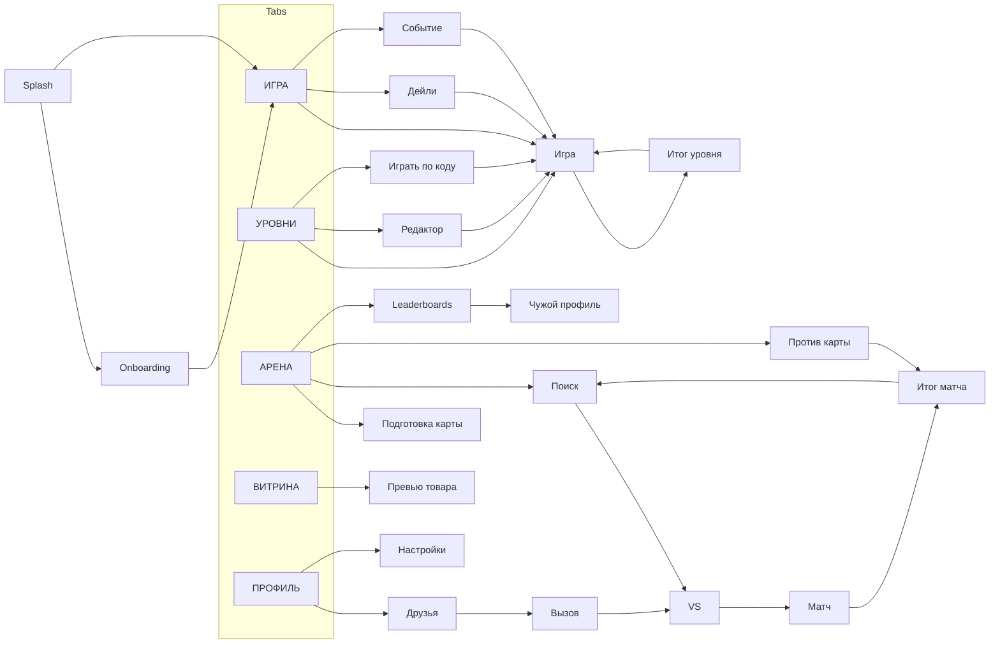

# Часть 4. Экраны

Каждый экран описан по одной схеме: назначение → состав сверху вниз → действия → состояния → крайние случаи. Компоненты — из вкладки «Дизайн-система», правила игры — из «Продукт и игровая логика». Ключи маршрутов (`/arena/match`) совпадают с маршрутами в коде.

## 1. Общие правила

### 1.1 Каркас экрана с таб-баром

1. Статус-бар системы (светлые иконки в тёмной теме и над геро).
2. `TopBar`: знак + PELENGE / SIGNAL HUNT слева; справа `WalletChip` ◆ и ●. Липкий, при прокрутке получает фон и blur.
3. `InlineBanner` (офлайн / техработы скоро), если есть.
4. Контент с боковыми полями 16 pt, прокручивается; снизу отступ = высота таб-бара + 24.
5. `TabBar` плавающий.

### 1.2 Каркас вложенного экрана

`TopBar` с кнопкой «Назад», заголовком по центру и слотом справа; таб-бар скрыт. Свайп от левого края (iOS) и системный «назад» (Android) работают везде, кроме игры и матча (там — пауза или диалог «Сдаться?»).

### 1.3 Полноэкранный игровой экран

Без таб-бара и кошелька. Поле всегда целиком в зоне видимости, без прокрутки. Экран не гаснет.

### 1.4 Общие правила

- Safe areas: всё интерактивное — вне выреза и домашнего индикатора; фоны и геро-градиенты уходят под статус-бар.
- Pull-to-refresh на Главной, Арене, Витрине, Профиле, Друзьях, Лидербордах.
- Повторный тап по активному табу — прокрутка наверх и возврат к корню стека.
- Табы сохраняют положение прокрутки и выбранную вкладку при переключении.
- Клавиатура не перекрывает поля ввода и кнопку отправки.
- Горизонтальная ориентация заблокирована.

## 2. Сплэш, онбординг, согласия, обучение

### 2.1 Сплэш (`/splash`)

- Системный сплэш (знак на тёмном фоне) → сразу в приложение с тем же знаком, который «раскрывается» волной сонара в первый экран.
- В это время: `GET /bootstrap`, авторизация, загрузка кэша. Максимум 2,5 с; если сеть медленная — вход с кэшем и плашкой «Обновляем…».
- Исходы: принудительное обновление → экран обновления; техработы → экран техработ (с кнопкой «Играть офлайн»); бан → экран бана; первый запуск → онбординг; иначе → Главная (или экран из deep link / push).
- Нет сети и нет кэша (первый запуск офлайн) → создаётся локальный гость, доступна кампания; аккаунт регистрируется при появлении сети.

### 2.2 Онбординг (`/onboarding`)

Цель — за 60 секунд привести игрока к первой находке цели. Без слайдов с текстом: игрок сразу играет.

1. **Язык** — только если язык системы не RU и не EN: два больших варианта.
2. **Согласия** — в ЕЭЗ системное окно UMP; на iOS ATT показывается не здесь, а перед первой рекламой с пред-экраном «Зачем это».
3. **Уровень 1 с подсказками** (поле 4×4, 1 цель):
   - Шаг 1: затемнение, подсвечена одна клетка, `CoachMark` «Тапни по клетке».
   - Шаг 2: появилось число → «Число — сколько шагов до сигнала», анимация пути по клеткам.
   - Шаг 3: «Тапни ближе» — подсвечены клетки на расстоянии 1 от первой.
   - Шаг 4: игрок находит цель сам; лимит ходов на этом уровне не применяется.
4. **Победа** → упрощённый итог (3★ всегда) → «Дальше» → Уровень 2 с короткой подсказкой про лимит ходов.
5. После Уровня 3 — первый вход на Главную с коуч-марками: «Здесь твой текущий уровень», «Все уровни — здесь».

Кнопка «Пропустить» в правом верхнем углу на шагах 1–3 (ведёт на Главную, Уровень 1 считается непройденным).

### 2.3 Карточка нового элемента (модалка перед уровнем)

Показывается при первом появлении забора, ручья, нескольких целей, бомбы, скалы, ×2, моста, маяка, буя, тумана, порядка целей, режима «курс» и «горячо/холодно» (уровни — «Продукт» 3.1). В шапке игры при буях появляется счётчик буёв, при порядке — ряд номеров целей.

- Состав: eyebrow «НОВЫЙ ЭЛЕМЕНТ», название, Lottie-демонстрация на мини-поле, 1–2 предложения правила («Ручей: шаг в него стоит 3. Путь в обход может быть короче»), кнопка «Понятно».
- Для бомбы: «Бомба спрятана на поле. Тап по ней стоит 2 хода и не даёт пеленга. Сколько бомб на карте — видно вверху», затем вторая карточка при первом значке: «Значок мины — бомба в соседней клетке: сверху, снизу, слева или справа» (поле затемняется, подсвечены клетка со значком и её 4 соседа).
- Повторно доступна из паузы → «Правила».

## 3. Главная «Игра» (`/home`)

Назначение: за один тап вернуть игрока в игру и показать, что сегодня нового.

### 3.1 Состав сверху вниз

1. `TopBar` с кошельком.
2. **Геро «Текущая игра»** (`HeroCard.home`): eyebrow «ТЕКУЩАЯ ИГРА», «Уровень 27» (display.xl), название уровня и мира, чип «12 ХОДОВ», значки элементов уровня; мини-превью поля уровня (видимые элементы без целей, неинтерактивное, в скине игрока); внизу чип SIGNAL HUNT и кнопка «ИГРАТЬ». Если есть незаконченная партия — «ПРОДОЛЖИТЬ» и прогресс «найдено 1 / 2».
   - В концепте поле на главной интерактивное. В приложении оно только превью: тап по нему = «ИГРАТЬ», чтобы не тратить ходы случайно.
3. **Карточка «Пеленг дня»**: дата, статус (не сыгран / победа N ходов, место #N / поражение), огонёк серии с числом дней, таймер до нового дейли. До уровня 6 — заблокирована с подписью «Откроется после уровня 6».
4. **Баннер события** (если активно): название, прогресс трека, таймер.
5. **Быстрые ссылки** (2 колонки): «АРЕНА · PvP» (с лигой и кубками, или замок до уровня 12), «ВИТРИНА · COLLECTION» (с таймером дропа, если есть).
6. **«СЕГОДНЯ»** — 3 `StatCard`: серия, кубки, место в недельном лидерборде (до арены — звёзды кампании вместо кубков и места).
7. **Вызовы друзей** (если есть входящие): строка с аватаром и кнопками «Принять» / «Отклонить».

### 3.2 Состояния

| Состояние | Поведение |
| --- | --- |
| Все 100 уровней пройдены | Геро: «Кампания пройдена», сумма звёзд, кнопки «Собрать 3★» (первый уровень не на 3★) и «Пеленг дня» |
| Офлайн | Плашка «Нет сети»; кубки, место, события — из кэша с пометкой времени; игра и дейли работают |
| Первая загрузка без кэша | Скелетоны карточек, геро уровня — сразу (локальный прогресс) |
| Новый сезон / итог сезона | Модалка поверх главной (очередь окон, см. «Продукт» 8.2) |
| Серия пропущена, можно восстановить | Карточка дейли с потухшим огоньком и кнопкой «Восстановить» |

## 4. Уровни (`/levels`)

Назначение: карта прогресса, выбор уровня, вход в редактор и игру по коду.

### 4.1 Состав

1. `ScreenTitle`: eyebrow «ПУТЬ СИГНАЛА», «Уровни», справа чип «★ 214 / 300».
2. Ряд из двух кнопок secondary: «Редактор», «Играть по коду».
3. Список миров (виртуализированный): `WorldHeader` (обложка, номер и название мира, подзаголовок — новый элемент/режим, «★ 31 / 48», диапазон «25–40»), далее `LevelRow` уровней мира.
4. `LevelRow`: плитка номера (done — галочка на `gradient.done`, current — `gradient.hot`, locked — замок), название, описание, иконки элементов и размер поля («7×7 · 2 цели · 1 бомба»), справа — звёзды или «ИГРАТЬ» для текущего.

### 4.2 Поведение

- При открытии — автопрокрутка к текущему уровню (по центру экрана). Плавающая кнопка «К текущему» появляется, когда текущий уровень вне экрана.
- Тап по уровню → нижний лист «Уровень N»: превью поля, элементы, лимит ходов, пороги звёзд («3★ — до 8 ходов»), лучший результат, кнопка «Играть». Для текущего уровня — сразу в игру.
- Тап по закрытому → микро-тряска + тост «Сначала пройди уровень 26».
- Закрытый мир свёрнут: обложка в оттенках серого + «Пройди мир N, чтобы открыть».
- Мир завершён на 3★ — золотая рамка заголовка и бейдж.

## 5. Экран игры (`/play/:mode/:id`)

Один экран для кампании, дейли, уровня по коду и карты события; отличаются шапка и награды.

### 5.1 Состав

1. **Шапка**: кнопка «Пауза» слева; по центру «Уровень 27» + название (для дейли — «Пеленг дня · 26 сентября», для кода — название автора и «Вызов: 9 ходов»); справа кнопка «Заново».
2. **HUD** — три `HudCounter` в ряд: ходы «9 / 12», цели «1 / 2», бомбы «× 1» — сколько ещё не взорвано (если есть). На открытых клетках рядом с бомбой — значок мины в углу (Дизайн-система, таблица элементов). Под ними тонкая шкала звёзд: отметки 3★ и 2★ на полосе ходов — игрок видит, когда теряет звезду.
3. **Режим подсказки** — чип «Число» / «Курс» / «Горячо-холодно» с иконкой ℹ (тап → правило).
4. **Поле** — по центру, максимальный размер.
5. **Панель под полем**: последний результат крупно («C4 → 3 · тепло»), переключатель режима флажка (альтернатива долгому тапу: в режиме флажка обычный тап ставит флажок).

### 5.2 Действия

| Действие | Результат |
| --- | --- |
| Тап по закрытой клетке | Разрешение по таблице «Продукт» 2.4 + анимация, звук, вибрация |
| Долгий тап (400 мс) | Флажок поставлен / снят, ход не тратится |
| Тап по флажку | Обычный тап (открывает клетку) |
| Тап по открытой клетке | Тултип «C4: пеленг 3 (до находки первой цели)», ход не тратится |
| «Заново» | Если сделан хотя бы 1 ход — диалог «Начать заново?»; в дейли после первого хода зачётной попытки — «Зачётная попытка будет засчитана как поражение» |
| «Пауза», системный «назад», сворачивание | Меню паузы (сворачивание — состояние сохраняется) |

### 5.3 Меню паузы (нижний лист)

«Продолжить» (primary), «Начать заново», «Правила» (список карточек элементов, встреченных игроком), переключатели «Звук» и «Музыка», «Выйти к уровням». Выход сохраняет партию (кроме дейли: там партия тоже сохраняется, но таймер идёт для рейтинга по времени — сказать об этом подписью).

### 5.4 Крайние случаи

- Входящий звонок / уведомление — автопауза.
- Последний ход был бомбой — сначала анимация взрыва, потом лист поражения (через 700 мс).
- Тапы во время анимации находки цели: следующий тап принимается через 300 мс, ранее — игнорируется.
- Мультитач (два пальца на двух клетках) — обрабатывается только первое касание.
- Палец соскользнул с клетки до отпускания — тап отменён (как у кнопок).

## 6. Итог уровня

### 6.1 Победа (нижний лист 90% высоты поверх поля)

1. «СИГНАЛ НАЙДЕН» (display.l) + `StarRating` L с анимацией.
2. Строка: «8 ходов из 12 · лучший: 7», «Новый рекорд!» если улучшил.
3. `RewardList`: ●, XP, ◆ за завершение мира, тема мира, бейдж.
4. `Button.reward` «Удвоить ● за рекламу» (если лимит не исчерпан).
5. «ДАЛЬШЕ» (primary, следующий уровень) + «Ещё раз» + «К уровням».
6. Для дейли: место в дневном лидерборде (или «Считаем…»), серия +1, кнопка «Поделиться результатом» (картинка-сетка тапов без спойлера, в духе Wordle). Для кода: сравнение с вызовом автора.
7. Закрытие листа свайпом — остаётся раскрытое поле с кнопкой «Дальше» внизу.

### 6.2 Поражение (нижний лист)

1. «Ходы закончились» + «Найдено 1 из 2».
2. «+3 хода» — две кнопки: `Button.reward` (реклама, подпись «осталось 1 сегодня») и `Button.price` (◆ 15). Подпись «После продолжения — максимум 1★».
3. «Начать заново» (secondary), «К уровням» (ghost).
4. После отказа от продолжения — цели и бомбы показываются полупрозрачными только в кампании (в дейли — после конца суток, чтобы не было спойлеров).

Состояния кнопки рекламы: загрузка (спиннер), недоступна (серая + «Реклама недоступна»), лимит (скрыта), офлайн (серая). Если ◆ не хватает — цена красная, тап → лист «Как заработать».

## 7. Дейли и серия (`/daily`)

Открывается с карточки на Главной и из push. Назначение — запустить дейли, показать серию и место среди других.

### 7.1 Состав

1. Шапка «Пеленг дня», дата, таймер до следующего («Новый через 05:12:40»).
2. Карточка сегодня: превью поля (размер, элементы, лимит ходов), статус и главная кнопка: «ИГРАТЬ» / «ПРОДОЛЖИТЬ» / «Сыграно: 7 ходов, #134» + «Сыграть ещё (без награды)».
3. Виджет серии: огонёк + число, лучшая серия, шкала с вехами 3 / 7 / 14 / 30 и наградами, следующая веха подсвечена.
4. Календарь за 30 дней: победа (заливка `status.success` + звёзды), поражение (контур), пропуск (пусто), восстановлен (иконка пластыря), сегодня (рамка). Прошлые дейли не переигрываются.
5. Лидерборд дня: вкладки «Все / Страна / Друзья», топ-10 + моя строка, «Показать всех». До своей попытки игрок видит только топ и медиану («В среднем 9 ходов»).

### 7.2 Состояния

| Состояние | Поведение |
| --- | --- |
| Серия пропущена вчера | Карточка «Серия 12 дней прервалась» + «Восстановить за рекламу» / «за ◆ 30» + таймер «ещё 14 ч» |
| Восстановление недоступно (уже было за 7 дней) | Подпись «Восстановление доступно раз в неделю» |
| Офлайн | Играть можно, лидерборд — заглушка «Результат отправится, когда появится сеть» |
| Смена суток во время игры | Партия доигрывается и засчитывается за день начала; экран обновляется после выхода |
| Дейли закрыт (уровень < 6) | Экран недоступен, карточка на Главной с замком |

## 8. Арена

### 8.1 Главная арены (`/arena`)

1. **Шапка** (`HeroCard.arena`): eyebrow «ARENA», «Сигнал против сигнала.», эмблема лиги 64 pt, 3 стата: кубки / лига (GOLD II) / сезон (07 · ещё 12 дн.), `LeagueProgress` до следующего дивизиона.
2. **Кнопки**: «В БОЙ» (primary L, широкая) + «Против карты» (secondary). Под кнопками — формат лиги: «7×7 · 2 цели · 5 с на ход».
3. **Моя карта**: мини-превью активной карты (с целями и бомбами — игрок видит свою), оценка «бот решает за \~11 ходов», «защита: 14 побед», кнопки «Изменить» и «Сменить карту» (выбор из 3 сохранённых).
4. **Сезонный трек** (`SeasonTrack`): RP, ступени с наградами, кнопка «Забрать» на доступных.
5. **Лидеры**: сегмент «Неделя / Сезон», топ-3 + моя строка с соседями, «Все лидерборды».
6. **История матчей**: последние 5 (соперник, результат, ходы, ±кубки), тап → детали (обе карты и тапы).

Закрыта (уровень < 12): геро с замком, «Пройди уровень 12, чтобы открыть арену», прогресс «9 / 12», кнопка «К уровням». Нет сети: «В БОЙ» неактивна, подпись «Нужен интернет». Привязки аккаунта нет: перед первым матчем — лист «Сохрани прогресс» с кнопками Apple / Google и «Позже».

### 8.2 Подготовка карты (`/arena/map/:id`)

1. Шапка: «Назад», «Карта 1» (переименование тапом), «Сохранить» справа.
2. Формат: «7×7 · GOLD» (не редактируется — задаётся лигой).
3. Поле с координатами, в скине игрока.
4. `ToolPalette` сеткой 3×3: ЦЕЛЬ (2/2), ЗАБОР (5/8), РУЧЕЙ, ×2, СКАЛА, МОСТ, БОМБА (1/4), СТЕРЕТЬ, RANDOM. Цифра — сколько поставлено / лимит.
5. Строка проверки: «✓ карта валидна · бот решает за \~11 ходов» или ошибка «✖ клетки D5–E6 отрезаны заборами» с подсветкой на поле.
6. Кнопки: «СОХРАНИТЬ КАРТУ» (primary), «Проверить карту» (анимация бота, решающего карту за 5 с), «Очистить».

Взаимодействия:

| Инструмент | Жест | Поведение |
| --- | --- | --- |
| Цель, ручей, ×2, скала, бомба | Тап по клетке | Ставит / снимает элемент; на занятой клетке — заменяет (с проверкой совместимости) |
| Ручей, скала | Провести пальцем | Рисует на нескольких клетках до лимита |
| Забор | Тап по границе между клетками или свайп вдоль границ | Пунктир под пальцем → забор; повторный тап убирает |
| Мост | Тап по клетке ручья | На не-ручье — тряска + «Мост ставится на ручей» |
| Стереть | Тап / провести | Убирает любой элемент и заборы клетки |
| RANDOM | Тап | Диалог «Заменить карту случайной?» (если карта не пустая) → валидная случайная карта в лимитах |
| Отмена / повтор | Кнопки ← → в шапке | 30 шагов истории |

Выход с несохранёнными изменениями — диалог «Сохранить изменения?» (Сохранить / Не сохранять / Отмена). Невалидную карту можно сохранить как черновик, но нельзя сделать активной.

### 8.3 Поиск соперника (`/arena/search`)

- Полноэкранно: радар (Rive) по центру, «Ищем соперника…», таймер ожидания 0:07, формат, моя карта мини-превью.
- Кнопки: «Отмена» (ghost). С 10 с появляется «Играть против карты». На 20 с — переход в матч с ботом (радар «захватывает» сигнал).
- Сворачивание во время поиска → поиск отменяется; возврат — тост «Поиск остановлен».

### 8.4 VS-экран (3 с)

Две половины экрана цветами `player.me` и `player.opponent`: аватар 96 в рамке, ник, титул, эмблема лиги, кубки; по центру «VS». Для бота — метка «Тренировочный соперник». Затем анимация жребия «Первым ходит: Kira».

### 8.5 Матч (`/arena/match/:id`)

1. Верх: `MatchPlayerBar` соперника (аватар + `TimerRing`, ник, «сигналы 1 / 2», статус связи) и справа мини-карта моего поля с его тапами.
2. Центр: плашка состояния хода («ТВОЙ ХОД» / «Ход соперника» / «Ты пропускаешь ход — бомба» / «Соперник пропускает ход — ходи ещё» / «Финальный ход!»), под ней поле соперника на всю ширину.
3. Низ: `MatchPlayerBar` мой (аватар + таймер, «найдено 0 / 2», бомбы на карте соперника «× 3»), кнопки «Эмоции», «Флажок», «Меню» (сдаться, звук, заглушить эмоции).
4. Номер хода «Ход 7 / 40» мелко под полем.

| Событие | Отображение |
| --- | --- |
| Мой ход | Поле яркое, мой таймер идёт, звук `turn_start` |
| Ход соперника | Поле затемнено 25%, мини-карта подсвечена; его тап — точка + результат на мини-карте |
| Соперник нашёл мою цель | Вспышка на мини-карте, его счётчик +1, тревожный звук |
| Соперник на моей бомбе | Взрыв на мини-карте, плашка «Соперник пропускает ход» |
| Я на бомбе | Взрыв на главном поле, мой таймер перечёркнут на следующий ход |
| Тайм-аут | Тост «Время вышло — ход пропущен (1/3)»; на 2/3 — предупреждение «Ещё один пропуск — поражение» |
| Соперник переподключается | Иконка wifi-off у его аватара, его таймер идёт |
| Я переподключаюсь | Полноэкранный оверлей «Восстанавливаем связь…» поверх поля, счётчик секунд |
| Сдача | Диалог «Сдаться? Ты потеряешь 30 кубков» (точное число) |

### 8.6 Итог матча (`/arena/result/:id`)

1. Заголовок «ПОБЕДА» / «ПОРАЖЕНИЕ» / «НИЧЬЯ» + причина («все цели найдены за 9 ходов», «сдача соперника», «соперник покинул матч», «лимит ходов», «матч аннулирован»).
2. Две карты рядом (моя и соперника), раскрыты целиком с тапами; тап — увеличение.
3. Кубки «+32» (счётчик) + `LeagueProgress`, при смене дивизиона — отдельный полноэкранный момент.
4. `RewardList`: RP, ●, ◆ (если среди первых 3 побед), XP, event tokens.
5. Кнопки: «ЕЩЁ БОЙ» (primary), «На арену», «Добавить в друзья» (если не друг и не бот), меню «…» → «Пожаловаться» / «Заблокировать».

### 8.7 Асинхронный матч

Тот же экран матча без верхнего бара соперника; вместо него — карточка автора карты (аватар, ник, лига) и «Норма: 11 ходов». Таймер 5 с есть. Итог: «Ты: 9 ходов · Норма: 11 → ПОБЕДА».

### 8.8 Лидерборды (`/leaderboards`)

Два уровня вкладок: «Неделя / Сезон / Дейли» × «Все / Страна / Друзья». Список топ-100 с медалями для топ-3, моя строка прилипает к низу экрана, если я не в видимой части. Таймер до обнуления недели / сезона. Пусто у друзей — «Добавь друзей».

### 8.9 Итог сезона (модалка при первом входе после смены)

«Сезон 07 завершён», пиковая лига с эмблемой, место, награды (забрать), сброс кубков «3 120 → 2 560» с анимацией, «Сезон 08 начался».

## 9. Витрина (`/shop`)

### 9.1 Состав

1. **Шапка** (`HeroCard.shop`): eyebrow «ВИТРИНА», «Собери свой сигнал.», подпись «Косметика меняет поле, профиль и эффекты. Результат игры остаётся честным», живое превью поля в текущем скине игрока.
2. **LIMITED DROP** (`FeaturedBanner`): баннер из админки, тег таймера, кнопка «Открыть набор». Нет дропа — блок скрыт.
3. **Вкладки** (прокручиваемые): Эксклюзив, Праздничное, Элементы, Поля, Наборы, Профиль, Эффекты. Пустая вкладка скрывается.
4. **Сетка товаров** (2 колонки, `ProductCard`): превью, название, тип + «видно в матче», цена. Сортировка: лимитированные → новые → по редкости; уже купленные — в конце.
5. Фильтр «Скрыть купленное» (чип над сеткой).

### 9.2 Превью товара (нижний лист 90%)

1. Тип + редкость, название, описание (1–2 строки).
2. Живое превью по типу: поле / элемент — интерактивное поле 5×5 со всеми элементами (тапы показывают числа и эффекты); аватар/рамка — на моём профиле и в баре матча; эффект — кнопка «Повторить»; набор — карусель состава.
3. Переключатель светлая / тёмная для полей.
4. Для набора: состав с пометками «уже есть», цена со скидкой и зачёркнутая сумма.
5. Кнопки: «Закрыть» + `Button.price` / «Экипировать» / «Экипировано ✓» (неактивная). Таймер для лимитированных.

### 9.3 Покупка

| Шаг | Отображение |
| --- | --- |
| Тап по цене (≥ ◆ 500) | Диалог «Купить Storm Holiday Field за ◆ 1 400?» |
| Запрос | Кнопка → loading, превью нельзя закрыть 2 с |
| Успех | Анимация покупки, баланс в шапке уменьшается, кнопки «Экипировать» / «Позже» |
| Не хватает | Лист «Не хватает ◆ 240» + способы заработать (реклама ◆ 5 с счётчиком, дейли, арена, событие) |
| Ошибки | По таблице «Продукт» 6.4 |

### 9.4 Лист «Как заработать» (из кошелька)

Балансы ◆ и ●, список источников с кнопками-переходами: «Смотреть рекламу: +◆ 5 (3/5 сегодня)», «Пеленг дня», «Победы на арене», «Сезонный трек», «Событие», «Пригласи друга: +◆ 20».

## 10. Профиль, коллекция, друзья

### 10.1 Профиль (`/profile`)

1. **Шапка**: аватар 72 в рамке (тап → выбор аватара), ник (тап → редактирование), титул, «Уровень 18 · GOLD II · 2 640 кубков», полоса XP, до 3 бейджей, иконка настроек справа сверху.
2. **Друзья**: строка «Друзья · 12 · 3 онлайн» + аватарки, бейдж входящих заявок.
3. **Статистика**: сетка `StatCard` 3×2: уровни, звёзды, победы / винрейт, пик кубков, серия / лучшая, защита карты; «Подробнее» → экран статистики (по режимам, средние ходы, бомбы).
4. **Коллекция**: сетка `CollectionSlot` 4×3. Тап → лист слота: имеющиеся предметы (первый — «По умолчанию»), выбор = экипировка с мгновенным превью, внизу «Ещё в витрине».
5. **Достижения / бейджи**: полученные и закрытые (с условием), выбор 3 для показа.
6. Кнопка «Настройки» (secondary, внизу).

Гость: под шапкой карточка «Сохрани прогресс» с кнопками Apple / Google.

### 10.2 Редактирование ника (лист)

Поле со счётчиком 3–16, живая проверка («Занято», «Недопустимые символы», «Недопустимое слово»), подпись «Первая смена бесплатна» или «◆ 100, следующая смена через 30 дней», кнопка «Сохранить».

### 10.3 Чужой профиль (`/user/:id`)

Шапка как у своего (без редактирования), публичная статистика, история личных встреч («3 : 2»), кнопки: «Добавить в друзья» / «Заявка отправлена» / «Вызвать» (для друзей), меню «…»: пожаловаться, заблокировать, удалить из друзей.

### 10.4 Друзья (`/friends`)

1. Шапка «Друзья» + кнопка «Добавить».
2. Вкладки: «Друзья» / «Заявки (2)».
3. Список `FriendRow`: сначала онлайн, потом «в матче», потом офлайн («был 2 ч назад»). Кнопка «Вызвать» активна только для онлайн.
4. Лист «Добавить»: поиск по нику, поле дружеского кода, мой код «K7F2-QX9M» с кнопкой «Скопировать», «Пригласить по ссылке» (системный «Поделиться»).
5. Пусто: иллюстрация + «Играть с друзьями веселее» + «Пригласить».

### 10.5 Вызов друга

- Исходящий: лист выбора формата (5×5 / 7×7 / 9×9) и карты → экран ожидания с аватаром друга и таймером 60 с, «Отменить».
- Входящий (в приложении): верхняя плашка поверх любого экрана (кроме матча и игры): аватар, «Kira вызывает на дуэль · 7×7», «Принять» / «Отклонить», полоска таймера. Во время игры — отклоняется автоматически с статусом «занят».
- Отказ / тайм-аут — тост у пригласившего «Kira не может сейчас».

## 11. События, редактор, игра по коду

### 11.1 Событие (`/event/:id`)

1. Шапка (`HeroCard.event`): eyebrow «LIVE EVENT», название, описание, `ProgressBar` «680 / 1000», таймер «6 дней», баннер-иллюстрация из админки.
2. Карты события: список 5–10 коротких уровней (как `LevelRow`, с наградой токенами). Открываются по одной в день или все сразу (настройка события).
3. Трек наград (`SeasonTrack`): ступени с наградами, «Забрать».
4. Способы получить токены: карты, победы на арене, реклама (счётчик).
5. «Смотреть праздничную коллекцию» → Витрина, вкладка «Праздничное».

Нет активного события: заглушка «Следующее событие скоро» (+ дата, если запланировано). Событие закончилось, пока экран открыт: плашка «Событие завершено, награды начислены».

### 11.2 Редактор уровня (`/editor`, `/editor/:id`)

1. Список моих уровней (до 20): мини-превью, название, размер, дата; кнопка «Новый уровень». Свайп влево — удалить (с подтверждением).
2. Новый уровень: лист параметров — размер (степперы строк/столбцов 4–9), режим подсказки.
3. Экран редактора — как «Подготовка карты», но без лимитов формата (кроме 2.5 и 2.7 «Продукта») + поле названия и степпер «Лимит ходов» (подсказка «бот решает за \~8»).
4. Кнопки: «Сыграть самому» (игра с полупрозрачными целями), «Поделиться» (становится доступной после валидации), «Сохранить».
5. «Поделиться» → лист: код `PELENG2-…` в моноширинном поле, «Скопировать», «Поделиться ссылкой» (системный лист), переключатель «Добавить вызов: мой результат N ходов» (если автор прошёл уровень).

### 11.3 Играть по коду (`/play-code`)

Лист: поле ввода с кнопкой «Вставить» (автоматически предлагается, если в буфере есть код) → превью уровня (название, размер, элементы, вызов автора) → «Играть». Ошибки — под полем. Диплинк открывает сразу превью.

## 12. Настройки, аккаунт, системные экраны

### 12.1 Настройки (`/settings`)

Группы `SettingsRow` в карточках:

| Группа | Строки |
| --- | --- |
| Игра | Звуки (слайдер), Музыка (слайдер), Вибрация, Показывать координаты, Подтверждение тапа в PvP, Чужие скины в PvP, Высокий контраст поля |
| Оформление | Тема: светлая / тёмная / как в системе (сегмент), Язык: Русский / English |
| Уведомления | Пеленг дня, Серия, Вызовы друзей, События и дропы (если системные уведомления выключены — плашка «Включить в настройках») |
| Аккаунт | Статус («Гость» / «Вход через Apple»), Привязать Apple / Google, Выйти (только для привязанных), Удалить аккаунт (красная) |
| Конфиденциальность | Настройки рекламы (UMP), Политика конфиденциальности, Условия использования |
| Помощь | Правила игры, FAQ, Написать в поддержку, События |
| О приложении | Версия и сборка, ID игрока (тап — скопировать), Оценить игру |

### 12.2 Удаление аккаунта

Лист с перечнем того, что удалится (прогресс, валюта, коллекция, друзья) → поле «Введи свой ник» → красная кнопка «Удалить навсегда» → экран «Аккаунт будет удалён 26 октября. Войди до этой даты, чтобы отменить».

### 12.3 Привязка аккаунта (лист)

«Сохрани прогресс», 3 пункта пользы (не потеряешь при смене телефона, друзья, игра на нескольких устройствах), системные кнопки Sign in with Apple (обязательно первой на iOS) и Google, «Позже». Конфликт аккаунтов — диалог с двумя карточками прогресса («Это устройство: ур. 12, 240 ★» / «Сохранённый: ур. 58, GOLD I») и выбором.

### 12.4 Системные экраны

| Экран | Состав | Действия |
| --- | --- | --- |
| Принудительное обновление | Иллюстрация, «Доступна новая версия», текст из админки | «Обновить» → стор. Незакрываемый |
| Мягкое обновление | Нижний лист с тем же текстом | «Обновить» / «Позже» |
| Техработы | Иллюстрация, текст, «Завершим примерно в 15:30» | «Играть офлайн» (кампания), «Проверить снова» |
| Бан | Причина, срок (или «навсегда»), ID игрока | «Обжаловать» (форма), для бана арены — «К кампании» |
| Критическая ошибка | «Что-то пошло не так», код ошибки | «Перезапустить», «Написать в поддержку» |
| Пред-экран ATT (iOS) | «Помоги нам показывать подходящую рекламу…» | «Продолжить» → системный запрос |
| Пред-экран push | Показывается после первого дейли или первого друга: «Напомнить о пеленге дня?» | «Да» → системный запрос / «Не сейчас» |

## 13. Push-уведомления

Не больше 2 push в сутки на игрока (вызовы друзей не в лимите), не с 22:00 до 9:00 по локальному времени. Тап открывает указанный экран.

| Тип | Текст RU | Текст EN | Открывает |
| --- | --- | --- | --- |
| Дейли | Пеленг дня ждёт. Найдёшь сигнал быстрее всех? | Today’s bearing is live. Can you find the signal first? | `/daily` |
| Серия сгорает | Серия 12 дней сгорит через 3 часа 🔥 | Your 12-day streak ends in 3 hours 🔥 | `/daily` |
| Вызов друга | Kira вызывает тебя на дуэль | Kira challenges you to a duel | Принятие вызова |
| Заявка в друзья | Milo хочет добавить тебя в друзья | Milo wants to be friends | `/friends` (Заявки) |
| Защита карты (раз в сутки, сводка) | Твоя карта остановила 7 игроков: +● 35 | Your map stopped 7 players: +● 35 | `/arena` |
| Конец сезона | До конца сезона 24 часа. Успей подняться в GOLD I | 24 hours left in the season. Climb to GOLD I | `/arena` |
| Новый дроп / событие | Текст из админки | Текст из админки | `/shop` или `/event/:id` |

Иконка уведомления Android — монохромный знак 24×24 dp, цвет акцента `accent.cyan`. Каналы Android: «Дейли и серия», «Друзья», «Арена», «События».

## 14. Вайрфреймы: главная, уровни, игра, итог

Вайрфреймы задают иерархию и пропорции, а не визуал. Дизайнер может менять форму блоков, но не порядок важности и не зоны большого пальца. Цифры справа — высота блока в pt на экране 390×844.

### 14.1 Главная

```
┌───────────────────────────────────┐
│ ◉ PELENGE          ◆ 2 640  ● 18 420 │ 56  TopBar
├───────────────────────────────────┤
│ ╭─ ТЕКУЩАЯ ИГРА ─────── 12 ХОДОВ ╮ │
│ │ Уровень 27                        │ │
│ │ Мель и мост · Слепой пеленг   │ │
│ │      ┌─────────────────┐          │ │ ~380  Геро: 45% экрана
│ │      │  превью поля 7×7 │          │ │      поле — главный объект
│ │      │  (без целей)     │          │ │
│ │      └─────────────────┘          │ │
│ │ ▣▣▣ элементы    [   ИГРАТЬ   ]   │ │  ← главная кнопка в зоне пальца
│ ╰─────────────────────────────────╯ │
│ ╭ 🔥 12 · Пеленг дня · 05:12:40  [▶] ╮ │ 72  Дейли
│ ╭ АРЕНА · GOLD II ╮ ╭ ВИТРИНА · 6д ╮ │ 64  Быстрые ссылки
│  СЕГОДНЯ                            │
│ [ Серия 12 ] [ Кубки 2640 ] [ #42 ] │ 72  Статы
│                                      │
│ ╭ ⌂ ИГРА ◇ УРОВНИ ◈ АРЕНА ▣ ○ ╮ │ 64  TabBar
└───────────────────────────────────┘
```

### 14.2 Уровни

```
┌───────────────────────────────────┐
│ ПУТЬ СИГНАЛА                        │
│ Уровни                  [★ 214/300] │
│ [ Редактор ]  [ Играть по коду ]    │
│ ╭── обложка мира 5 ────────────────╮ │
│ │ 5 · Слепой пеленг   25–40  ★ 31/48 │ │ 96  WorldHeader
│ ╰─────────────────────────────────╯ │
│ [✓] 25 Первая мина  7×7·1💣   ★★★  │ 72  LevelRow done
│ [✓] 26 Обход мин     7×7·2💣   ★★☆  │
│ [27] Мель и мост  7×7·2◎   [ИГРАТЬ] │ 72  current (акцент)
│ [🔒] 28 …                              │ 72  locked 40%
│                     [ ↓ К текущему ] │  ← плавающая, если текущий вне экрана
│ ╭ ⌂  ◇  ◈  ▣  ○ ╮                    │
└───────────────────────────────────┘
```

### 14.3 Игра (уровень)

```
┌───────────────────────────────────┐
│ [‖]     Уровень 27 · Мель и мост  [↻] │ 56
│  ХОДЫ 9/12   ЦЕЛИ 1/2   💣 × 2      │ 48  HUD (числа крупно)
│  ━━━━━━━━━▲★★★━━━━▲★★━━━━━━━━━   │ 12  шкала звёзд
│  (ℹ Курс)                            │ 28  режим подсказки
│ ┌─────────────────────────────────┐ │
│ │  ▢ ▢ ▢ ▢ ▢ ▢ ▢                   │ │
│ │  ▢ ≈ ≈ ▢ 3 ▢ ▢    ≈ ручей         │ │
│ │  ▢ ▢ ┃ ▢ ▢ ▲ ▢    ┃ забор ▲ скала  │ │ 358 ПОЛЕ — центр экрана
│ │  ▢ ▢ ┃ ▢ ▢ ▢ ▢                   │ │
│ │  ▢ ×2▢ ▢ ◎ ▢ ▢    ◎ найденный     │ │
│ │  ▢ ▢ ▢ ▢ ▢ ▢ ▢      сигнал         │ │
│ │  ▢ ▢ ▢ ▢ ▢ ▢ ▢                   │ │
│ └─────────────────────────────────┘ │
│   E2 → 3 · тепло                      │ 56  последний результат
│                          [ ⚑ Флажок ] │ 56  режим флажка
└───────────────────────────────────┘
```

Правило: поле и HUD помещаются без прокрутки на 360×640; при нехватке места сначала скрывается шкала звёзд, затем строка режима подсказки (уходит в паузу), поле не уменьшается ниже 300 pt.

### 14.4 Итог уровня (победа / поражение)

```
┌───────────────────────────────────┐      ┌───────────────────────────────────┐
│   (поле сверху, затемнено)           │      │   (поле сверху, серое)               │
│╭──────────────────────────────────╮│      │╭──────────────────────────────────╮│
││     СИГНАЛ НАЙДЕН              ││      ││   Ходы закончились             ││
││        ★  ★  ★                  ││      ││   Найдено 1 из 2                 ││
││  8 из 12 · Новый рекорд!         ││      ││ [ ▶ +3 хода за рекламу ]      ││
││  +● 50   +XP 10   +◆ 10           ││      ││ [ ◆ 15 · +3 хода ]             ││
││ [ ▶ Удвоить ● ]                  ││      ││  после продолжения — макс. 1★  ││
││ [        ДАЛЬШЕ         ]       ││      ││ [   Начать заново   ]           ││
││  Ещё раз      К уровням        ││      ││      К уровням                 ││
│╰──────────────────────────────────╯│      │╰──────────────────────────────────╯│
└───────────────────────────────────┘      └───────────────────────────────────┘
```

## 15. Вайрфреймы: арена

### 15.1 Главная арены

```
┌───────────────────────────────────┐
│ ◉ PELENGE          ◆ 2 640  ● 18 420 │
│ ╭─ ARENA ──────────────────────────╮ │
│ │  ☸   Сигнал против сигнала.       │ │
│ │ 64pt КУБКИ 2640 · GOLD II · S07 12д  │ │ 220 геро
│ │ ━━━━━━━━━━━━━━━━━━━━━━━━━━━━━━━━ 2800 │ │     прогресс дивизиона
│ ╰─────────────────────────────────╯ │
│ [      В  Б  О  Й      ] [Против    │ 56 главное действие
│                              карты]  │
│   7×7 · 2 цели · 5 с на ход            │
│ ╭ МОЯ КАРТА ──────────────────────╮ │
│ │ [мини]  бот: ~11 ходов              │ │ 120
│ │ [карта] защита: 14   [Изменить]  │ │
│ ╰─────────────────────────────────╯ │
│ СЕЗОННЫЙ ТРЕК  RP 340      → →     │
│ [✓][✓][ЗАБРАТЬ][ ][ ][ ]  ← скролл →     │ 96
│ ЛИДЕРЫ  [Неделя|Сезон]               │
│  1 Nova 3820 · 2 Kira · 3 Milo       │
│ ▸ 42 Ты 2640                         │ ← подсвечено
│ ╭ ⌂  ◇  ◈  ▣  ○ ╮                    │
└───────────────────────────────────┘
```

### 15.2 Подготовка карты

```
┌───────────────────────────────────┐
│ [←]  Карта 1 ✎     [↶][↷]  [Сохранить]│ 56
│ 7×7 · GOLD                            │
│    A B C D E F G                      │
│  1 ▢ ▢ ▢ ▢ ▢ ▢ ▢                    │
│  2 ▢ ◎ ▢ ┃ ▢ ▢ ▢   (свои цели и      │ 340 поле с координатами
│  3 ▢ ≈ ≈ ┃ ▢ 💣▢    бомбы видны)   │
│  …                                    │
│ ✓ Карта валидна · бот ~11 ходов     │ 32 статус валидации
│ ╭────────╮╭────────╮╭────────╮           │
│ │◎ ЦЕЛЬ ││┃ЗАБОР ││≈ РУЧЕЙ│           │
│ │  2/2   ││  5/8   ││  2/7   │           │
│ │×2 БЛОК││▲ СКАЛА││═ МОСТ │           │ 3×3 палитра, 64 pt плитка
│ │💣 БОМБА││⌫ СТЕР.││⚄ RANDOM│           │
│ ╰────────╯╰────────╯╰────────╯           │
│ [ Проверить ]  [ СОХРАНИТЬ КАРТУ ] │ 56
└───────────────────────────────────┘
```

### 15.3 Матч

```
┌───────────────────────────────────┐
│ (◐K) Kira · GOLD I   сигн. 1/2  [мини]│ 64 соперник + моя карта
│  таймер кольцом              [карта]│      (её тапы — розовые)
│ ╭──────── ТВОЙ ХОД ─────────╮           │ 36 состояние хода
│ ┌─────────────────────────────────┐ │
│ │      карта соперника 7×7          │ │ 358 поле (её скин)
│ │      мои тапы обведены цианом      │ │
│ └─────────────────────────────────┘ │
│          Ход 7 / 40                   │
│ (◑Я) Ты · GOLD II  найдено 0/2  💣×3 │ 64 я
│ [☺ Эмоции]     [⚑ Флажок]   [≡ Меню] │ 56
└───────────────────────────────────┘
```

Мой игрок всегда снизу, соперник сверху (как за столом). Цвет игрока проходит через все элементы: рамка аватара, таймер, счётчик, обводки тапов.

### 15.4 Итог матча

```
┌───────────────────────────────────┐
│             П О Б Е Д А              │ display.xl
│     все цели найдены за 9 ходов        │
│  [моя карта]      [карта Kira]       │ 150 обе раскрыты
│              +32 кубка                 │
│  GOLD II ━━━━━━━━━━━━━━━━━━━━━ GOLD I      │
│   +10 RP   +● 40   +◆ 3   +XP 10      │
│ [          ЕЩЁ БОЙ          ]       │
│  На арену   + В друзья   …           │
└───────────────────────────────────┘
```

## 16. Вайрфреймы: витрина и профиль

### 16.1 Витрина и превью

```
┌───────────────────────────────────┐      ┌───────────────────────────────────┐
│ ◉ PELENGE          ◆ 2 640  ● 18 420 │      │ (витрина под затемнением)       │
│ ╭ LIMITED DROP · STORM SIGNAL  6Д ╮  │      │╭──────── ─── ────────────────────╮│
│ │   [баннер-иллюстрация]  [Открыть] │  │      ││ FIELD · ЭПИЧЕСКИЙ                ││
│ ╰────────────────────────────────╯  │      ││ Storm Holiday Field             ││
│ [Эксклюзив][Праздник][Элементы]→  │      ││ ┌────────────────────┐ [☀|☾]   ││
│  □ Скрыть купленное                │      ││ │ интерактивное 5×5 │          ││
│ ╭───────────────╮ ╭───────────────╮  │      ││ │ тапы показывают  │          ││
│ │  [превью 1:1] │ │  [превью 1:1] │  │      ││ │ эффекты          │          ││
│ │ Neon Signal   │ │ Champion Set  │  │      ││ └────────────────────┘          ││
│ │ FIELD · в матче│ │ SET · 4 предм.│  │      ││ Поле и блики шторма…          ││
│ │ ◆ 1 180      │ │ ◆ 2 100      │  │      ││ ⏱ осталось 5д 14ч              ││
│ ╰───────────────╯ ╰───────────────╯  │      ││ [Закрыть]      [ ◆ 1 400 ]      ││
│ ╭ ⌂  ◇  ◈  ▣  ○ ╮                    │      │╰──────────────────────────────────╯│
└───────────────────────────────────┘      └───────────────────────────────────┘
```

Карточка товара: превью занимает ≥ 60% карточки — товар продаёт картинка, а не название. Рамка цвета редкости, легендарки — с переливом.

### 16.2 Профиль

```
┌───────────────────────────────────┐
│                                   [⚙] │
│ ╭────╮  PELENGE Player ✎              │
│ │ 72 │  MASTER TITLE                   │ 120 шапка
│ │ават│  Ур. 18 · GOLD II · 2 640         │
│ ╰────╯  ━━━━━━━━ XP        [бейдж×3]  │
│ ╭ Друзья · 12 · 3 онлайн  (○)(○)(○) →╮│ 56
│ СТАТИСТИКА                   Подробнее │
│ [Уровни 64][★ 214][Победы 37 · 61%] │ 144 сетка 3×2
│ [Пик 2 910][Серия 12/19][Защита 14] │
│ КОЛЛЕКЦИЯ                            │
│ [ПОЛЕ][ЗАБОР][РУЧЕЙ][СКАЛА]         │ сетка 4×3, превью экипированного
│ [ ×2 ][МОСТ ][БОМБА][ ЦЕЛЬ]         │
│ [АВАТ][РАМКА][ТИТУЛ][ FX ]          │
│ ╭ ⌂  ◇  ◈  ▣  ○ ╮                    │
└───────────────────────────────────┘
```

## 17. Карта переходов и ключевые пути

### 17.1 Карта переходов



### 17.2 Ключевые пути и целевое число тапов

| Путь | Шаги | Тапов до цели (макс.) |
| --- | --- | --- |
| Новый игрок → первый найденный сигнал | Запуск → обучение → 3–4 тапа по полю | 0 тапов интерфейса, ≤ 60 с |
| Вернувшийся игрок → текущий уровень | Запуск → «ИГРАТЬ» | 1 |
| Push → дейли | Тап по push → «ИГРАТЬ» | 2 |
| Матч подряд | Итог → «ЕЩЁ БОЙ» | 1 |
| Первый матч | Таб «Арена» → «В бой» → (привязка или «Позже») → карта собирается автоматически → матч обучения | 3 |
| Покупка скина и экипировка | Витрина → товар → цена → (подтвердить) → «Экипировать» | 4–5 |
| Вызов друга | Профиль → Друзья → «Вызвать» → формат | 4 |
| Поделиться уровнем | Редактор → «Поделиться» → канал | 2 |

Если макет требует больше тапов, чем в таблице, это повод пересмотреть макет, а не таблицу.


